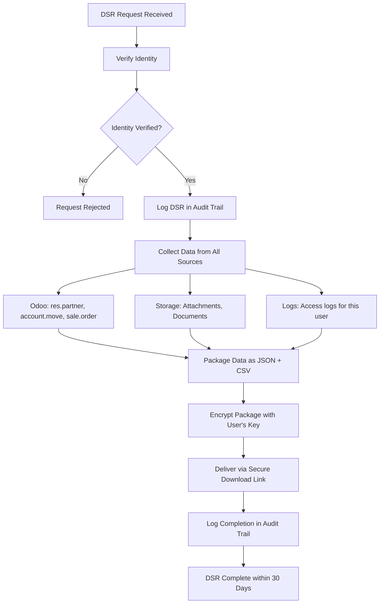

# Examples: SaaS Compliance Design

## Example 1: GDPR Data Subject Request Workflow

**Scenario**: Tenant user requests data export under GDPR Article 15 (right of access).

**Workflow**:


**Odoo data export query**:
```python
def export_tenant_user_data(user_id, tenant_id):
    """Export all PII for a specific user in a tenant."""
    partner = env['res.partner'].search([
        ('id', '=', user_id),
        ('company_id.tenant_slug', '=', tenant_id)
    ])
    return {
        'personal_data': partner.read(['name', 'email', 'phone', 'street']),
        'invoices': env['account.move'].search_read(
            [('partner_id', '=', partner.id)],
            ['name', 'date', 'amount_total']
        ),
        'orders': env['sale.order'].search_read(
            [('partner_id', '=', partner.id)],
            ['name', 'date_order', 'amount_total']
        ),
    }
```

---

## Example 2: Data Residency Enforcement via Azure Policy

**Scenario**: EU tenants' data must remain in EU regions only.

**Azure Policy definition**:
```json
{
  "mode": "All",
  "policyRule": {
    "if": {
      "allOf": [
        {
          "field": "tags['data-residency']",
          "equals": "eu"
        },
        {
          "not": {
            "field": "location",
            "in": ["westeurope", "northeurope", "francecentral", "germanywestcentral"]
          }
        }
      ]
    },
    "then": {
      "effect": "deny"
    }
  }
}
```

**Stamp-to-region mapping**:
| Stamp | Region | Data Residency | Eligible Tenants |
|-------|--------|---------------|-----------------|
| stamp-weu-001 | West Europe | EU | EU tenants |
| stamp-sea-001 | Southeast Asia | APAC | APAC tenants, no residency requirement |
| stamp-eus-001 | East US | US | US tenants |

---

## Example 3: SOC2 Audit Evidence Package

**Scenario**: Annual SOC2 Type II audit evidence collection.

**Automated evidence collection**:
```yaml
evidence_package:
  period: "2025-04-01 to 2026-03-31"

  access_controls:
    - name: "User access review"
      source: "Entra ID access reviews"
      frequency: "quarterly"
      artifacts: ["access_review_Q1.pdf", "access_review_Q2.pdf", "access_review_Q3.pdf", "access_review_Q4.pdf"]

    - name: "Privileged access log"
      source: "Azure PIM activation logs"
      query: "AuditLogs | where Category == 'RoleManagement'"
      retention: "1 year"

  change_management:
    - name: "Production change log"
      source: "GitHub pull requests merged to main"
      query: "gh pr list --state merged --base main --json number,title,mergedAt"

    - name: "Infrastructure changes"
      source: "Azure Activity Log"
      query: "AzureActivity | where CategoryValue == 'Administrative'"

  incident_response:
    - name: "Incident log"
      source: "PagerDuty incidents"
      artifacts: ["incident_log_annual.csv"]

    - name: "Post-incident reviews"
      source: "docs/incidents/"
      artifacts: ["PIR-*.md"]

  availability:
    - name: "SLA compliance report"
      source: "Application Insights"
      query: "Monthly availability report per tenant"
      artifacts: ["sla_report_monthly_*.pdf"]
```
