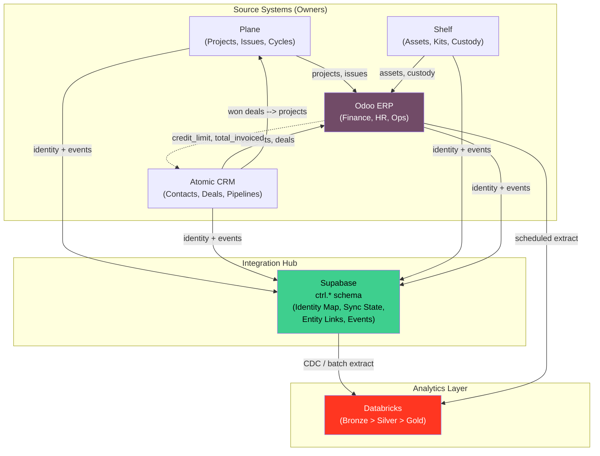

# Canonical Entity Map

> Machine-readable contract: [`CANONICAL_ENTITY_MAP.yaml`](./CANONICAL_ENTITY_MAP.yaml)
> Schema foundation: [`spec/schema/entities.yaml`](../../spec/schema/entities.yaml)

This document defines **which system owns which entities**, how data flows between systems, and how conflicts are resolved. Every cross-system sync in the platform must conform to this map.

---

## Entity Ownership Matrix

Each entity has exactly **one owner** (source of truth). Other systems receive synced copies.

| Entity | Plane | Atomic CRM | Shelf | Odoo | Supabase | Databricks |
|--------|:-----:|:----------:|:-----:|:----:|:--------:|:----------:|
| **Projects** | **OWNER** | | | sync | sync | read |
| **Issues** | **OWNER** | | | sync | sync | read |
| **Cycles** | **OWNER** | | | | sync | read |
| **Modules** | **OWNER** | | | | sync | read |
| **Labels** | **OWNER** | | | | sync | read |
| **Contacts** | | **OWNER** | | sync | sync | read |
| **Companies** | | **OWNER** | | sync | sync | read |
| **Deals** | | **OWNER** | | sync | sync | read |
| **Activities** | | **OWNER** | | | sync | read |
| **Pipelines** | | **OWNER** | | | sync | read |
| **Assets** | | | **OWNER** | sync | sync | read |
| **Kits** | | | **OWNER** | | sync | read |
| **Categories** | | | **OWNER** | | sync | read |
| **Custody Records** | | | **OWNER** | sync | sync | read |
| **QR Codes** | | | **OWNER** | | sync | read |
| **Chart of Accounts** | | | | **OWNER** | | read |
| **Journal Entries** | | | | **OWNER** | | read |
| **Invoices** | | | | **OWNER** | | read |
| **Payments** | | | | **OWNER** | | read |
| **Employees** | | | | **OWNER** | | read |
| **Payroll** | | | | **OWNER** | | read |
| **Tax Returns** | | | | **OWNER** | | read |
| **Purchase Orders** | | | | **OWNER** | | read |
| **Bills** | | | | **OWNER** | | read |
| **Bank Reconciliation** | | | | **OWNER** | | read |
| **Identity Map** | | | | | **OWNER** | |
| **Entity Links** | | | | | **OWNER** | |
| **Sync State** | | | | | **OWNER** | |
| **Integration Events** | | | | | **OWNER** | |
| **Bronze Tables** | | | | | | **OWNER** |
| **Silver Tables** | | | | | | **OWNER** |
| **Gold Tables** | | | | | | **OWNER** |

**Legend**: **OWNER** = source of truth | sync = receives writes from owner | read = read-only copy

---

## Data Flow Diagram

---

## Sync Direction Summary

| Source | Target | Direction | Frequency | Trigger |
|--------|--------|-----------|-----------|---------|
| Plane | Odoo | Uni (Plane --> Odoo) | Near-realtime | Webhook |
| Atomic CRM | Odoo | Bidirectional | Near-realtime | Webhook |
| Atomic CRM | Plane | Uni (CRM --> Plane) | Event-driven | Deal won |
| Shelf | Odoo | Uni (Shelf --> Odoo) | Near-realtime | Webhook |
| All sources | Supabase | Uni (source --> hub) | On every sync | Sync worker |
| All sources | Databricks | Uni (source --> lakehouse) | Scheduled batch | Cron (hourly/daily) |

---

## Conflict Resolution Matrix

| Scenario | Strategy | Rationale |
|----------|----------|-----------|
| **Default (all pairs)** | `source_wins` | Owner system is source of truth |
| CRM contact synced to Odoo | `source_wins` (CRM) | CRM owns contact master data |
| Odoo financial fields synced back to CRM | `odoo_wins` | Odoo owns financial data |
| Identity map writes | `append_only` | Identity records are immutable once created |
| Databricks ingestion | `last_write_wins` | Overwrite previous batch extract |
| Concurrent edits (same entity, two systems) | `source_wins` | Owner version prevails; non-owner edit is logged as rejected |

### Conflict Detection

Conflicts are detected by comparing `updated_at` timestamps. When a conflict is detected:

1. The sync worker logs the conflict to `ctrl.integration_events` with `event_type = 'conflict'`.
2. The winning value (per strategy above) is applied.
3. The losing value is preserved in `ctrl.integration_events.payload.rejected_value`.
4. If both systems claim ownership (misconfiguration), the sync halts and alerts fire.

---

## Anti-Patterns

These patterns are **forbidden** and enforced by CI lint rules.

### 1. Financial Data Outside Odoo

**Never** store financial transactions (journal entries, invoices, payments, bank reconciliation, tax returns) in any system other than Odoo.

- Plane, Atomic CRM, Shelf, Supabase: forbidden
- Databricks: read-only analytical copies allowed (bronze/silver/gold)

### 2. Supabase as Business Data Store

Supabase `ctrl.*` schema is the **integration hub only**. Business records (contacts, deals, assets, invoices) belong in their respective owner systems. Supabase stores only identity mappings, sync state, and event logs.

### 3. Writing Back to Databricks Sources

Databricks is a **read-only consumer**. It never writes back to Odoo, Plane, CRM, or Shelf. Any derived insights that need to trigger actions must flow through Supabase integration events.

### 4. Bypassing the Identity Map

All cross-system foreign keys **must** resolve through `ctrl.identity_map`. Direct ID references between systems (e.g., storing a Plane project ID directly in an Odoo field) are forbidden because IDs are system-local and opaque.

### 5. PII in Bronze Without Pseudonymization

Personal data (names, emails, phone numbers) must be hashed or tokenized before landing in Databricks bronze tables. Silver/gold tables may contain PII only if access-controlled.

---

## Cross-References

- Machine-readable contract: [`CANONICAL_ENTITY_MAP.yaml`](./CANONICAL_ENTITY_MAP.yaml)
- Schema foundation: [`spec/schema/entities.yaml`](../../spec/schema/entities.yaml)
- Integration boundaries: [`INTEGRATION_BOUNDARY_MODEL.md`](./INTEGRATION_BOUNDARY_MODEL.md)
- Supabase hub schema: [`SUPABASE_CONTROL_PLANE.md`](./SUPABASE_CONTROL_PLANE.md)
- Odoo-Supabase master pattern: [`docs/infra/ODOO_SUPABASE_MASTER_PATTERN.md`](../infra/ODOO_SUPABASE_MASTER_PATTERN.md)
- Decoupled platform PRD: [`spec/odoo-decoupled-platform/prd.md`](../../spec/odoo-decoupled-platform/prd.md)
