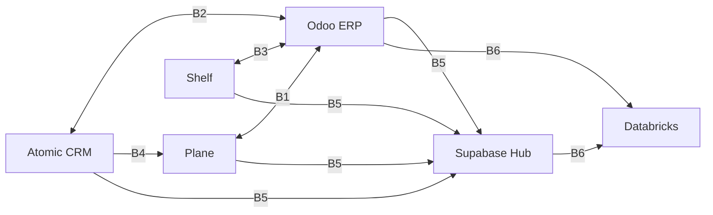
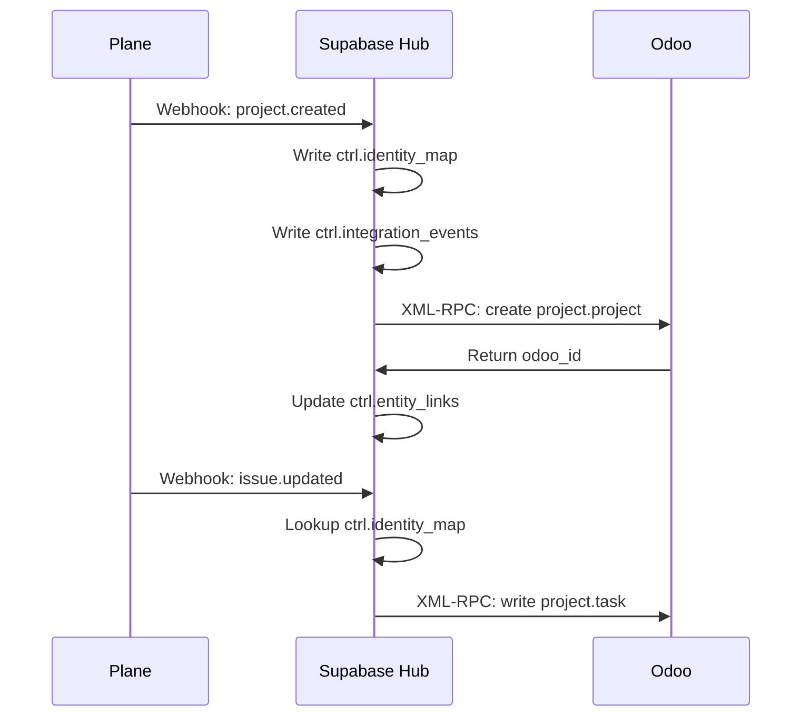
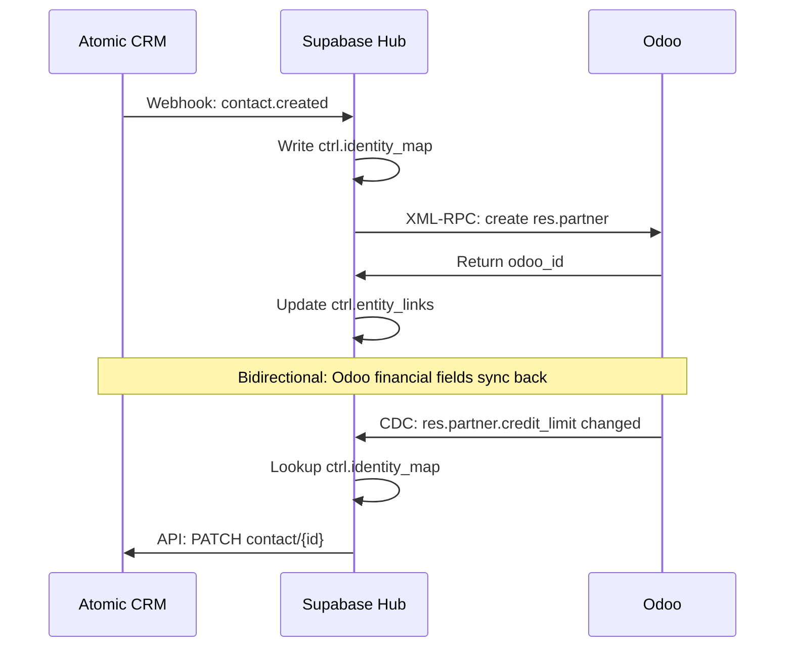
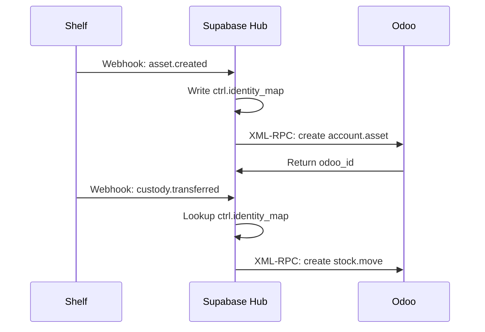
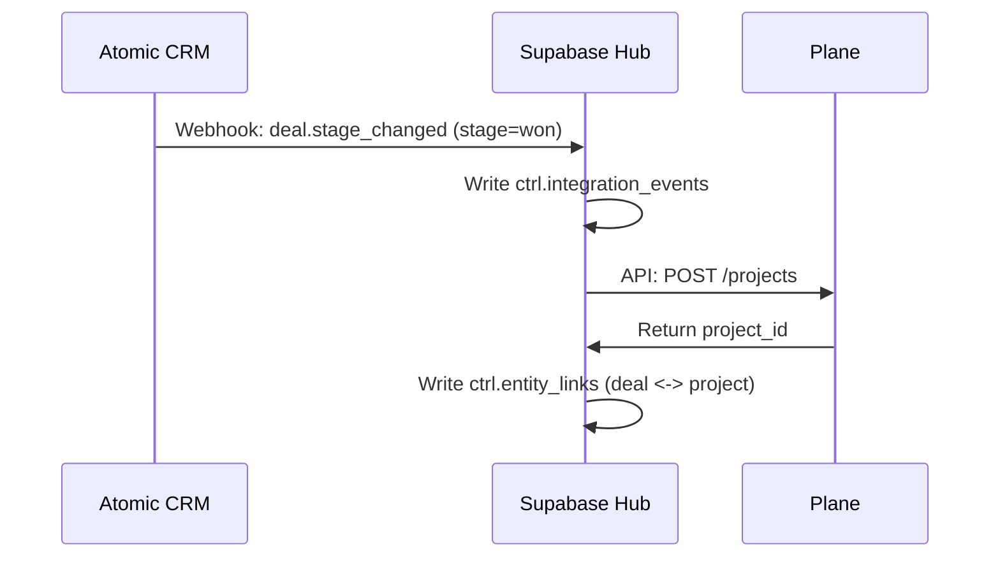
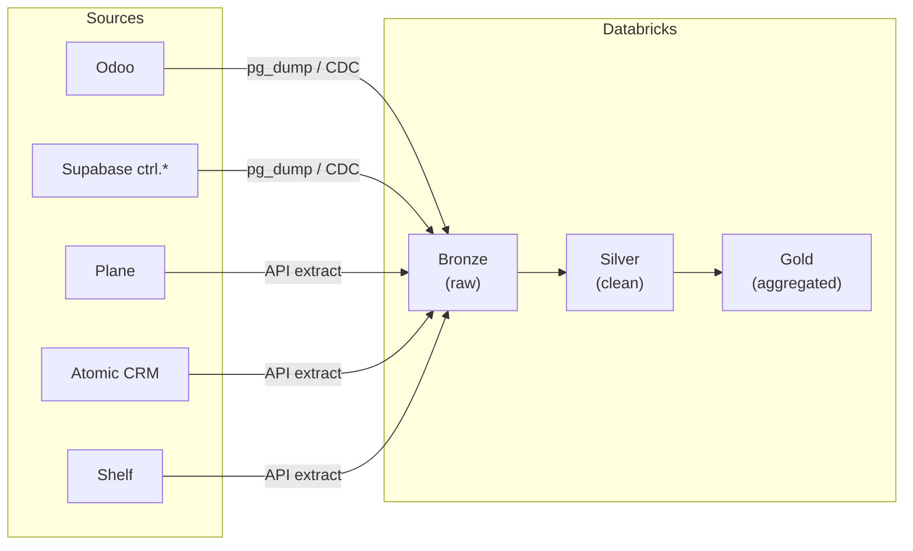

# Integration Boundary Model

> Canonical entity map: [`CANONICAL_ENTITY_MAP.yaml`](./CANONICAL_ENTITY_MAP.yaml)
> Supabase hub schema: [`SUPABASE_CONTROL_PLANE.md`](./SUPABASE_CONTROL_PLANE.md)

This document defines the **contract for every system-pair boundary** in the platform. Each boundary specifies: API contract, data classification, sync direction, frequency, and error handling.

All cross-system data flows pass through the Supabase `ctrl.*` schema for identity resolution and event logging.

---

## Boundary Overview



| ID | Boundary | Direction | Frequency |
|----|----------|-----------|-----------|
| B1 | Plane <-> Odoo | Uni (Plane --> Odoo) | Near-realtime |
| B2 | Atomic CRM <-> Odoo | Bidirectional | Near-realtime |
| B3 | Shelf <-> Odoo | Uni (Shelf --> Odoo) | Near-realtime |
| B4 | Atomic CRM --> Plane | Uni | Event-driven |
| B5 | All --> Supabase | Uni (sources --> hub) | On every sync |
| B6 | All --> Databricks | Uni | Scheduled batch |

---

## B1: Plane <-> Odoo

**Purpose**: Synchronize project/task lifecycle from Plane into Odoo for resource planning, timesheets, and cost tracking.

### Data Flow



### API Contract

| Field | Plane (Source) | Odoo (Target) | Notes |
|-------|---------------|---------------|-------|
| `name` | `project.name` | `project.project.name` | Direct map |
| `description` | `project.description` | `project.project.description` | Markdown stripped |
| `status` | `project.status` | `project.project.stage_id` | Requires stage mapping table |
| `issue.title` | `issue.name` | `project.task.name` | Direct map |
| `issue.description` | `issue.description` | `project.task.description` | Markdown stripped |
| `issue.priority` | `issue.priority` (0-3) | `project.task.priority` (0-2) | Clamped |
| `issue.assignee` | `issue.assignee_id` | `project.task.user_id` | Via `ctrl.identity_map` |

### Data Classification

| Data Element | Classification | Handling |
|-------------|---------------|----------|
| Project names | Internal | No special handling |
| Issue descriptions | Internal | May contain client references |
| Assignee mapping | PII-adjacent | Resolved via identity map, not stored in transit |

### Sync Rules

- **Direction**: Plane --> Odoo (unidirectional)
- **Conflict resolution**: `source_wins` (Plane)
- **Frequency**: Webhook-driven, near-realtime
- **Error handling**: 3 retries with exponential backoff, then dead-letter queue
- **Idempotency**: Deduplicated by `(source_system, source_id)` in `ctrl.identity_map`

---

## B2: Atomic CRM <-> Odoo

**Purpose**: Keep customer master data synchronized. CRM owns contact/deal lifecycle; Odoo enriches with financial data (credit limits, invoice totals).

### Data Flow



### API Contract

| Field | Atomic CRM (Source) | Odoo (Target) | Direction |
|-------|---------------------|---------------|-----------|
| `name` | `contact.name` | `res.partner.name` | CRM --> Odoo |
| `email` | `contact.email` | `res.partner.email` | CRM --> Odoo |
| `phone` | `contact.phone` | `res.partner.phone` | CRM --> Odoo |
| `company` | `contact.company_id` | `res.partner.parent_id` | CRM --> Odoo (via identity_map) |
| `company.name` | `company.name` | `res.partner.name` (is_company) | CRM --> Odoo |
| `company.industry` | `company.industry` | `res.partner.industry_id` | CRM --> Odoo |
| `deal.name` | `deal.name` | `crm.lead.name` | CRM --> Odoo |
| `deal.value` | `deal.value` | `crm.lead.expected_revenue` | CRM --> Odoo |
| `deal.stage` | `deal.stage` | `crm.lead.stage_id` | CRM --> Odoo (stage mapping) |
| `credit_limit` | `contact.credit_limit` | `res.partner.credit_limit` | Odoo --> CRM |
| `total_invoiced` | `contact.total_invoiced` | `res.partner.total_invoiced` | Odoo --> CRM |

### Data Classification

| Data Element | Classification | Handling |
|-------------|---------------|----------|
| Contact names, emails, phones | PII | Encrypted in transit, pseudonymized for analytics |
| Deal values | Confidential | Access-controlled |
| Credit limits | Confidential | Odoo-owned, read-only in CRM |

### Sync Rules

- **Direction**: Bidirectional
- **Conflict resolution**: `source_wins` for each direction (CRM for contacts, Odoo for financial fields)
- **Frequency**: Webhook-driven, near-realtime
- **Error handling**: 3 retries with exponential backoff, then dead-letter queue
- **Idempotency**: Deduplicated by `(source_system, source_id)` in `ctrl.identity_map`

---

## B3: Shelf <-> Odoo

**Purpose**: Synchronize physical and digital asset records for accounting (depreciation, asset register) and inventory tracking (custody changes as stock moves).

### Data Flow



### API Contract

| Field | Shelf (Source) | Odoo (Target) | Notes |
|-------|---------------|---------------|-------|
| `asset.name` | `asset.name` | `account.asset.name` | Direct map |
| `asset.category` | `asset.category_id` | `account.asset.category_id` | Via category mapping |
| `asset.purchase_value` | `asset.purchase_value` | `account.asset.original_value` | Decimal precision |
| `asset.purchase_date` | `asset.purchase_date` | `account.asset.date` | ISO 8601 |
| `custody.asset_id` | `custody.asset_id` | `stock.move.product_id` | Via `ctrl.identity_map` |
| `custody.custodian` | `custody.custodian_id` | `stock.move.partner_id` | Via `ctrl.identity_map` |
| `custody.action` | `custody.action` | `stock.move.picking_type_id` | check_in/check_out mapping |

### Data Classification

| Data Element | Classification | Handling |
|-------------|---------------|----------|
| Asset names/categories | Internal | No special handling |
| Purchase values | Confidential | Financial data |
| Custodian identity | PII-adjacent | Resolved via identity map |

### Sync Rules

- **Direction**: Shelf --> Odoo (unidirectional)
- **Conflict resolution**: `source_wins` (Shelf)
- **Frequency**: Webhook-driven, near-realtime
- **Error handling**: 3 retries with exponential backoff, then dead-letter queue
- **Idempotency**: Deduplicated by `(source_system, source_id)` in `ctrl.identity_map`

---

## B4: Atomic CRM --> Plane

**Purpose**: Automatically create a project in Plane when a deal is won in Atomic CRM, enabling seamless handoff from sales to delivery.

### Data Flow



### API Contract

| Field | Atomic CRM (Source) | Plane (Target) | Notes |
|-------|---------------------|----------------|-------|
| `deal.name` | `deal.name` | `project.name` | Prefixed with company name |
| `deal.company` | `deal.company.name` | `project.description` | Added as context |
| `deal.value` | `deal.value` | `project.metadata.deal_value` | Custom field |
| `deal.contact` | `deal.contact_id` | `project.metadata.client_contact` | For reference |

### Trigger Condition

This sync fires **only** when `deal.stage` transitions to `won`. No other stage changes trigger project creation.

### Sync Rules

- **Direction**: CRM --> Plane (unidirectional, event-driven)
- **Conflict resolution**: `source_wins` (CRM)
- **Frequency**: Event-driven (on deal won)
- **Error handling**: 3 retries, then dead-letter queue with manual review
- **Idempotency**: Check `ctrl.entity_links` for existing deal-project link before creating

---

## B5: All Sources --> Supabase (Hub)

**Purpose**: Every cross-system sync operation registers identity mappings, entity links, and events in Supabase `ctrl.*` schema. Supabase is the **integration backbone**, not a business data store.

### What Gets Written

| Table | Written By | Content |
|-------|-----------|---------|
| `ctrl.identity_map` | All sync workers | `(source_system, source_id, canonical_id)` |
| `ctrl.entity_links` | All sync workers | `(entity_a_id, entity_b_id, link_type)` |
| `ctrl.sync_state` | All sync workers | Cursor position, watermark, last_sync_at |
| `ctrl.integration_events` | All sync workers | Event log: created, updated, conflict, error |

### Sync Rules

- **Direction**: All sources --> Supabase (unidirectional)
- **Conflict resolution**: `append_only` (identity map is immutable; events are append-only)
- **Frequency**: On every sync operation
- **Error handling**: Sync worker logs error to `ctrl.integration_events` and alerts

See [`SUPABASE_CONTROL_PLANE.md`](./SUPABASE_CONTROL_PLANE.md) for full schema.

---

## B6: All Sources --> Databricks

**Purpose**: Feed the analytics lakehouse with data from all source systems for reporting, ML, and dashboards. Databricks is a **read-only consumer**.

### Ingestion Pattern



### Sync Rules

- **Direction**: All sources --> Databricks (unidirectional, read-only)
- **Conflict resolution**: `last_write_wins` (batch overwrite)
- **Frequency**: Scheduled batch (hourly for bronze, daily for silver/gold)
- **Error handling**: Retry failed extracts; alert on 2 consecutive failures
- **PII handling**: Pseudonymize before bronze landing (hash emails, tokenize names)

---

## Error Handling (All Boundaries)

All boundaries share a common error handling pattern:

```
1. Attempt sync operation
2. On transient failure (network, timeout, 5xx):
   - Retry up to 3 times with exponential backoff (1s, 4s, 16s)
3. On permanent failure (4xx, validation error):
   - Log to ctrl.integration_events with event_type='error'
   - Move to dead-letter queue
4. On dead-letter queue:
   - Alert via Slack #ops-alerts channel
   - Manual review required before replay
5. On conflict:
   - Apply conflict resolution strategy per boundary
   - Log rejected value to ctrl.integration_events
```

---

## Cross-References

- Entity ownership contract: [`CANONICAL_ENTITY_MAP.yaml`](./CANONICAL_ENTITY_MAP.yaml)
- Entity ownership docs: [`CANONICAL_ENTITY_MAP.md`](./CANONICAL_ENTITY_MAP.md)
- Supabase hub schema: [`SUPABASE_CONTROL_PLANE.md`](./SUPABASE_CONTROL_PLANE.md)
- Odoo-Supabase pattern: [`docs/infra/ODOO_SUPABASE_MASTER_PATTERN.md`](../infra/ODOO_SUPABASE_MASTER_PATTERN.md)
- Decoupled platform PRD: [`spec/odoo-decoupled-platform/prd.md`](../../spec/odoo-decoupled-platform/prd.md)
- Parallel control planes: [`spec/parallel-control-planes/prd.md`](../../spec/parallel-control-planes/prd.md)
