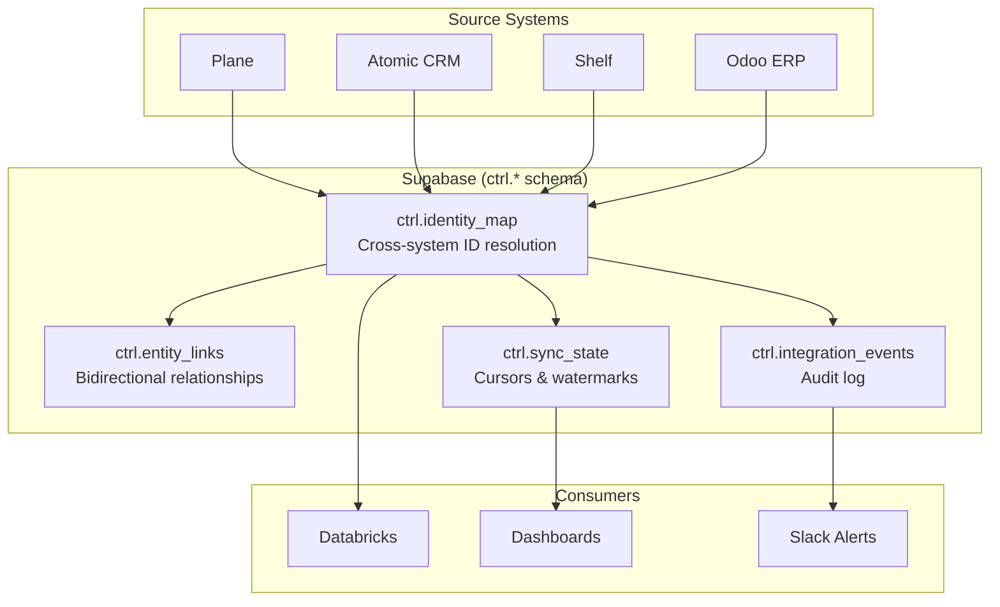
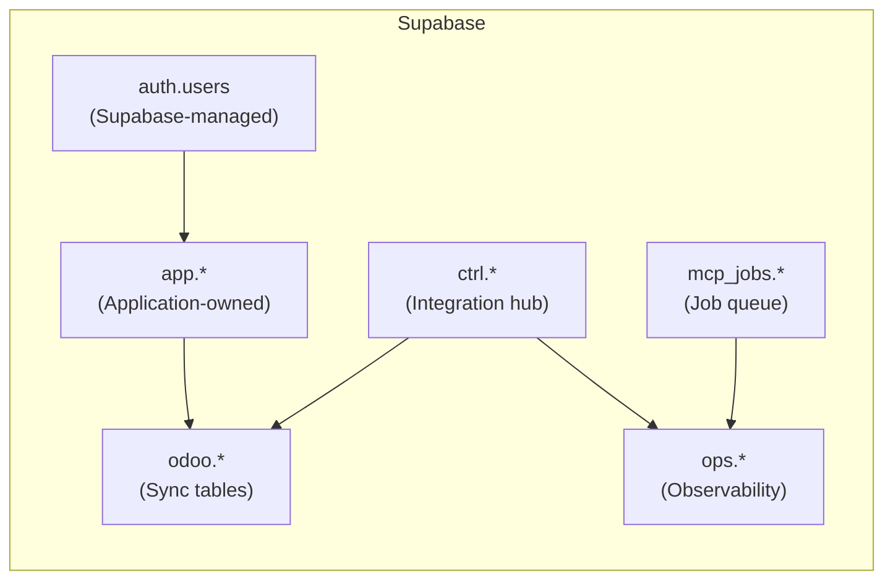

# Supabase Control Plane

> Entity ownership contract: [`CANONICAL_ENTITY_MAP.yaml`](./CANONICAL_ENTITY_MAP.yaml)
> Integration boundaries: [`INTEGRATION_BOUNDARY_MODEL.md`](./INTEGRATION_BOUNDARY_MODEL.md)
> Master pattern: [`docs/infra/ODOO_SUPABASE_MASTER_PATTERN.md`](../infra/ODOO_SUPABASE_MASTER_PATTERN.md)
> Decoupled platform PRD: [`spec/odoo-decoupled-platform/prd.md`](../../spec/odoo-decoupled-platform/prd.md)

Supabase serves as the **integration hub** for all cross-system data flows. It does not store business data -- it stores the **identity mappings, entity relationships, sync cursors, and event logs** that make cross-system sync possible.

All tables live in the `ctrl` schema, separate from the existing `app`, `odoo`, and `ops` schemas defined in [`spec/schema/entities.yaml`](../../spec/schema/entities.yaml).

---

## Architecture



---

## Schema Definition

### `ctrl.identity_map`

Cross-system entity identity resolution. Every entity that exists in more than one system gets a canonical ID here.

```sql
CREATE SCHEMA IF NOT EXISTS ctrl;

CREATE TABLE ctrl.identity_map (
    id              uuid PRIMARY KEY DEFAULT gen_random_uuid(),
    canonical_id    uuid NOT NULL DEFAULT gen_random_uuid(),
    source_system   text NOT NULL,
    source_id       text NOT NULL,
    entity_type     text NOT NULL,
    metadata        jsonb DEFAULT '{}',
    created_at      timestamptz NOT NULL DEFAULT now(),
    updated_at      timestamptz NOT NULL DEFAULT now(),

    -- Each (source_system, source_id) pair is unique
    CONSTRAINT uq_identity_source UNIQUE (source_system, source_id)
);

-- Lookup by canonical ID (find all representations of an entity)
CREATE INDEX idx_identity_canonical ON ctrl.identity_map (canonical_id);

-- Lookup by entity type within a system
CREATE INDEX idx_identity_system_type ON ctrl.identity_map (source_system, entity_type);

COMMENT ON TABLE ctrl.identity_map IS
    'Cross-system entity identity resolution. Maps system-local IDs to a shared canonical ID.';
COMMENT ON COLUMN ctrl.identity_map.canonical_id IS
    'Shared UUID that groups all representations of the same real-world entity across systems.';
COMMENT ON COLUMN ctrl.identity_map.source_system IS
    'System that owns this ID. One of: plane, atomic_crm, shelf, odoo, databricks.';
COMMENT ON COLUMN ctrl.identity_map.source_id IS
    'The entity ID as known by the source system (may be UUID, integer, or string).';
COMMENT ON COLUMN ctrl.identity_map.entity_type IS
    'Semantic type: project, contact, company, deal, asset, invoice, employee, etc.';
```

**Usage**: When Plane creates a project and it syncs to Odoo, two rows are inserted:

```sql
-- Plane side
INSERT INTO ctrl.identity_map (canonical_id, source_system, source_id, entity_type)
VALUES ('aaa-bbb-ccc', 'plane', 'PLN-42', 'project');

-- Odoo side (after sync creates the record)
INSERT INTO ctrl.identity_map (canonical_id, source_system, source_id, entity_type)
VALUES ('aaa-bbb-ccc', 'odoo', '157', 'project');
```

To resolve a Plane project ID to its Odoo ID:

```sql
SELECT source_id
FROM ctrl.identity_map
WHERE canonical_id = (
    SELECT canonical_id FROM ctrl.identity_map
    WHERE source_system = 'plane' AND source_id = 'PLN-42'
)
AND source_system = 'odoo';
```

---

### `ctrl.entity_links`

Bidirectional entity relationships across systems. Captures semantic links like "this deal became this project" or "this asset belongs to this kit".

```sql
CREATE TABLE ctrl.entity_links (
    id              uuid PRIMARY KEY DEFAULT gen_random_uuid(),
    canonical_id_a  uuid NOT NULL,
    canonical_id_b  uuid NOT NULL,
    link_type       text NOT NULL,
    metadata        jsonb DEFAULT '{}',
    created_at      timestamptz NOT NULL DEFAULT now(),

    -- Prevent duplicate links of the same type
    CONSTRAINT uq_entity_link UNIQUE (canonical_id_a, canonical_id_b, link_type),

    -- Both sides must exist in identity_map
    CONSTRAINT fk_link_a FOREIGN KEY (canonical_id_a)
        REFERENCES ctrl.identity_map (canonical_id) ON DELETE CASCADE,
    CONSTRAINT fk_link_b FOREIGN KEY (canonical_id_b)
        REFERENCES ctrl.identity_map (canonical_id) ON DELETE CASCADE
);

-- Lookup links by either side
CREATE INDEX idx_link_a ON ctrl.entity_links (canonical_id_a);
CREATE INDEX idx_link_b ON ctrl.entity_links (canonical_id_b);
CREATE INDEX idx_link_type ON ctrl.entity_links (link_type);

COMMENT ON TABLE ctrl.entity_links IS
    'Bidirectional semantic relationships between entities across systems.';
COMMENT ON COLUMN ctrl.entity_links.link_type IS
    'Semantic relationship: deal_to_project, asset_to_kit, contact_to_employee, etc.';
```

**Link types**:

| `link_type` | Meaning | Example |
|-------------|---------|---------|
| `deal_to_project` | Won deal converted to delivery project | CRM deal --> Plane project |
| `asset_to_kit` | Asset belongs to a kit | Shelf asset --> Shelf kit |
| `contact_to_employee` | CRM contact is also an employee | CRM contact --> Odoo employee |
| `project_to_invoice` | Project generated an invoice | Plane project --> Odoo invoice |
| `asset_to_account_asset` | Shelf asset mapped to Odoo fixed asset | Shelf --> Odoo |

---

### `ctrl.sync_state`

Sync cursors, watermarks, and last-sync timestamps for each system-entity pair. Enables incremental sync (only fetch records changed since last cursor).

```sql
CREATE TABLE ctrl.sync_state (
    id              uuid PRIMARY KEY DEFAULT gen_random_uuid(),
    source_system   text NOT NULL,
    target_system   text NOT NULL,
    entity_type     text NOT NULL,
    cursor_value    text,
    watermark       timestamptz,
    last_sync_at    timestamptz,
    records_synced  bigint DEFAULT 0,
    status          text NOT NULL DEFAULT 'idle',
    error_message   text,
    updated_at      timestamptz NOT NULL DEFAULT now(),

    -- One cursor per (source, target, entity) triple
    CONSTRAINT uq_sync_state UNIQUE (source_system, target_system, entity_type),

    -- Status must be one of the known values
    CONSTRAINT chk_sync_status CHECK (status IN ('idle', 'running', 'error', 'paused'))
);

CREATE INDEX idx_sync_state_status ON ctrl.sync_state (status);

COMMENT ON TABLE ctrl.sync_state IS
    'Tracks sync progress for each source-target-entity combination. Enables incremental sync.';
COMMENT ON COLUMN ctrl.sync_state.cursor_value IS
    'Opaque cursor value from the source system (page token, offset, or record ID).';
COMMENT ON COLUMN ctrl.sync_state.watermark IS
    'High-water mark timestamp. Only records with updated_at > watermark are fetched.';
COMMENT ON COLUMN ctrl.sync_state.records_synced IS
    'Cumulative count of records synced for this combination.';
```

**Relationship to existing schema**: This table supersedes `odoo.sync_cursors` from `spec/schema/entities.yaml` for cross-system sync. The existing `odoo.sync_cursors` table remains valid for Odoo-specific internal sync tracking.

---

### `ctrl.integration_events`

Append-only event log for all cross-system operations. Provides a complete audit trail for debugging, compliance, and observability.

```sql
CREATE TABLE ctrl.integration_events (
    id              uuid PRIMARY KEY DEFAULT gen_random_uuid(),
    event_type      text NOT NULL,
    source_system   text NOT NULL,
    target_system   text,
    entity_type     text,
    canonical_id    uuid,
    payload         jsonb DEFAULT '{}',
    error           jsonb,
    created_at      timestamptz NOT NULL DEFAULT now(),

    -- Event type must be one of the known values
    CONSTRAINT chk_event_type CHECK (event_type IN (
        'sync_started', 'sync_completed', 'sync_failed',
        'entity_created', 'entity_updated', 'entity_deleted',
        'conflict_detected', 'conflict_resolved',
        'identity_created', 'link_created',
        'dlq_enqueued', 'dlq_replayed',
        'error', 'warning'
    ))
);

-- Time-series queries (most recent first)
CREATE INDEX idx_events_created ON ctrl.integration_events (created_at DESC);

-- Filter by system pair
CREATE INDEX idx_events_systems ON ctrl.integration_events (source_system, target_system);

-- Filter by entity
CREATE INDEX idx_events_entity ON ctrl.integration_events (entity_type, canonical_id);

-- Filter by event type
CREATE INDEX idx_events_type ON ctrl.integration_events (event_type);

COMMENT ON TABLE ctrl.integration_events IS
    'Append-only audit log for all cross-system integration operations.';
COMMENT ON COLUMN ctrl.integration_events.payload IS
    'Event-specific data. For conflicts: includes both winning and rejected values.';
COMMENT ON COLUMN ctrl.integration_events.error IS
    'Error details for failed events. Includes error_code, message, stack_trace.';
```

**Event flow example** (CRM contact synced to Odoo):

```sql
-- 1. Sync started
INSERT INTO ctrl.integration_events (event_type, source_system, target_system, entity_type)
VALUES ('sync_started', 'atomic_crm', 'odoo', 'contact');

-- 2. Identity created
INSERT INTO ctrl.integration_events (event_type, source_system, entity_type, canonical_id, payload)
VALUES ('identity_created', 'atomic_crm', 'contact', 'aaa-bbb', '{"source_id": "CRM-99"}');

-- 3. Entity created in target
INSERT INTO ctrl.integration_events (event_type, source_system, target_system, entity_type, canonical_id, payload)
VALUES ('entity_created', 'atomic_crm', 'odoo', 'contact', 'aaa-bbb', '{"odoo_id": 42}');

-- 4. Sync completed
INSERT INTO ctrl.integration_events (event_type, source_system, target_system, entity_type, payload)
VALUES ('sync_completed', 'atomic_crm', 'odoo', 'contact', '{"records_synced": 1, "duration_ms": 340}');
```

---

## RLS Policies

The `ctrl` schema is **not exposed to end users**. Only service-role connections (sync workers, n8n, Edge Functions) may read/write these tables.

```sql
-- Enable RLS on all ctrl tables
ALTER TABLE ctrl.identity_map ENABLE ROW LEVEL SECURITY;
ALTER TABLE ctrl.entity_links ENABLE ROW LEVEL SECURITY;
ALTER TABLE ctrl.sync_state ENABLE ROW LEVEL SECURITY;
ALTER TABLE ctrl.integration_events ENABLE ROW LEVEL SECURITY;

-- Only service_role can access ctrl tables
CREATE POLICY "service_role_only" ON ctrl.identity_map
    FOR ALL USING (auth.role() = 'service_role');
CREATE POLICY "service_role_only" ON ctrl.entity_links
    FOR ALL USING (auth.role() = 'service_role');
CREATE POLICY "service_role_only" ON ctrl.sync_state
    FOR ALL USING (auth.role() = 'service_role');
CREATE POLICY "service_role_only" ON ctrl.integration_events
    FOR ALL USING (auth.role() = 'service_role');
```

---

## Helper Functions

### Resolve cross-system ID

```sql
CREATE OR REPLACE FUNCTION ctrl.resolve_id(
    p_source_system text,
    p_source_id text,
    p_target_system text
) RETURNS text AS $$
    SELECT im2.source_id
    FROM ctrl.identity_map im1
    JOIN ctrl.identity_map im2 ON im1.canonical_id = im2.canonical_id
    WHERE im1.source_system = p_source_system
      AND im1.source_id = p_source_id
      AND im2.source_system = p_target_system;
$$ LANGUAGE sql STABLE;

COMMENT ON FUNCTION ctrl.resolve_id IS
    'Resolve an entity ID from one system to another via the identity map.';
```

### Register a new identity pair

```sql
CREATE OR REPLACE FUNCTION ctrl.register_identity(
    p_source_system text,
    p_source_id text,
    p_target_system text,
    p_target_id text,
    p_entity_type text,
    p_canonical_id uuid DEFAULT gen_random_uuid()
) RETURNS uuid AS $$
DECLARE
    v_canonical uuid;
BEGIN
    -- Check if source already has a canonical ID
    SELECT canonical_id INTO v_canonical
    FROM ctrl.identity_map
    WHERE source_system = p_source_system AND source_id = p_source_id;

    -- Use existing canonical ID or the provided/generated one
    v_canonical := COALESCE(v_canonical, p_canonical_id);

    -- Upsert source side
    INSERT INTO ctrl.identity_map (canonical_id, source_system, source_id, entity_type)
    VALUES (v_canonical, p_source_system, p_source_id, p_entity_type)
    ON CONFLICT (source_system, source_id) DO NOTHING;

    -- Upsert target side
    INSERT INTO ctrl.identity_map (canonical_id, source_system, source_id, entity_type)
    VALUES (v_canonical, p_target_system, p_target_id, p_entity_type)
    ON CONFLICT (source_system, source_id) DO NOTHING;

    -- Log the event
    INSERT INTO ctrl.integration_events (event_type, source_system, target_system, entity_type, canonical_id, payload)
    VALUES ('identity_created', p_source_system, p_target_system, p_entity_type, v_canonical,
            jsonb_build_object('source_id', p_source_id, 'target_id', p_target_id));

    RETURN v_canonical;
END;
$$ LANGUAGE plpgsql;

COMMENT ON FUNCTION ctrl.register_identity IS
    'Register a bidirectional identity mapping between two systems for the same entity.';
```

---

## Relationship to Existing Schemas



| Schema | Owner | Purpose | Defined In |
|--------|-------|---------|------------|
| `auth` | Supabase | User authentication | Supabase-managed |
| `app` | Application | Business entities (orgs, projects, tasks) | `spec/schema/entities.yaml` |
| `odoo` | Sync | Odoo instance config, cursors, mappings | `spec/schema/entities.yaml` |
| `ops` | Platform | Runs, events, artifacts | `spec/schema/entities.yaml` |
| `ctrl` | Integration | Identity map, entity links, sync state, events | **This document** |
| `mcp_jobs` | Platform | Job queue, dead-letter queue, metrics | `docs/infra/MCP_JOBS_SYSTEM.md` |

The `ctrl` schema complements -- does not replace -- the existing `odoo.sync_cursors` and `odoo.entity_mappings` tables. Those tables handle Odoo-specific internal sync. The `ctrl` schema handles **cross-system** sync across all six systems.

---

## Observability

### Key Metrics (SQL)

```sql
-- Sync health: events in last hour by type
SELECT event_type, source_system, target_system, COUNT(*)
FROM ctrl.integration_events
WHERE created_at > now() - interval '1 hour'
GROUP BY event_type, source_system, target_system
ORDER BY count DESC;

-- Identity map coverage: entities per system
SELECT source_system, entity_type, COUNT(*)
FROM ctrl.identity_map
GROUP BY source_system, entity_type
ORDER BY source_system, entity_type;

-- Sync lag: time since last successful sync per boundary
SELECT source_system, target_system, entity_type,
       last_sync_at,
       now() - last_sync_at AS lag
FROM ctrl.sync_state
WHERE status != 'paused'
ORDER BY lag DESC;

-- Error rate: failed syncs in last 24h
SELECT source_system, target_system, entity_type, COUNT(*)
FROM ctrl.integration_events
WHERE event_type IN ('sync_failed', 'error')
  AND created_at > now() - interval '24 hours'
GROUP BY source_system, target_system, entity_type;
```

### Alert Thresholds

| Metric | Warning | Critical |
|--------|---------|----------|
| Sync lag | > 5 minutes | > 30 minutes |
| Error rate (per hour) | > 5 | > 20 |
| Unresolved DLQ items | > 3 | > 10 |
| Identity map orphans | > 10 | > 50 |

---

## Cross-References

- Entity ownership contract: [`CANONICAL_ENTITY_MAP.yaml`](./CANONICAL_ENTITY_MAP.yaml)
- Entity ownership docs: [`CANONICAL_ENTITY_MAP.md`](./CANONICAL_ENTITY_MAP.md)
- Integration boundaries: [`INTEGRATION_BOUNDARY_MODEL.md`](./INTEGRATION_BOUNDARY_MODEL.md)
- Odoo-Supabase master pattern: [`docs/infra/ODOO_SUPABASE_MASTER_PATTERN.md`](../infra/ODOO_SUPABASE_MASTER_PATTERN.md)
- Decoupled platform PRD: [`spec/odoo-decoupled-platform/prd.md`](../../spec/odoo-decoupled-platform/prd.md)
- Existing entity schema: [`spec/schema/entities.yaml`](../../spec/schema/entities.yaml)
- MCP Jobs system: [`docs/infra/MCP_JOBS_SYSTEM.md`](../infra/MCP_JOBS_SYSTEM.md)
