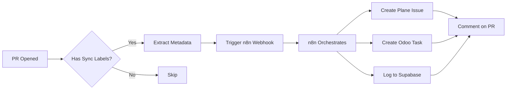
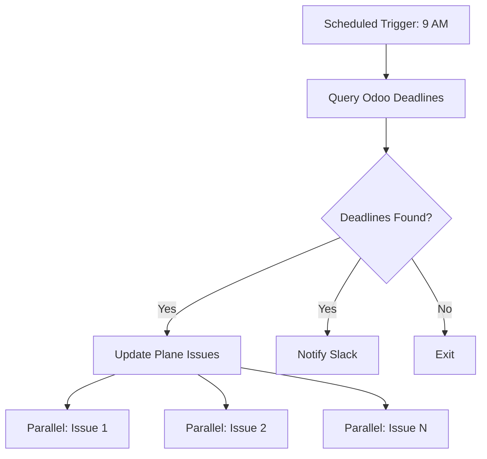

# GitHub Actions Workflows for Plane-Odoo-n8n Integration

> Practical workflow examples demonstrating GitHub Actions integration with the Plane-Odoo-n8n stack

---

## Overview

This guide provides production-ready GitHub Actions workflows that:
- Trigger n8n orchestration workflows
- Sync GitHub events to Plane and Odoo
- Use self-hosted runners on DigitalOcean infrastructure
- Visualize complex multi-stage workflows
- Follow Anthropic's effective agent design principles

## Self-Hosted Runner Setup (DigitalOcean)

### Architecture

```
GitHub Repository
    ↓ webhook
DigitalOcean Droplet (178.128.112.214)
    ↓ runner service
GitHub Actions Runner
    ↓ executes
Workflow Jobs
    ↓ triggers
n8n Workflows (n8n.insightpulseai.com)
    ↓ orchestrates
Plane + Odoo + Supabase + Slack
```

### Runner Installation Script

**File**: `scripts/github/setup-self-hosted-runner.sh`

```bash
#!/bin/bash
set -euo pipefail

# GitHub Actions Self-Hosted Runner Setup
# Target: DigitalOcean Droplet (178.128.112.214)
# Org: Insightpulseai

RUNNER_VERSION="2.311.0"
RUNNER_DIR="/opt/actions-runner"
RUNNER_USER="github-runner"

# Create runner user
sudo useradd -m -s /bin/bash ${RUNNER_USER}

# Create runner directory
sudo mkdir -p ${RUNNER_DIR}
sudo chown ${RUNNER_USER}:${RUNNER_USER} ${RUNNER_DIR}

# Download and extract runner
cd ${RUNNER_DIR}
curl -o actions-runner-linux-x64-${RUNNER_VERSION}.tar.gz \
  -L https://github.com/actions/runner/releases/download/v${RUNNER_VERSION}/actions-runner-linux-x64-${RUNNER_VERSION}.tar.gz

tar xzf ./actions-runner-linux-x64-${RUNNER_VERSION}.tar.gz
rm actions-runner-linux-x64-${RUNNER_VERSION}.tar.gz

# Configure runner (requires RUNNER_TOKEN from GitHub org settings)
sudo -u ${RUNNER_USER} ./config.sh \
  --url https://github.com/Insightpulseai \
  --token ${RUNNER_TOKEN} \
  --name odoo-prod-runner \
  --labels odoo,n8n,plane,self-hosted \
  --work _work \
  --unattended

# Install as systemd service
sudo ./svc.sh install ${RUNNER_USER}
sudo ./svc.sh start

# Verify runner status
sudo ./svc.sh status

echo "✅ Self-hosted runner installed and started"
echo "Runner name: odoo-prod-runner"
echo "Labels: odoo, n8n, plane, self-hosted"
```

### Runner Labels Strategy

| Label | Use Case | Example Job |
|-------|----------|-------------|
| `self-hosted` | All jobs on DigitalOcean infrastructure | General workflows |
| `odoo` | Jobs requiring Odoo access | Module testing, deployments |
| `n8n` | Jobs triggering n8n workflows | Webhook orchestration |
| `plane` | Jobs interacting with Plane API | Issue sync, project creation |
| `linux` | OS-specific jobs | Docker builds, shell scripts |

---

## Workflow Examples

### 1. Auto-Sync PR to Plane (with Visualization)

**File**: `.github/workflows/pr-plane-sync.yml`

```yaml
name: PR → Plane Issue Sync

on:
  pull_request:
    types: [opened, reopened, labeled, unlabeled]
    branches: [main, develop]

# Workflow visualization stages:
# 1. Validate → 2. Extract → 3. n8n Trigger → 4. Plane Create → 5. Comment

jobs:
  validate-labels:
    name: "🔍 Stage 1: Validate Labels"
    runs-on: ubuntu-latest
    outputs:
      should_sync: ${{ steps.check.outputs.result }}
    steps:
      - name: Check for sync labels
        id: check
        uses: actions/github-script@v7
        with:
          script: |
            const labels = context.payload.pull_request.labels.map(l => l.name);
            const syncLabels = ['needs-planning', 'bir:filing', 'compliance', 'feature'];
            const shouldSync = labels.some(l => syncLabels.includes(l));
            console.log(`Labels: ${labels.join(', ')}`);
            console.log(`Should sync: ${shouldSync}`);
            return shouldSync;

  extract-metadata:
    name: "📊 Stage 2: Extract Metadata"
    runs-on: ubuntu-latest
    needs: validate-labels
    if: needs.validate-labels.outputs.should_sync == 'true'
    outputs:
      pr_data: ${{ steps.extract.outputs.data }}
    steps:
      - name: Extract PR metadata
        id: extract
        uses: actions/github-script@v7
        with:
          script: |
            const pr = context.payload.pull_request;
            const data = {
              number: pr.number,
              title: pr.title,
              body: pr.body || '',
              url: pr.html_url,
              author: pr.user.login,
              labels: pr.labels.map(l => l.name),
              created_at: pr.created_at,
              repository: context.repo.repo
            };
            core.setOutput('data', JSON.stringify(data));
            return data;

  trigger-n8n-workflow:
    name: "⚡ Stage 3: Trigger n8n Orchestration"
    runs-on: self-hosted
    needs: extract-metadata
    steps:
      - name: Call n8n webhook
        id: n8n
        run: |
          RESPONSE=$(curl -s -w "\n%{http_code}" -X POST \
            "${{ secrets.N8N_WEBHOOK_URL }}/plane-odoo-github-sync" \
            -H "Content-Type: application/json" \
            -H "X-N8N-Webhook-Secret: ${{ secrets.N8N_WEBHOOK_SECRET }}" \
            -d '${{ needs.extract-metadata.outputs.pr_data }}')

          HTTP_CODE=$(echo "$RESPONSE" | tail -n1)
          BODY=$(echo "$RESPONSE" | sed '$d')

          if [ "$HTTP_CODE" != "200" ]; then
            echo "❌ n8n webhook failed with HTTP $HTTP_CODE"
            echo "$BODY"
            exit 1
          fi

          echo "✅ n8n workflow triggered successfully"
          echo "$BODY" | jq '.'

          # Extract Plane issue ID from response
          PLANE_ISSUE_ID=$(echo "$BODY" | jq -r '.plane_issue_id')
          PLANE_URL=$(echo "$BODY" | jq -r '.plane_issue_url')

          echo "plane_issue_id=$PLANE_ISSUE_ID" >> $GITHUB_OUTPUT
          echo "plane_url=$PLANE_URL" >> $GITHUB_OUTPUT

      - name: Log to Supabase
        run: |
          curl -X POST \
            "${{ secrets.SUPABASE_URL }}/rest/v1/ops.platform_events" \
            -H "apikey: ${{ secrets.SUPABASE_SERVICE_ROLE_KEY }}" \
            -H "Authorization: Bearer ${{ secrets.SUPABASE_SERVICE_ROLE_KEY }}" \
            -H "Content-Type: application/json" \
            -d '{
              "event_type": "github.pr_plane_sync",
              "source_system": "github_actions",
              "event_data": {
                "pr_number": ${{ github.event.pull_request.number }},
                "plane_issue_id": "${{ steps.n8n.outputs.plane_issue_id }}",
                "workflow_run_id": "${{ github.run_id }}"
              },
              "timestamp": "'$(date -u +%Y-%m-%dT%H:%M:%SZ)'",
              "correlation_id": "gh_${{ github.run_id }}"
            }'

  comment-pr:
    name: "💬 Stage 5: Comment on PR"
    runs-on: ubuntu-latest
    needs: trigger-n8n-workflow
    steps:
      - name: Add Plane link comment
        uses: actions/github-script@v7
        with:
          script: |
            const planeUrl = '${{ needs.trigger-n8n-workflow.outputs.plane_url }}';
            const body = `
            ✅ **Auto-synced to Plane**

            **Plane Issue**: [View in fin-ops](${planeUrl})

            Changes to this PR will be automatically synced to Plane and Odoo.

            ---
            *Automated by [GitHub Actions + n8n + Plane](https://n8n.insightpulseai.com)*
            `;

            await github.rest.issues.createComment({
              owner: context.repo.owner,
              repo: context.repo.repo,
              issue_number: context.issue.number,
              body: body
            });
```

**Workflow Visualization**:
```
┌─────────────┐    ┌──────────────┐    ┌─────────────┐    ┌─────────────┐    ┌─────────────┐
│ Validate    │───▶│ Extract      │───▶│ n8n Trigger │───▶│ Plane Create│───▶│ Comment PR  │
│ Labels      │    │ Metadata     │    │ Workflow    │    │ Issue       │    │ with Link   │
└─────────────┘    └──────────────┘    └─────────────┘    └─────────────┘    └─────────────┘
    Stage 1             Stage 2             Stage 3             Stage 4             Stage 5
```

---

### 2. BIR Deadline Reminder (Scheduled + Parallel)

**File**: `.github/workflows/bir-deadline-reminder.yml`

```yaml
name: BIR Deadline Reminders

on:
  schedule:
    # Daily at 9 AM Manila time (1 AM UTC)
    - cron: '0 1 * * *'
  workflow_dispatch:
    inputs:
      days_ahead:
        description: 'Days ahead to check'
        required: false
        default: '3'

jobs:
  fetch-deadlines:
    name: "📅 Fetch Upcoming Deadlines"
    runs-on: self-hosted
    outputs:
      deadlines: ${{ steps.query.outputs.result }}
    steps:
      - name: Query Odoo for deadlines
        id: query
        run: |
          # Call Odoo XML-RPC via Python
          python3 << 'EOF'
          import xmlrpc.client
          import json
          from datetime import datetime, timedelta

          url = "${{ secrets.ODOO_URL }}"
          db = "${{ secrets.ODOO_DB }}"
          username = "${{ secrets.ODOO_USERNAME }}"
          password = "${{ secrets.ODOO_PASSWORD }}"

          common = xmlrpc.client.ServerProxy(f'{url}/xmlrpc/2/common')
          uid = common.authenticate(db, username, password, {})

          models = xmlrpc.client.ServerProxy(f'{url}/xmlrpc/2/object')

          days_ahead = int("${{ github.event.inputs.days_ahead || '3' }}")
          deadline_date = (datetime.now() + timedelta(days=days_ahead)).strftime('%Y-%m-%d')

          deadlines = models.execute_kw(db, uid, password,
              'bir.filing.deadline', 'search_read',
              [[['deadline_date', '<=', deadline_date], ['status', '=', 'pending']]],
              {'fields': ['id', 'form_type', 'period_start', 'period_end', 'deadline_date', 'plane_issue_id']}
          )

          print(f"::set-output name=result::{json.dumps(deadlines)}")
          EOF

  notify-plane:
    name: "🔔 Update Plane Issues"
    runs-on: self-hosted
    needs: fetch-deadlines
    if: needs.fetch-deadlines.outputs.deadlines != '[]'
    strategy:
      matrix:
        deadline: ${{ fromJson(needs.fetch-deadlines.outputs.deadlines) }}
    steps:
      - name: Add urgent comment to Plane
        run: |
          curl -X POST \
            "${{ secrets.PLANE_API_URL }}/workspaces/fin-ops/projects/${{ secrets.PLANE_BIR_PROJECT_ID }}/issues/${{ matrix.deadline.plane_issue_id }}/comments/" \
            -H "X-API-Key: ${{ secrets.PLANE_API_KEY }}" \
            -H "Content-Type: application/json" \
            -d '{
              "comment_html": "<p>🚨 <strong>Urgent: Deadline in ${{ github.event.inputs.days_ahead || 3 }} days</strong></p><p>BIR Form: ${{ matrix.deadline.form_type }}<br>Deadline: ${{ matrix.deadline.deadline_date }}</p>"
            }'

  notify-slack:
    name: "💬 Slack Notifications"
    runs-on: ubuntu-latest
    needs: [fetch-deadlines, notify-plane]
    if: needs.fetch-deadlines.outputs.deadlines != '[]'
    steps:
      - name: Send Slack summary
        uses: slackapi/slack-github-action@v1.24.0
        with:
          channel-id: 'C06COMPLIANCE'
          slack-message: |
            🚨 **BIR Deadline Alert**

            ${{ length(fromJson(needs.fetch-deadlines.outputs.deadlines)) }} deadline(s) approaching:

            ${{ join(fromJson(needs.fetch-deadlines.outputs.deadlines).*.form_type, ', ') }}

            All Plane issues updated with urgent priority.
        env:
          SLACK_BOT_TOKEN: ${{ secrets.SLACK_BOT_TOKEN }}
```

**Parallel Execution Visualization**:
```
         ┌─────────────────┐
         │ Fetch Deadlines │
         └────────┬────────┘
                  │
        ┌─────────┴─────────┐
        ▼                   ▼
┌───────────────┐   ┌───────────────┐
│ Notify Plane  │   │ Notify Slack  │
│ (Parallel)    │   │               │
│               │   │               │
│ Issue 1 ─┐    │   │ Summary       │
│ Issue 2 ─┤    │   │ Message       │
│ Issue 3 ─┤    │   │               │
│ Issue N ─┘    │   │               │
└───────────────┘   └───────────────┘
```

---

### 3. Odoo Module Deployment (Multi-Stage with Rollback)

**File**: `.github/workflows/odoo-module-deploy.yml`

```yaml
name: Deploy Odoo Module

on:
  push:
    branches: [main]
    paths:
      - 'addons/ipai/**'
  workflow_dispatch:
    inputs:
      module_name:
        description: 'Module to deploy (e.g., ipai_bir_plane_sync)'
        required: true
      environment:
        description: 'Target environment'
        required: true
        type: choice
        options:
          - production
          - staging

# Visualization: Build → Test → Deploy → Verify → Rollback (if needed)

jobs:
  build:
    name: "🏗️ Stage 1: Build & Validate"
    runs-on: ubuntu-latest
    steps:
      - uses: actions/checkout@v4

      - name: Set up Python
        uses: actions/setup-python@v4
        with:
          python-version: '3.12'

      - name: Install dependencies
        run: |
          pip install flake8 black isort

      - name: Lint module
        run: |
          flake8 addons/ipai/${{ github.event.inputs.module_name || 'ipai_*' }}
          black --check addons/ipai/${{ github.event.inputs.module_name || 'ipai_*' }}
          isort --check addons/ipai/${{ github.event.inputs.module_name || 'ipai_*' }}

      - name: Archive module
        uses: actions/upload-artifact@v3
        with:
          name: odoo-module
          path: addons/ipai/${{ github.event.inputs.module_name }}

  test:
    name: "🧪 Stage 2: Run Tests"
    runs-on: self-hosted
    needs: build
    steps:
      - uses: actions/checkout@v4

      - name: Download module artifact
        uses: actions/download-artifact@v3
        with:
          name: odoo-module
          path: /tmp/module-test

      - name: Run Odoo tests
        run: |
          docker run --rm \
            -v /tmp/module-test:/mnt/extra-addons \
            -e ODOO_DB_NAME=odoo_test \
            odoo:19 \
            odoo -d odoo_test -i ${{ github.event.inputs.module_name }} --test-enable --stop-after-init

  deploy:
    name: "🚀 Stage 3: Deploy to ${{ github.event.inputs.environment || 'production' }}"
    runs-on: self-hosted
    needs: test
    environment: ${{ github.event.inputs.environment || 'production' }}
    steps:
      - uses: actions/checkout@v4

      - name: Backup current module version
        run: |
          ssh root@178.128.112.214 "
            cd /workspaces/odoo/addons/ipai
            tar -czf /tmp/backup_${{ github.event.inputs.module_name }}_$(date +%Y%m%d_%H%M%S).tar.gz ${{ github.event.inputs.module_name }}
          "

      - name: Deploy module
        run: |
          rsync -avz --delete \
            addons/ipai/${{ github.event.inputs.module_name }}/ \
            root@178.128.112.214:/workspaces/odoo/addons/ipai/${{ github.event.inputs.module_name }}/

      - name: Update module in Odoo
        run: |
          ssh root@178.128.112.214 "
            docker exec odoo-odoo-1 odoo-bin \
              -d odoo \
              -u ${{ github.event.inputs.module_name }} \
              --stop-after-init
            docker restart odoo-odoo-1
          "

  verify:
    name: "✅ Stage 4: Verify Deployment"
    runs-on: ubuntu-latest
    needs: deploy
    steps:
      - name: Health check
        run: |
          sleep 30
          HTTP_CODE=$(curl -s -o /dev/null -w "%{http_code}" https://erp.insightpulseai.com)
          if [ "$HTTP_CODE" != "200" ]; then
            echo "❌ Health check failed with HTTP $HTTP_CODE"
            exit 1
          fi
          echo "✅ Odoo is responding"

      - name: Module status check
        run: |
          python3 << 'EOF'
          import xmlrpc.client

          url = "${{ secrets.ODOO_URL }}"
          db = "${{ secrets.ODOO_DB }}"
          username = "${{ secrets.ODOO_USERNAME }}"
          password = "${{ secrets.ODOO_PASSWORD }}"

          common = xmlrpc.client.ServerProxy(f'{url}/xmlrpc/2/common')
          uid = common.authenticate(db, username, password, {})

          models = xmlrpc.client.ServerProxy(f'{url}/xmlrpc/2/object')

          modules = models.execute_kw(db, uid, password,
              'ir.module.module', 'search_read',
              [[['name', '=', '${{ github.event.inputs.module_name }}'], ['state', '=', 'installed']]],
              {'fields': ['name', 'state', 'latest_version']}
          )

          if not modules:
              print("❌ Module not installed")
              exit(1)

          print(f"✅ Module {modules[0]['name']} is installed (version: {modules[0]['latest_version']})")
          EOF

  rollback:
    name: "⏮️ Rollback on Failure"
    runs-on: self-hosted
    needs: [deploy, verify]
    if: failure()
    steps:
      - name: Restore backup
        run: |
          ssh root@178.128.112.214 "
            LATEST_BACKUP=\$(ls -t /tmp/backup_${{ github.event.inputs.module_name }}_*.tar.gz | head -1)
            cd /workspaces/odoo/addons/ipai
            rm -rf ${{ github.event.inputs.module_name }}
            tar -xzf \$LATEST_BACKUP
            docker restart odoo-odoo-1
          "

      - name: Notify rollback
        uses: slackapi/slack-github-action@v1.24.0
        with:
          channel-id: 'C06DEPLOYMENTS'
          slack-message: |
            ⏮️ **Deployment Rollback**

            Module: ${{ github.event.inputs.module_name }}
            Environment: ${{ github.event.inputs.environment || 'production' }}
            Workflow: ${{ github.server_url }}/${{ github.repository }}/actions/runs/${{ github.run_id }}

            Previous version restored from backup.
        env:
          SLACK_BOT_TOKEN: ${{ secrets.SLACK_BOT_TOKEN }}
```

**Multi-Stage Visualization with Rollback**:
```
┌────────┐    ┌──────┐    ┌────────┐    ┌────────┐
│ Build  │───▶│ Test │───▶│ Deploy │───▶│ Verify │
└────────┘    └──────┘    └────────┘    └────┬───┘
                                              │
                                        Success │ Failure
                                              │ │
                                              ▼ ▼
                                          ┌────────┐
                                          │Rollback│
                                          │(if fail)│
                                          └────────┘
```

---

### 4. Design System Sync (Figma → Vercel)

**File**: `.github/workflows/design-tokens-sync.yml`

```yaml
name: Figma Design Tokens → Vercel Deploy

on:
  repository_dispatch:
    types: [figma-update]
  workflow_dispatch:

jobs:
  extract-tokens:
    name: "🎨 Extract Design Tokens"
    runs-on: ubuntu-latest
    steps:
      - uses: actions/checkout@v4

      - name: Fetch Figma tokens
        run: |
          curl -X GET \
            "https://api.figma.com/v1/files/${{ secrets.FIGMA_FILE_KEY }}" \
            -H "X-Figma-Token: ${{ secrets.FIGMA_ACCESS_TOKEN }}" \
            | jq '.document.children[] | select(.name == "Tokens") | .children' \
            > design-tokens-raw.json

      - name: Transform to CSS variables
        run: |
          node scripts/figma-to-css.js design-tokens-raw.json > tokens.css

      - name: Commit tokens
        run: |
          git config user.name "GitHub Actions"
          git config user.email "actions@github.com"
          git add tokens.css
          git commit -m "chore(design): update design tokens from Figma"
          git push

  trigger-vercel-deploy:
    name: "🚀 Trigger Vercel Deployment"
    runs-on: ubuntu-latest
    needs: extract-tokens
    steps:
      - name: Trigger Vercel hook
        run: |
          curl -X POST "${{ secrets.VERCEL_DEPLOY_HOOK }}"

      - name: Log to n8n
        run: |
          curl -X POST \
            "${{ secrets.N8N_WEBHOOK_URL }}/design-system-deploy" \
            -H "Content-Type: application/json" \
            -d '{
              "source": "github_actions",
              "event": "figma_sync",
              "commit_sha": "${{ github.sha }}",
              "vercel_deployment_triggered": true
            }'
```

---

## Workflow Visualization Strategies

### 1. GitHub Actions UI Visualization

All workflows use job names with stage prefixes for visual clarity:

```yaml
jobs:
  validate-labels:
    name: "🔍 Stage 1: Validate Labels"

  extract-metadata:
    name: "📊 Stage 2: Extract Metadata"

  trigger-n8n-workflow:
    name: "⚡ Stage 3: Trigger n8n Orchestration"
```

This creates a visual workflow graph in GitHub Actions UI:
```
Stage 1 → Stage 2 → Stage 3 → Stage 4 → Stage 5
```

### 2. Mermaid Diagrams in Workflow README

**File**: `.github/workflows/README.md`

```markdown
# Workflow Visualizations

## PR to Plane Sync Flow



## BIR Deadline Reminder Flow


```

### 3. Status Badges in README

**File**: `README.md`

```markdown
# InsightPulse AI — Odoo Integration

[](https://github.com/Insightpulseai/odoo/actions/workflows/pr-plane-sync.yml)
[](https://github.com/Insightpulseai/odoo/actions/workflows/bir-deadline-reminder.yml)
[](https://github.com/Insightpulseai/odoo/actions/workflows/odoo-module-deploy.yml)
```

---

## Required GitHub Secrets

Configure these in GitHub repository settings (`Settings → Secrets → Actions`):

### n8n Integration
```
N8N_WEBHOOK_URL=https://n8n.insightpulseai.com/webhook
N8N_WEBHOOK_SECRET=[from n8n webhook node settings]
```

### Plane API
```
PLANE_API_URL=https://plane.insightpulseai.com/api/v1
PLANE_API_KEY=plane_api_ec7bbd295de445518bca2c8788d5e941
PLANE_WORKSPACE_SLUG=fin-ops
PLANE_BIR_PROJECT_ID=dd0b3bd5-43e8-47ab-b3ad-279bb15d4778
```

### Odoo XML-RPC
```
ODOO_URL=https://erp.insightpulseai.com
ODOO_DB=odoo
ODOO_USERNAME=admin
ODOO_PASSWORD=[from vault]
```

### Supabase
```
SUPABASE_URL=https://spdtwktxdalcfigzeqrz.supabase.co
SUPABASE_SERVICE_ROLE_KEY=[from Supabase dashboard]
```

### Slack
```
SLACK_BOT_TOKEN=xoxb-[your-bot-token]
```

### Figma (Optional)
```
FIGMA_ACCESS_TOKEN=[from Figma account settings]
FIGMA_FILE_KEY=[from Figma file URL]
```

### Vercel (Optional)
```
VERCEL_DEPLOY_HOOK=[from Vercel project settings]
```

---

## Integration with n8n Workflows

### n8n Receives GitHub Actions Data

When GitHub Actions triggers n8n webhooks, n8n can:

1. **Enrich Data**: Add context from Plane, Odoo, Supabase
2. **Orchestrate**: Coordinate multi-system updates
3. **Validate**: Check business rules before proceeding
4. **Notify**: Send comprehensive notifications with full context

**Example n8n Node** (receiving GitHub Actions webhook):

```json
{
  "nodes": [
    {
      "name": "GitHub Actions Webhook",
      "type": "n8n-nodes-base.webhook",
      "parameters": {
        "path": "github-actions-trigger",
        "responseMode": "responseNode",
        "authentication": "headerAuth"
      }
    },
    {
      "name": "Validate Payload",
      "type": "n8n-nodes-base.function",
      "parameters": {
        "functionCode": "// Verify GitHub Actions signature\nconst crypto = require('crypto');\nconst secret = '{{ $credentials.githubActionsWebhook.secret }}';\nconst payload = JSON.stringify($input.item.json);\nconst signature = $node['GitHub Actions Webhook'].context['X-Hub-Signature-256'];\n\nconst expectedSignature = 'sha256=' + crypto\n  .createHmac('sha256', secret)\n  .update(payload)\n  .digest('hex');\n\nif (signature !== expectedSignature) {\n  throw new Error('Invalid signature');\n}\n\nreturn $input.item;"
      }
    },
    {
      "name": "Enrich from Plane",
      "type": "n8n-nodes-base.httpRequest",
      "parameters": {
        "url": "={{ $env.PLANE_API_URL }}/workspaces/{{ $env.PLANE_WORKSPACE_SLUG }}/projects/{{ $json.plane_project_id }}/issues/{{ $json.plane_issue_id }}/",
        "authentication": "genericCredentialType",
        "genericAuthType": "httpHeaderAuth"
      }
    }
  ]
}
```

---

## Best Practices

### 1. Idempotency
- All workflows should be safe to re-run
- Use `if_not_exists` patterns for resource creation
- Check current state before making changes

### 2. Error Handling
```yaml
- name: Safe operation
  run: |
    set -euo pipefail
    # Your command
  continue-on-error: false
```

### 3. Secrets Management
- Never log secrets (`set +x` before using secrets)
- Use GitHub Actions secrets, not environment files
- Rotate secrets regularly

### 4. Performance
- Use self-hosted runners for Odoo/n8n access (no network latency)
- Cache dependencies when possible
- Use matrix strategy for parallel operations

### 5. Monitoring
- Log all operations to Supabase `ops.platform_events`
- Send Slack notifications for critical workflows
- Use GitHub Actions status checks as quality gates

---

## Troubleshooting

### Self-Hosted Runner Not Picking Up Jobs

**Symptom**: Jobs remain queued even though runner is online

**Solutions**:
1. Check runner labels match job requirements
2. Verify runner service is running: `sudo systemctl status actions.runner.*`
3. Check runner logs: `sudo journalctl -u actions.runner.* -f`
4. Re-register runner if needed

### n8n Webhook Returns 401 Unauthorized

**Symptom**: GitHub Actions receives HTTP 401 from n8n

**Solutions**:
1. Verify `N8N_WEBHOOK_SECRET` matches n8n webhook node configuration
2. Check n8n webhook authentication settings (Basic Auth vs Header Auth)
3. Test webhook manually with curl to isolate issue

### Odoo XML-RPC Authentication Fails

**Symptom**: `xmlrpc.client.Fault: ODOO Session expired`

**Solutions**:
1. Verify `ODOO_USERNAME` and `ODOO_PASSWORD` are correct
2. Check Odoo user has necessary permissions
3. Ensure Odoo database name matches `ODOO_DB` secret

---

## Next Steps

1. ✅ **Review workflow examples** (you're here)
2. ⏳ **Set up self-hosted runner** on DigitalOcean droplet
3. ⏳ **Configure GitHub Actions secrets** in repository settings
4. ⏳ **Deploy workflows** to `.github/workflows/` directory
5. ⏳ **Test with real PR** to validate end-to-end flow
6. ⏳ **Monitor execution** via GitHub Actions UI and Supabase logs

---

**Last Updated**: 2026-03-05
**Status**: Production-ready workflow examples for Plane-Odoo-n8n integration
**Next Action**: Set up self-hosted runner and configure GitHub secrets
