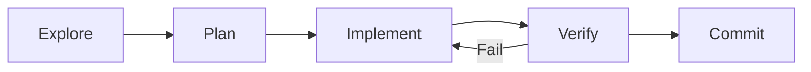

# Agent workflow

Every change in InsightPulse AI follows a mandatory five-phase workflow. Agents do not skip phases or ship unverified work.

## The five phases



### 1. Explore

Read the codebase, understand the current state. Never guess — read first.

### 2. Plan

Create an implementation plan with minimal diffs. Prefer editing existing files over creating new ones.

### 3. Implement

Execute the plan. Follow the module philosophy: Config → OCA → Delta.

### 4. Verify

Run the verification sequence. All checks must pass before committing.

### 5. Commit

Commit with OCA-style message and push.

## Role commands

| Command | Purpose |
|---------|---------|
| `/project:plan` | Create an implementation plan |
| `/project:implement` | Execute the plan |
| `/project:verify` | Run verification checks |
| `/project:ship` | Full workflow end-to-end |
| `/project:fix-github-issue` | Fix a specific GitHub issue |

## Verification sequence

Run all three scripts before every commit:

```bash
./scripts/repo_health.sh && ./scripts/spec_validate.sh && ./scripts/ci_local.sh
```

| Script | Purpose |
|--------|---------|
| `repo_health.sh` | Repository structure and hygiene checks |
| `spec_validate.sh` | Spec bundle completeness validation |
| `ci_local.sh` | Local CI pipeline (lint, test, build) |

!!! warning "All three must pass"
    A commit with any failing check is rejected. Fix the issue and re-verify.

## Agent rules

| Rule | Rationale |
|------|-----------|
| Never guess — read first | Prevents incorrect assumptions |
| Simplicity first | Reduces maintenance burden |
| Verify always | No unverified code ships |
| Minimal diffs | Smaller changes are easier to review |
| Docs and tests change with code | Documentation and tests stay in sync |

## Output contract

Every agent action produces structured output:

```
Outcome (1-3 lines) + Evidence + Verification (pass/fail) + Changes shipped
```

Evidence is saved to `docs/evidence/<YYYYMMDD-HHMM>/<scope>/` for audit trails.

!!! note "No guides, no tutorials"
    Agents execute changes directly. They never produce "here's how to do it" instructions, time estimates, or UI clickpaths.
