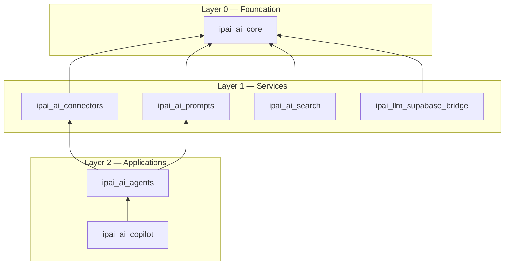

# AI modules

InsightPulse AI extends Odoo CE 19 with a layered set of AI/agent modules. These modules follow the `ipai_ai_*` naming convention and are organized into dependency layers.

## Layer model



## Module reference

### Layer 0 — Foundation

#### `ipai_ai_core`

The base framework for all AI functionality in InsightPulse AI.

- Abstract base classes for AI providers
- Configuration models (API keys, endpoints, model selection)
- Shared utilities (token counting, rate limiting, retry logic)
- Logging and audit trail for AI operations

### Layer 1 — Services

#### `ipai_ai_connectors`

LLM API connectivity layer.

- Provider adapters (OpenAI, Azure OpenAI, Anthropic)
- Unified request/response interface
- Connection pooling and failover
- Cost tracking per request

#### `ipai_ai_prompts`

Prompt template management.

- Versioned prompt templates stored as Odoo records
- Variable interpolation with Jinja2
- A/B testing support for prompt variants
- Prompt performance metrics

#### `ipai_ai_search`

Semantic search capabilities.

- Vector embedding generation
- Similarity search across Odoo records
- Hybrid search (keyword + semantic)
- Index management and refresh scheduling

#### `ipai_llm_supabase_bridge`

Bridge to Supabase pgvector for vector storage.

- Embedding storage and retrieval via Supabase
- Sync pipeline from Odoo records to pgvector
- Query interface for nearest-neighbor search
- Batch processing for bulk embedding operations

!!! info "Why Supabase for vectors?"
    Odoo's PostgreSQL instance handles transactional data. Vector operations (high-dimensional indexing, approximate nearest neighbor) run on Supabase's pgvector to avoid performance impact on the ERP database.

### Layer 2 — Applications

#### `ipai_ai_agents`

The agent system for autonomous task execution.

- Agent definitions with capability declarations
- Task queue and execution engine
- Tool use framework (agents can call Odoo methods)
- Conversation memory and context management

#### `ipai_ai_copilot`

User-facing copilot interface within Odoo.

- Chat widget in the Odoo web client
- Context-aware suggestions based on current view
- Action execution (create records, run reports)
- Native Odoo 18 "Ask AI" integration

!!! warning "Deprecated: `ipai_ai_widget`"
    The previous `ipai_ai_widget` module used global patches and is deprecated. Use `ipai_ai_copilot` with native Odoo 18 Ask AI instead.

## Test coverage

| Module | Unit tests | Integration tests | Status |
|--------|-----------|-------------------|--------|
| `ipai_ai_core` | Yes | Yes | Active |
| `ipai_ai_connectors` | Yes | Mocked | Active |
| `ipai_ai_prompts` | Yes | No | Active |
| `ipai_ai_search` | Yes | Yes | Active |
| `ipai_llm_supabase_bridge` | Yes | Mocked | Active |
| `ipai_ai_agents` | Partial | No | In progress |
| `ipai_ai_copilot` | Partial | No | In progress |

## Dependencies

All AI modules depend on `ipai_ai_core` (Layer 0). Layer 2 modules depend on at least one Layer 1 module. No circular dependencies are permitted.

Install the full AI stack:

```bash
./scripts/odoo/odoo_install.sh -m ipai_ai_core,ipai_ai_connectors,ipai_ai_prompts,ipai_ai_search,ipai_ai_agents,ipai_ai_copilot
```
