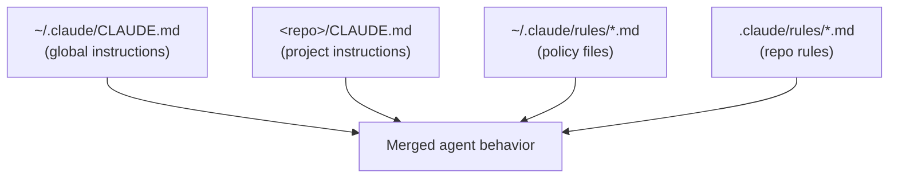

# Claude Code integration

Claude Code is the primary AI agent for InsightPulse AI development. It operates under strict contracts defined in configuration files at the repository and user levels.

## Configuration hierarchy



### CLAUDE.md

The `CLAUDE.md` file at the repository root is the single source of truth for agent behavior. It defines:

- **Operating contract** — execute, verify, evidence, commit
- **Quick reference** — stack, domain, hosting, secrets
- **Module philosophy** — Config → OCA → Delta
- **Commit convention** — `feat|fix|refactor|docs|test|chore(scope): description`
- **Critical rules** — secrets, database, CE-only, OCA-first
- **Deprecated items** — things the agent must never use

### Rules files

Policy files in `~/.claude/rules/` enforce non-negotiable constraints:

| File | Purpose |
|------|---------|
| `secrets-policy.md` | Never hardcode, echo, or ask for secrets |
| `output-format.md` | Structured output contract for evidence |
| `verification.md` | Deployment verification protocol |
| `infrastructure.md` | Production IPs, domains, services |
| `testing.md` | Isolated test databases, failure classification |
| `path-contract.md` | Canonical paths inside the devcontainer |

## Operating contract

```
Execute → Verify → Evidence → Commit
```

The agent follows this sequence for every task. No exceptions.

### Banned behaviors

| Behavior | Why |
|----------|-----|
| "Here's a guide" | Agents execute, not instruct |
| "Run these commands" | Agents run the commands themselves |
| "You should..." | Agents take action, not give advice |
| Time estimates | Unpredictable and misleading |
| Asking for confirmation | Agents decide and execute |
| UI clickpaths | CLI/CI only |

## Evidence packs

Every significant action produces evidence saved to:

```
docs/evidence/<YYYYMMDD-HHMM>/<scope>/
```

Evidence includes:

- Build logs
- Test output with pass/fail counts
- Deployment verification (curl output, screenshots)
- Error tracebacks with classification

!!! warning "Never claim success without proof"
    Required evidence: build logs showing completion, live URL responding, specific success criteria met.

## Secrets policy

| Rule | Detail |
|------|--------|
| Never hardcode | Secrets live in `.env*` files or environment variables only |
| Never echo | Do not log or print secrets in any output |
| Never ask | Do not ask users to paste secrets or tokens |
| Debug safely | Show only prefixes: `${TOKEN:0:15}` |
| Missing secret | State what is missing in one sentence, continue executing |

## MCP server connections

Claude Code connects to external services via MCP (Model Context Protocol) servers. See [MCP servers](mcp-servers.md) for the full architecture.

Configuration lives in `.mcp.json` at the repository root.
