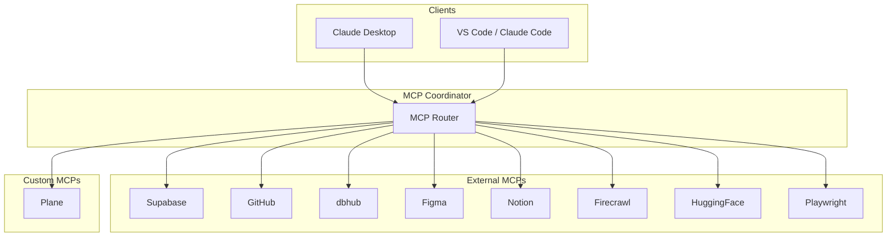

# MCP servers

Model Context Protocol (MCP) servers provide Claude Code with structured access to external services. They act as typed bridges between the AI agent and APIs, databases, and tools.

## Architecture



## External servers

| Server | Purpose | Transport |
|--------|---------|-----------|
| Supabase | Database queries, Edge Functions, Auth, Vault | stdio |
| GitHub | Repository operations, issues, PRs | stdio |
| dbhub | Direct database inspection | stdio |
| Figma | Design token extraction, component inspection | stdio |
| Notion | Documentation sync, knowledge base | stdio |
| Firecrawl | Web scraping and content extraction | stdio |
| HuggingFace | Model registry, inference endpoints | stdio |
| Playwright | Browser automation, screenshot capture | stdio |

## Custom servers

### Plane (`mcp/servers/plane/`)

The Plane MCP server connects Claude Code to the Plane project management instance at `plane.insightpulseai.com`.

Capabilities:

- Read and create issues
- Update issue status and assignments
- Query project boards and cycles
- Sync with BIR compliance task tracking

Status: **live**

## Configuration

MCP servers are configured in `.mcp.json` at the repository root:

```json
{
  "mcpServers": {
    "supabase": {
      "command": "npx",
      "args": ["-y", "@supabase/mcp-server"],
      "env": {
        "SUPABASE_ACCESS_TOKEN": "${SUPABASE_ACCESS_TOKEN}"
      }
    },
    "plane": {
      "command": "node",
      "args": ["mcp/servers/plane/index.js"],
      "env": {
        "PLANE_API_TOKEN": "${PLANE_API_TOKEN}",
        "PLANE_BASE_URL": "https://plane.insightpulseai.com"
      }
    }
  }
}
```

!!! note "Secrets in environment variables"
    MCP server credentials are never hardcoded in `.mcp.json`. They reference environment variables that are set in `.env` files or the shell profile.

## Adding a new MCP server

1. Add the server configuration to `.mcp.json`
2. Set required environment variables in `.env`
3. Test the connection with a simple query
4. Document the server in this page

!!! tip "Prefer official MCP servers"
    Use published `@org/mcp-server` packages when available. Build custom servers only when no official option exists.
