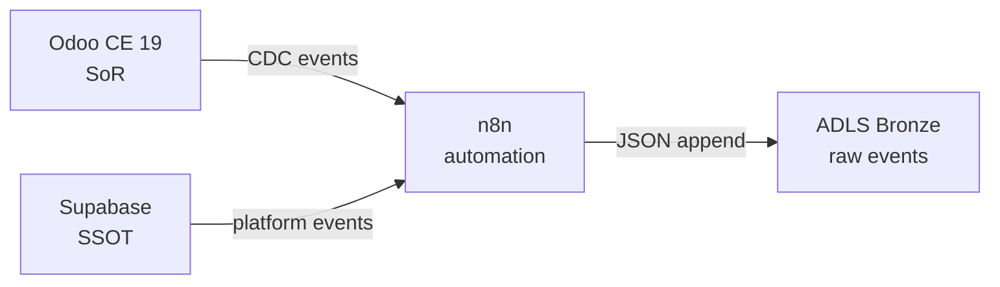
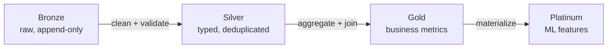
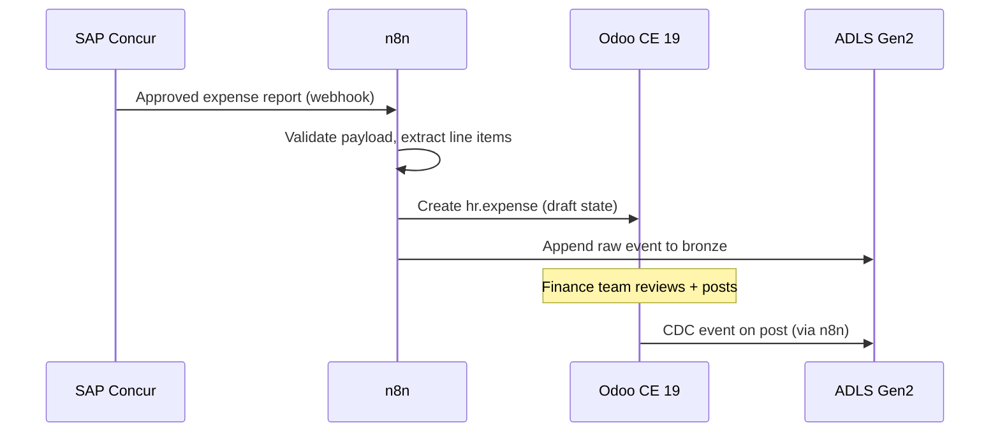
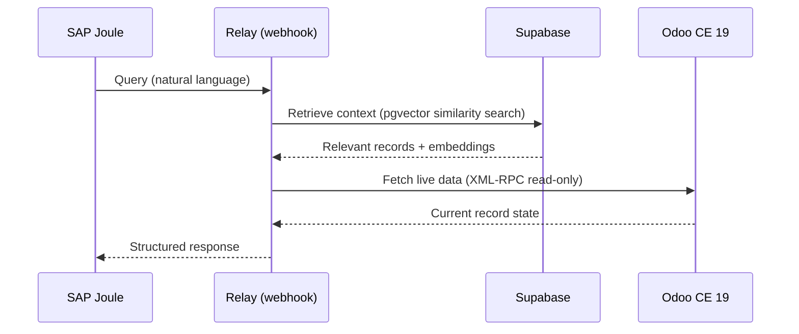
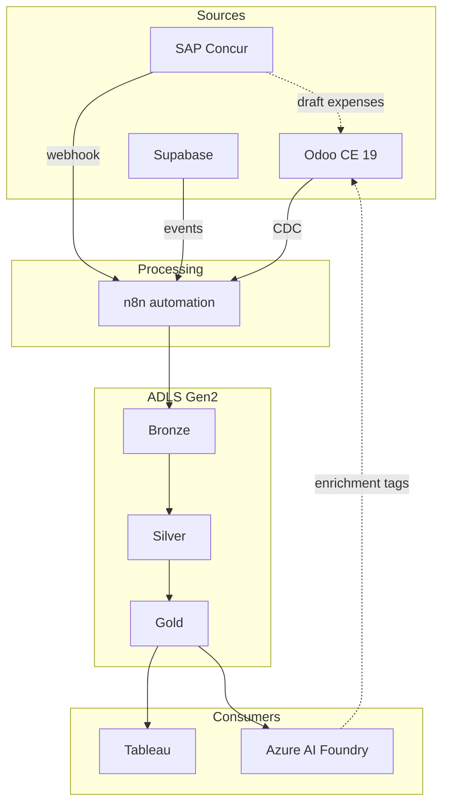

# Data flows

Data flows between systems in well-defined patterns. This page documents the ETL, transform, reverse ETL, and integration flows.

## Ingestion: source systems to ADLS bronze

Source systems (Odoo, Supabase) push data into the ADLS bronze layer as raw, append-only records.

### Ingestion rules

- All records land as immutable JSON with a `_ingested_at` timestamp.
- Source system identifiers (`external_id`, UUID) are preserved as-is.
- No transformations occur at the bronze layer. Data arrives exactly as the source emitted it.
- n8n handles event routing, retry logic, and dead-letter queuing.

## Transform: bronze to silver to gold

The medallion architecture transforms data through three layers:

| Layer | Purpose | Example |
|-------|---------|---------|
| **Bronze** | Raw ingestion, no transforms | `invoice_events_raw.parquet` |
| **Silver** | Cleaned, typed, deduplicated | `invoices_cleaned.parquet` (validated amounts, normalized currencies) |
| **Gold** | Aggregated business metrics | `monthly_revenue_by_cluster.parquet` (joins invoices + finance clusters) |
| **Platinum** | ML-ready feature tables | `expense_anomaly_features.parquet` (engineered features for fraud detection) |

### Transform rules

- Silver deduplicates by source system primary key + event timestamp.
- Gold aggregations use idempotent SQL/Spark jobs that can re-run safely.
- Platinum features are versioned and tagged with the model version that consumes them.

## Reverse ETL: bounded write-back

Reverse ETL writes data from the analytical layer back into operational systems. This is tightly bounded to prevent authority violations.

!!! warning "Reverse ETL constraints"
    Reverse ETL must never overwrite authoritative data. It creates draft records or enriches existing records with non-authoritative metadata only.

### Allowed reverse ETL patterns

| # | Pattern | Source | Target | Constraint |
|---|---------|--------|--------|------------|
| 1 | **Draft expense creation** | SAP Concur (via ADLS) | Odoo `hr.expense` | Creates in `draft` state only. Human approves. |
| 2 | **AI enrichment tags** | Azure AI Foundry | Odoo custom fields | Writes to `x_ai_*` fields only. Never touches core fields. |
| 3 | **Anomaly flags** | ADLS gold | Supabase `ops.alerts` | Append-only alert records. Does not modify source data. |
| 4 | **Forecast values** | ADLS platinum | Supabase analytics views | Overwrites forecast-specific materialized views only. |
| 5 | **Sync status markers** | n8n | Supabase `ops.sync_cursors` | Updates cursor positions for idempotent replay. |

### Forbidden patterns

- Writing to `account.move` (posted entries) from any external system
- Updating Odoo `res.partner` contact data from analytics
- Overwriting Supabase `ops.platform_events` rows
- Any flow without an entry in `ssot/azure/service-matrix.yaml`

## SAP integration flows

### SAP Concur: expense sync

**Rules:**

- Expenses arrive as `draft` -- never auto-posted.
- Receipt attachments store in Supabase Storage with a link in the Odoo record.
- Currency conversion uses Odoo's rate tables, not Concur's.

### SAP Joule: AI agent queries

**Rules:**

- Joule queries are read-only against Odoo. No mutations.
- Vector similarity search runs against Supabase pgvector, not Odoo.
- Query audit records append to `ops.platform_events`.

## Event flow summary

