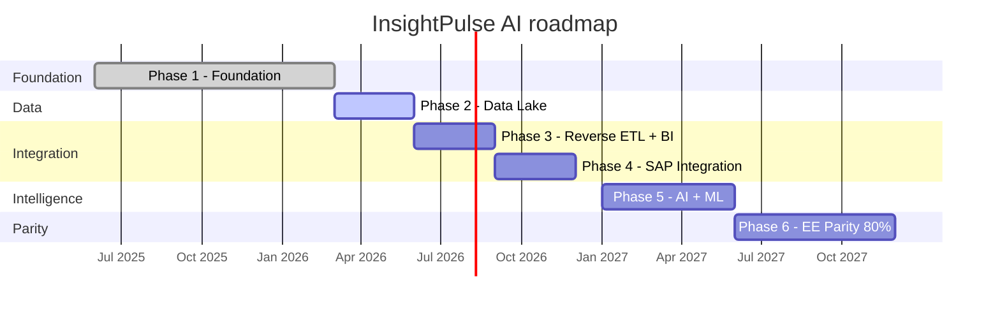

# Target end state

The platform evolves through six phases. Each phase builds on the previous one and delivers a usable increment.

## Phase overview

---

## Phase 1: Foundation (current)

Core ERP and platform infrastructure operational.

- Odoo CE 19 deployed on Azure Container Apps with PostgreSQL 16
- Azure Front Door configured for TLS, WAF, and edge routing
- Supabase control plane operational (Auth, Edge Functions, pgvector, Vault)
- Custom `ipai_*` module framework established (60+ modules)
- n8n automation layer handling GitHub events, scheduled jobs, and webhook routing
- Slack ChatOps integration with Claude AI
- BIR compliance modules for Philippine tax requirements (1601-C, 2316, alphalist, VAT)
- Devcontainer and CI/CD pipeline operational (355 workflows)
- DNS managed via Cloudflare YAML-first workflow
- Spec-kit methodology and Claude Code agent workflow adopted

## Phase 2: Data lake

Medallion architecture on Azure Data Lake Storage Gen2.

- ADLS Gen2 storage account provisioned in Southeast Asia
- Bronze layer: CDC ingestion from Odoo and Supabase via n8n
- Silver layer: cleaning, typing, deduplication jobs
- Gold layer: aggregated business metrics (revenue, expenses, headcount)
- Parquet format with Delta Lake or Iceberg table format
- Access controls: service principals with RBAC, no shared keys
- Data catalog registration for discoverability

## Phase 3: Reverse ETL and BI

Bounded write-back and business intelligence dashboards.

- Tableau connected to ADLS gold layer for self-service analytics
- Five approved reverse ETL patterns implemented (draft expenses, AI tags, anomaly flags, forecasts, sync cursors)
- Reverse ETL guardrails enforced via service-matrix YAML validation
- Superset self-hosted instance for internal operational dashboards
- Odoo embedded dashboards via Superset guest token integration
- Automated report generation for BIR compliance (monthly/quarterly)

## Phase 4: SAP integration

SAP Concur and SAP Joule connected to the platform.

- SAP Concur expense sync: approved reports create draft `hr.expense` records in Odoo
- Receipt attachment storage in Supabase Storage with Odoo record linking
- SAP Joule AI agent: read-only natural language queries against Odoo and Supabase
- Query context served from Supabase pgvector similarity search
- Audit trail for all SAP integration events in `ops.platform_events`
- Error handling with dead-letter queue and n8n retry logic

## Phase 5: AI and ML

AI-native capabilities embedded across the platform.

- Azure AI Foundry models for expense anomaly detection, revenue forecasting, and document classification
- Platinum data layer: ML feature tables versioned and tagged by model
- RAG pipeline: Odoo knowledge base indexed in Supabase pgvector
- Claude Code agents for automated PR generation, issue triage, and code review
- MCP servers for Odoo, Supabase, and infrastructure management
- AI enrichment reverse ETL: model outputs written to Odoo `x_ai_*` fields
- Prompt management via `ipai_ai_prompts` module

## Phase 6: Enterprise parity (>= 80%)

CE + OCA + `ipai_*` modules achieve >= 80% weighted parity with Odoo Enterprise.

- P0 critical features complete: bank reconciliation, financial reports, payroll, approvals
- P1 features complete: helpdesk, planning, timesheet, asset management
- P2 features complete: documents, knowledge, spreadsheet integration
- Parity CI gate enforcing >= 80% weighted score on every PR
- EE feature mapping table fully validated with functional tests
- All `ipai_*` modules certified against the parity checklist (spec bundle, tests, UI/UX review, benchmarks)
- BIR compliance features at 100% coverage (Philippine market regulatory requirement)

## Success criteria

| Metric | Target |
|--------|--------|
| EE parity score (weighted) | >= 80% |
| BIR compliance coverage | 100% |
| Data lake latency (source to gold) | < 4 hours |
| Reverse ETL patterns | 5 approved, 0 unauthorized |
| AI model inference p95 latency | < 2 seconds |
| CI pipeline green rate | >= 95% |
