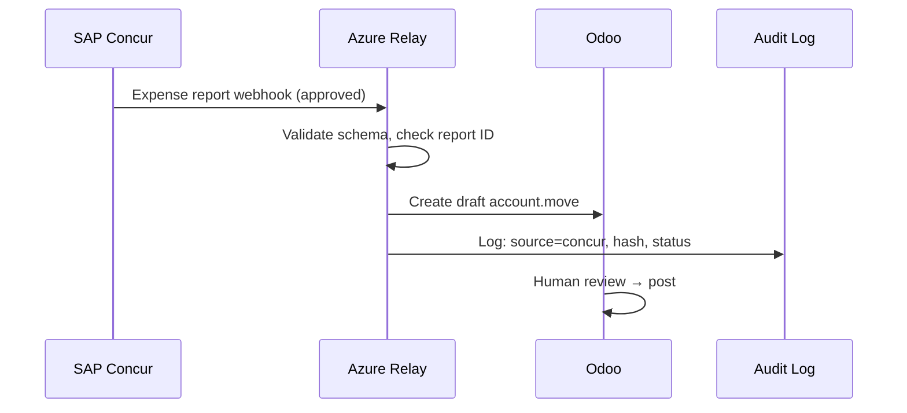
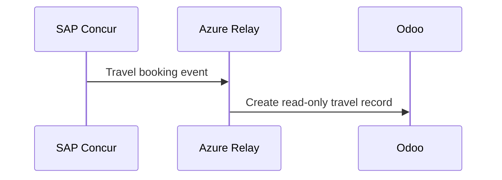
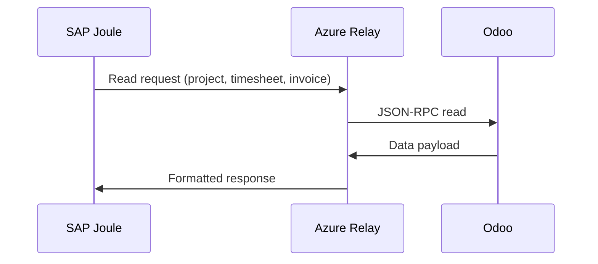
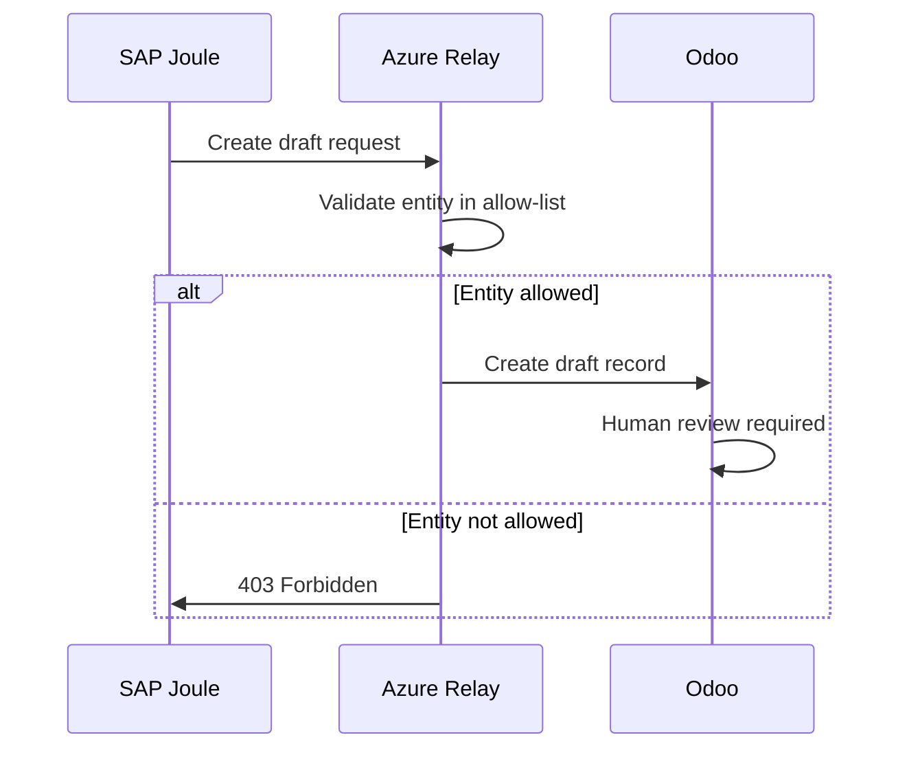
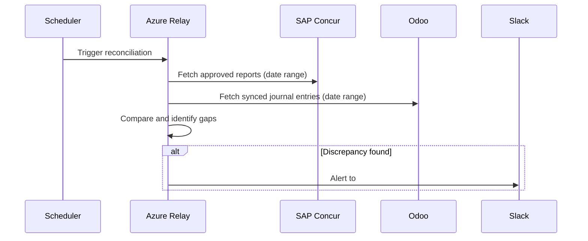

# SAP integration contract

This contract governs all integrations between InsightPulse AI and SAP systems (Concur, Joule). Azure relay functions mediate every call.

## System boundaries

| System | Role | Boundary |
|--------|------|----------|
| Azure Container Apps | Runtime compute | Hosts relay functions and Odoo |
| Odoo CE 19 | ERP system of record | Owns all non-T&E transactional data |
| SAP Concur | T&E system of record | Owns expense reports, travel, T&E invoices |
| SAP Joule | Conversational AI copilot | Read-heavy access, bounded draft writes |
| Microsoft Entra ID | SSO identity plane | Token issuance and validation |

## Hard rules

!!! danger "SAP integration rules (non-negotiable)"
    1. **No direct Joule-to-Odoo writes.** All Joule requests route through Azure relay functions.
    2. **All inbound records arrive as drafts.** No automated posting of financial records from SAP.
    3. **Idempotency via Concur report ID.** Every expense sync uses the Concur report ID as the deduplication key.
    4. **Concur is the T&E SSOT.** Odoo never overwrites Concur-originated data.
    5. **Entra ID is the sole SSO plane.** No separate credentials for SAP services.
    6. **Relay functions are stateless.** No data caching or session state in the relay layer.
    7. **Audit every inbound record.** Log source system, timestamp, payload hash, and processing outcome.

## Integration flows

### Flow 1: Concur expense sync

Approved expense reports flow from Concur to Odoo as draft journal entries.

### Flow 2: Concur travel sync

Travel booking data flows from Concur to Odoo as read-only reference records.

### Flow 3: Joule read queries

Joule reads Odoo data through relay functions. No writes.

### Flow 4: Joule bounded write

Joule may create draft records in Odoo for a limited set of entities.

### Flow 5: Reconciliation

Daily reconciliation job compares Concur and Odoo records.

## Data ownership matrix

| Entity | Owner | Odoo access | Concur access | Joule access |
|--------|-------|-------------|---------------|--------------|
| Expense reports | Concur | Read (draft JE) | Read/Write | Read |
| Travel bookings | Concur | Read-only | Read/Write | Read |
| T&E invoices | Concur | Read (draft JE) | Read/Write | Read |
| Non-T&E invoices | Odoo | Read/Write | N/A | Read |
| Projects | Odoo | Read/Write | N/A | Read |
| Employees | Odoo | Read/Write | Read | Read |
| Chart of accounts | Odoo | Read/Write | Mapping ref | Read |
| Timesheets | Odoo | Read/Write | N/A | Read, Draft write |

## Failure handling

| Failure mode | Response | SLA |
|--------------|----------|-----|
| Relay function timeout | Retry 3x with exponential backoff | Resolve within 1 hour |
| Concur webhook missed | Daily reconciliation catches gaps | Reconciled within 24 hours |
| Duplicate report ID | Reject and log | Immediate |
| Odoo draft creation fails | Dead-letter queue + Slack alert | Investigate within 4 hours |
| Entra ID token failure | Refresh flow; fail gracefully | Retry within 15 minutes |

## BIR compliance

| Requirement | Implementation |
|-------------|----------------|
| 7-year retention | All synced expense records retained in Odoo and ADLS |
| Monthly reconciliation | Automated comparison of Concur approvals vs Odoo journal entries |
| Discrepancy handling | Alerts only; no automatic corrections to posted records |
| Audit trail | Every sync logged with source, timestamp, hash, and outcome |
