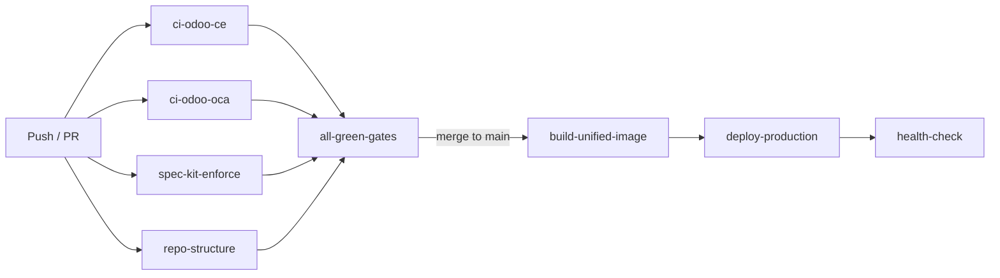

# CI/CD

InsightPulse AI uses **355+ GitHub Actions workflows** to gate every merge. Pipelines cover linting, testing, spec validation, image builds, deployment, and production health monitoring.

## Core pipelines

| Workflow | Trigger | Purpose |
|----------|---------|---------|
| `ci-odoo-ce` | Push, PR | Lint and test Odoo CE core modules |
| `ci-odoo-oca` | Push, PR | Validate OCA module compatibility |
| `spec-kit-enforce` | PR | Enforce spec bundle completeness |
| `repo-structure` | PR | Validate repository directory conventions |
| `all-green-gates` | PR (required) | Aggregate status check for merge gating |

## Build and deploy

| Workflow | Trigger | Purpose |
|----------|---------|---------|
| `build-unified-image` | Push to `main` | Build consolidated Docker image with all addons |
| `build-seeded-image` | Manual, schedule | Build image with pre-seeded database |
| `deploy-production` | Release tag | Deploy to Azure Container Apps |

## Quality gates

| Workflow | Purpose |
|----------|---------|
| `seeds-validate` | Verify database seed scripts execute cleanly |
| `spec-validate` | Confirm spec bundles have required files and pass schema checks |
| `spec-and-parity` | Validate EE parity claims against module manifests |
| `infra-validate` | Check infrastructure SSOT YAML against live resources |
| `dns-sync-check` | Enforce DNS subdomain registry consistency |

## Monitoring

| Workflow | Schedule | Purpose |
|----------|----------|---------|
| `health-check` | Every 15 min | Ping all container app endpoints |
| `finance-ppm-health` | Hourly | Validate finance PPM module integrity |
| `ipai-prod-checks` | Daily | Full production smoke test suite |

## Pipeline architecture



## Verification sequence

Run this sequence locally before pushing:

```bash
./scripts/repo_health.sh && ./scripts/spec_validate.sh && ./scripts/ci_local.sh
```

| Script | Purpose |
|--------|---------|
| `repo_health.sh` | Check directory structure, manifest validity, dangling references |
| `spec_validate.sh` | Validate spec bundles against schema |
| `ci_local.sh` | Run the same checks CI runs, locally |

!!! tip "Run verification before every commit"
    The `all-green-gates` workflow is a required status check. Failing it blocks the PR. Save time by running the local verification sequence first.

## Adding a new workflow

1. Create the workflow YAML in `.github/workflows/`.
2. Add the workflow to the `all-green-gates` job list if it should gate merges.
3. Update `docs/ai/CI_WORKFLOWS.md` with the new workflow entry.
4. Test with `act` or a draft PR before merging.
