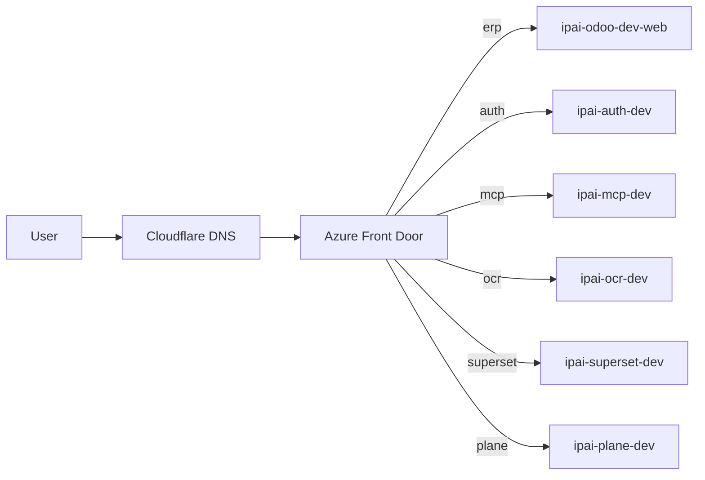

# DNS and routing

All public traffic to InsightPulse AI routes through Cloudflare DNS to Azure Front Door. The domain `insightpulseai.com` is the only active domain.

## Domain configuration

| Property | Value |
|----------|-------|
| **Domain** | `insightpulseai.com` |
| **Registrar** | Spacesquare (delegated to Cloudflare) |
| **DNS provider** | Cloudflare (authoritative, DNS-only mode for Front Door-backed records) |

!!! warning "Deprecated domain"
    `insightpulseai.net` is deprecated. Do not create records or references to it.

## Subdomain registry

All subdomains point to Azure Front Door via CNAME records:

| Subdomain | Type | Target | Purpose |
|-----------|------|--------|---------|
| `@` (apex) | CNAME-flat | Azure Front Door | Website / root |
| `www` | CNAME | Azure Front Door | WWW redirect |
| `erp` | CNAME | Azure Front Door | Odoo ERP |
| `n8n` | CNAME | Azure Front Door | n8n automation |
| `auth` | CNAME | Azure Front Door | Keycloak SSO |
| `ocr` | CNAME | Azure Front Door | OCR service |
| `superset` | CNAME | Azure Front Door | Apache Superset BI |
| `mcp` | CNAME | Azure Front Door | MCP coordination |
| `plane` | CNAME | Azure Front Door | Plane project management |
| `shelf` | CNAME | Azure Front Door | Shelf service |
| `crm` | CNAME | Azure Front Door | CRM service |
| `ops` | CNAME | Azure Front Door | Ops console |

## Mail configuration (Zoho)

| Record | Type | Target | Purpose |
|--------|------|--------|---------|
| `@` | MX | Zoho MX servers | Inbound mail |
| `@` | TXT | SPF for Zoho | SPF authentication |
| `zoho._domainkey` | TXT | DKIM key | DKIM signing |
| `_dmarc` | TXT | DMARC policy | DMARC enforcement |

**SMTP configuration:**

| Property | Value |
|----------|-------|
| Server | `smtp.zoho.com` |
| Port | `587` |
| Encryption | STARTTLS |
| Credentials | Azure Key Vault (`kv-ipai-dev`) |

!!! warning "Deprecated mail provider"
    Mailgun (`mg.insightpulseai.com`) is deprecated as of 2026-03-11. Use Zoho for all mail operations.

## Routing architecture



## DNS change workflow

1. Edit `infra/dns/subdomain-registry.yaml` with the new or modified record.
2. Generate Terraform artifacts from the registry.
3. Commit the changes and push.
4. CI applies the Terraform plan via `dns-sync-check` workflow.

```bash
# Edit the registry
vim infra/dns/subdomain-registry.yaml

# Validate locally
./scripts/infra/validate_dns.sh

# Commit and push
git add infra/dns/subdomain-registry.yaml
git commit -m "chore(deploy): add new subdomain record"
git push
```

!!! note "CI enforcement"
    The `dns-sync-check` workflow validates that `subdomain-registry.yaml` matches the live Cloudflare zone. Drift triggers a CI failure.

## SSOT files

| File | Purpose |
|------|---------|
| `infra/dns/subdomain-registry.yaml` | Subdomain SSOT |
| `ssot/azure/service-matrix.yaml` | Service-to-container mapping |
| `ssot/azure/resources.yaml` | Azure resource inventory |
