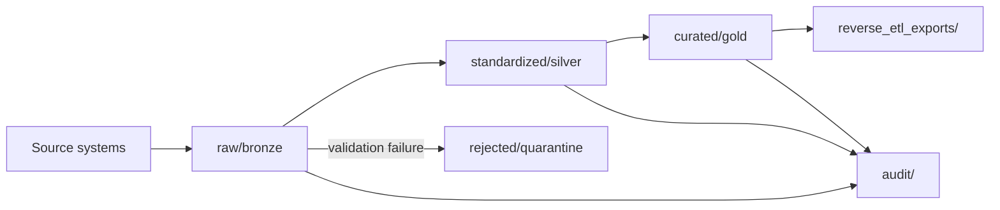

# ADLS ETL and reverse ETL

Azure Data Lake Storage Gen2 is the **analytical data authority** for InsightPulse AI. Data flows in via ETL from Supabase and Odoo, and flows back via classified reverse ETL pipelines.

## ADLS account

| Property | Value |
|----------|-------|
| **Account name** | `adlsipaidev` |
| **Region** | `southeastasia` |
| **Type** | ADLS Gen2 (hierarchical namespace enabled) |

## Zone layout

The data lake follows a medallion architecture:

| Zone | Path prefix | Purpose |
|------|-------------|---------|
| Raw / Bronze | `raw/` | Unprocessed ingestion from source systems |
| Standardized / Silver | `standardized/` | Cleaned, typed, deduplicated records |
| Curated / Gold | `curated/` | Business-ready aggregates and feature tables |
| Reverse ETL exports | `reverse_etl_exports/` | Staged payloads for writeback to operational systems |
| Rejected / Quarantine | `rejected/` | Records that failed validation |
| Audit | `audit/` | Change logs and lineage tracking |

## ETL flows (inbound)

| # | Source | Entity | Target zone | Frequency |
|---|--------|--------|-------------|-----------|
| 1 | Supabase | Users | `raw/supabase/users/` | Hourly |
| 2 | Supabase | Events | `raw/supabase/events/` | Real-time (CDC) |
| 3 | Odoo | Journal entries | `raw/odoo/journal_entries/` | Daily |
| 4 | Odoo | Projects | `raw/odoo/projects/` | Daily |
| 5 | Odoo | Employees | `raw/odoo/employees/` | Daily |
| 6 | Odoo | BIR filings | `raw/odoo/bir_filings/` | On filing |

## Reverse ETL flows (outbound)

| # | Source zone | Target | Entity | Frequency |
|---|------------|--------|--------|-----------|
| 1 | `curated/ml_scores/` | Supabase | ML prediction scores | On model run |
| 2 | `curated/dashboards/` | Supabase | Dashboard refresh payloads | Hourly |
| 3 | `curated/forecasts/` | Odoo | Forecast records | Daily |

## Reverse ETL classification

Every reverse ETL flow is classified into one of five types:

| Type | Description | Example |
|------|-------------|---------|
| `read_model_refresh` | Refresh a read-optimized view in an operational system | Dashboard data refresh to Supabase |
| `enrichment_writeback` | Add computed fields to existing records | ML feature scores appended to user profiles |
| `scoring_writeback` | Write model predictions to operational tables | Risk scores written to Supabase |
| `notification_trigger` | Trigger an alert or notification based on analytical results | Anomaly detection alert to Slack via n8n |
| `draft_record_creation` | Create draft records in an operational system for human review | Forecast draft records in Odoo |

## Prohibited writebacks

!!! danger "Never write back to these targets"

    | Target | Reason |
    |--------|--------|
    | Odoo `account.move` (posted) | Financial records are immutable after posting |
    | Supabase `auth.users` | Identity data is owned by Supabase Auth |
    | SAP Concur | Concur is the T&E system of record |
    | Any system without a contract entry | All writebacks require a contract |
