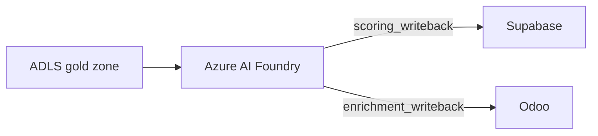

# Microsoft Foundry

Microsoft Foundry (formerly Azure AI Foundry) provides **compute-only** ML capabilities for InsightPulse AI. It does not own data. All training data comes from ADLS, and all scoring results write back to Odoo through classified reverse ETL flows.

## Role boundaries

| Responsibility | Owner |
|----------------|-------|
| Model training | Azure AI Foundry |
| Model scoring / inference | Azure AI Foundry |
| Training data (feature tables) | ADLS Gen2 (gold zone) |
| Scoring results (operational) | Supabase |
| Scoring results (ERP enrichment) | Odoo |
| Operational embeddings (RAG) | Supabase pgvector |
| Analytical / historical embeddings | ADLS Gen2 |

!!! note "No data ownership"
    Azure AI Foundry is a compute surface. It reads from ADLS, runs models, and writes results back through reverse ETL. It never serves as a system of record.

## ML feature tables

Feature tables live in the ADLS **gold zone** (`curated/`):

| Feature table | Source | Purpose |
|---------------|--------|---------|
| `curated/ml/user_features/` | Supabase users + Odoo employee data | User-level prediction features |
| `curated/ml/transaction_features/` | Odoo journal entries | Financial anomaly detection |
| `curated/ml/project_features/` | Odoo projects + timesheets | Project risk scoring |
| `curated/ml/document_embeddings/` | Document OCR output | Document similarity and search |

## Scoring writeback

Model predictions flow back to operational systems:

### To Supabase

- ML prediction scores (risk, churn, anomaly)
- Written to dedicated scoring tables with RLS
- Classified as `scoring_writeback`

### To Odoo

- Enrichment columns on existing records (e.g., project risk score)
- Written as field updates on draft/existing records
- Classified as `enrichment_writeback`

## Operational vs analytical embeddings

| Dimension | Supabase pgvector | ADLS |
|-----------|-------------------|------|
| **Use case** | Real-time semantic search, agent memory | Historical analysis, batch similarity |
| **Latency** | Low (< 100ms) | High (batch processing) |
| **Update frequency** | Real-time / near-real-time | Batch (daily or on-demand) |
| **Retention** | Active operational window | Full history |
| **Access pattern** | Point queries, k-NN search | Bulk scan, join with feature tables |

!!! tip "Choose the right embedding store"
    - Need sub-second similarity search for a user-facing feature? Use **Supabase pgvector**.
    - Need to analyze embedding drift over months or join with feature tables? Use **ADLS**.

## Model lifecycle

1. **Feature engineering**: Transform raw data in ADLS silver to gold feature tables.
2. **Training**: Train models in Azure AI Foundry using gold features.
3. **Evaluation**: Validate model performance against holdout data.
4. **Deployment**: Deploy model as a managed endpoint.
5. **Scoring**: Run inference on new data; write results via reverse ETL.
6. **Monitoring**: Track model drift and retrain on schedule.
