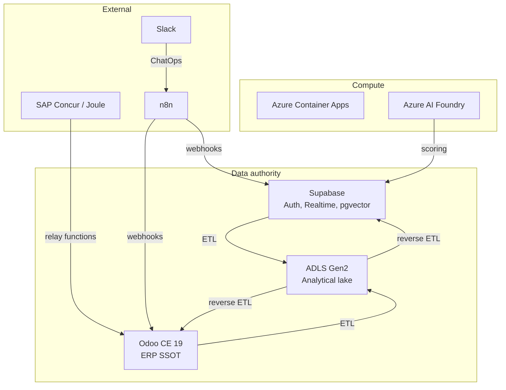

# Integrations

InsightPulse AI integrates with external systems through **contract-governed boundaries**. Every integration has an SSOT YAML entry in `ssot/integrations/` and a corresponding contract document in `docs/contracts/`.

No integration bypasses the contract layer. Data flows are classified, ownership is explicit, and reverse ETL is guardrailed.

## Pages in this section

| Page | Description |
|------|-------------|
| [Supabase](supabase.md) | Auth identity, Edge Functions, pgvector, Realtime |
| [ADLS ETL](adls-etl.md) | Data lake zones, ETL flows, reverse ETL classification |
| [SAP integration](sap-integration.md) | SAP Concur T&E sync, Joule copilot, Entra ID SSO |
| [Slack and n8n](slack-n8n.md) | ChatOps, automation workflows, scheduled jobs |
| [Azure AI Foundry](azure-ai.md) | ML training, scoring, operational RAG |

## Integration boundary model

