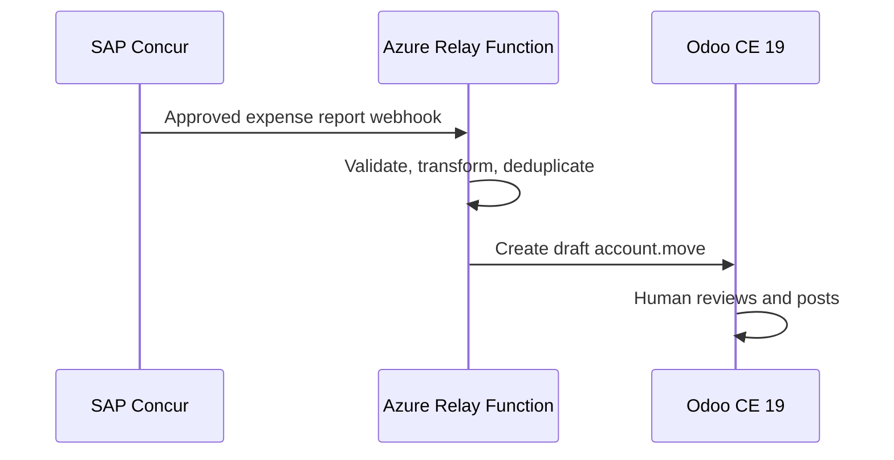
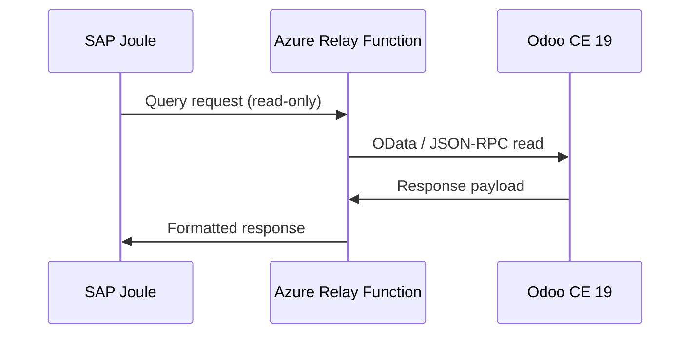
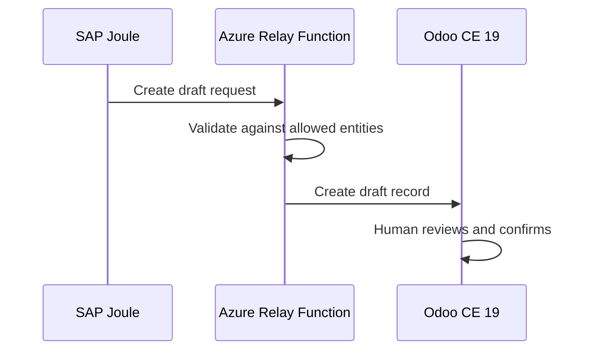

# SAP Concur and Joule integration

InsightPulse AI integrates with **SAP Concur** for travel and expense management and **SAP Joule** as a conversational AI copilot. **Microsoft Entra ID** provides the SSO plane across all systems.

## System boundaries

| System | Role |
|--------|------|
| Azure Container Apps | Runtime compute for all relay functions |
| Odoo CE 19 | ERP system of record (except T&E) |
| SAP Concur | System of record for travel and expense (T&E) |
| SAP Joule | Conversational AI copilot (read-heavy, bounded write) |
| Microsoft Entra ID | SSO identity plane |

## Integration flows

### 1. Concur to Odoo expense sync

SAP Concur pushes approved expense reports to Odoo via Azure relay functions. Odoo creates draft journal entries for human review.

### 2. Joule read access

Joule queries Odoo data through read-only API endpoints. Joule can access projects, timesheets, invoices, and employee records.

### 3. Joule bounded write

Joule may create **draft records only** through relay functions. All drafts require human approval before posting.

## Hard rules

!!! danger "SAP integration rules"
    1. **No direct Joule-to-Odoo writes.** All communication goes through Azure relay functions.
    2. **All inbound records arrive as drafts.** No automated posting of financial records.
    3. **Idempotency via Concur report ID.** Duplicate expense reports are rejected, not duplicated.
    4. **Concur is the T&E SSOT.** Odoo never overwrites Concur-originated data.
    5. **Entra ID is the SSO plane.** No separate credentials for SAP services.
    6. **Relay functions are stateless.** No data caching in the relay layer.
    7. **Audit every inbound record.** Log source system, timestamp, and payload hash.

## Data ownership matrix

| Entity | Authoritative system | Odoo role | Concur role |
|--------|---------------------|-----------|-------------|
| Expense reports | SAP Concur | Consumer (draft journal entries) | Owner |
| Travel bookings | SAP Concur | Consumer (read-only) | Owner |
| Invoices (T&E) | SAP Concur | Consumer | Owner |
| Invoices (non-T&E) | Odoo | Owner | N/A |
| Projects | Odoo | Owner | N/A |
| Employees | Odoo | Owner | Consumer |
| Chart of accounts | Odoo | Owner | Mapping reference |

## Failure handling

| Failure mode | Response |
|--------------|----------|
| Relay function timeout | Retry with exponential backoff (max 3 attempts) |
| Concur webhook missed | Reconciliation job runs daily to catch gaps |
| Duplicate report ID | Reject and log; do not create duplicate draft |
| Odoo draft creation fails | Queue in dead-letter topic; alert via Slack |
| Entra ID token expired | Refresh token flow; fail gracefully if refresh fails |

## BIR compliance

- Retain all synced expense records for **7 years** per BIR requirements.
- Run monthly reconciliation between Concur and Odoo journal entries.
- Reconciliation discrepancies trigger alerts, not automatic corrections.
