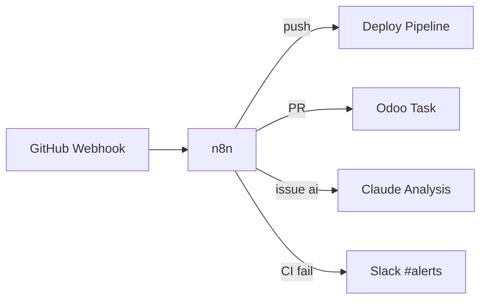
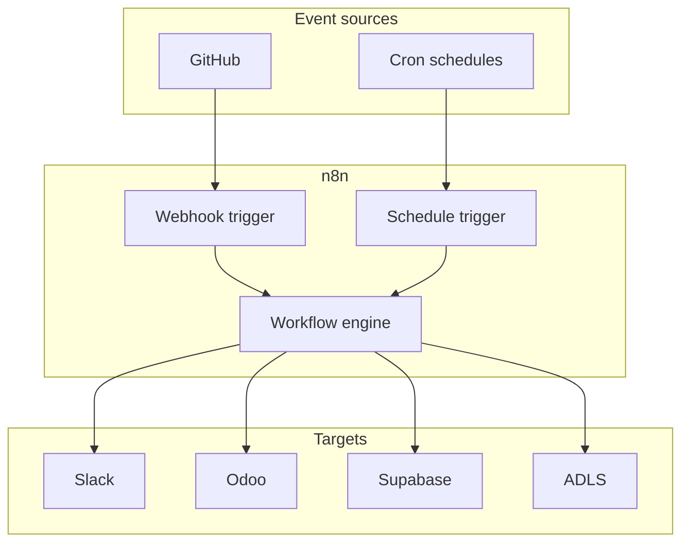

# Slack and n8n

**Slack** serves as the ChatOps interface for InsightPulse AI. **n8n** provides workflow automation connecting GitHub, Slack, Odoo, and Supabase.

## Slack

### ChatOps capabilities

| Feature | Channel | Description |
|---------|---------|-------------|
| Claude in Slack | `#ai-ops` | AI assistant for operational queries |
| Channel mentions | `#deploy`, `#alerts` | Deployment notifications and alerts |
| PR agent | `#dev` | Pull request status updates and reviews |

### Slack integration rules

- Use the `ipai_slack_connector` Odoo module for Odoo-to-Slack messaging.
- Never use `ipai_mattermost_connector` (deprecated 2026-01-28).
- Bot tokens and webhook URLs are stored in environment variables, never in code.

## n8n

n8n runs as a managed service behind Azure Front Door at `n8n.insightpulseai.com`. It orchestrates event-driven and scheduled workflows.

### GitHub event handler

The primary n8n workflow listens to GitHub webhooks and routes events:

| GitHub event | n8n action |
|--------------|------------|
| Push to `main` | Trigger deploy pipeline |
| Pull request opened/updated | Create or update Odoo task |
| Issue labeled `ai` | Send to Claude for analysis |
| CI failure | Send alert to `#alerts` in Slack |

### Scheduled jobs

| Schedule | Workflow | Description |
|----------|----------|-------------|
| Daily | Actions log export | Export GitHub Actions run logs to ADLS |
| Weekly | Dependency digest | Summarize dependency updates and vulnerabilities |
| Monthly | Compliance report | Generate BIR compliance status report |

### Credential management

!!! danger "n8n credential rules"
    - All workflows use **credential references**, never literal values.
    - Credentials are stored in n8n's encrypted credential store.
    - Rotate credentials on the same schedule as the source system.
    - Never export workflows with embedded credentials.

## Architecture

