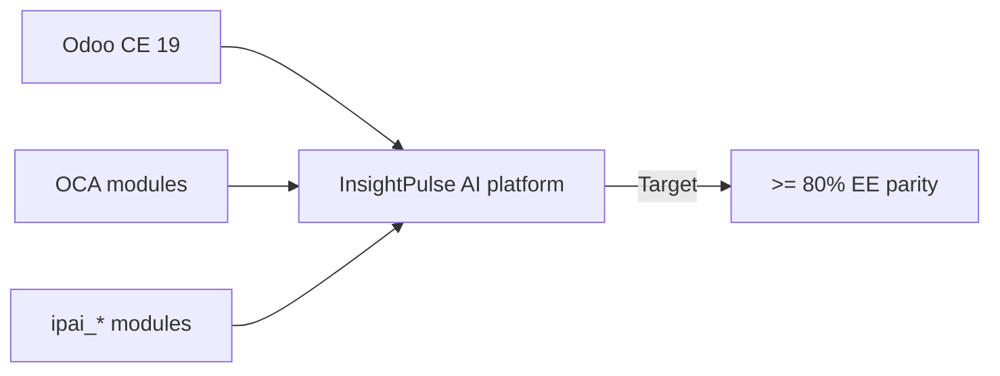

# Enterprise parity

InsightPulse AI targets >=80% weighted parity with Odoo Enterprise through the combination of CE + OCA + ipai_* modules. Current verified parity stands at ~35-45% (audited 2026-03-08).

## Strategy



The approach avoids Enterprise licensing by replacing EE-only features with:

1. **OCA equivalents** where maintained modules exist
2. **Custom ipai_* modules** for Philippine-specific or AI features
3. **External integrations** for capabilities better served outside Odoo

## Priority tiers

| Tier | Priority | Criteria |
|------|----------|----------|
| P0 | Critical | Core business operations blocked without it |
| P1 | High | Significant productivity loss without it |
| P2 | Medium | Nice to have, workarounds exist |
| P3 | Low | Rarely used or out of scope |

## EE feature mapping

### Accounting (P0)

| EE feature | Parity source | Status | Parity |
|------------|--------------|--------|--------|
| Financial reports | OCA `account_financial_report` | Adopted | 85% |
| Budget management | `ipai_finance_ppm` | Active | 70% |
| Bank reconciliation | OCA `account_reconcile_oca` | Adopted | 80% |
| Asset management | OCA `account_asset_management` | Adopted | 75% |
| Analytic accounting | CE built-in + OCA | Active | 60% |
| Consolidated invoicing | Not started | Planned | 0% |

### HR and payroll (P0)

| EE feature | Parity source | Status | Parity |
|------------|--------------|--------|--------|
| Payroll | `ipai_hr_payroll_ph` | Active | 70% |
| Expense management | `ipai_hr_expense_liquidation` | Active | 60% |
| Attendance | Planned `ipai_hr_attendance_ph` | Planned | 0% |
| Time off | OCA `hr_holidays` extensions | Evaluating | 30% |
| Appraisal | Planned | Planned | 0% |
| Recruitment | OCA `hr_recruitment` | Evaluating | 40% |

### Professional services (P1)

| EE feature | Parity source | Status | Parity |
|------------|--------------|--------|--------|
| Project forecasting | Not started | Planned | 0% |
| Timesheets | OCA `hr_timesheet` extensions | Evaluating | 50% |
| Field service | Not in scope | N/A | N/A |

### Studio (P1)

| EE feature | Parity source | Status | Parity |
|------------|--------------|--------|--------|
| Form builder | OCA `web_studio` alternatives | Evaluating | 20% |
| Report builder | OCA report modules | Evaluating | 30% |
| Automated actions | CE built-in | Active | 80% |

### Documents (P2)

| EE feature | Parity source | Status | Parity |
|------------|--------------|--------|--------|
| Document management | OCA `dms` | Evaluating | 40% |
| Digital signatures | OCA `sign` alternatives | Evaluating | 20% |
| Spreadsheet | Not in scope | N/A | N/A |

### Marketing (P3)

| EE feature | Parity source | Status | Parity |
|------------|--------------|--------|--------|
| Email marketing | OCA `mass_mailing` extensions | Evaluating | 50% |
| Marketing automation | Not in scope | N/A | N/A |
| Social marketing | Not in scope | N/A | N/A |

## Parity score calculation

Parity is weighted by priority tier:

| Tier | Weight |
|------|--------|
| P0 | 4x |
| P1 | 2x |
| P2 | 1x |
| P3 | 0.5x |

```
Weighted parity = Σ (feature_parity × tier_weight) / Σ tier_weight
```

!!! info "Current score: ~35-45%"
    The weighted parity score was last audited on 2026-03-08. The gap is primarily in HR modules (attendance, leave, appraisal) and professional services.

## Validation

Check parity status by module:

```bash
# List all ipai_* modules and their install status
./scripts/odoo/odoo_module_list.sh --filter ipai_

# Run parity validation
./scripts/ee_parity_check.sh
```

## Roadmap to 80%

| Quarter | Target | Key modules |
|---------|--------|-------------|
| Q1 2026 | 45% | Finance PPM, BIR compliance |
| Q2 2026 | 60% | HR attendance, leave, OCA adoption |
| Q3 2026 | 70% | Appraisal, timesheets, document management |
| Q4 2026 | 80% | Studio alternatives, report builder |
