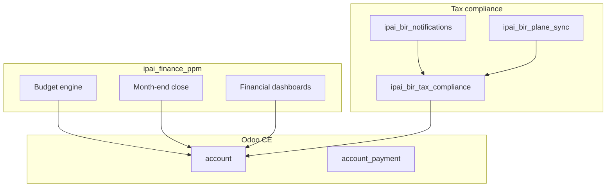

# Finance unified system

The finance layer centers on `ipai_finance_ppm` — a unified module for budget management, month-end close, and financial dashboards with full BIR tax compliance.

## Architecture

## Core module: `ipai_finance_ppm`

### Budget management

- Department and project-level budgets
- Budget vs. actual variance tracking
- Multi-period budget planning (monthly, quarterly, annual)
- Approval workflows with configurable thresholds

### Month-end close

- Close checklist with task assignments
- Automated reconciliation checks
- Period lock enforcement
- Variance report generation

### Financial dashboards

- Real-time P&L and balance sheet views
- Cash flow forecasting
- Department spending trends
- KPI cards with drill-down capability

## BIR tax compliance

Philippine Bureau of Internal Revenue compliance is handled by dedicated modules. See [BIR compliance](bir-compliance.md) for full detail.

### Supported forms

| Form | Description | Frequency |
|------|-------------|-----------|
| 1601-C | Monthly withholding tax remittance | Monthly |
| 2316 | Certificate of compensation payment / tax withheld | Annual |
| Alphalist | Alphabetical list of employees | Annual |
| 2550M | Monthly VAT declaration | Monthly |
| 2550Q | Quarterly VAT declaration | Quarterly |

## Contribution tables (2025 rates)

### SSS

| Salary range | Employee share | Employer share |
|-------------|---------------|----------------|
| Below 4,250 | 180.00 | 390.00 |
| 4,250 – 4,749.99 | 202.50 | 427.50 |
| 4,750 – 5,249.99 | 225.00 | 475.00 |
| ... | ... | ... |
| 29,750 – 30,249.99 | 1,350.00 | 2,850.00 |

!!! note "Full tables"
    Complete SSS, PhilHealth, and Pag-IBIG tables with all brackets are in the BIR compliance spec bundle at `spec/finance-unified/`.

### PhilHealth (2025)

- Rate: 5% of basic salary
- Split: 50/50 employee/employer
- Ceiling: PHP 100,000/month

### Pag-IBIG

| Salary range | Employee rate | Employer rate |
|-------------|--------------|--------------|
| <= 1,500 | 1% | 2% |
| > 1,500 | 2% | 2% |
| Maximum contribution | 200.00 | 200.00 |

## TRAIN Law tax table

Monthly withholding tax (2023 onwards):

| Taxable income (monthly) | Tax |
|--------------------------|-----|
| <= 20,833 | 0 |
| 20,834 – 33,332 | 15% of excess over 20,833 |
| 33,333 – 66,666 | 1,875 + 20% of excess over 33,333 |
| 66,667 – 166,666 | 8,541.80 + 25% of excess over 66,667 |
| 166,667 – 666,666 | 33,541.80 + 30% of excess over 166,667 |
| > 666,666 | 183,541.80 + 35% of excess over 666,667 |

## Seed strategy

Tax and contribution data follows a canonical seed strategy:

| Format | Role |
|--------|------|
| Odoo XML/CSV | Canonical source (committed to module `data/` directory) |
| JSON | Derived format for API consumers and dashboards |

!!! warning "XML/CSV is the source of truth"
    JSON files are generated from XML/CSV seeds. Never edit JSON directly — regenerate it from the canonical source.

## Constitution (8 immutable rules)

The finance spec bundle defines 8 rules that cannot be changed:

1. All monetary values use `Decimal` with 4-digit precision
2. Tax computations follow BIR regulations exactly
3. No hardcoded tax rates — all rates from configuration tables
4. Month-end close is an atomic operation (all-or-nothing)
5. Budget approval thresholds are configurable per department
6. Financial reports use Odoo's native reporting engine
7. All tax filings produce PDF and CSV output
8. Audit trail records every financial transaction modification
