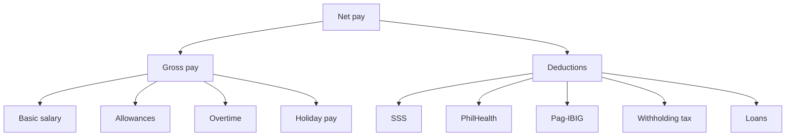

# HR and payroll

The HR and payroll layer provides Philippine-specific payroll processing, government contribution computation, and employee benefits management on top of Odoo CE 19.

## Modules

### Active

| Module | Purpose | EE parity |
|--------|---------|-----------|
| `ipai_hr_payroll_ph` | Philippine payroll computation | ~70% |
| `ipai_hr_expense_liquidation` | Expense liquidation with approval workflow | ~60% |

### Planned

| Module | Purpose | Target |
|--------|---------|--------|
| `ipai_hr_attendance_ph` | Philippine attendance rules | Q2 2026 |
| `ipai_hr_leave_ph` | Philippine leave types and accrual | Q2 2026 |
| `ipai_hr_appraisal_ph` | Performance appraisal | Q3 2026 |

## `ipai_hr_payroll_ph`

### Payroll structure



### Philippine-specific features

#### Government contributions

All three mandatory contributions are computed automatically:

| Contribution | Employee | Employer | Basis |
|-------------|----------|----------|-------|
| SSS | 4.5% of salary credit | 9.5% of salary credit | Bracketed salary credits |
| PhilHealth | 2.5% of basic | 2.5% of basic | 5% total, capped at 100K |
| Pag-IBIG | 1-2% of basic | 2% of basic | Capped at 200/month each |

See [BIR compliance](bir-compliance.md) for computation code and bracket tables.

#### 13th month pay

- Mandatory for all rank-and-file employees
- Computed as: total basic salary earned / 12
- Due date: December 24 (or upon separation)
- Tax-exempt up to PHP 90,000

```python
def compute_13th_month(total_basic_earned: Decimal) -> Decimal:
    """Compute 13th month pay."""
    return (total_basic_earned / Decimal("12")).quantize(Decimal("0.01"))
```

#### De minimis benefits

Tax-exempt benefits with BIR-defined limits:

| Benefit | Annual limit |
|---------|-------------|
| Rice subsidy | PHP 18,000 |
| Uniform/clothing allowance | PHP 6,000 |
| Medical cash allowance | PHP 10,000 |
| Laundry allowance | PHP 3,600 |
| Achievement awards | PHP 10,000 |
| Christmas gifts | PHP 5,000 |

!!! note "Excess is taxable"
    Amounts exceeding de minimis limits are added to taxable income for withholding tax computation.

#### Overtime computation

| Type | Rate |
|------|------|
| Regular overtime | 125% of hourly rate |
| Rest day / special holiday | 130% of hourly rate |
| Rest day + special holiday | 150% of hourly rate |
| Regular holiday | 200% of hourly rate |
| Regular holiday + rest day | 260% of hourly rate |

## `ipai_hr_expense_liquidation`

Handles the Philippine-standard expense liquidation workflow:

1. Employee submits expense report with receipts
2. Manager reviews and approves/rejects
3. Finance validates receipts and amounts
4. Liquidation is posted to the accounting journal
5. Reimbursement is processed via payroll or direct payment

### Features

- Receipt attachment with OCR integration (via `ipai-ocr-dev`)
- Multi-level approval routing
- Automatic journal entry creation
- VAT input tax extraction from official receipts

### Test coverage

`ipai_hr_expense_liquidation` includes unit tests for:

- Expense report creation and validation
- Approval workflow state transitions
- Journal entry generation
- Currency conversion

```bash
# Run expense liquidation tests
./scripts/odoo/odoo_test.sh -m ipai_hr_expense_liquidation
```
