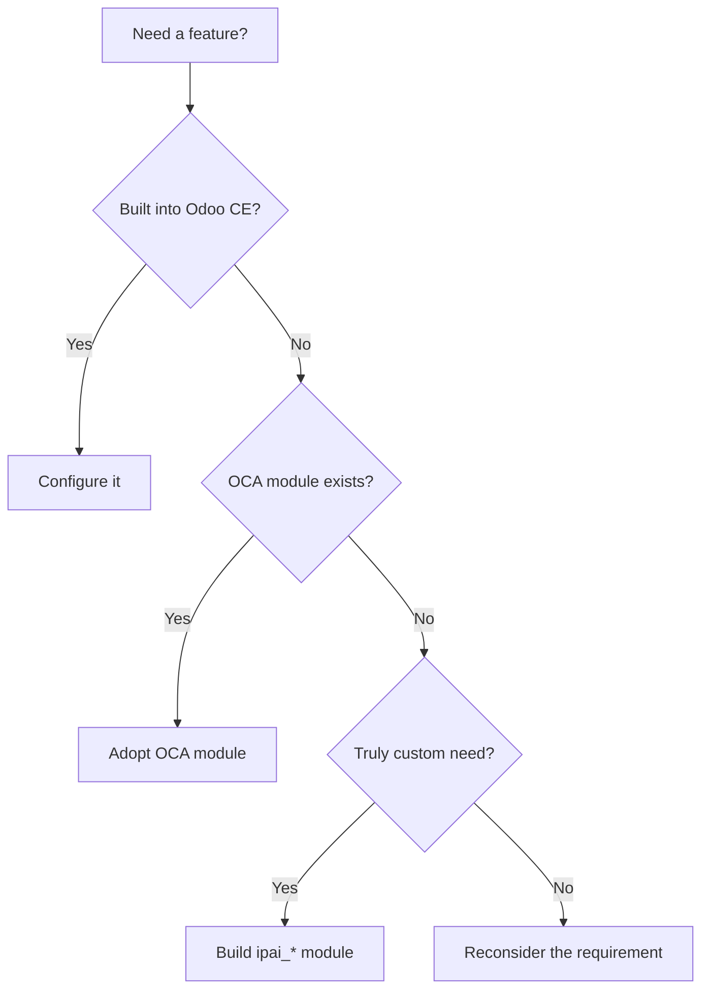

# Module philosophy

Every module decision follows one principle: do not build what you can configure, and do not build what the community already maintains.

## Decision hierarchy



### Config (Layer 1)

Use Odoo's built-in configuration, views, actions, and server actions before writing any code. Many requirements are solvable with:

- Custom fields via Settings
- Automated actions
- Scheduled actions
- Email templates
- Report customization

### OCA (Layer 2)

The Odoo Community Association maintains hundreds of production-grade modules. Adopt OCA modules when:

- The module covers >=80% of the requirement
- It is maintained for Odoo 18.0 (or portable from 18.0)
- It has active maintainers and CI

### Delta / `ipai_*` (Layer 3)

Build a custom module only when no config or OCA option covers the requirement. Custom modules follow strict naming and isolation rules.

## Naming convention

All custom modules use the pattern:

```
ipai_<domain>_<feature>
```

| Domain | Examples |
|--------|----------|
| `finance` | `ipai_finance_ppm`, `ipai_finance_dashboard` |
| `hr` | `ipai_hr_payroll_ph`, `ipai_hr_expense_liquidation` |
| `bir` | `ipai_bir_tax_compliance`, `ipai_bir_notifications` |
| `ai` | `ipai_ai_core`, `ipai_ai_copilot` |
| `auth` | `ipai_auth_oidc` |
| `slack` | `ipai_slack_connector` |

## When to build custom

| Situation | Action |
|-----------|--------|
| Not paying for EE + need the feature | Build `ipai_*` replacement |
| Paying for EE + want better ROI | Build connector module |
| Not paying + feature works in CE | No module needed |
| OCA covers 80%+ | Adopt OCA, extend with `ipai_*` if needed |

## OCA isolation rules

!!! danger "Never modify OCA source"
    OCA modules are treated as read-only dependencies. To customize behavior:

    1. Create an `ipai_*` module that depends on the OCA module
    2. Override or extend specific methods/views in your module
    3. Pin the OCA module version in `oca.lock.json`

## Module layers

The full platform targets 60 modules across 8 layers:

| Layer | Domain | Count |
|-------|--------|-------|
| 0 | Core / framework | 4 |
| 1 | Finance / accounting | 8 |
| 2 | HR / payroll | 6 |
| 3 | Tax / compliance | 5 |
| 4 | AI / agents | 7 |
| 5 | Integrations | 8 |
| 6 | Operations | 10 |
| 7 | Reporting / BI | 12 |
