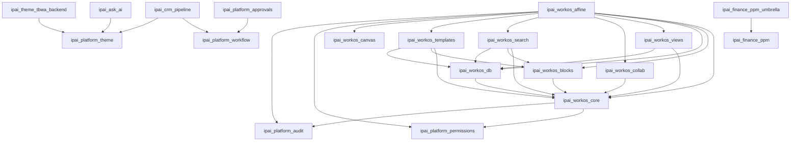

# IPAI Modules Index

**Generated:** 2026-01-04 10:06:09
**Odoo Version:** 18.0
**Total Modules:** 32

## Summary by Category

| Category | Count |
|----------|-------|
| Accounting | 2 |
| Accounting/Accounting | 2 |
| Accounting/Close | 1 |
| Accounting/Finance | 2 |
| Accounting/Localizations | 1 |
| Finance | 1 |
| Hidden | 1 |
| Hidden/Tools | 1 |
| Productivity | 9 |
| Productivity/AI | 1 |
| Productivity/Views | 1 |
| Project Management | 1 |
| Project/Portfolio | 1 |
| Reporting/BI | 1 |
| Sales/CRM | 1 |
| Technical | 3 |
| Theme | 1 |
| Themes/Backend | 1 |
| Uncategorized | 1 |

## Module Index

| Module | Purpose | Dependencies (CE/OCA) | Data Models | Views/Menus | Security/RLS | Config Settings | External Integrations | Seed Data | Known Limits | Docs Coverage | Test Status |
|--------|---------|----------------------|-------------|-------------|--------------|-----------------|----------------------|-----------|--------------|---------------|-------------|
| `ipai` | InsightPulse AI namespace for Odoo CE mo... | CE:1, IPAI:0 | - | 199v/114m | 29g, 31r | 19 params | - | - | - | partial | pending |
| `ipai_ask_ai` | AI-powered conversational assistant for ... | CE:3, IPAI:1 | 4 models | 1v/0m | 1g, 1a | 7 params | AI API | 6 files | - | partial | pending |
| `ipai_bir_tax_compliance` | Philippine BIR tax compliance - 36 eBIRF... | CE:3, IPAI:0 | 10 models | 15v/11m | 18a | - | Mail | 10 files | - | partial | pending |
| `ipai_close_orchestration` | Close Cycle Orchestration - Cycles, Task... | CE:2, IPAI:0 | 9 models | 20v/10m | 3g, 27a, 6r | - | Mail | 9 files | - | partial | pending |
| `ipai_crm_pipeline` | Salesforce-like CRM pipeline experience | CE:2, IPAI:2 | 2 models | 3v/2m | - | - | Mail | 4 files | - | partial | pending |
| `ipai_finance_closing` | Month-end financial closing task templat... | CE:2, IPAI:0 | - | - | 4a | - | - | 1 files | - | good | pending |
| `ipai_finance_monthly_closing` | Structured month-end closing and BIR fil... | CE:1, IPAI:0 | 1 models | - | - | - | - | 3 files | - | partial | pending |
| `ipai_finance_ppm` | Finance Project Portfolio Management (No... | CE:3, IPAI:0 | 17 models | 24v/12m | 10a | 3 params | Mail | 11 files | - | good | pending |
| `ipai_finance_ppm_golive` | Production go-live checklist for Finance... | CE:2, IPAI:0 | 3 models | 7v/6m | 6a | - | - | 9 files | - | partial | pending |
| `ipai_finance_ppm_umbrella` | Complete seed data for 8-employee Financ... | CE:1, IPAI:1 | - | - | - | - | - | 6 files | - | good | pending |
| `ipai_grid_view` | Advanced grid and list view with sorting... | CE:3, IPAI:0 | 4 models | 9v/4m | 2g, 7a, 4r | - | Mail | 6 files | - | partial | pending |
| `ipai_month_end` | SAP AFC replacement - Month-end closing ... | CE:3, IPAI:0 | 4 models | 15v/6m | 8a | - | Mail | 9 files | - | partial | pending |
| `ipai_month_end_closing` | SAP AFC-style month-end closing with BIR... | CE:2, IPAI:0 | - | - | 2a | - | - | 5 files | - | good | pending |
| `ipai_platform_approvals` | Role-based approval chains for IPAI modu... | CE:2, IPAI:1 | 1 models | - | - | - | Mail | 2 files | - | partial | pending |
| `ipai_platform_audit` | Field-level audit trail for IPAI modules | CE:2, IPAI:0 | 2 models | 3v/0m | 2a | - | Mail | 2 files | - | partial | pending |
| `ipai_platform_permissions` | Scope-based permission and role manageme... | CE:2, IPAI:0 | 2 models | 3v/0m | 4a | - | Mail | 2 files | - | partial | pending |
| `ipai_platform_theme` | Single source of truth for IPAI design t... | CE:1, IPAI:0 | - | - | - | - | - | - | - | partial | pending |
| `ipai_platform_workflow` | Generic workflow state machine for IPAI ... | CE:2, IPAI:0 | 1 models | - | - | - | Mail | 2 files | - | partial | pending |
| `ipai_ppm_a1` | A1 Control Center - Workstreams, Templat... | CE:3, IPAI:0 | 11 models | 18v/9m | 3g, 33a, 6r | - | Mail | 9 files | - | partial | pending |
| `ipai_ppm_monthly_close` | Automated monthly financial close schedu... | CE:4, IPAI:0 | 3 models | 8v/4m | 6a | - | Mail | 7 files | - | good | pending |
| `ipai_superset_connector` | Apache Superset integration with managed... | CE:7, IPAI:0 | 7 models | 9v/6m | 3g, 13a | 3 params | Superset | 8 files | - | good | pending |
| `ipai_tbwa_finance` | Unified month-end closing + BIR tax comp... | CE:3, IPAI:0 | 8 models | 18v/9m | 14a | - | Mail | 13 files | - | partial | pending |
| `ipai_theme_tbwa_backend` | TBWA branding skin - Black + Yellow + IB... | CE:1, IPAI:1 | - | - | - | - | - | - | - | good | pending |
| `ipai_workos_affine` | Installs the full WorkOS AFFiNE-style su... | CE:0, IPAI:10 | - | - | - | - | - | - | - | partial | pending |
| `ipai_workos_blocks` | Notion-style block editor for pages | CE:2, IPAI:1 | 1 models | 2v/1m | 2a | - | - | 2 files | - | partial | pending |
| `ipai_workos_canvas` | Edgeless canvas surface for WorkOS (AFFi... | CE:3, IPAI:0 | 1 models | 2v/1m | 2a | - | Mail | 2 files | - | partial | pending |
| `ipai_workos_collab` | Comments, mentions, and notifications | CE:2, IPAI:1 | 1 models | 2v/1m | 2a | - | Mail | 2 files | - | partial | pending |
| `ipai_workos_core` | Notion-style Work OS - Core module with ... | CE:3, IPAI:2 | 3 models | 10v/5m | 6a | - | Mail | 5 files | - | partial | pending |
| `ipai_workos_db` | Notion-style databases with typed proper... | CE:2, IPAI:1 | 3 models | 4v/1m | 6a | - | - | 2 files | - | partial | pending |
| `ipai_workos_search` | Global and scoped search for pages and d... | CE:2, IPAI:3 | 2 models | 1v/1m | 3a | - | - | 2 files | - | partial | pending |
| `ipai_workos_templates` | Page and database templates | CE:2, IPAI:3 | 2 models | 3v/1m | 4a | - | - | 3 files | - | partial | pending |
| `ipai_workos_views` | Table, Kanban, and Calendar views for da... | CE:2, IPAI:2 | 1 models | 2v/1m | 2a | - | - | 2 files | - | partial | pending |

## Dependency Graph

## Application Modules

- **IPAI WorkOS - AFFiNE Clone (Umbrella)** (`ipai_workos_affine`)
- **IPAI Work OS Core** (`ipai_workos_core`)
- **IPAI BIR Tax Compliance** (`ipai_bir_tax_compliance`)
- **IPAI Close Cycle Orchestration** (`ipai_close_orchestration`)
- **IPAI Finance PPM** (`ipai_finance_ppm`)
- **Finance PPM Go-Live Checklist** (`ipai_finance_ppm_golive`)
- **IPAI Month-End Closing** (`ipai_month_end`)
- **IPAI PPM A1 Control Center** (`ipai_ppm_a1`)
- **IPAI Superset Connector** (`ipai_superset_connector`)
- **IPAI TBWA Finance** (`ipai_tbwa_finance`)

## Static Validation Summary

| Module | Status | Issues |
|--------|--------|--------|
| `ipai` | PASS | - |
| `ipai_ask_ai` | PASS | - |
| `ipai_bir_tax_compliance` | PASS | - |
| `ipai_close_orchestration` | PASS | - |
| `ipai_crm_pipeline` | WARNING | ir.model.access.csv is empty |
| `ipai_finance_closing` | PASS | - |
| `ipai_finance_monthly_closing` | WARNING | ir.model.access.csv is empty |
| `ipai_finance_ppm` | PASS | - |
| `ipai_finance_ppm_golive` | PASS | - |
| `ipai_finance_ppm_umbrella` | PASS | - |
| `ipai_grid_view` | PASS | - |
| `ipai_month_end` | PASS | - |
| `ipai_month_end_closing` | PASS | - |
| `ipai_platform_approvals` | WARNING | ir.model.access.csv is empty |
| `ipai_platform_audit` | PASS | - |
| `ipai_platform_permissions` | PASS | - |
| `ipai_platform_theme` | PASS | - |
| `ipai_platform_workflow` | WARNING | ir.model.access.csv is empty |
| `ipai_ppm_a1` | PASS | - |
| `ipai_ppm_monthly_close` | PASS | - |
| `ipai_superset_connector` | PASS | - |
| `ipai_tbwa_finance` | PASS | - |
| `ipai_theme_tbwa_backend` | PASS | - |
| `ipai_workos_affine` | PASS | - |
| `ipai_workos_blocks` | PASS | - |
| `ipai_workos_canvas` | PASS | - |
| `ipai_workos_collab` | PASS | - |
| `ipai_workos_core` | PASS | - |
| `ipai_workos_db` | PASS | - |
| `ipai_workos_search` | PASS | - |
| `ipai_workos_templates` | PASS | - |
| `ipai_workos_views` | PASS | - |

## Documentation Links

- [IPAI Module Namespace](../addons/ipai/README.md)
- [IPAI Ask AI Assistant](../addons/ipai_ask_ai/README.md)
- [IPAI BIR Tax Compliance](../addons/ipai_bir_tax_compliance/README.md)
- [IPAI Close Cycle Orchestration](../addons/ipai/ipai_close_orchestration/README.md)
- [IPAI CRM - Pipeline Clone](../addons/ipai_crm_pipeline/README.md)
- [SAP AFC-Style Month-End Closing Template](../addons/ipai_finance_closing/README.md)
- [IPAI Finance Monthly Closing](../addons/ipai/ipai_finance_monthly_closing/README.md)
- [IPAI Finance PPM](../addons/ipai/ipai_finance_ppm/README.md)
- [Finance PPM Go-Live Checklist](../addons/ipai_finance_ppm_golive/README.md)
- [IPAI Finance PPM – TBWA Complete Configuration](../addons/ipai_finance_ppm_umbrella/README.md)
- [IPAI Grid/List View](../addons/ipai_grid_view/README.md)
- [IPAI Month-End Closing](../addons/ipai_month_end/README.md)
- [IPAI Month-End Closing & BIR Tax Filing](../addons/ipai_month_end_closing/README.md)
- [IPAI Platform - Approvals](../addons/ipai_platform_approvals/README.md)
- [IPAI Platform - Audit Trail](../addons/ipai_platform_audit/README.md)
- [IPAI Platform Permissions](../addons/ipai_platform_permissions/README.md)
- [IPAI Platform Theme](../addons/ipai_platform_theme/README.md)
- [IPAI Platform - Workflow Engine](../addons/ipai_platform_workflow/README.md)
- [IPAI PPM A1 Control Center](../addons/ipai/ipai_ppm_a1/README.md)
- [PPM Monthly Close Scheduler](../addons/ipai/ipai_ppm_monthly_close/README.md)
- [IPAI Superset Connector](../addons/ipai_superset_connector/README.md)
- [IPAI TBWA Finance](../addons/ipai_tbwa_finance/README.md)
- [TBWA Backend Theme](../addons/ipai_theme_tbwa_backend/README.md)
- [IPAI WorkOS - AFFiNE Clone (Umbrella)](../addons/ipai_workos_affine/README.md)
- [IPAI Work OS Blocks](../addons/ipai_workos_blocks/README.md)
- [IPAI WorkOS - Canvas (Edgeless)](../addons/ipai_workos_canvas/README.md)
- [IPAI Work OS Collaboration](../addons/ipai_workos_collab/README.md)
- [IPAI Work OS Core](../addons/ipai_workos_core/README.md)
- [IPAI Work OS Database](../addons/ipai_workos_db/README.md)
- [IPAI Work OS Search](../addons/ipai_workos_search/README.md)
- [IPAI Work OS Templates](../addons/ipai_workos_templates/README.md)
- [IPAI Work OS Views](../addons/ipai_workos_views/README.md)
