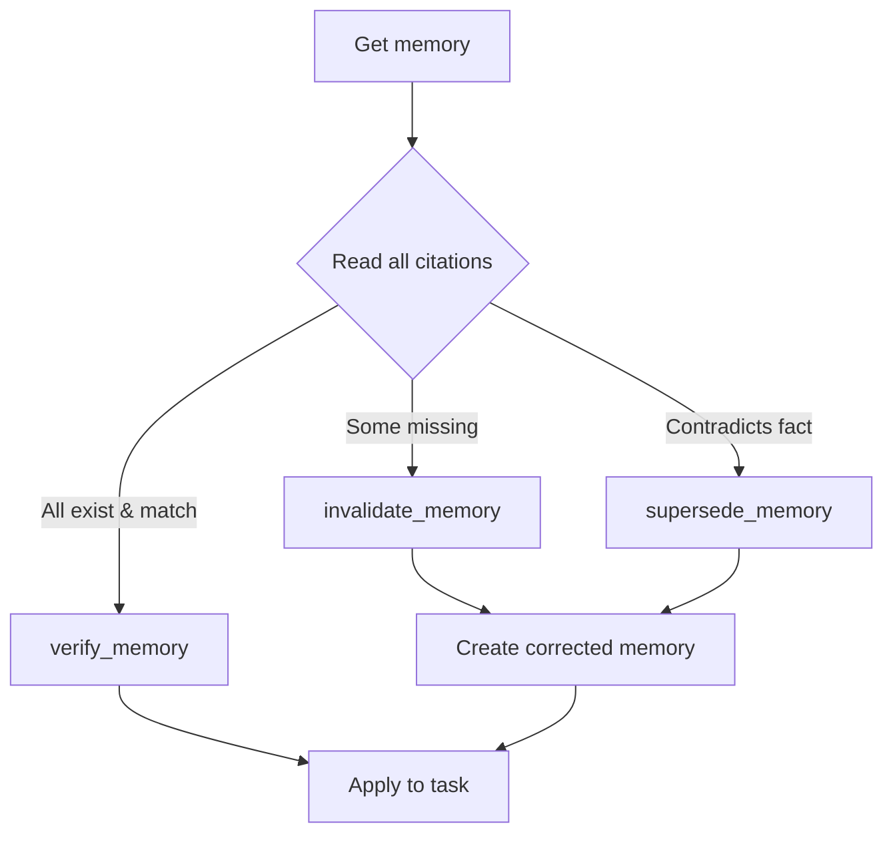

# Verified Memory System

Repository-scoped, cross-agent memory with citation verification.

Based on [GitHub Copilot's verified memory approach](https://github.blog/changelog/2026-01-15-copilot-memory) (Jan 15, 2026).

## Core Principle

**Memories are hypotheses, not truth.**

Every memory stored includes code citations. Before applying a memory, agents MUST verify those citations just-in-time. This eliminates the need for expensive offline memory curation pipelines.

## Architecture

```
┌─────────────────────────────────────────────────────────────┐
│                     Agent Session Start                      │
├─────────────────────────────────────────────────────────────┤
│                                                              │
│   1. get_recent_memories(repo) → Load context               │
│                                                              │
│   2. For each memory:                                        │
│      ├── Read all cited code locations                       │
│      ├── If citations valid & consistent → verify_memory()  │
│      ├── If citations contradict → invalidate_memory() or   │
│      │                             supersede_memory()        │
│      └── If citations missing → invalidate_memory()         │
│                                                              │
│   3. Apply verified memories to current task                 │
│                                                              │
└─────────────────────────────────────────────────────────────┘
```

## Data Model

```sql
-- ipai.agent_memory
{
  id: uuid,
  repo: "owner/name",           -- Repository scope
  subject: "API versioning",    -- Topic category
  fact: "Version must match...",-- The convention/invariant
  citations: [                  -- Code locations that prove this
    {path, line_start, line_end, sha?, snippet_hash?}
  ],
  reason: "Why this matters",
  status: "active|superseded|invalid",
  verification_count: 5,        -- How many times verified
  rejection_count: 0,           -- How many times rejected
  refreshed_at: timestamp       -- Recency = usefulness ranking
}
```

## MCP Tools

| Tool | Purpose |
|------|---------|
| `store_memory` | Store a durable convention with citations |
| `get_recent_memories` | Retrieve recent memories for session start |
| `search_memories` | Search by subject pattern |
| `verify_memory` | Mark memory as verified after citation check |
| `invalidate_memory` | Mark memory invalid when citations contradict |
| `supersede_memory` | Replace incorrect memory with correction |
| `get_memory_stats` | Get telemetry statistics |
| `get_memory_logs` | Get operation logs for debugging |

## Agent Prompt Rules

```markdown
MEMORY RULES
- Treat memory as hypotheses, not truth.
- For each memory you might use, you MUST verify by reading every cited location on the current branch/revision.
- If any citation is missing, outdated, or contradicts the memory:
  - Do NOT use it.
  - Write a corrected memory with updated citations (store_memory).
  - Mark the old one invalid/superseded if supported by the tool.
- If memory is valid and useful:
  - Re-store it (or refresh timestamp) so recency reflects usefulness.
- Only store memories that are durable conventions or invariants:
  - API contracts and version sync rules
  - Naming conventions
  - Required multi-file edits
  - Test patterns
  - Configuration dependencies
```

## Example Memory

```json
{
  "repo": "tbwa/odoo-ce",
  "subject": "IPAI module naming",
  "fact": "All custom modules must use ipai_ prefix and be placed in addons/ipai/ directory",
  "citations": [
    {"path": "CLAUDE.md", "line_start": 156, "line_end": 165},
    {"path": "addons/ipai/ipai_dev_studio_base/__manifest__.py", "line_start": 1, "line_end": 5}
  ],
  "reason": "Enforces consistent module organization for OCA-style compliance"
}
```

## Verification Flow



## Self-Healing Behavior

When agents encounter incorrect or malicious memories:

1. **Citation verification catches contradictions** - Agent reads cited code and finds it doesn't match the stated fact
2. **Automatic correction** - Agent creates a new memory with correct fact and updated citations
3. **Old memory superseded** - Creates correction chain for audit trail
4. **Recency ranking** - Valid memories rise to top through refresh; invalid memories drop out

This "self-healing" behavior was validated through adversarial testing (seeding repos with incorrect memories).

## Telemetry

Track these metrics:

- `memory_used` - Memory applied successfully
- `memory_rejected` - Memory failed verification
- `memory_corrected` - Memory replaced with correction
- `time_to_verify` - Latency of citation checks

Query stats:
```sql
SELECT * FROM ipai.agent_memory_stats WHERE repo = 'tbwa/odoo-ce';
```

Query logs:
```sql
SELECT * FROM ipai.agent_memory_log
WHERE repo = 'tbwa/odoo-ce'
ORDER BY created_at DESC
LIMIT 20;
```

## Configuration

### MCP Server

Add to `.claude/mcp-servers.json`:

```json
"memory": {
  "command": "node",
  "args": ["mcp/servers/memory-mcp-server/dist/index.js"],
  "env": {
    "SUPABASE_URL": "${SUPABASE_URL}",
    "SUPABASE_SERVICE_KEY": "${SUPABASE_SERVICE_KEY}"
  },
  "description": "Verified memory system for repository-scoped agent learning"
}
```

### Building

```bash
cd mcp/servers/memory-mcp-server
npm install
npm run build
```

### Required Environment Variables

- `SUPABASE_URL` - Supabase project URL
- `SUPABASE_SERVICE_KEY` - Supabase service role key (not anon key)

## Migration

Apply the migration to enable the memory system:

```bash
# Via Supabase CLI
supabase db push

# Or direct SQL
psql $DATABASE_URL < db/migrations/202601160001_VERIFIED_MEMORY.sql
```

## References

- [GitHub Blog: Copilot Memory](https://github.blog/changelog/2026-01-15-copilot-memory)
- Migration: `db/migrations/202601160001_VERIFIED_MEMORY.sql`
- MCP Server: `mcp/servers/memory-mcp-server/`
