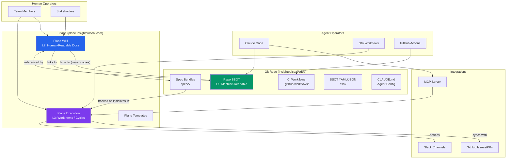

# Plane Unified Docs: Architecture Target State

> Spec bundle: `spec/plane-unified-docs/`
> SSOT map: `ssot/docs/plane-docs-canonical-map.yaml`
> Status: Active
> Created: 2026-03-13

---

## System Architecture Diagram



---

## Three-Layer Separation Model

The documentation architecture enforces strict layer separation. Each layer has a designated surface, owner, and governance model.

### Layer 1: Machine-Readable SSOT (Git Repo)

**Surface**: `Insightpulseai/odoo` repository on GitHub
**Governance**: Merge to `main` via PR with CI gates
**Content types**:

| Type | Repo Path | Format | Example |
|------|-----------|--------|---------|
| SSOT configs | `ssot/**/*.yaml` | YAML | `ssot/azure/service-matrix.yaml` |
| CI workflows | `.github/workflows/*.yml` | YAML | `.github/workflows/ci-odoo-ce.yml` |
| Schema definitions | `db/schema/*.sql`, `*.dbml` | SQL/DBML | `docs/architecture/schema.dbml` |
| Agent configs | `.claude/`, `CLAUDE.md` | Markdown/JSON | `CLAUDE.md`, `.claude/settings.json` |
| Spec bundles (code) | `spec/*/constitution.md` | Markdown | `spec/plane-unified-docs/constitution.md` |
| DNS/Infra contracts | `infra/dns/*.yaml` | YAML | `infra/dns/subdomain-registry.yaml` |
| Lock files | `oca.lock.json`, `pnpm-lock.yaml` | JSON/YAML | `oca.lock.json` |
| Evidence bundles | `docs/evidence/` | Mixed | `docs/evidence/20260313-1200/` |
| Docker/IaC | `docker/`, `deploy/`, `infra/` | Mixed | `deploy/odoo-prod.compose.yml` |
| Module source | `addons/ipai/` | Python | `addons/ipai/ipai_finance_ppm/` |

**Rule**: L1 content is never duplicated into Plane. Plane wiki pages link to L1 artifacts.

### Layer 2: Human-Readable Ops Docs (Plane Wiki)

**Surface**: `plane.insightpulseai.com` wiki pages
**Governance**: Page owner + review cadence + staleness automation
**Content types**:

| Type | Plane Location | Template | Example |
|------|---------------|----------|---------|
| Architecture overviews | `Architecture > *` | ADR / none | Platform Architecture Overview |
| Product requirements | `Product > *` | PRD | Odoo Copilot PRD |
| Delivery plans | `Delivery > *` | none | Q2 2026 Delivery Plan |
| Runbooks | `Runbooks > *` | Runbook | Monthly Close Runbook |
| Integration specs | `Integrations > *` | Integration Spec | n8n Automation Contract |
| Decision records | `Architecture > Decision Records > *` | ADR | ADR-001: Use Plane for Docs |
| Onboarding guides | `Onboarding > *` | Onboarding Guide | New Developer Setup |
| Incident postmortems | `Operations > Incidents > *` | Postmortem | 2026-03-10 Odoo Outage |
| Release notes | `Releases > *` | Release Checklist | v2026.03 Release Notes |
| Governance docs | `Governance > *` | none | Doc Review Escalation Path |

**Rule**: L2 content is never back-synced into the repo. If a wiki page decision changes a machine-readable contract, the contract in L1 is updated directly and the wiki page links to the updated contract.

### Layer 3: Execution State (Plane Projects)

**Surface**: `plane.insightpulseai.com` projects, work items, cycles
**Governance**: Cycle discipline (2-week sprints), assignee-owned
**Content types**:

| Type | Plane Surface | Example |
|------|--------------|---------|
| Initiatives | Project boards | "Plane Unified Docs Migration" |
| Epics | Modules | "Phase 3: Deploy Plane on Azure" |
| Tasks | Work items | "Configure Keycloak OIDC client" |
| Bugs | Work items | "Fix Plane SSO redirect loop" |
| Validations | Work items | "Verify daily backup cron" |
| Cycles | Sprints | "Sprint 2026-W12" |

**Rule**: L3 is ephemeral execution state. It is not documentation. Do not export board state into repo files.

---

## Wiki Page Hierarchy

```
InsightPulseAI Wiki
|
+-- Architecture
|   +-- Platform Overview
|   +-- Target State
|   +-- Authentication (Keycloak SSO)
|   +-- Data Platform (Databricks, Superset)
|   +-- Container Architecture (Azure ACA)
|   +-- Network and DNS
|   +-- Decision Records
|       +-- ADR-001: Plane for Unified Docs
|       +-- ADR-002: Azure over DigitalOcean
|       +-- ADR-003: Keycloak over Auth0
|       +-- ...
|
+-- Product
|   +-- Odoo Copilot PRD
|   +-- Enterprise Parity PRD
|   +-- Platform Auth PRD
|   +-- Lakehouse PRD
|   +-- Agent Skills PRD
|   +-- ...
|
+-- Delivery
|   +-- Q1 2026 Delivery Plan
|   +-- Q2 2026 Delivery Plan
|   +-- Roadmap
|
+-- Runbooks
|   +-- Deployment
|   |   +-- Odoo Production Deploy
|   |   +-- Plane Deploy
|   |   +-- n8n Deploy
|   |   +-- Deployment Target Matrix
|   +-- Operations
|   |   +-- Monthly Close
|   |   +-- Database Backup and Restore
|   |   +-- Certificate Renewal
|   +-- Developer
|       +-- Golden Path
|       +-- Local Dev Setup
|       +-- Module Development
|
+-- Integrations
|   +-- Surface Map
|   +-- n8n Automation Contract
|   +-- Slack Agent Contract
|   +-- GitHub Integration
|   +-- Supabase Integration
|   +-- Plane GitHub Sync
|   +-- MCP Server Registry
|
+-- Data Platform
|   +-- Superset BI
|   +-- Databricks Architecture
|   +-- Medallion Architecture (Bronze/Silver/Gold/Platinum)
|   +-- pgvector and AI Search
|
+-- ERP / Odoo
|   +-- Editions Policy (CE Only)
|   +-- Enterprise Parity Matrix
|   +-- Module Decision Rubric
|   +-- OCA Workflow
|   +-- IPAI Module Catalog
|   +-- Canonical Setup (odoo19/)
|
+-- Platform / Azure
|   +-- Azure Container Apps
|   +-- Azure Front Door
|   +-- Azure Key Vault
|   +-- Service Matrix
|   +-- Cost Optimization
|
+-- AI / Agents
|   +-- Agent Runtimes
|   +-- Claude Code Integration
|   +-- MCP Coordination
|   +-- AI Provider Bridge
|   +-- Copilot Architecture
|
+-- Finance / Compliance
|   +-- BIR Tax Compliance
|   +-- SSS/PhilHealth/Pag-IBIG Tables
|   +-- Monthly Close Process
|   +-- Audit Trail
|
+-- Governance
|   +-- Doc Review Escalation
|   +-- Linking Model
|   +-- Branch Protection
|   +-- Commit Convention
|   +-- Secrets Policy
|   +-- Repo Hygiene
|
+-- Templates
|   +-- Architecture Decision Record (ADR)
|   +-- Product Requirements Document (PRD)
|   +-- Runbook
|   +-- Incident Postmortem
|   +-- Release Checklist
|   +-- Onboarding Guide
|   +-- Integration Spec
|
+-- Releases
|   +-- What Shipped (current)
|   +-- Go-Live Manifest
|   +-- Release Archive
|
+-- Operations
|   +-- Incidents
|   +-- Health Checks
|   +-- Monitoring Thresholds
|   +-- On-Call Rotation
|
+-- Onboarding
|   +-- Ecosystem Guide
|   +-- New Developer Setup
|   +-- Agent Onboarding (Claude, n8n)
|   +-- Platform Services Map
```

---

## Project and Work-Item Type Model

### Projects

| Identifier | Name | Scope | Lead |
|------------|------|-------|------|
| `ARCH` | Architecture and Platform Design | System design, ADRs, platform evolution | Platform Architect |
| `INFRA` | Infrastructure and Deployment | Azure, DNS, containers, networking | Infrastructure Lead |
| `SPEC` | Product Specifications | PRDs, feature design, acceptance criteria | Product Owner |
| `MIGRATE` | Migration and Consolidation | Docs migration, system migrations, data migrations | Migration Lead |
| `OPS` | Operations and Runbooks | Incident response, monitoring, operational procedures | Ops Lead |
| `ERP` | Odoo ERP Development | Modules, EE parity, OCA integration | Odoo Lead |
| `DATA` | Data Platform and Analytics | Superset, Databricks, ETL, reporting | Data Lead |
| `AI` | AI/Agent Development | Claude integration, MCP, copilot features | AI Lead |
| `COMPLY` | Finance and Compliance | BIR, tax, payroll, audit | Compliance Lead |
| `GOV` | Governance and Process | Review cadence, standards, quality gates | Governance Lead |

### Work Item Types

| Type | Icon | Usage | Example |
|------|------|-------|---------|
| Initiative | Flag | Strategic outcome spanning multiple epics | "Achieve 80% EE Parity" |
| Epic | Layers | Large deliverable spanning multiple cycles | "Phase 3: Deploy Plane" |
| Task | Circle | Discrete unit of work, completable in one cycle | "Configure Keycloak OIDC client" |
| Bug | Bug | Defect requiring fix | "Fix SSO redirect loop" |
| Validation | Checkmark | Verification/testing activity | "Verify daily backup cron" |

### States

| State | Meaning |
|-------|---------|
| Backlog | Not yet scheduled |
| Todo | Scheduled for current cycle, not started |
| In Progress | Actively being worked |
| In Review | Awaiting review/approval |
| Done | Completed and verified |
| Cancelled | Will not be done |

---

## Template Catalog

### 1. Architecture Decision Record (ADR)

```markdown
# ADR-NNN: [Decision Title]

**Status**: Proposed | Accepted | Deprecated | Superseded
**Date**: YYYY-MM-DD
**Owner**: @name
**Deciders**: @name, @name

## Context

What is the issue we are deciding on?

## Decision

What did we decide?

## Consequences

What are the positive and negative outcomes?

## Alternatives Considered

| Option | Pros | Cons |
|--------|------|------|
| Option A | ... | ... |
| Option B | ... | ... |

## References

- [Link to repo artifact]
- [Link to related ADR]
```

### 2. Product Requirements Document (PRD)

```markdown
# PRD: [Feature Name]

**Status**: Draft | Active | Shipped | Archived
**Owner**: @name
**Spec bundle**: spec/[feature-slug]/prd.md
**Last reviewed**: YYYY-MM-DD

## Problem Statement

What problem are we solving?

## Goals

1. Goal 1
2. Goal 2

## Non-Goals

1. Non-goal 1

## Solution Overview

High-level description of the solution.

## Requirements

### Functional

| ID | Requirement | Priority |
|----|-------------|----------|
| FR-001 | ... | P0 |

### Non-Functional

| ID | Requirement | Target |
|----|-------------|--------|
| NFR-001 | ... | ... |

## Success Metrics

| Metric | Target | Measurement |
|--------|--------|-------------|
| ... | ... | ... |

## References

- Repo spec bundle: [link]
- Related PRDs: [links]
```

### 3. Runbook

```markdown
# Runbook: [Procedure Name]

**Owner**: @name
**Category**: Runbooks > [Subcategory]
**Last tested**: YYYY-MM-DD
**Last reviewed**: YYYY-MM-DD

## Purpose

What does this runbook accomplish?

## Prerequisites

- [ ] Access to ...
- [ ] Credentials for ...

## Procedure

### Step 1: [Title]

```bash
# command
```

Expected output: ...

### Step 2: [Title]

...

## Verification

How to confirm the procedure succeeded.

## Rollback

How to undo if something goes wrong.

## Troubleshooting

| Symptom | Cause | Fix |
|---------|-------|-----|
| ... | ... | ... |
```

### 4. Incident Postmortem

```markdown
# Incident: [Title] (YYYY-MM-DD)

**Severity**: SEV1 | SEV2 | SEV3
**Duration**: HH:MM
**Owner**: @name
**Status**: Draft | Reviewed | Closed

## Summary

One-paragraph summary.

## Timeline

| Time (UTC) | Event |
|------------|-------|
| HH:MM | ... |

## Root Cause

What caused the incident?

## Impact

Who/what was affected?

## Resolution

How was it resolved?

## Action Items

| ID | Action | Owner | Due | Status |
|----|--------|-------|-----|--------|
| AI-001 | ... | @name | YYYY-MM-DD | Open |

## Lessons Learned

What do we do differently?
```

### 5. Release Checklist

```markdown
# Release: [Version/Tag]

**Date**: YYYY-MM-DD
**Owner**: @name
**Status**: Planning | In Progress | Released | Rolled Back

## Changes

| Component | Change | PR |
|-----------|--------|-----|
| ... | ... | #NNN |

## Pre-Release

- [ ] All CI gates green
- [ ] Database migrations tested
- [ ] Rollback procedure documented
- [ ] Stakeholders notified

## Deployment

- [ ] Deploy to staging
- [ ] Smoke test staging
- [ ] Deploy to production
- [ ] Verify health endpoints

## Post-Release

- [ ] Monitor error rates (30 min)
- [ ] Update release notes
- [ ] Close release work items
```

### 6. Onboarding Guide

```markdown
# Onboarding: [Role/Topic]

**Owner**: @name
**Audience**: [Who is this for]
**Last reviewed**: YYYY-MM-DD

## Overview

What will the reader learn?

## Prerequisites

- Account access: ...
- Tools installed: ...

## Steps

### Day 1: [Topic]

...

### Day 2: [Topic]

...

## Resources

| Resource | Location | Purpose |
|----------|----------|---------|
| ... | [link] | ... |

## FAQ

**Q: ...**
A: ...
```

### 7. Integration Spec

```markdown
# Integration: [Service Name]

**Owner**: @name
**Status**: Active | Deprecated | Planned
**SSOT config**: ssot/integrations/[name].yaml
**Last reviewed**: YYYY-MM-DD

## Overview

What systems are connected and why?

## Architecture

[Diagram or description of data flow]

## Configuration

| Parameter | Source | Description |
|-----------|--------|-------------|
| API URL | ... | ... |
| Auth method | ... | ... |

## Data Flow

| Direction | Source | Target | Trigger | Payload |
|-----------|--------|--------|---------|---------|
| ... | ... | ... | ... | ... |

## Error Handling

| Error | Behavior | Alert |
|-------|----------|-------|
| ... | ... | ... |

## References

- SSOT config: [repo link]
- API docs: [external link]
```

---

## Linking Model

### Plane to Repo

| Link Type | Source (Plane) | Target (Repo) | Format |
|-----------|---------------|----------------|--------|
| Wiki -> SSOT artifact | Wiki page body | YAML/JSON file | GitHub permalink URL |
| Wiki -> Spec bundle | Wiki page body | `spec/*/` directory | GitHub tree URL |
| Work item -> Spec | Issue description | `spec/*/prd.md` | GitHub blob URL |
| Work item -> PR | Issue link field | Pull request | GitHub PR URL |
| Work item -> Evidence | Issue comment | `docs/evidence/` | GitHub tree URL |

### Repo to Plane

| Link Type | Source (Repo) | Target (Plane) | Format |
|-----------|--------------|----------------|--------|
| Redirect stub -> Wiki page | `docs/*.md` (migrated) | Wiki page | Plane page URL |
| SSOT map -> Wiki location | `ssot/docs/plane-docs-canonical-map.yaml` | Wiki path | Plane wiki path string |
| CI -> Work item | GitHub Actions | Plane issue | Plane issue URL (via API) |

### Plane to External

| Link Type | Source (Plane) | Target | Format |
|-----------|---------------|--------|--------|
| Issue -> GitHub Issue | Plane issue | GitHub issue | Bidirectional sync (GitHub integration) |
| State change -> Slack | Plane issue | Slack channel | Webhook (Slack integration) |
| MCP query -> Agent | Plane API | Claude Code | MCP tool call |

---

## Self-Hosted Deployment Architecture

```
                                    Internet
                                       |
                              Azure Front Door
                           (ipai-fd-dev, TLS, WAF)
                                       |
                    +------------------+------------------+
                    |                  |                  |
              erp.ipai.com      plane.ipai.com     auth.ipai.com
                    |                  |                  |
            +-------+-------+   +-----+------+   +------+------+
            | Odoo CE 19    |   | Plane      |   | Keycloak    |
            | ACA: ipai-    |   | ACA: ipai- |   | ACA: ipai-  |
            | odoo-dev-web  |   | plane-dev  |   | auth-dev    |
            +-------+-------+   +-----+------+   +------+------+
                    |                  |                  |
            +-------+-------+   +-----+------+          |
            | PostgreSQL    |   | PostgreSQL |          |
            | (Odoo DB)     |   | (Plane DB) |          |
            +---------------+   +-----+------+          |
                                      |                  |
                               +------+------+          |
                               | Azure Blob  |          |
                               | Storage     |          |
                               | (uploads)   |          |
                               +-------------+          |
                                                        |
            +-------------------------------------------+
            |
      +-----+------+     +-------------+
      | Azure Key  |     | Zoho SMTP   |
      | Vault      |     | (smtp.zoho  |
      | (kv-ipai-  |     |  .com:587)  |
      | dev)       |     +-------------+
      +------------+
```

### Plane Container Composition

| Container | Image | Port | Purpose |
|-----------|-------|------|---------|
| `plane-web` | `makeplane/plane-frontend` | 3000 | Next.js frontend |
| `plane-api` | `makeplane/plane-backend` | 8000 | Django REST API |
| `plane-worker` | `makeplane/plane-backend` | -- | Celery async worker |
| `plane-beat` | `makeplane/plane-backend` | -- | Celery beat scheduler |
| `plane-migrator` | `makeplane/plane-backend` | -- | Database migration runner |
| `plane-proxy` | `makeplane/plane-proxy` | 3002 | Nginx reverse proxy (exposed) |

### Resource Requirements

| Resource | Specification |
|----------|--------------|
| Container App | `ipai-plane-dev` in `cae-ipai-dev` |
| CPU | 1 vCPU minimum, 2 vCPU recommended |
| Memory | 2 GB minimum, 4 GB recommended |
| Storage | Azure Blob Storage (S3-compatible via MinIO gateway or native) |
| Database | PostgreSQL 15+ (separate instance or separate database on shared instance) |
| Domain | `plane.insightpulseai.com` |
| Front Door origin | Port 3002 (plane-proxy) |

### Authentication Flow

```
User -> plane.insightpulseai.com -> Plane Login
  -> "Sign in with SSO" -> auth.insightpulseai.com (Keycloak)
  -> OIDC Authorization Code Flow
  -> Keycloak validates credentials
  -> Redirect to plane.insightpulseai.com/auth/callback
  -> Plane creates/matches user session
  -> User logged in
```

### SMTP Configuration

| Parameter | Value |
|-----------|-------|
| Host | `smtp.zoho.com` |
| Port | 587 (STARTTLS) |
| Auth | Required |
| From address | `plane@insightpulseai.com` (must be authorized Zoho mailbox) |
| Credentials | Azure Key Vault: `zoho-smtp-user`, `zoho-smtp-password` |

### Backup Strategy

| What | How | Frequency | Retention |
|------|-----|-----------|-----------|
| Plane database | `pg_dump` to Azure Blob Storage | Daily | 30 days |
| Plane uploads | Azure Blob Storage built-in redundancy | Continuous | LRS |
| Plane config | Tracked in repo (`ssot/integrations/plane_*.yaml`) | Per commit | Git history |

---

## Consolidation Rules

### What Migrates to Plane Wiki (L2)

- Architecture overviews and strategy documents
- Product requirements documents (PRDs) and delivery plans
- Runbooks and operational procedures
- Integration specifications (human-readable portions)
- Decision records (ADRs)
- Onboarding guides
- Governance and process documentation
- Release notes and go-live manifests

### What Stays in Repo (L1)

- Machine-readable SSOT files (YAML, JSON, DBML, SQL)
- CI/CD workflow definitions
- Code-adjacent documentation (`CLAUDE.md`, inline docs, module READMEs)
- CI-enforced contracts and schemas
- Evidence bundles (CI-generated proof artifacts)
- Docker/IaC configurations
- Lock files and dependency manifests
- Spec bundle constitutions (non-negotiable rules enforced by CI)
- Agent configurations (`.claude/`)

### What Gets Archived Then Deleted

- Duplicate docs (same content in `docs/architecture/` and `docs/ai/`)
- Stale docs referencing deprecated systems (Mattermost, DigitalOcean hosting, Mailgun, Vercel deploy)
- Draft documents never finalized (no review in 180+ days)
- Legacy migration artifacts from completed migrations
- Redundant README files that duplicate higher-level docs

### What Links Bidirectionally

- Spec bundles: constitution stays in repo (L1), PRD summary in Plane wiki (L2), tasks tracked in Plane (L3)
- Integration configs: YAML stays in repo (L1), human-readable spec in Plane wiki (L2)
- Architecture decisions: if they result in a machine-readable contract, the contract is L1 and the ADR narrative is L2

---

## Governance Model

### Review Cadence

| Category | Review Frequency | Reviewer |
|----------|-----------------|----------|
| Architecture | Quarterly | Platform Architect |
| Product (PRDs) | Per cycle (2 weeks) | Product Owner |
| Runbooks | Monthly | Ops Lead |
| Integrations | Quarterly | Integration Owner |
| Data Platform | Quarterly | Data Lead |
| ERP/Odoo | Monthly | Odoo Lead |
| Platform/Azure | Quarterly | Infrastructure Lead |
| AI/Agents | Monthly | AI Lead |
| Finance/Compliance | Monthly | Compliance Lead |
| Governance | Quarterly | Governance Lead |
| Releases | Per release | Release Manager |
| Operations | Monthly | Ops Lead |
| Onboarding | Quarterly | Team Lead |

### Staleness Automation

1. n8n workflow runs weekly
2. Queries Plane API for pages where `Last Reviewed` > 90 days
3. Sets page status to `Needs Review`
4. Posts Slack digest to `#docs-governance`
5. After 30 additional days without action: auto-archive

### Violation Detection

| Violation | Detection | Action |
|-----------|-----------|--------|
| L2 content pasted in repo | CI lint (check for Plane URLs in new markdown) | Block PR |
| L1 content pasted in wiki | Quarterly audit | Flag for removal |
| Orphan wiki page (no category) | Weekly n8n scan | Flag for categorization |
| Missing page metadata | Weekly n8n scan | Flag for completion |
| Stale page (90 days) | Weekly n8n scan | Auto-flag, 30-day archive |
