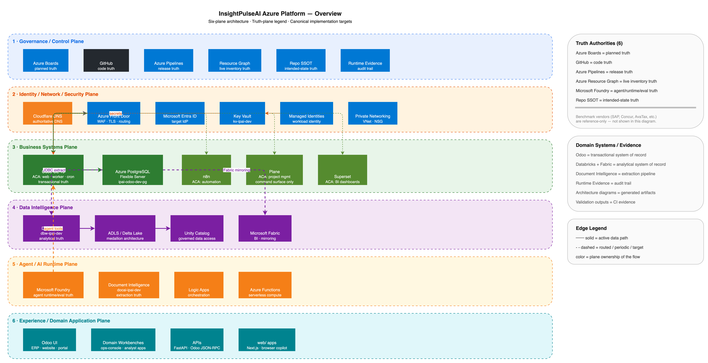

# Architecture Documentation

## Overview

| Document | Purpose |
|----------|---------|
| [**AZURE_PLATFORM_OVERVIEW.md**](AZURE_PLATFORM_OVERVIEW.md) | Six-plane Azure architecture, truth-plane split, canonical services |
| [UNIFIED_TARGET_ARCHITECTURE.md](UNIFIED_TARGET_ARCHITECTURE.md) | Unified target architecture |
| [PLATFORM_TARGET_STATE.md](PLATFORM_TARGET_STATE.md) | Platform target state |
| [ROADMAP_TARGET_STATE.md](ROADMAP_TARGET_STATE.md) | Roadmap SSOT architecture (Odoo write, Plane projection, Supabase read) |
| [ROADMAP_FIELD_AUTHORITY.md](ROADMAP_FIELD_AUTHORITY.md) | Field-level authority matrix (Odoo vs Plane) |
| [ROADMAP_INTEGRATION_DECISIONS.md](ROADMAP_INTEGRATION_DECISIONS.md) | ADR-style integration decisions |

## Diagrams

| Diagram | Level | Source | Render |
|---------|-------|--------|--------|
| Azure Platform Overview | overview | [`azure-platform-overview.drawio`](diagrams/azure-platform-overview.drawio) |  |

The `.drawio` file is the canonical editable source. The `.png` is a derived render artifact.

- Edit in [app.diagrams.net](https://app.diagrams.net) or VS Code draw.io extension
- Export: `./scripts/docs/export_drawio.sh`
- CI: `.github/workflows/diagram-drift-check.yml` enforces source/render lockstep
- Registry: `ssot/architecture/diagram_catalog.yaml`

See [`diagrams/README.md`](diagrams/README.md) for naming conventions and export contract.

## SSOT Registry

Architecture SSOT files live in `ssot/architecture/`:

| File | Purpose |
|------|---------|
| `planes.yaml` | Six-plane model definition |
| `runtime-authority-map.yaml` | Truth-plane ownership |
| `diagram_catalog.yaml` | Diagram registry with authority/scope metadata |
| `system-context.yaml` | System context boundaries |
| `tenant-model.yaml` | Tenant context propagation |
| `data-flows.yaml` | Data flow definitions |
