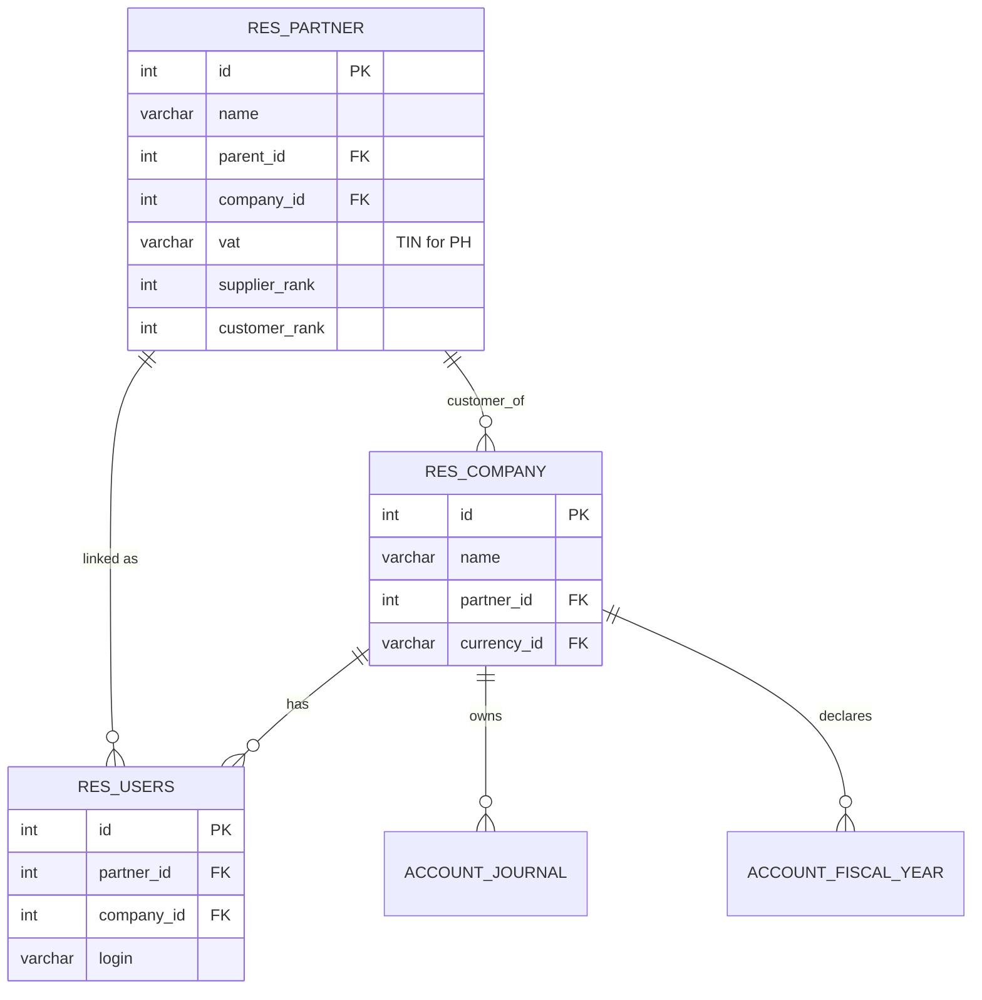
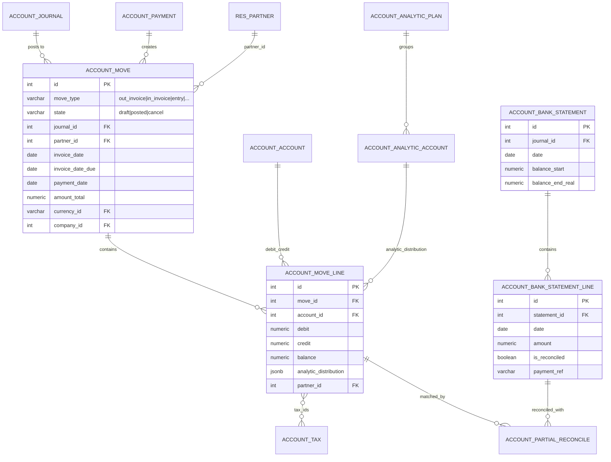
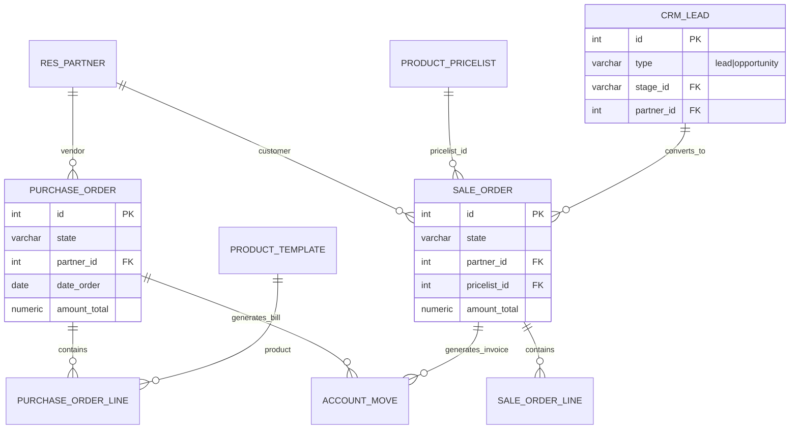
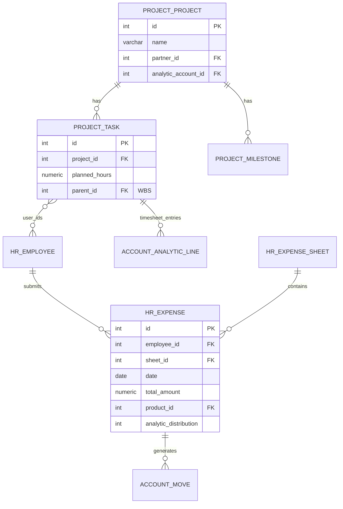
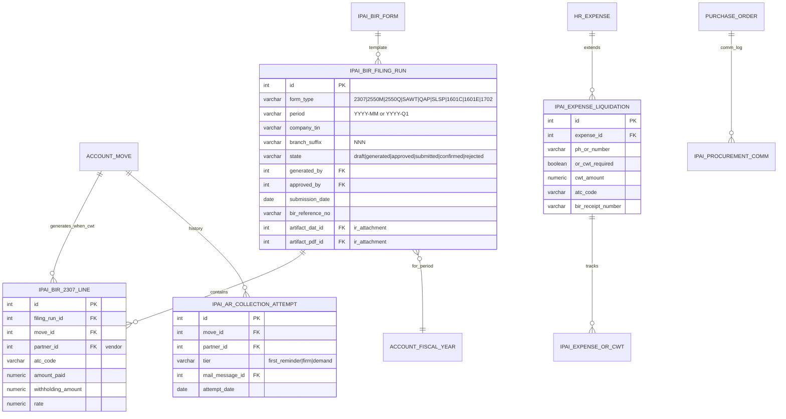
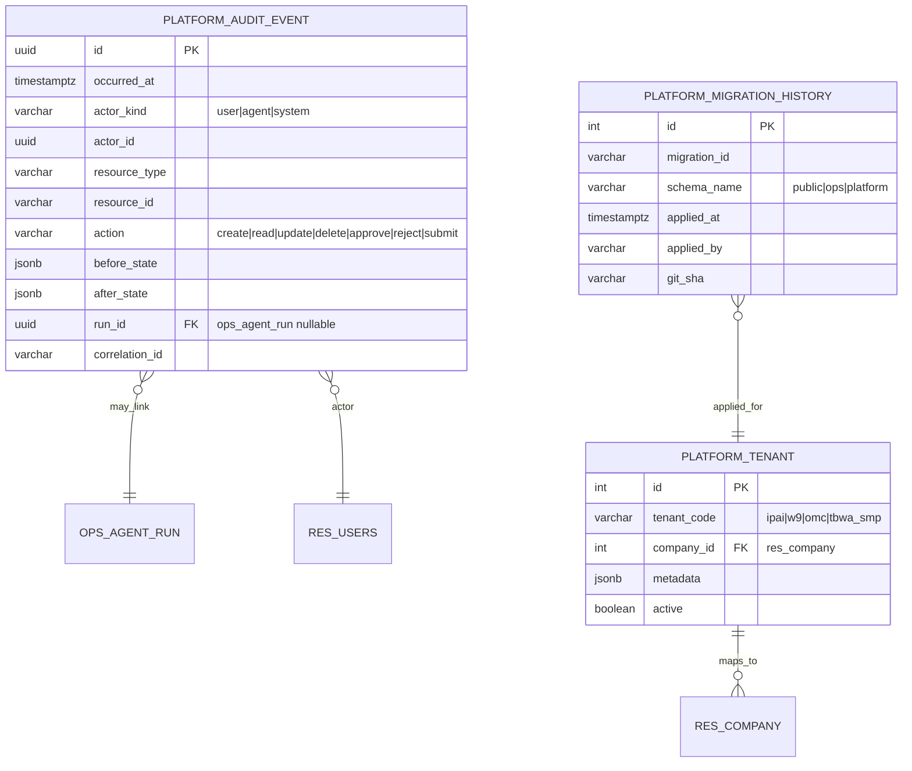
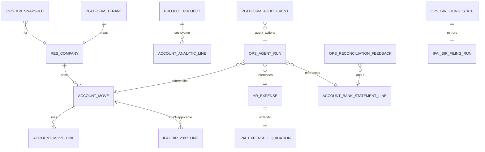

# Pulser / Odoo / Agent Platform — Data Model, DBMS, ORM, ERD

> Canonical data-model lock-in across the three schemas on `pg-ipai-odoo` (PG Flex 16, SEA).
> Doctrine: single Postgres instance with schema separation. No Supabase. No Cosmos (yet).
> Companions:
> - [`d365-displacement-map.md`](./d365-displacement-map.md)
> - [`../research/d365-to-odoo-mapping.md`](../research/d365-to-odoo-mapping.md)
> - [`revised-bom-target-state.md`](./revised-bom-target-state.md) ← BOM v2 (multitenant SaaS + 4 planes)
> - [`multitenant-saas-target-state.md`](./multitenant-saas-target-state.md)
> - [`cdm-and-analytics-bridge.md`](./cdm-and-analytics-bridge.md)
> - [`odata-to-odoo-mapping.md`](./odata-to-odoo-mapping.md)
>
> **BOM authority:** [`ssot/azure/bill-of-materials.yaml`](../../ssot/azure/bill-of-materials.yaml) v2.0.0
> **Tag contract:** [`ssot/azure/tagging-standard.yaml`](../../ssot/azure/tagging-standard.yaml) v3.0.0 (17 required tags)
> **Naming contract:** [`ssot/azure/naming-standard.yaml`](../../ssot/azure/naming-standard.yaml)
>
> Locked 2026-04-15. Refreshed for BOM v2 alignment.

---

## 0. DBMS — single canonical instance

| Field | Value (current) | Value (target per BOM v2) |
|---|---|---|
| DBMS | PostgreSQL 16 (Flexible Server) | PostgreSQL 16 (Flexible Server) — one per env |
| Instance (nonprod) | `pg-ipai-odoo` | `pg-ipai-nonprod-odoo` (after naming-standard rename) |
| Instance (prod) | — | `pg-ipai-prod-odoo` (to provision) |
| Subscription (current) | **Azure subscription 1** `536d8cf6-…` — **deprecated, migration in progress** | **Microsoft Azure Sponsorship** `eba824fb-…` (nonprod) + new prod sub |
| Resource group (current) | `rg-ipai-dev-odoo-data` | `rg-ipai-<env>-odoo-data` per canonical RG layout |
| Region | Southeast Asia | Southeast Asia |
| Compute | General Purpose tier | GP tier per env (right-sized at cutover) |
| Mirroring | Fabric mirroring eligible (per `project_fabric_finance_ppm` memory) | Same; Fabric = read-only mirror |
| Connection pooler | PgBouncer — currently OFF | PgBouncer ON (target for prod) |
| Access path (MCP) | `ipai-odoo-mcp` (ACA, 13 tools) → `pg-ipai-odoo` | Per-env MCP; MI-only auth |
| Access path (JSON-RPC) | `ipai-odoo-connector` (ACA) → Odoo web app → `pg-ipai-odoo` | Per-env connector |
| Auth | Entra ID (Managed Identity). No password auth for service workloads. | Same — enforced per `tagging-standard.yaml` `managed_by: bicep` |

**Mandatory tag set** (per [`tagging-standard.yaml`](../../ssot/azure/tagging-standard.yaml) v3):
```yaml
plane: transaction
product: odoo
workload: odoo
tenant_scope: multi-tenant          # Odoo shares DB; per-tenant via res.company
billing_scope: shared               # runtime is shared across tenants
regulated_scope: none               # no PHI/clinical on this instance
criticality: high
data_classification: confidential
backup_tier: critical
# ... plus organization, environment, owner, cost_center, managed_by,
# source_repo, lifecycle, region (17 total)
```

**Forbidden:** direct SQL from Pulser agents. All reads go through `ipai-odoo-mcp`; all writes go through `ipai-odoo-connector`.

### 0.1. BOM v2 topology — where this DB sits

```
Subscription(s):  ipai-shared-management  (pending) — governance, billing, global edge
                  ipai-nonprod             (current Sponsorship sub)
                  ipai-prod                (pending provisioning)

RG for this DB:   rg-ipai-<env>-odoo-data   (canonical name per naming-standard)

Plane mapping:    plane=transaction  (core operations plane per revised-bom)
                  Other data: data-intelligence plane (Databricks lake, Fabric mirror)

Per-env qty per BOM v2:
  postgres_flexible_server: 1
  odoo_storage_account:     1
  aca_env:                  1   (runtime for Odoo web/worker/cron + Pulser)
  aca_apps:                 5   (odoo-app, odoo-worker, pulser-api, prisma-api, forms-api)
  aca_jobs:                 2   (odoo-init, odoo-batch)
```

See [`revised-bom-target-state.md`](./revised-bom-target-state.md) for the full 38–42 resources per env (target: ~84–94 across nonprod + prod + shared-mgmt).

---

## 1. Schema layout — 3 schemas, 1 database, multitenant-scoped

```
pg-ipai-odoo (database: odoo_dev | odoo_staging | odoo)
├── public          ← Odoo ORM schema (CE + OCA + ipai_*)
│                    Owned by Odoo runtime. Never modify outside Odoo migrations.
│                    Multitenancy: res.company per tenant (company_id column
│                    on every business table). Per multitenant-saas-target-state
│                    pattern: shared DB, schema-per-tenant for ERP,
│                    tenant_id discriminator on products-level rows.
├── ops             ← Pulser agent operational state
│                    Owned by agent-platform. Append-only where possible.
│                    Multitenancy: every row carries tenant_id FK to ops.tenants.
└── platform        ← IPAI platform extensions (audit, migrations, tenancy)
                     Owned by platform/ team. Cross-schema read for telemetry.
                     Houses: ops.tenants, ops.feature_flags, ops.audit_log
                     per multitenant-saas-target-state §Phase 1.
```

**Rules:**
- `public` schema mutations ONLY via Odoo migrations (`addons/<module>/migrations/`) or runtime ORM
- `ops` schema migrations via `migrations/odoo/` (`agent-platform/migrations/` as fallback)
- `platform` schema migrations via `platform/migrations/`
- Cross-schema reads allowed. Cross-schema writes require a documented contract in `docs/contracts/`.
- **Every table carries tenant identity**:
  - `public.*`: via `company_id` (Odoo native multi-company)
  - `ops.*`: via `tenant_id` column FK to `ops.tenants.id`
  - `platform.*`: via `tenant_id` (or NULL for platform-level rows)

---

## 2. `public` schema — Odoo ORM (CE + OCA + ipai_*)

Canonical Odoo tables powering SOR. ORM = Odoo Python `odoo.models.Model`.

### 2.1 Company / partner / user



### 2.2 Accounting core (GL/AP/AR)



### 2.3 Procure-to-Pay + Order-to-Cash



### 2.4 Project + Time + Expense



### 2.5 `ipai_*` extensions — PH-specific delta

Per `docs/research/d365-to-odoo-mapping.md §4`, only 4 must-build + 6 conditional.



---

## 3. `ops` schema — Pulser agent operational state

Agent runtime state. Append-only where possible; row-level soft-delete only.

```mermaid
erDiagram
    OPS_AGENT_RUN ||--o{ OPS_AGENT_MESSAGE : "contains"
    OPS_AGENT_RUN }o--|| OPS_AGENT_CONVERSATION : "belongs_to"
    OPS_AGENT_RUN ||--o{ OPS_TOOL_CALL : "emits"
    OPS_AGENT_RUN ||--o{ OPS_RECONCILIATION_FEEDBACK : "may_collect"
    OPS_AGENT_RUN }o--|| OPS_EVAL_RUN : "part_of_eval_run"
    OPS_BIR_FILING_STATE }o--|| IPAI_BIR_FILING_RUN : "mirrors"
    OPS_KPI_SNAPSHOT }o--|| RES_COMPANY : "for_company"

    OPS_AGENT_CONVERSATION {
        uuid id PK
        varchar agent_name "pulser-finance|pulser-ops|pulser-research|..."
        uuid thread_id "Entra user's thread id"
        varchar entra_user_oid
        timestamptz started_at
        timestamptz last_activity_at
        varchar status "active|closed|archived"
    }
    OPS_AGENT_RUN {
        uuid id PK
        uuid conversation_id FK
        varchar model_deployment "gpt-4.1|gpt-4.1-mini-20260415|..."
        timestamptz started_at
        timestamptz completed_at
        varchar status "running|succeeded|failed|cancelled"
        int prompt_tokens
        int completion_tokens
        int total_tokens
        numeric cost_usd
    }
    OPS_AGENT_MESSAGE {
        uuid id PK
        uuid run_id FK
        varchar role "user|assistant|tool"
        text content
        jsonb tool_calls
        timestamptz created_at
    }
    OPS_TOOL_CALL {
        uuid id PK
        uuid run_id FK
        varchar tool_name "pg_mcp|code_interpreter|azure_ai_search|..."
        jsonb parameters
        jsonb result_summary
        int duration_ms
        varchar status
    }
    OPS_RECONCILIATION_FEEDBACK {
        uuid id PK
        uuid run_id FK
        int statement_line_id FK "account.bank.statement.line"
        int move_line_id FK "account.move.line"
        boolean agent_suggested
        boolean operator_accepted
        text operator_note
        numeric confidence_score
        timestamptz decided_at
    }
    OPS_BIR_FILING_STATE {
        uuid id PK
        int filing_run_id FK "ipai_bir_filing_run"
        varchar state_snapshot
        timestamptz transitioned_at
        uuid transitioned_by_run_id FK "ops_agent_run"
    }
    OPS_EVAL_RUN {
        uuid id PK
        varchar agent_name
        varchar eval_suite "pulser-finance-evals|..."
        timestamptz run_at
        jsonb per_test_scores
        numeric composite_score
        varchar git_sha
        varchar model_deployment
    }
    OPS_KPI_SNAPSHOT {
        uuid id PK
        int company_id FK
        date snapshot_date
        varchar kpi_name "dso|dpo|days_to_close|filing_on_time_rate|..."
        numeric value
        numeric target
        varchar owner_agent
    }
```



### 3.1 ORM for `ops` schema

Agent-platform side uses **SQLAlchemy** (not Odoo ORM) since agents are not Odoo modules:

```python
# agent-platform/models/ops.py
from sqlalchemy.orm import DeclarativeBase, Mapped, mapped_column
from uuid import UUID, uuid4
from datetime import datetime

class OpsBase(DeclarativeBase):
    __table_args__ = {"schema": "ops"}

class AgentConversation(OpsBase):
    __tablename__ = "agent_conversation"
    id: Mapped[UUID] = mapped_column(primary_key=True, default=uuid4)
    agent_name: Mapped[str]
    thread_id: Mapped[UUID]
    entra_user_oid: Mapped[str]
    started_at: Mapped[datetime]
    # ...
```

Connection: `DefaultAzureCredential` → Entra token → PG Flex with `iam_authn`.
**Never** use password auth; **never** commit connection strings.

---

## 4. `platform` schema — IPAI platform cross-cutting

Audit, migrations, tenant metadata. Cross-cuts all schemas.



---

## 5. Complete ERD — cross-schema high-level view



---

## 6. ORM matrix — which ORM reads/writes which schema

| Workload | Runtime | ORM | Reads schemas | Writes schemas |
|---|---|---|---|---|
| Odoo web/worker | `odoo-web`, `odoo-worker` (ACA) | Odoo Python ORM (`odoo.models`) | `public` | `public` (canonical) |
| Odoo MCP (read path) | `ipai-odoo-mcp` (ACA) | Raw SQL via async asyncpg; schema-qualified | `public` | — |
| Odoo Connector (write path) | `ipai-odoo-connector` (ACA) | Odoo JSON-RPC (not direct SQL) | via ORM | via ORM → `public` |
| Pulser agent runtime | `agent-platform/*` (Foundry Agents + ACA workers) | SQLAlchemy 2.x async | `ops`, `platform` (+ read `public` via MCP) | `ops`, `platform` |
| Eval harness | `agent-platform/evals/` | SQLAlchemy 2.x | `ops` | `ops.eval_run` |
| Audit log writer | middleware in `agent-platform` + Odoo `ir.logging` shim | SQLAlchemy | — | `platform.audit_event` |
| Fabric mirror | Fabric shortcut to `pg-ipai-odoo` | — (mirroring) | `public` read-only | — |
| Power BI | Fabric semantic model | — (DirectQuery or import) | via Fabric mirror | — |

**Doctrine — write boundaries:**
- Only Odoo ORM or Odoo JSON-RPC writes `public`
- Only agent-platform writes `ops`
- Only platform code writes `platform.audit_event` (but agents emit via a middleware)
- Fabric mirror is read-only; never write-back

---

## 7. Migration story

| Schema | Migration location | Tool | Triggered by |
|---|---|---|---|
| `public` (Odoo core/OCA) | `addons/<module>/migrations/<version>/` | Odoo on upgrade | Module version bump |
| `public` (`ipai_*`) | `addons/ipai/<mod>/migrations/` | Odoo | `ipai_*` version bump |
| `ops` | `migrations/odoo/YYYYMMDD_*.sql` OR `agent-platform/migrations/` | Liquibase or Alembic | PR + Azure Pipelines |
| `platform` | `platform/migrations/YYYYMMDD_*.sql` | Liquibase | PR + Azure Pipelines |

**Rollback posture:** every migration has an explicit `DOWN` script committed alongside `UP`; no blind reverts.

---

## 8. Current state vs declared model

| Schema | Status | Notes |
|---|---|---|
| `public` (Odoo) | ✅ LIVE | Odoo 18 CE + OCA + some `ipai_*` deployed |
| `ops` | ❌ **NOT YET CREATED** | Must land Issue #XX: `migrations/odoo/20260415_ops_schema_init.sql` |
| `platform` | ⚠️ **Partial** | Some scaffolding; `platform.audit_event` not yet live |

**Gap to close:** `ops` schema does not yet exist. Until it does, agent state has no durable home. This is the #1 implementation prerequisite before Pulser agents go to production. Corresponds to `spec/pulser-evals/pulser-finance-evals.md §2.2` requirement for `ops.reconciliation_feedback`.

---

## 9. Fine-tune corpus decision — dataset vs curate

Given the locked data model, the corpus for fine-tuning (`ssot/foundry/runtime-contract.yaml §fine_tuning_roadmap §Phase 3`) has two source paths:

### Option A — Public / open dataset
| Pro | Con |
|---|---|
| Zero PII risk | No PH BIR specificity |
| Fast to start | No Odoo-schema alignment |
| Benchmarking easy (vs HF Smol Training Playbook methodology) | Model learns patterns irrelevant to IPAI use case |

Candidates: **BIRD-SQL** (text-to-SQL over multi-domain DBs including finance), **FinanceBench** (financial analyst tasks), **FinQA** (numerical reasoning over financial reports). None covers PH BIR.

### Option B — Curate from `public` + `ops` schema
| Pro | Con |
|---|---|
| PH BIR specificity — the moat | Requires production data volume IPAI may not yet have |
| Schema-aligned — model learns actual Odoo field names | PII risk — requires anonymization pipeline |
| DPO signal from `ops.reconciliation_feedback` | Requires `ops` schema live first (Issue #XX) |
| Natural growth as customers operate | Cold-start problem |

### Option C (recommended) — Hybrid

1. **Phase 3 bootstrap** with Option A public datasets for base task adaptation (reasoning on financial data, text-to-SQL on finance schemas)
2. **Phase 3.1 domain injection** with curated PH BIR corpus: ~500 anonymized 2307 records, ~300 expense liquidation forms, ~1000 reconciliation pairs (synthetic + real once `ops` is live)
3. **Phase 4 DPO** exclusively from Option B — operator-correction pairs are the scarcest + highest-value signal; don't dilute with public data

### Decision needed before Phase 3 launch

1. **Anonymization pipeline** — PII detection + redaction for Option B. Target: `agent-platform/anonymize/` module. Reversibility: deterministic hashing for TINs so re-identification is controlled.
2. **Synthetic BIR record generator** — for cold-start; generate plausible 2307 records against schema + ATC rules. Target: `agent-platform/synth/bir_2307_gen.py`.
3. **Public dataset licenses** — verify BIRD-SQL / FinanceBench / FinQA licenses permit commercial fine-tune use.

---

## 11. Common Data Model (CDM) positioning

Microsoft's **Common Data Model** (learn.microsoft.com/common-data-model/) is a
shared metadata + standardized entity schemas for D365, Power Platform,
Power BI, Azure. Entities like `Account`, `Contact`, `SalesOrder`, `Invoice`,
`Worker` are defined with fixed attribute shapes so data can flow across
Microsoft products without custom ETL.

### IPAI doctrine on CDM

**CDM is NOT canonical IPAI data.** Odoo is the SOR. Adopting CDM entity
names/shapes in `public` would fork Odoo or force a renaming layer — both
forbidden by `feedback_odoo_module_selection_doctrine`.

**CDM IS a projection target** for Fabric / Power Platform / Power BI
consumers who expect CDM-shaped entities. Implemented as **semantic
model views in Fabric**, never as tables in `pg-ipai-odoo`.

### Architecture — 3 layers with CDM as a projection

```
pg-ipai-odoo.public         ← Odoo entities (canonical SOR)
         ↓ (Fabric mirror, read-only, no transformation)
Fabric OneLake bronze       ← Odoo-shaped tables mirrored 1:1
         ↓ (Fabric notebooks / SQL endpoint transforms)
Fabric silver/gold          ← CDM-shaped semantic views (Account, Invoice, …)
         ↓ (Power BI semantic model, DirectQuery or import)
Power BI / Power Platform   ← Consumers see CDM entities
```

**Where transformations live:** Fabric notebooks or Fabric SQL endpoint
views, NOT Postgres. Keeps Odoo canonical untouched.

### Odoo → CDM mapping (the projection contract)

| Odoo entity | CDM entity | Notes |
|---|---|---|
| `res.partner` (customer_rank>0) | `Account` (customerType) | CDM `Account` covers both customers and org accounts |
| `res.partner` (supplier_rank>0) | `Vendor` / `Account` (supplierType) | CDM uses role discriminator |
| `res.partner` (is_company=False) | `Contact` | Individual partners |
| `crm.lead` (type=lead) | `Lead` | — |
| `crm.lead` (type=opportunity) | `Opportunity` | — |
| `sale.order` | `SalesOrder` | `state` → CDM statusCode |
| `sale.order.line` | `SalesOrderDetail` / `SalesOrderLine` | — |
| `purchase.order` | `PurchaseOrder` | — |
| `purchase.order.line` | `PurchaseOrderDetail` | — |
| `account.move` (move_type=out_invoice) | `Invoice` / `CustomerInvoice` | — |
| `account.move` (move_type=in_invoice) | `VendorInvoice` / `Bill` | — |
| `account.move.line` | `InvoiceLine` | Debit/credit → CDM positive/negative |
| `account.payment` | `Payment` | — |
| `account.bank.statement` | `BankStatement` | — |
| `account.bank.statement.line` | `BankStatementLine` | — |
| `account.account` | `GeneralLedgerAccount` | — |
| `account.journal` | `Journal` / `LedgerJournal` | — |
| `product.template` | `Product` | — |
| `product.category` | `ProductCategory` | — |
| `product.pricelist` | `PriceList` | — |
| `hr.employee` | `Worker` / `Employee` | — |
| `hr.expense` | `ExpenseReport` / `ExpenseTransaction` | — |
| `project.project` | `Project` | — |
| `project.task` | `ProjectTask` | — |
| `res.company` | `CompanyInformation` / `LegalEntity` | — |

### What IPAI-specific entities DON'T project to CDM

Entities with no CDM equivalent stay Odoo-shaped in Fabric gold, exposed
under an `IPAI_*` namespace for BI consumers that need them:

- `ipai_bir_filing_run`, `ipai_bir_2307_line` — PH-specific; no CDM entity
- `ipai_expense_liquidation` — PH-specific extension of `ExpenseReport`
- `ops.*` — agent operational state; not an analytical entity
- `platform.audit_event` — exposed as `AuditEvent` custom CDM extension

### CDM adoption rules for IPAI

1. **NEVER** rename Odoo fields to CDM names in `public` schema
2. **NEVER** create CDM entities as physical tables in `pg-ipai-odoo`
3. CDM projection is Fabric-only; implemented as views, not materialized tables, unless performance demands otherwise
4. When a Power BI report needs an attribute that doesn't exist in Odoo, extend Odoo first (`ipai_*` module), then project to CDM — never fabricate in the semantic layer
5. PH BIR entities (`ipai_bir_*`) stay Odoo-shaped in the `IPAI_*` CDM namespace; do NOT force-map to generic `TaxTransaction` CDM entity (loses ATC code specificity)

### What this means operationally

- Issue 18 (`ipai_finance_ppm` KPI definitions) adds a **second deliverable**: the CDM projection contract for KPIs visible in Power BI. Target file: `data-intelligence/fabric/semantic-models/ipai-finance-cdm.pbix` + `data-intelligence/fabric/cdm-mapping.yaml`.
- Fabric mirror (when provisioned) consumes `pg-ipai-odoo` → bronze Odoo-shaped tables; CDM projection views live in silver/gold.
- Future: if a D365 customer migrates TO IPAI, CDM is the interchange format for master data import — Odoo `res.partner` populated from customer's existing CDM `Account` entities.

---

## 10. Related artifacts

- `docs/research/d365-to-odoo-mapping.md` — entity-level mapping of D365 → Odoo
- `docs/research/d365-data-model-inventory.md` — D365 entity catalog
- `docs/runbooks/foundry-connections-and-tools.md` — which tools read which models
- `ssot/foundry/runtime-contract.yaml` — model deployment + FT roadmap
- `spec/pulser-evals/*` — eval cases reference specific tables
- `docs/backlog/open-issues-20260415.md` — implementation backlog (Issue 8: module naming, Issue 9: BIR Phase 1, Issue 14: evals)

---

*Locked 2026-04-15. Next revision: when `ops` schema lands (closes §8 gap) OR when a new `ipai_*` module adds entities that change §2.5.*
