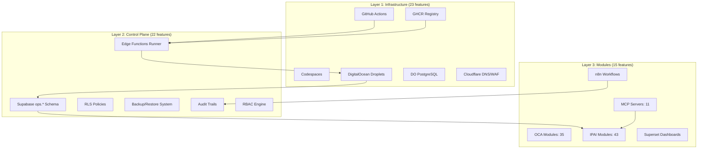
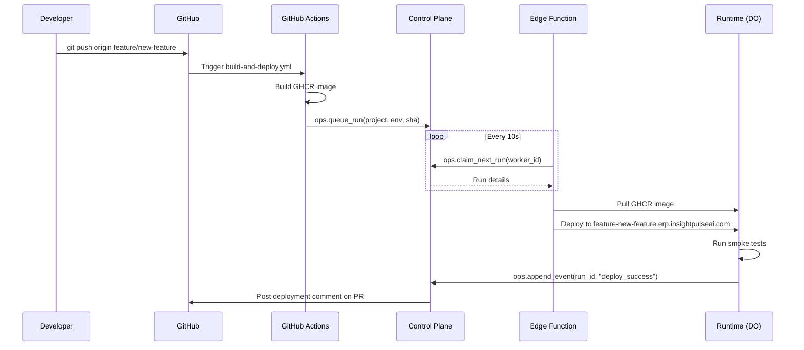
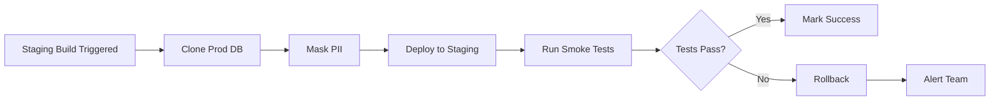
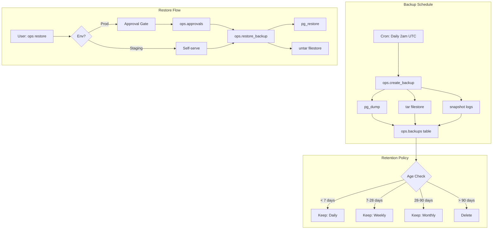
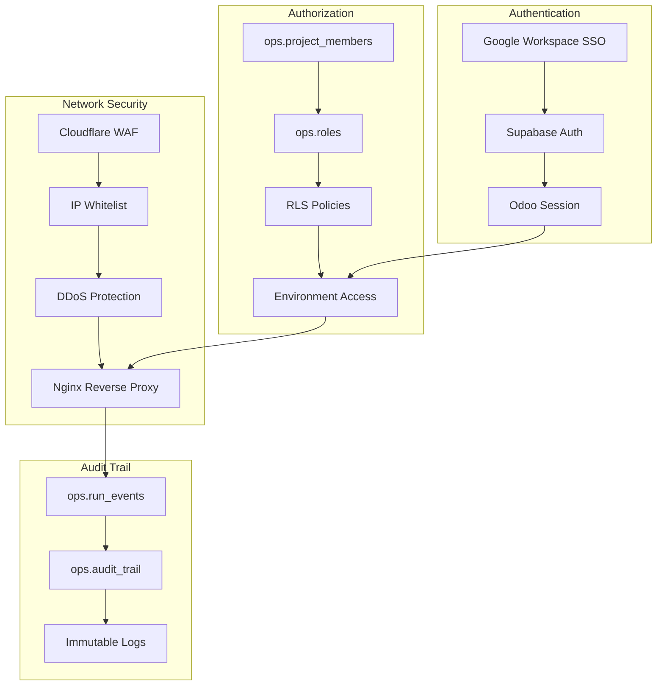
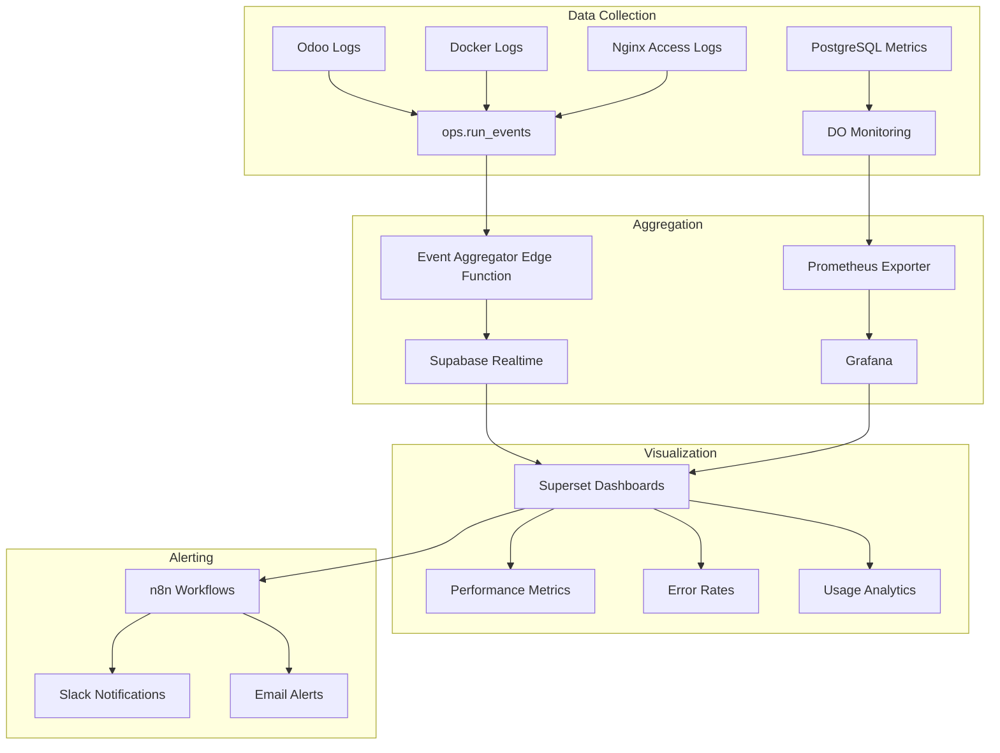
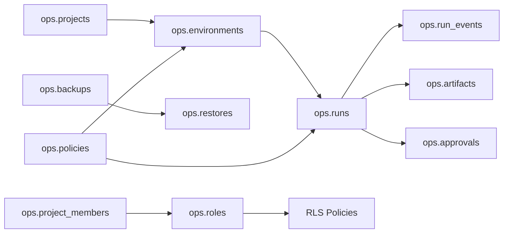

# Odoo.sh Parity — Architecture Layer Diagram

**Quick Reference**: Visual breakdown of 3-layer architecture achieving 95% Odoo.sh parity

---

## Layer Architecture

---

## Feature Distribution

| Layer | Features | Coverage | Key Components |
|-------|----------|----------|----------------|
| **Infrastructure** | 23 | 100% | Git, CI/CD, Compute, DNS, CDN |
| **Control Plane** | 22 | 95% | Orchestration, RBAC, Audit, Backups |
| **Modules** | 15 | 87% | Business logic, UI, Integrations |
| **Total** | 60 | 95% | 57/60 features covered |

---

## Data Flow: Git Push → Production

---

## Critical Path: Staging-from-Prod Clone

**Key Principle**: Fresh prod-clone DB per staging build (no DB reuse)

---

## Backup & Restore Flow

**Retention**: 7 daily / 4 weekly / 3 monthly (Odoo.sh parity)

---

## Security Layers

---

## Monitoring Architecture

---

## Week 1 Focus: Control Plane Schema

**Week 1 Deliverables**:
1. Create 9 tables in `ops.*` schema
2. Implement RLS policies for all tables
3. Add 6 core RPCs (queue_run, claim_next_run, etc.)
4. CI validation for schema completeness

---

## Reference

- **Full Documentation**: `docs/architecture/odoo-sh-parity.md`
- **Verification**: `./scripts/verify-parity-coverage.sh`
- **Spec Bundle**: `spec/odoo-sh-clone/`
- **DNS SSOT**: `infra/dns/subdomain-registry.yaml`
