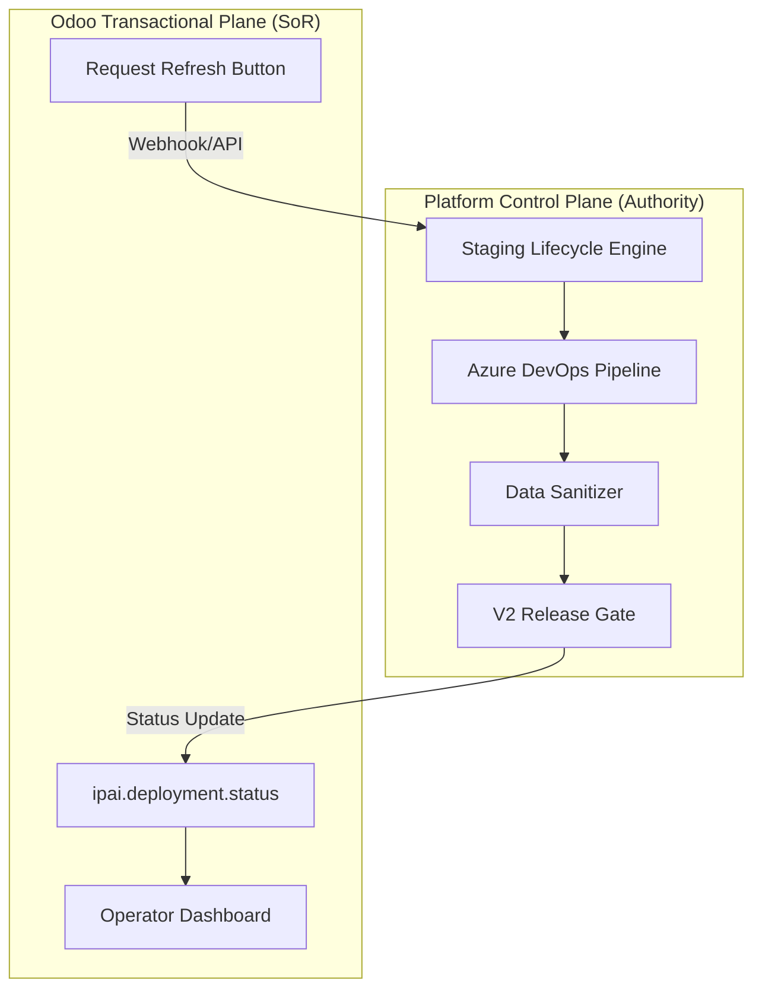

# Staging Architecture: Control Surface Split

## Hierarchy

## Implementation Rules
1. **No Local DB Mutations**: Odoo shall NOT perform its own DB cloning or sanitization logic.
2. **Asynchronous Feedback**: Odoo calls the Engine API and waits for a background callback to update status.
3. **Evidence First**: All staging refreshes must generate a machine-readable evidence pack before the environment is marked 'Healthy' in Odoo.
