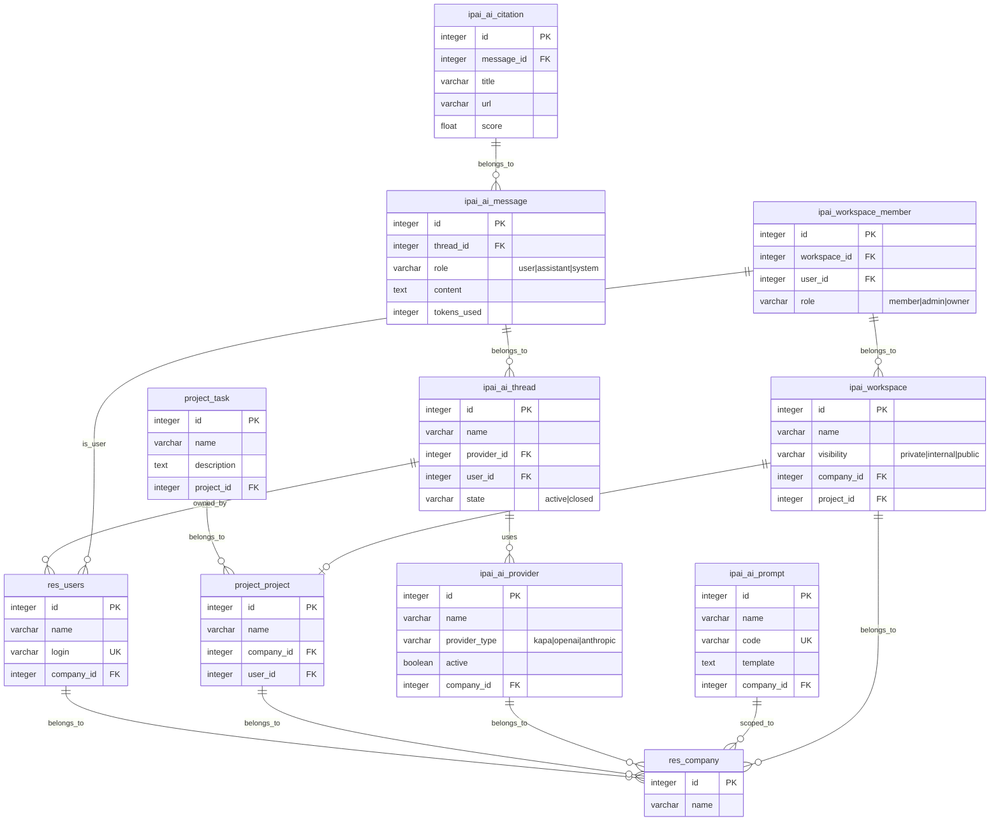
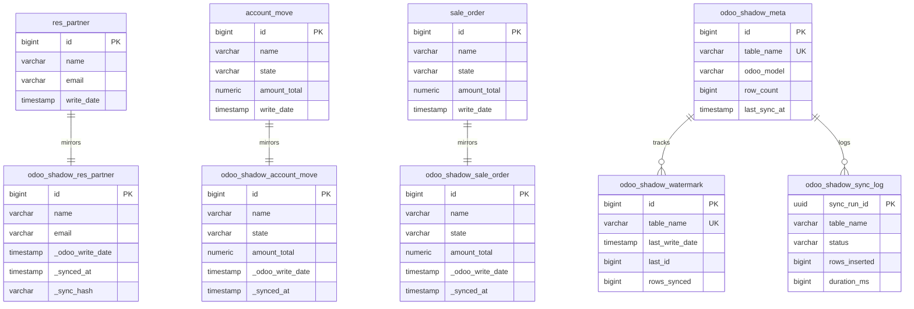
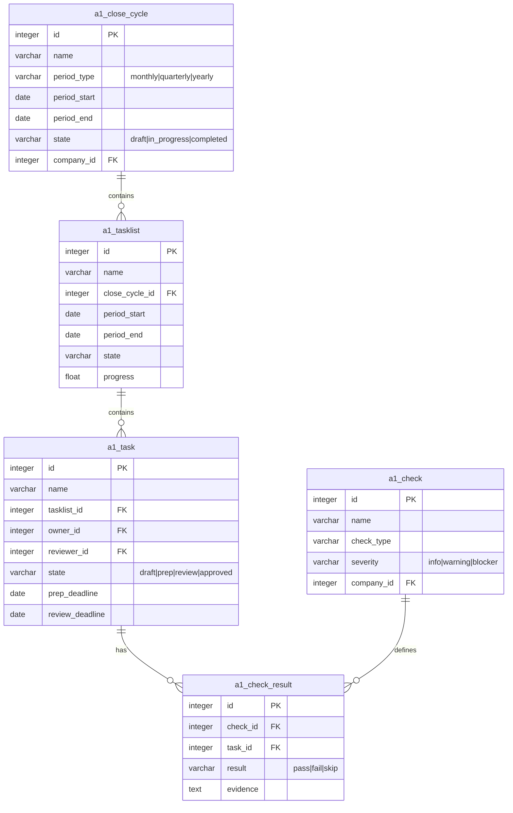
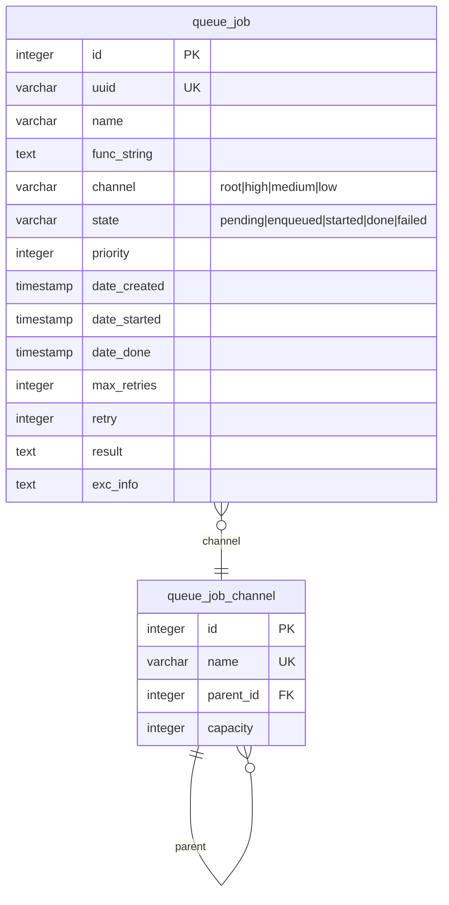

# Odoo Data Model Artifacts

This folder contains canonical, generated representations of the Odoo CE data model as defined by this repository's addons.

---

## Quick View: IPAI AI Platform ERD



---

## Quick View: Shadow Schema Architecture



---

## Quick View: Finance PPM Core



---

## Quick View: OCA Queue Job



---

## Contents

### Schema Definitions
| File | Format | Description |
|------|--------|-------------|
| `ODOO_CANONICAL_SCHEMA.dbml` | DBML | Canonical schema for dbdiagram.io (132KB, 357 models) |
| `ODOO_MODEL_INDEX.json` | JSON | Machine-readable index of models, fields, relations |
| `ODOO_ORM_MAP.md` | Markdown | ORM map linking Odoo models, tables, and fields |
| `ODOO_MODULE_DELTAS.md` | Markdown | Per-module deltas highlighting new and extended tables |
| `ODOO_SHADOW_SCHEMA.sql` | SQL | Auto-generated shadow schema DDL (288 tables) |

### Diagram Formats
| File | Format | Viewer |
|------|--------|--------|
| `ODOO_ERD.mmd` | Mermaid | GitHub, [Mermaid Live](https://mermaid.live) |
| `ODOO_ERD.puml` | PlantUML | [PlantUML Online](https://www.plantuml.com/plantuml) |
| `IPAI_AI_PLATFORM_ERD.mmd` | Mermaid | GitHub (rendered above) |
| `EXTENDED_PLATFORM_ERD.mmd` | Mermaid | GitHub, Mermaid Live |

### Extended Schemas
| File | Description |
|------|-------------|
| `EXTENDED_PLATFORM_SCHEMA.dbml` | Extended platform DBML (OCA modules) |
| `IPAI_AI_PLATFORM_SCHEMA.dbml` | AI platform DBML (IPAI modules) |
| `IPAI_FINANCE_OKR_SCHEMA.dbml` | Finance OKR schema |
| `MULTI_TENANT_PROVIDER_SCHEMA.dbml` | Multi-tenant provider schema |
| `SCOUT_CES_ANALYTICS_SCHEMA.dbml` | Scout/CES analytics schema |
| `insightpulse_canonical.dbml` | InsightPulse canonical schema |

### Documentation
| File | Purpose |
|------|---------|
| `SHADOW_SCHEMA_FEASIBILITY.md` | Technical feasibility analysis for shadow mirroring |
| `SUPERSET_ERD_INTEGRATION.md` | How to embed ERDs in Superset dashboards |

---

## View DBML Online

Import any `.dbml` file into [dbdiagram.io](https://dbdiagram.io):

1. Go to https://dbdiagram.io/d
2. Click **Import** → **From DBML**
3. Paste contents of any `.dbml` file

**Direct links** (copy content from):
- [ODOO_CANONICAL_SCHEMA.dbml](./ODOO_CANONICAL_SCHEMA.dbml) - Full Odoo schema
- [IPAI_AI_PLATFORM_SCHEMA.dbml](./IPAI_AI_PLATFORM_SCHEMA.dbml) - AI platform
- [EXTENDED_PLATFORM_SCHEMA.dbml](./EXTENDED_PLATFORM_SCHEMA.dbml) - OCA extensions

---

## Regenerate Locally

### All formats (DBML, Mermaid, PlantUML)
```bash
python scripts/generate_odoo_dbml.py
```

### Shadow schema DDL
```bash
python scripts/generate_shadow_ddl.py
```

### Graphviz formats (DOT, SVG, PNG)
```bash
# Requires: apt-get install graphviz
python scripts/generate_erd_graphviz.py --format all
```

### IPAI modules only
```bash
python scripts/generate_erd_graphviz.py --filter ipai_ --format all
```

### From live database (requires DB connection)
```bash
psql -f scripts/erd_dot.sql -t -A > erd.dot
dot -Tsvg erd.dot -o erd.svg
```

---

## CI/CD Automation

ERDs are automatically regenerated when:
- Model files change in `addons/ipai/**/models/**`
- Migration files change in `db/migrations/**`
- Generator scripts are updated

### Workflows
| Workflow | Purpose |
|----------|---------|
| `erd-graphviz.yml` | Generates ERD from codebase (no DB required) |
| `erd-schemaspy.yml` | Generates ERD from live database (requires DB secrets) |

---

## Color Legend

| Color | Meaning |
|-------|---------|
| Light Green | IPAI custom modules (`ipai_*`) |
| Light Yellow | Odoo core models (`res_*`, `ir_*`) |
| Light Gray | Relation tables (`*_rel`) |
| Light Blue | Other tables |

---

## API Access

### Supabase Edge Function
```bash
# Get SVG ERD
curl https://spdtwktxdalcfigzeqrz.supabase.co/functions/v1/serve-erd?format=svg

# IPAI modules only
curl https://spdtwktxdalcfigzeqrz.supabase.co/functions/v1/serve-erd?format=svg&filter=ipai
```

### GitHub Raw URLs
```markdown

```

---

## Schema Statistics

| Metric | Value |
|--------|-------|
| Total Odoo Models | 357 |
| Stored Fields | 2,847 |
| IPAI Custom Models | 80+ |
| Shadow Tables | 288 |
| DBML Size | 132KB |

---

*Last updated: 2026-01-20*
