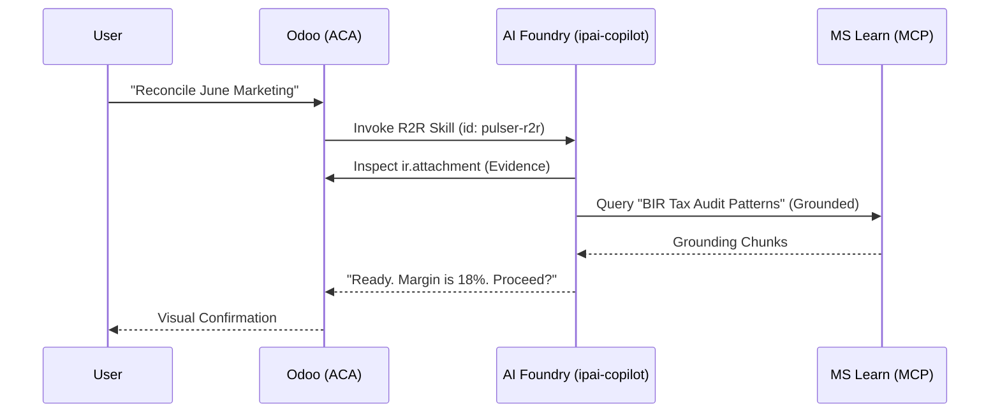

# Demo Storyboard: Pulser for PH - Q3 Launch

> **Goal**: Demonstrate the "Intelligent Operational Control" of Pulser for Odoo to Microsoft Sellers and initial PH customers.

---

## SCENE 1: The "Paperwork" Storm
**Visual**: An office manager in Manila facing a pile of disorganized invoices/receipts.
**Narrative**: "Scaling in the Philippines means managing operational friction—manual encoding, tax compliance, and lack of visibility."
**Action**: User starts the **Pulser for Odoo Mobile App**, opens the camera, and batch-scans three invoices.

## SCENE 2: The Pulser Extraction (Document Intelligence)
**Visual**: High-fidelity overlays showing **Azure Document Intelligence** (prebuilt-layout) extracting fields: Vendor, VAT-Included Amount, BIR-compliance fields, and Line Items.
**Narrative**: "Pulser uses Azure's enterprise-grade AI to extract truth from physical documents without human error."
**Action**: System highlights the `DefaultAzureCredential` auth flow (secure, keyless) while populating the Odoo Draft Invoice.

## SCENE 3: The Copilot Assistant (Skill Integration)
**Visual**: A sidebar interaction using the **Pulser Copilot** (aligned with the `agents/skills/` Agent Plugin).
**Narrative**: "Integrated directly via the Microsoft AI Cloud, the Pulser Assistant guides the user through the 'Month-End Close' checklist."

**Action**: Copilot says: *"I see these invoices are for Marketing Ops. Should I tag them to the 'Retail Expansion' budget?"*

## SCENE 4: The Data Gravity (Databricks + Power BI)
**Visual**: A transition from Odoo's operational data to a **Power BI** dashboard (Bronze -> Silver -> Gold lineage).
**Narrative**: "Operational truth becomes business intelligence. View your Burn Rate, VAT Liability, and Marketing ROI in real-time."
**Action**: User clicks a 'Project to Profit' visualization showing real-time margin tracking across all scanned invoices.

## SCENE 5: Generative Media & Marketing Ops (Sora/Veo/Nano)
**Visual**: The Pulser Assistant suggesting a marketing asset based on the ROI data from Scene 4. High-fidelity video generated by **Veo 3.2** / **Sora 1.2** and social media tiles by **Nano 2** are displayed.
**Narrative**: "Operational efficiency frees up creative bandwidth. Pulser orchestrates generative content directly from your project data, ready for immediate social deployment."
**Action**: Copilot says: *"Our Retail Expansion ROI is exceeding targets. I've generated a 10s brand video and 3 social tiles to celebrate our progress. Should I schedule them for posting?"*

## SCENE 6: Unified Governance (Security + Compliance)
**Visual**: Administrator dashboard showing the **Azure AI Foundry Portal**—unified view of agents, traced conversations, and Entra ID security logs.
**Narrative**: "Built on the Microsoft Security stack. 100% Entra-ID-aligned governance through the unified AI Foundry management plane."
**Action**: One-click 'Deploy Stamp' button shown in the Pulser Ops Console.

---
Technical Implementation Note:
1. **Azure Document Intelligence**: Python SDK (v1.0.x) for structured ingestion.
2. **Azure AI Foundry Agents**: Orchestrated via the `azure-ai-projects` SDK v2.
3. **Agentic Skills**: Following the canonical [agents/skills/](../../agents/skills/) pattern for multi-specialist logic.
4. **Platform Hosting**: Azure Container Apps (ACA) in `rg-ipai-dev-odoo-sea`.
5. **Data Logic**: Databricks Unity Catalog + Power BI for governed lineage.
