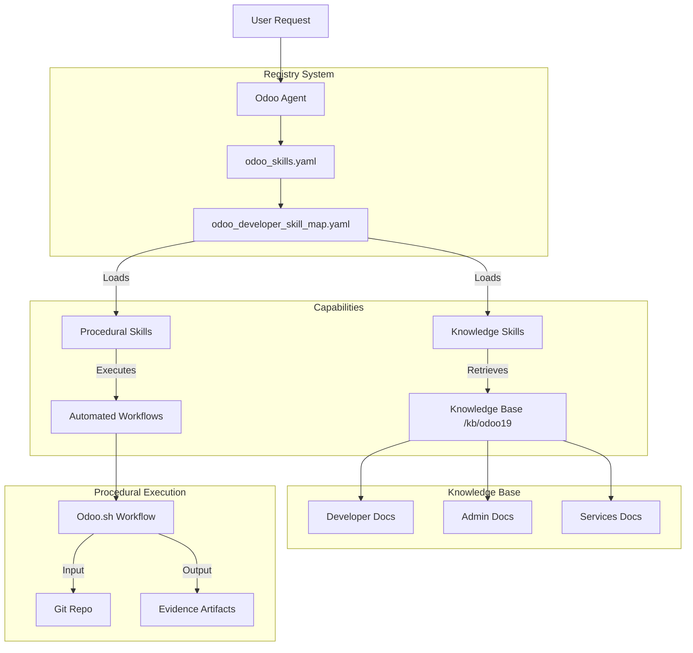
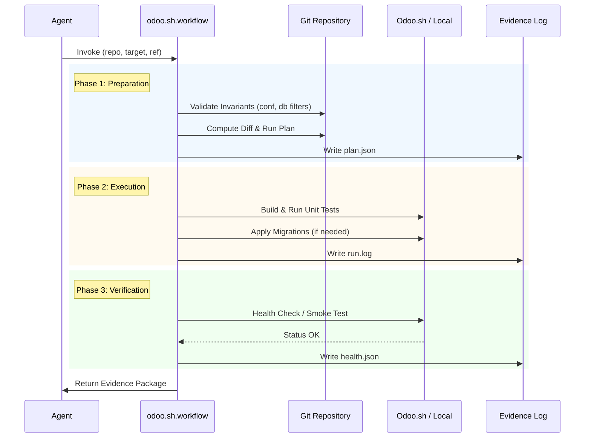

# Odoo 19 Agent Architecture

## System Overview

The following diagram illustrates how the `Skill Registry`, `Skill Map`, and `Knowledge Base` interact to empower the Odoo Agent.

_Note: This diagram is rendered by your local Draw.io extension._

## Workflow: Odoo.sh CI/CD via Procedural Skill

Visualization of the deterministic `odoo.sh.workflow` skill.

