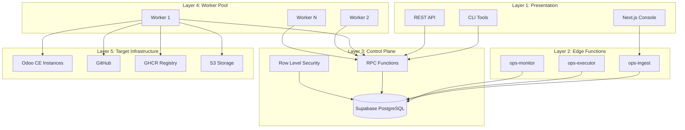
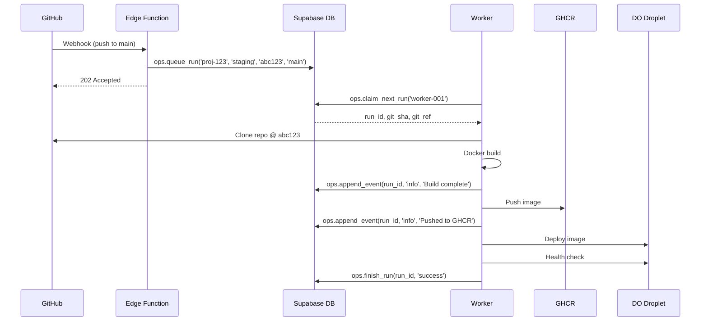
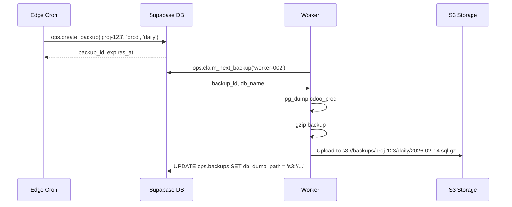
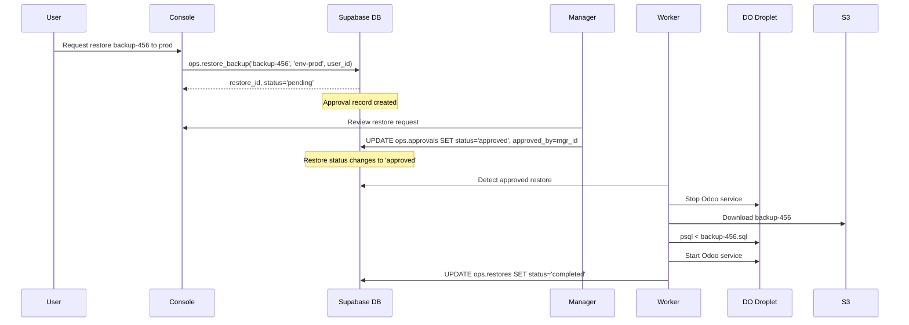

# OdooOps Sh Architecture

## Overview

OdooOps Sh is a self-hosted Odoo.sh-style control plane that brings enterprise-grade DevOps workflows to self-hosted Odoo Community Edition environments. It provides automated build/deploy pipelines, backup management, environment orchestration, and comprehensive audit trails—all backed by Supabase PostgreSQL with real-time capabilities.

The architecture is designed around a queue-based execution model where workers claim runs from a central queue, execute workflows, and report progress through structured events. This enables distributed execution, horizontal scaling, and complete observability of all operations.

## 5-Layer Architecture



### Layer 1: Presentation

**Purpose**: User-facing interfaces for managing projects, runs, and workflows.

**Components**:
- **Next.js Console** (`apps/odooops-console/`)
  - Real-time run monitoring dashboard
  - Project/environment configuration
  - Backup/restore management
  - Approval workflows for production changes
  - Built with Prisma client generated from `ops.*` schema

- **CLI Tools** (`scripts/odooops/`)
  - `env_create.sh` - Queue new environment builds
  - `env_wait_ready.sh` - Poll run status until completion
  - `env_destroy.sh` - Teardown environments
  - Direct RPC calls via `psql` or Edge Function HTTP

- **REST API**
  - Supabase PostgREST auto-generated endpoints
  - Full CRUD on `ops.*` tables (filtered by RLS)
  - Public API for CI/CD integration

**Technology Stack**:
- Next.js 14+ (App Router, Server Components)
- Prisma ORM (type-safe database access)
- Supabase Realtime (WebSocket subscriptions)
- Tailwind CSS + shadcn/ui components

### Layer 2: Edge Functions

**Purpose**: Serverless middleware for webhooks, automation triggers, and external API integrations.

**Components**:
- **ops-ingest** (`supabase/functions/ops-ingest/`)
  - GitHub webhook receiver (push events, PR merges)
  - Creates queued runs for matching environment patterns
  - Validates payloads and enforces rate limits

- **ops-executor** (`supabase/functions/ops-executor/`)
  - Cron-triggered run executor for scheduled workflows
  - Backup automation (daily/weekly/monthly)
  - Cleanup of expired artifacts

- **ops-monitor** (`supabase/functions/ops-monitor/`)
  - Queue health monitoring
  - Stale run detection (claimed but not started in 5 minutes)
  - Alert generation for queue backpressure

**Technology Stack**:
- Deno 1.x (TypeScript runtime)
- Supabase Edge Functions SDK
- GitHub Octokit (API client)

### Layer 3: Control Plane (Core Data Layer)

**Purpose**: Centralized state management, access control, and business logic enforcement.

**Components**:

#### PostgreSQL Schema (`ops.*`)
```sql
-- Core tables (9 total)
ops.projects            -- Project/workspace definitions
ops.environments        -- Dev/staging/prod configurations
ops.runs                -- Main execution queue
ops.run_events          -- Append-only event log
ops.artifacts           -- Build outputs (images, SBOMs, logs)
ops.backups             -- Database backup metadata
ops.restores            -- Restore requests and approvals
ops.approvals           -- Production change gating
ops.policies            -- RBAC permission policies
ops.roles               -- User role definitions
ops.project_members     -- User-project assignments
ops.env_permissions     -- Fine-grained environment access
ops.agents              -- Worker registration
ops.agent_teams         -- Multi-agent coordination
ops.agent_team_members  -- Team membership
ops.agent_tasks         -- Task queue for agents
ops.agent_events        -- Agent activity log
```

#### RPC Functions (6 Core + 2 Backup)
```sql
-- Run lifecycle
ops.queue_run(project_id, env, git_sha, git_ref, metadata)
ops.claim_next_run(worker_id)
ops.append_event(run_id, level, message, payload)
ops.finish_run(run_id, status, metadata)

-- Backup/restore
ops.create_backup(project_id, env, backup_type, metadata)
ops.restore_backup(backup_id, target_env_id, requested_by, metadata)
```

#### Row Level Security (RLS)
- **Project-scoped access**: Users see only their assigned projects
- **Role-based permissions**: `ops.user_has_permission()` checks
- **Worker isolation**: Workers can only update runs they've claimed
- **Approval workflows**: Production restores require manager approval

**Technology Stack**:
- PostgreSQL 16 (Supabase-hosted)
- PL/pgSQL stored procedures
- PostgREST (auto-generated REST API)
- Realtime Server (WebSocket pub/sub)

### Layer 4: Worker Pool

**Purpose**: Distributed execution of queued runs with horizontal scaling.

**Components**:
- **Worker Processes**
  - Claim runs via `ops.claim_next_run(worker_id)`
  - Execute workflow steps (build, test, deploy)
  - Report progress via `ops.append_event()`
  - Upload artifacts to GHCR/S3
  - Mark completion with `ops.finish_run()`

- **Worker Types**:
  - **Build Workers**: Docker image builds, SBOM generation
  - **Deploy Workers**: Environment provisioning, database migrations
  - **Backup Workers**: Database dumps, artifact archival
  - **Test Workers**: Integration/E2E test execution

**Scaling Strategy**:
- Horizontal: Add more workers (auto-scaling based on queue depth)
- Vertical: Increase worker CPU/memory for parallel builds
- Queue-based coordination: No worker-to-worker communication needed

**Technology Stack**:
- Docker 24+ (containerized builds)
- GitHub Actions (primary worker runtime)
- DigitalOcean Droplets (self-hosted workers)
- GHCR (GitHub Container Registry)

### Layer 5: Target Infrastructure

**Purpose**: Physical resources managed by OdooOps Sh.

**Components**:
- **Odoo CE Instances**
  - Development: Feature branches, ephemeral databases
  - Staging: `main` branch, persistent database with daily backups
  - Production: Tagged releases, PITR-enabled database, manual approval gates

- **GitHub**
  - Source code repositories (`org/repo` format)
  - Webhook delivery for push/PR events
  - GHCR for Docker image storage
  - Artifact storage for build outputs

- **S3-Compatible Storage**
  - Database backups (`.sql.gz` dumps)
  - Build logs and evidence
  - Artifact expiry and lifecycle policies

**Network Topology**:
```
GitHub → Webhook → Edge Function → Queue Run
                                       ↓
Worker claims run → Docker build → Push GHCR
                ↓
            Deploy to Droplet → Health check → Finish run
```

## Component Interactions

### Standard Build/Deploy Flow



### Backup Creation Flow



### Production Restore Flow (with Approval)



## Data Flow Patterns

### Write Path
1. User/CLI/Webhook initiates operation
2. Edge Function validates and creates queued run
3. Worker claims run (atomic lock with `FOR UPDATE SKIP LOCKED`)
4. Worker executes workflow steps
5. Worker appends events to `ops.run_events`
6. Worker finishes run (success/failed/cancelled)

### Read Path
1. Console subscribes to `ops.runs` via Supabase Realtime
2. RLS filters runs to current user's projects
3. UI receives real-time updates on status changes
4. User clicks run → fetch `ops.run_events` for detailed log
5. User downloads artifact → presigned S3 URL

### Concurrency Control
- **Queue Claiming**: PostgreSQL row-level locks (`FOR UPDATE SKIP LOCKED`)
- **Idempotency**: Run metadata includes idempotency keys for duplicate prevention
- **Optimistic Locking**: `updated_at` timestamp checks for conflict detection

## Technology Stack Summary

| Layer | Technologies | Purpose |
|-------|-------------|---------|
| **Presentation** | Next.js 14, Prisma, Tailwind CSS | User interfaces |
| **Edge** | Deno, Supabase Functions | Webhooks, automation |
| **Control Plane** | PostgreSQL 16, PostgREST, Realtime | State management |
| **Workers** | Docker, GitHub Actions, DigitalOcean | Execution runtime |
| **Infrastructure** | Odoo CE, GHCR, S3 | Target systems |

## Deployment Topology

### Supabase-Hosted Components
- PostgreSQL database (`ops.*` schema)
- PostgREST API server
- Realtime WebSocket server
- Edge Functions runtime
- S3-compatible storage

**Cost**: ~$25-100/month (Pro plan recommended for production)

### Self-Hosted Components
- Worker processes (GitHub Actions or DigitalOcean Droplets)
- Odoo CE instances (dev/staging/prod)
- GHCR (included with GitHub)

**Cost**: $0-155/month depending on runner choice

### Recommended Production Setup
- **Supabase**: Pro plan ($25/mo) with dedicated PostgreSQL instance
- **Workers**: 2x DigitalOcean Droplets ($12/mo each) for reliability
- **Odoo Instances**: 3x Droplets (dev: $12/mo, staging: $24/mo, prod: $48/mo)
- **Total**: ~$133/month for full stack

## Scalability Considerations

### Horizontal Scaling
- **Workers**: Add unlimited workers by increasing GitHub Actions concurrency or provisioning more Droplets
- **Database**: Supabase Pro supports connection pooling (up to 200 connections)
- **Edge Functions**: Auto-scaling, no configuration needed

### Vertical Scaling
- **Database**: Upgrade Supabase plan (8GB → 32GB RAM)
- **Workers**: Increase Droplet size (2GB → 8GB RAM) for faster Docker builds
- **Odoo Instances**: Scale per-environment based on user load

### Performance Optimization
- **Queue Indexing**: Composite indexes on `(status, queued_at)` for fast claiming
- **Event Partitioning**: Partition `ops.run_events` by `created_at` (monthly partitions)
- **Artifact Cleanup**: Automated expiry of old artifacts (configurable retention policies)
- **Read Replicas**: Supabase Enterprise supports read replicas for analytics queries

## Security Boundaries

### Authentication
- Supabase Auth (email/password, OAuth providers)
- GitHub App for worker authentication
- API keys for programmatic access

### Authorization
- Row Level Security (RLS) on all `ops.*` tables
- Role-based permissions (`owner`, `admin`, `developer`, `viewer`)
- Environment-specific permissions (prod requires additional approval)

### Audit Trail
- All state changes logged to `ops.run_events`
- Approval records immutable
- Complete lineage from webhook → run → artifacts

## Monitoring and Observability

### Metrics
- Queue depth (number of queued runs)
- Worker utilization (claimed but not finished)
- Run success rate (success/total)
- Average run duration by workflow type

### Alerting
- Queue backpressure (>50 queued runs)
- Stale runs (claimed for >30 minutes)
- Failed backup jobs
- Production restore requests (Slack notifications)

### Logging
- Structured events in `ops.run_events`
- Worker stdout/stderr captured to `ops.artifacts`
- Edge Function logs in Supabase dashboard

## Future Enhancements

### Planned Features (Week 7+)
- **Multi-region workers**: Distribute workers across geographic regions
- **Blue/green deployments**: Zero-downtime production updates
- **Canary releases**: Gradual rollout with automatic rollback
- **Performance testing**: Load testing as part of CI/CD pipeline
- **Cost allocation**: Track resource usage per project

### Integration Roadmap
- **Slack notifications**: Run status updates in project channels
- **PagerDuty escalation**: Production incident alerting
- **Datadog metrics**: Custom dashboards for run analytics
- **GitHub Status API**: Report deployment status on commits

## References

- **Spec Bundle**: `spec/odooops-sh/` (PRD, plan, tasks)
- **Migrations**: `supabase/migrations/20260214_00000*_ops_*.sql`
- **RPC Functions**: `supabase/migrations/20260214_000006_ops_rpcs.sql`
- **RLS Policies**: `supabase/migrations/20260214_000005_ops_rls.sql`
- **CLI Scripts**: `scripts/odooops/env_*.sh`
- **Prisma Schema**: `apps/odooops-console/prisma/schema.prisma` (generated)
