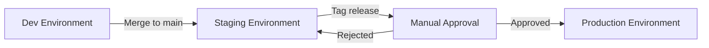

# CI/CD Workflow Orchestration

## Overview

OdooOps Sh integrates with GitHub Actions to provide a complete CI/CD pipeline for Odoo CE projects. The system supports automated builds, tests, deployments, and rollbacks—all orchestrated through the `ops.*` control plane with real-time visibility in the Next.js console.

**Key Integration Points**:
- **GitHub Webhooks** → Supabase Edge Functions → Queue runs
- **GitHub Actions** → OdooOps workers → Execute workflows
- **GitHub Container Registry (GHCR)** → Store Docker images and SBOMs
- **GitHub Environments** → Deployment gates and approvals

## Pipeline Architecture

```mermaid
graph LR
    GIT[Git Push] --> WEBHOOK[GitHub Webhook]
    WEBHOOK --> EDGE[Edge Function]
    EDGE --> QUEUE[(ops.runs)]
    QUEUE --> GA[GitHub Actions Worker]
    GA --> BUILD[Build Image]
    BUILD --> TEST[Run Tests]
    TEST --> PUSH[Push to GHCR]
    PUSH --> DEPLOY[Deploy to Environment]
    DEPLOY --> HEALTH[Health Check]
    HEALTH --> FINISH[ops.finish_run]
```



## Workflow Types

### 1. Build Workflow

**Trigger**: Push to any branch, pull request opened/synchronized

**Purpose**: Build Docker image, run unit tests, generate SBOM

**GitHub Actions Workflow** (`.github/workflows/odooops-build.yml`):
```yaml
name: OdooOps Build

on:
  push:
    branches: ['**']
  pull_request:
    types: [opened, synchronize]

env:
  SUPABASE_URL: ${{ secrets.SUPABASE_URL }}
  SUPABASE_SERVICE_ROLE_KEY: ${{ secrets.SUPABASE_SERVICE_ROLE_KEY }}
  REGISTRY: ghcr.io
  IMAGE_NAME: ${{ github.repository }}

jobs:
  build:
    runs-on: ubuntu-latest
    permissions:
      contents: read
      packages: write

    steps:
      - name: Checkout code
        uses: actions/checkout@v4

      - name: Claim run from queue
        id: claim_run
        run: |
          RUN_JSON=$(curl -X POST "$SUPABASE_URL/rest/v1/rpc/claim_next_run" \
            -H "apikey: $SUPABASE_SERVICE_ROLE_KEY" \
            -H "Content-Type: application/json" \
            -d '{"p_worker_id": "gha-${{ github.run_id }}"}' | jq -r '.[0]')

          if [ "$RUN_JSON" = "null" ]; then
            echo "No queued runs available"
            exit 0
          fi

          echo "run_id=$(echo $RUN_JSON | jq -r '.run_id')" >> $GITHUB_OUTPUT
          echo "git_sha=$(echo $RUN_JSON | jq -r '.git_sha')" >> $GITHUB_OUTPUT

      - name: Set up Docker Buildx
        uses: docker/setup-buildx-action@v3

      - name: Log in to GHCR
        uses: docker/login-action@v3
        with:
          registry: ${{ env.REGISTRY }}
          username: ${{ github.actor }}
          password: ${{ secrets.GITHUB_TOKEN }}

      - name: Build and push Docker image
        id: build
        uses: docker/build-push-action@v5
        with:
          context: .
          push: true
          tags: |
            ${{ env.REGISTRY }}/${{ env.IMAGE_NAME }}:${{ steps.claim_run.outputs.git_sha }}
            ${{ env.REGISTRY }}/${{ env.IMAGE_NAME }}:${{ github.ref_name }}-latest
          cache-from: type=gha
          cache-to: type=gha,mode=max
          sbom: true
          provenance: true

      - name: Generate SBOM
        run: |
          docker buildx imagetools inspect \
            ${{ env.REGISTRY }}/${{ env.IMAGE_NAME }}:${{ steps.claim_run.outputs.git_sha }} \
            --format '{{ json .SBOM }}' > sbom.json

      - name: Upload SBOM artifact
        run: |
          curl -X POST "$SUPABASE_URL/rest/v1/rpc/add_artifact" \
            -H "apikey: $SUPABASE_SERVICE_ROLE_KEY" \
            -H "Content-Type: application/json" \
            -d '{
              "p_run_id": "${{ steps.claim_run.outputs.run_id }}",
              "p_artifact_type": "sbom",
              "p_storage_path": "s3://odooops-artifacts/${{ steps.claim_run.outputs.run_id }}/sbom.json",
              "p_digest": null,
              "p_size_bytes": '$(stat -f%z sbom.json)'
            }'

      - name: Run unit tests
        run: |
          curl -X POST "$SUPABASE_URL/rest/v1/rpc/append_event" \
            -H "apikey: $SUPABASE_SERVICE_ROLE_KEY" \
            -H "Content-Type: application/json" \
            -d '{
              "p_run_id": "${{ steps.claim_run.outputs.run_id }}",
              "p_level": "info",
              "p_message": "Running unit tests"
            }'

          docker run --rm \
            ${{ env.REGISTRY }}/${{ env.IMAGE_NAME }}:${{ steps.claim_run.outputs.git_sha }} \
            odoo -c /etc/odoo/odoo.conf -u all --test-enable --stop-after-init --log-level=test

      - name: Finish run (success)
        if: success()
        run: |
          curl -X POST "$SUPABASE_URL/rest/v1/rpc/finish_run" \
            -H "apikey: $SUPABASE_SERVICE_ROLE_KEY" \
            -H "Content-Type: application/json" \
            -d '{
              "p_run_id": "${{ steps.claim_run.outputs.run_id }}",
              "p_status": "success",
              "p_metadata": {
                "image": "${{ env.REGISTRY }}/${{ env.IMAGE_NAME }}:${{ steps.claim_run.outputs.git_sha }}",
                "digest": "${{ steps.build.outputs.digest }}",
                "workflow_run_id": "${{ github.run_id }}"
              }
            }'

      - name: Finish run (failed)
        if: failure()
        run: |
          curl -X POST "$SUPABASE_URL/rest/v1/rpc/finish_run" \
            -H "apikey: $SUPABASE_SERVICE_ROLE_KEY" \
            -H "Content-Type: application/json" \
            -d '{
              "p_run_id": "${{ steps.claim_run.outputs.run_id }}",
              "p_status": "failed",
              "p_metadata": {
                "error": "Build or test failed",
                "workflow_run_id": "${{ github.run_id }}"
              }
            }'
```

### 2. Deploy Workflow

**Trigger**: Successful build on protected branch (main, release/*)

**Purpose**: Deploy Docker image to environment, run health checks

**GitHub Actions Workflow** (`.github/workflows/odooops-deploy.yml`):
```yaml
name: OdooOps Deploy

on:
  workflow_run:
    workflows: ["OdooOps Build"]
    types: [completed]
    branches: [main, 'release/**']

env:
  SUPABASE_URL: ${{ secrets.SUPABASE_URL }}
  SUPABASE_SERVICE_ROLE_KEY: ${{ secrets.SUPABASE_SERVICE_ROLE_KEY }}
  DO_TOKEN: ${{ secrets.DO_TOKEN }}

jobs:
  deploy:
    runs-on: ubuntu-latest
    if: ${{ github.event.workflow_run.conclusion == 'success' }}

    steps:
      - name: Queue deploy run
        id: queue_deploy
        run: |
          # Determine environment from branch
          BRANCH="${{ github.ref_name }}"
          if [ "$BRANCH" = "main" ]; then
            ENV="staging"
          elif [[ "$BRANCH" == release/* ]]; then
            ENV="prod"
          else
            ENV="dev"
          fi

          RUN_JSON=$(curl -X POST "$SUPABASE_URL/rest/v1/rpc/queue_run" \
            -H "apikey: $SUPABASE_SERVICE_ROLE_KEY" \
            -H "Content-Type: application/json" \
            -d '{
              "p_project_id": "proj-odoo-ce",
              "p_env": "'"$ENV"'",
              "p_git_sha": "${{ github.sha }}",
              "p_git_ref": "${{ github.ref_name }}",
              "p_metadata": {
                "workflow": "deploy",
                "triggered_by": "${{ github.actor }}"
              }
            }' | jq -r '.[0]')

          echo "run_id=$(echo $RUN_JSON | jq -r '.run_id')" >> $GITHUB_OUTPUT
          echo "env=$ENV" >> $GITHUB_OUTPUT

      - name: Install doctl
        uses: digitalocean/action-doctl@v2
        with:
          token: ${{ secrets.DO_TOKEN }}

      - name: Deploy to DigitalOcean
        run: |
          # Get environment configuration
          ENV_CONFIG=$(curl "$SUPABASE_URL/rest/v1/environments?env_type=eq.${{ steps.queue_deploy.outputs.env }}" \
            -H "apikey: $SUPABASE_SERVICE_ROLE_KEY" | jq -r '.[0]')

          DB_NAME=$(echo $ENV_CONFIG | jq -r '.db_name')
          DROPLET_ID=$(echo $ENV_CONFIG | jq -r '.config.droplet_id')

          # Update Docker image on droplet
          doctl compute ssh $DROPLET_ID --ssh-command "
            docker pull ghcr.io/${{ github.repository }}:${{ github.sha }} &&
            docker stop odoo-$DB_NAME || true &&
            docker rm odoo-$DB_NAME || true &&
            docker run -d --name odoo-$DB_NAME \
              -p 8069:8069 \
              -e POSTGRES_HOST=localhost \
              -e POSTGRES_DB=$DB_NAME \
              ghcr.io/${{ github.repository }}:${{ github.sha }}
          "

      - name: Health check
        run: |
          ENV_CONFIG=$(curl "$SUPABASE_URL/rest/v1/environments?env_type=eq.${{ steps.queue_deploy.outputs.env }}" \
            -H "apikey: $SUPABASE_SERVICE_ROLE_KEY" | jq -r '.[0]')

          DEPLOY_URL=$(echo $ENV_CONFIG | jq -r '.config.deploy_url')

          for i in {1..30}; do
            if curl -f "$DEPLOY_URL/web/health" > /dev/null 2>&1; then
              echo "Health check passed"
              exit 0
            fi
            echo "Waiting for service to be ready... ($i/30)"
            sleep 10
          done

          echo "Health check failed after 5 minutes"
          exit 1

      - name: Finish deploy run
        if: always()
        run: |
          STATUS=${{ job.status == 'success' && 'success' || 'failed' }}

          curl -X POST "$SUPABASE_URL/rest/v1/rpc/finish_run" \
            -H "apikey: $SUPABASE_SERVICE_ROLE_KEY" \
            -H "Content-Type: application/json" \
            -d '{
              "p_run_id": "${{ steps.queue_deploy.outputs.run_id }}",
              "p_status": "'"$STATUS"'",
              "p_metadata": {
                "environment": "${{ steps.queue_deploy.outputs.env }}",
                "deploy_url": "https://${{ steps.queue_deploy.outputs.env }}.example.com"
              }
            }'
```

### 3. Backup Workflow

**Trigger**: Scheduled (daily at 2 AM UTC)

**Purpose**: Create database backup, upload to S3

**GitHub Actions Workflow** (`.github/workflows/odooops-backup.yml`):
```yaml
name: OdooOps Backup

on:
  schedule:
    - cron: '0 2 * * *'  # Daily at 2 AM UTC
  workflow_dispatch:
    inputs:
      backup_type:
        description: 'Backup type'
        required: true
        default: 'manual'
        type: choice
        options:
          - manual
          - daily
          - weekly
          - monthly

env:
  SUPABASE_URL: ${{ secrets.SUPABASE_URL }}
  SUPABASE_SERVICE_ROLE_KEY: ${{ secrets.SUPABASE_SERVICE_ROLE_KEY }}
  DO_TOKEN: ${{ secrets.DO_TOKEN }}
  S3_BUCKET: odooops-backups
  AWS_ACCESS_KEY_ID: ${{ secrets.AWS_ACCESS_KEY_ID }}
  AWS_SECRET_ACCESS_KEY: ${{ secrets.AWS_SECRET_ACCESS_KEY }}

jobs:
  backup:
    runs-on: ubuntu-latest

    strategy:
      matrix:
        environment: [staging, prod]

    steps:
      - name: Create backup record
        id: create_backup
        run: |
          BACKUP_TYPE="${{ github.event.inputs.backup_type || 'daily' }}"

          BACKUP_JSON=$(curl -X POST "$SUPABASE_URL/rest/v1/rpc/create_backup" \
            -H "apikey: $SUPABASE_SERVICE_ROLE_KEY" \
            -H "Content-Type: application/json" \
            -d '{
              "p_project_id": "proj-odoo-ce",
              "p_env": "${{ matrix.environment }}",
              "p_backup_type": "'"$BACKUP_TYPE"'",
              "p_metadata": {
                "triggered_by": "github_actions",
                "workflow_run_id": "${{ github.run_id }}"
              }
            }' | jq -r '.[0]')

          echo "backup_id=$(echo $BACKUP_JSON | jq -r '.backup_id')" >> $GITHUB_OUTPUT

      - name: Install doctl and AWS CLI
        run: |
          sudo snap install doctl
          sudo snap install aws-cli --classic
          doctl auth init --access-token $DO_TOKEN

      - name: Perform backup
        run: |
          # Get environment config
          ENV_CONFIG=$(curl "$SUPABASE_URL/rest/v1/environments?env_type=eq.${{ matrix.environment }}" \
            -H "apikey: $SUPABASE_SERVICE_ROLE_KEY" | jq -r '.[0]')

          DB_NAME=$(echo $ENV_CONFIG | jq -r '.db_name')
          DROPLET_ID=$(echo $ENV_CONFIG | jq -r '.config.droplet_id')
          BACKUP_ID="${{ steps.create_backup.outputs.backup_id }}"
          TIMESTAMP=$(date +%Y%m%d-%H%M%S)
          BACKUP_FILE="${DB_NAME}_${TIMESTAMP}.sql.gz"

          # Create database dump
          doctl compute ssh $DROPLET_ID --ssh-command "
            pg_dump -h localhost -U odoo -d $DB_NAME | gzip > /tmp/$BACKUP_FILE
          "

          # Copy to local
          doctl compute scp $DROPLET_ID:/tmp/$BACKUP_FILE ./$BACKUP_FILE

          # Upload to S3
          aws s3 cp ./$BACKUP_FILE s3://$S3_BUCKET/proj-odoo-ce/${{ matrix.environment }}/$BACKUP_FILE

          # Update backup record
          S3_PATH="s3://$S3_BUCKET/proj-odoo-ce/${{ matrix.environment }}/$BACKUP_FILE"
          SIZE=$(stat -c%s ./$BACKUP_FILE)

          curl -X PATCH "$SUPABASE_URL/rest/v1/backups?backup_id=eq.$BACKUP_ID" \
            -H "apikey: $SUPABASE_SERVICE_ROLE_KEY" \
            -H "Content-Type: application/json" \
            -H "Prefer: return=minimal" \
            -d '{
              "db_dump_path": "'"$S3_PATH"'",
              "size_bytes": '$SIZE'
            }'

      - name: Cleanup
        if: always()
        run: rm -f *.sql.gz
```

## Build Artifact Management

### Artifact Types

| Type | Storage | Retention | Example |
|------|---------|-----------|---------|
| **image** | GHCR | 90 days (untagged), indefinite (tagged) | `ghcr.io/org/odoo-ce:abc123` |
| **sbom** | S3 | 90 days | `s3://artifacts/run-123/sbom.json` |
| **logs** | S3 | 30 days | `s3://artifacts/run-123/build.log.gz` |
| **evidence** | S3 | 90 days | `s3://artifacts/run-123/deploy-evidence.json` |
| **manifest** | S3 | 90 days | `s3://artifacts/run-123/manifest.yaml` |

### Artifact Upload Pattern

```typescript
// In GitHub Actions job
const artifactData = {
    p_run_id: process.env.RUN_ID,
    p_artifact_type: 'image',
    p_storage_path: `ghcr.io/${process.env.GITHUB_REPOSITORY}:${process.env.GIT_SHA}`,
    p_digest: buildOutput.digest,
    p_size_bytes: buildOutput.size,
    p_metadata: {
        build_time_seconds: buildOutput.duration,
        layers: buildOutput.layers.length,
        compressed_size: buildOutput.compressedSize
    }
};

const response = await fetch(`${process.env.SUPABASE_URL}/rest/v1/rpc/add_artifact`, {
    method: 'POST',
    headers: {
        'apikey': process.env.SUPABASE_SERVICE_ROLE_KEY,
        'Content-Type': 'application/json'
    },
    body: JSON.stringify(artifactData)
});
```

### Artifact Cleanup Policy

```sql
-- Edge Function cron (daily at 3 AM)
CREATE OR REPLACE FUNCTION ops.cleanup_expired_artifacts()
RETURNS void AS $$
BEGIN
    -- Delete artifact metadata for expired artifacts
    DELETE FROM ops.artifacts
    WHERE created_at < NOW() - INTERVAL '90 days'
      AND artifact_type IN ('sbom', 'logs', 'evidence', 'manifest');

    -- Mark old runs for archival
    UPDATE ops.runs
    SET metadata = metadata || '{"archived": true}'::jsonb
    WHERE created_at < NOW() - INTERVAL '90 days'
      AND status IN ('success', 'failed', 'cancelled');
END;
$$ LANGUAGE plpgsql;
```

## Environment Promotion

### Dev → Staging → Production Flow



### Promotion Workflow

```yaml
# .github/workflows/odooops-promote.yml
name: OdooOps Promote

on:
  workflow_dispatch:
    inputs:
      source_env:
        description: 'Source environment'
        required: true
        type: choice
        options: [staging]
      target_env:
        description: 'Target environment'
        required: true
        type: choice
        options: [prod]
      git_sha:
        description: 'Git SHA to promote'
        required: true

jobs:
  promote:
    runs-on: ubuntu-latest
    environment: production  # Requires GitHub Environment approval

    steps:
      - name: Queue promotion run
        run: |
          curl -X POST "$SUPABASE_URL/rest/v1/rpc/queue_run" \
            -H "apikey: $SUPABASE_SERVICE_ROLE_KEY" \
            -H "Content-Type: application/json" \
            -d '{
              "p_project_id": "proj-odoo-ce",
              "p_env": "${{ github.event.inputs.target_env }}",
              "p_git_sha": "${{ github.event.inputs.git_sha }}",
              "p_git_ref": "promote-from-${{ github.event.inputs.source_env }}",
              "p_metadata": {
                "workflow": "promote",
                "source_env": "${{ github.event.inputs.source_env }}",
                "approved_by": "${{ github.actor }}"
              }
            }'

      # ... (same deploy steps as deploy workflow)
```

## GitHub Environments and Protection Rules

### Environment Configuration

```yaml
# Repository Settings → Environments
environments:
  - name: staging
    protection_rules:
      required_reviewers: 0  # Auto-deploy
      wait_timer: 0
    deployment_branch_policy:
      protected_branches: true
      custom_branch_policies: false

  - name: production
    protection_rules:
      required_reviewers: 2  # Requires 2 approvals
      wait_timer: 0
      prevent_self_review: true
    deployment_branch_policy:
      protected_branches: false
      custom_branch_policies: true
      custom_branches: ['release/**']
```

### Approval Integration with Supabase

```typescript
// Webhook handler for GitHub deployment approvals
// supabase/functions/github-approval-webhook/index.ts

import { serve } from 'https://deno.land/std@0.168.0/http/server.ts';
import { createClient } from 'https://esm.sh/@supabase/supabase-js@2';

serve(async (req) => {
    const payload = await req.json();

    if (payload.action === 'approved') {
        const supabase = createClient(Deno.env.get('SUPABASE_URL')!, Deno.env.get('SUPABASE_SERVICE_ROLE_KEY')!);

        // Find corresponding approval in Supabase
        const { data: approval } = await supabase
            .from('approvals')
            .select('*')
            .eq('metadata->>github_deployment_id', payload.deployment.id)
            .single();

        if (approval) {
            // Mark as approved
            await supabase
                .from('approvals')
                .update({
                    status: 'approved',
                    approved_by: payload.approver.login,
                    approved_at: new Date().toISOString()
                })
                .eq('approval_id', approval.approval_id);
        }
    }

    return new Response(JSON.stringify({ ok: true }));
});
```

## Rollback Strategies

### Automated Rollback on Health Check Failure

```yaml
# In deploy workflow
- name: Deploy and health check
  id: deploy
  run: |
    # Deploy new version
    ./deploy.sh ${{ github.sha }}

    # Health check
    if ! ./health_check.sh; then
      echo "Health check failed, rolling back"

      # Get previous successful deployment
      PREV_SHA=$(curl "$SUPABASE_URL/rest/v1/runs?project_id=eq.proj-odoo-ce&env_id=eq.env-prod&status=eq.success&order=finished_at.desc&limit=1" \
        -H "apikey: $SUPABASE_SERVICE_ROLE_KEY" | jq -r '.[0].git_sha')

      # Rollback to previous version
      ./deploy.sh $PREV_SHA

      # Log rollback event
      curl -X POST "$SUPABASE_URL/rest/v1/rpc/append_event" \
        -H "apikey: $SUPABASE_SERVICE_ROLE_KEY" \
        -H "Content-Type: application/json" \
        -d '{
          "p_run_id": "${{ steps.queue_deploy.outputs.run_id }}",
          "p_level": "error",
          "p_message": "Automatic rollback triggered due to health check failure",
          "p_payload": {"previous_sha": "'"$PREV_SHA"'"}
        }'

      exit 1
    fi
```

### Manual Rollback via Console

```typescript
// Next.js console: Rollback button
async function rollbackDeployment(runId: string) {
    // Get run details
    const { data: run } = await supabase
        .from('runs')
        .select('project_id, env_id')
        .eq('run_id', runId)
        .single();

    // Get previous successful deployment
    const { data: previousRun } = await supabase
        .from('runs')
        .select('git_sha, run_id')
        .eq('project_id', run.project_id)
        .eq('env_id', run.env_id)
        .eq('status', 'success')
        .neq('run_id', runId)
        .order('finished_at', { ascending: false })
        .limit(1)
        .single();

    if (!previousRun) {
        throw new Error('No previous successful deployment found');
    }

    // Queue rollback run
    const { data: rollbackRun } = await supabase.rpc('queue_run', {
        p_project_id: run.project_id,
        p_env: run.env_id,
        p_git_sha: previousRun.git_sha,
        p_git_ref: `rollback-from-${runId}`,
        p_metadata: {
            workflow: 'rollback',
            rollback_from: runId,
            rollback_to: previousRun.run_id,
            triggered_by: 'manual'
        }
    });

    return rollbackRun;
}
```

## Monitoring and Alerting

### CI/CD Metrics Dashboard

```sql
-- GitHub Actions success rate (last 7 days)
SELECT
    DATE(created_at) AS date,
    COUNT(*) FILTER (WHERE status = 'success') AS successful_runs,
    COUNT(*) FILTER (WHERE status = 'failed') AS failed_runs,
    ROUND(100.0 * COUNT(*) FILTER (WHERE status = 'success') / COUNT(*), 2) AS success_rate
FROM ops.runs
WHERE metadata->>'workflow_run_id' IS NOT NULL
  AND created_at > NOW() - INTERVAL '7 days'
GROUP BY DATE(created_at)
ORDER BY date DESC;

-- Average build time by environment
SELECT
    e.env_type,
    AVG(EXTRACT(EPOCH FROM (r.finished_at - r.started_at))) AS avg_build_seconds
FROM ops.runs r
JOIN ops.environments e ON r.env_id = e.env_id
WHERE r.status IN ('success', 'failed')
  AND r.created_at > NOW() - INTERVAL '30 days'
GROUP BY e.env_type;
```

### Slack Notifications

```typescript
// Edge Function: ops-slack-notifier
import { serve } from 'https://deno.land/std@0.168.0/http/server.ts';

serve(async (req) => {
    const { run_id, status, metadata } = await req.json();

    // Only notify on production deployments and failures
    if (metadata.environment === 'prod' || status === 'failed') {
        await fetch(Deno.env.get('SLACK_WEBHOOK_URL')!, {
            method: 'POST',
            headers: { 'Content-Type': 'application/json' },
            body: JSON.stringify({
                text: `Deployment ${status}`,
                blocks: [
                    {
                        type: 'section',
                        text: {
                            type: 'mrkdwn',
                            text: `*${metadata.environment}* deployment ${status}\n*Run ID*: ${run_id}\n*Git SHA*: ${metadata.git_sha}`
                        }
                    },
                    {
                        type: 'actions',
                        elements: [
                            {
                                type: 'button',
                                text: { type: 'plain_text', text: 'View Logs' },
                                url: `https://console.example.com/runs/${run_id}`
                            }
                        ]
                    }
                ]
            })
        });
    }

    return new Response(JSON.stringify({ ok: true }));
});
```

## References

- **GitHub Actions Workflows**: `.github/workflows/odooops-*.yml`
- **Edge Functions**: `supabase/functions/ops-ingest/`, `ops-monitor/`
- **CLI Scripts**: `scripts/odooops/env_*.sh`
- **Spec Bundle**: `spec/odooops-sh/plan.md` (Week 4: CI Integration section)
