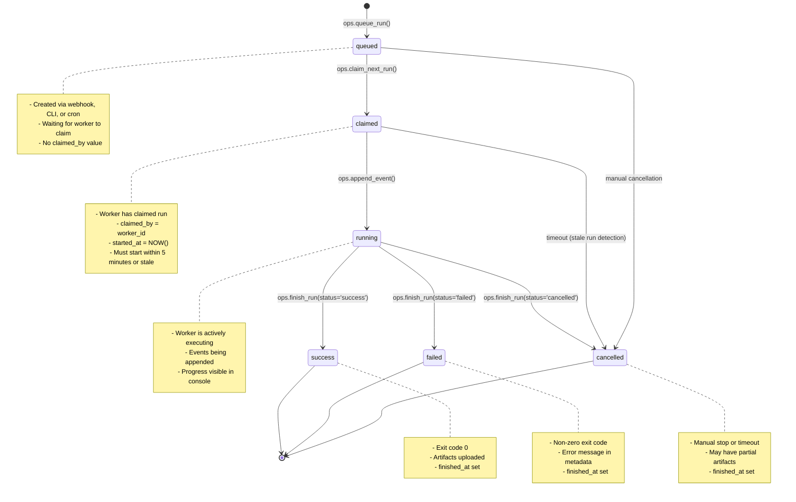

# Run Lifecycle State Machine

## Overview

The OdooOps Sh run lifecycle is a state machine that tracks the progression of build/deploy/backup operations from initial queueing through final completion or failure. The state machine is implemented in the `ops.runs` table with state transitions enforced by RPC functions and database triggers.

**Core Design Principles**:
- **Atomic State Transitions**: Each state change is a single database transaction
- **Idempotency**: Replaying a transition is safe (no duplicate side effects)
- **Append-Only Events**: All state changes logged to `ops.run_events` (immutable audit trail)
- **Worker Isolation**: Workers can only claim unclaimed runs (no conflicts)

## State Machine Diagram



## State Definitions

### `queued`

**Description**: Run is waiting in queue for a worker to claim it.

**Entry Conditions**:
- User calls `ops.queue_run(project_id, env, git_sha, git_ref, metadata)`
- GitHub webhook triggers Edge Function which queues run
- Cron job creates scheduled backup run

**Characteristics**:
- `claimed_by` is `NULL`
- `started_at` is `NULL`
- `finished_at` is `NULL`
- `status` = `'queued'`

**Exit Transitions**:
- → `claimed` when worker calls `ops.claim_next_run(worker_id)`
- → `cancelled` when user manually cancels or run expires

**SQL Example**:
```sql
-- Create queued run
SELECT * FROM ops.queue_run(
    p_project_id := 'proj-123',
    p_env := 'staging',
    p_git_sha := 'abc123def456',
    p_git_ref := 'main',
    p_metadata := '{"trigger": "webhook", "author": "john@example.com"}'::jsonb
);

-- Result:
--  run_id        | status  | queued_at
-- ---------------+---------+-------------------------
--  run-uuid-1234 | queued  | 2026-02-14 10:30:00+00
```

### `claimed`

**Description**: Worker has claimed the run and is preparing to execute it.

**Entry Conditions**:
- Worker calls `ops.claim_next_run(worker_id)` and receives this run
- Database uses `FOR UPDATE SKIP LOCKED` to prevent race conditions

**Characteristics**:
- `claimed_by` = `worker-001` (worker ID)
- `started_at` = `NOW()` (timestamp when claimed)
- `status` = `'claimed'`
- **Timeout**: If no events appended within 5 minutes, considered stale

**Exit Transitions**:
- → `running` when worker calls `ops.append_event()` (automatic transition)
- → `cancelled` if stale run detector marks it as timeout

**SQL Example**:
```sql
-- Worker claims next run
SELECT * FROM ops.claim_next_run(p_worker_id := 'worker-001');

-- Result:
--  run_id        | project_id | env_id    | git_sha      | git_ref | metadata
-- ---------------+------------+-----------+--------------+---------+----------
--  run-uuid-1234 | proj-123   | env-stg-1 | abc123def456 | main    | {...}

-- Database state after claim:
SELECT run_id, status, claimed_by, started_at
FROM ops.runs
WHERE run_id = 'run-uuid-1234';

--  run_id        | status  | claimed_by  | started_at
-- ---------------+---------+-------------+-------------------------
--  run-uuid-1234 | claimed | worker-001  | 2026-02-14 10:30:15+00
```

**Worker Claiming Logic (Concurrency-Safe)**:
```sql
-- Simplified version of ops.claim_next_run()
SELECT run_id INTO v_run_id
FROM ops.runs
WHERE status = 'queued'
ORDER BY queued_at
LIMIT 1
FOR UPDATE SKIP LOCKED;  -- Key to preventing race conditions

UPDATE ops.runs
SET status = 'claimed',
    claimed_by = p_worker_id,
    started_at = NOW()
WHERE run_id = v_run_id;
```

**`FOR UPDATE SKIP LOCKED` Behavior**:
- Worker 1 acquires lock on first queued run
- Worker 2's query skips locked row, gets second queued run
- Worker 3's query skips locked rows, gets third queued run
- No workers receive the same run (guaranteed by PostgreSQL)

### `running`

**Description**: Worker is actively executing the workflow (building, deploying, testing).

**Entry Conditions**:
- Worker calls `ops.append_event()` for the first time after claiming
- Automatic transition when `status = 'claimed'` and event is appended

**Characteristics**:
- `status` = `'running'`
- Events actively being appended to `ops.run_events`
- Progress visible in real-time via Supabase Realtime subscriptions

**Exit Transitions**:
- → `success` when worker calls `ops.finish_run(run_id, 'success')`
- → `failed` when worker calls `ops.finish_run(run_id, 'failed')`
- → `cancelled` when worker calls `ops.finish_run(run_id, 'cancelled')`

**SQL Example**:
```sql
-- Worker appends first event (triggers transition to 'running')
SELECT ops.append_event(
    p_run_id := 'run-uuid-1234',
    p_level := 'info',
    p_message := 'Starting build process',
    p_payload := '{"step": "build", "docker_image": "odoo-ce:19.0"}'::jsonb
);

-- Database state after append:
SELECT run_id, status FROM ops.runs WHERE run_id = 'run-uuid-1234';

--  run_id        | status
-- ---------------+---------
--  run-uuid-1234 | running
```

**Automatic Transition Logic (in `ops.append_event`)**:
```sql
-- Update run status to 'running' if still 'claimed'
UPDATE ops.runs
SET status = 'running',
    updated_at = NOW()
WHERE run_id = p_run_id
  AND status = 'claimed';  -- Only transition if not already running
```

### `success`

**Description**: Run completed successfully with exit code 0.

**Entry Conditions**:
- Worker calls `ops.finish_run(run_id, 'success', metadata)`
- All artifacts uploaded to GHCR/S3

**Characteristics**:
- `status` = `'success'`
- `finished_at` = `NOW()`
- `metadata` contains success details (artifacts, deploy URL, health check results)

**Exit Transitions**: None (terminal state)

**SQL Example**:
```sql
-- Worker finishes run successfully
SELECT ops.finish_run(
    p_run_id := 'run-uuid-1234',
    p_status := 'success',
    p_metadata := '{
        "exit_code": 0,
        "artifacts": [
            {"type": "image", "url": "ghcr.io/org/odoo-ce:abc123"},
            {"type": "sbom", "url": "s3://bucket/run-uuid-1234/sbom.json"}
        ],
        "deploy_url": "https://staging.example.com",
        "health_check": "passed"
    }'::jsonb
);

-- Database state:
SELECT run_id, status, finished_at, metadata->'exit_code'
FROM ops.runs
WHERE run_id = 'run-uuid-1234';

--  run_id        | status  | finished_at            | exit_code
-- ---------------+---------+------------------------+-----------
--  run-uuid-1234 | success | 2026-02-14 10:45:30+00 | 0
```

### `failed`

**Description**: Run failed with non-zero exit code or error.

**Entry Conditions**:
- Worker calls `ops.finish_run(run_id, 'failed', metadata)`
- Error occurred during build, deploy, or health check

**Characteristics**:
- `status` = `'failed'`
- `finished_at` = `NOW()`
- `metadata` contains error details (exit code, error message, stack trace)

**Exit Transitions**: None (terminal state)

**SQL Example**:
```sql
-- Worker finishes run with failure
SELECT ops.finish_run(
    p_run_id := 'run-uuid-1234',
    p_status := 'failed',
    p_metadata := '{
        "exit_code": 1,
        "error": "Docker build failed",
        "step": "build",
        "stderr": "ERROR: Cannot find Dockerfile",
        "retry_count": 0
    }'::jsonb
);

-- Database state:
SELECT run_id, status, metadata->>'error' AS error_message
FROM ops.runs
WHERE run_id = 'run-uuid-1234';

--  run_id        | status | error_message
-- ---------------+--------+--------------------
--  run-uuid-1234 | failed | Docker build failed
```

### `cancelled`

**Description**: Run was manually stopped or timed out.

**Entry Conditions**:
- User manually cancels via console/CLI
- Stale run detector marks claimed-but-not-started runs as cancelled
- Worker calls `ops.finish_run(run_id, 'cancelled')`

**Characteristics**:
- `status` = `'cancelled'`
- `finished_at` = `NOW()`
- `metadata` contains cancellation reason

**Exit Transitions**: None (terminal state)

**SQL Example**:
```sql
-- Manual cancellation
SELECT ops.finish_run(
    p_run_id := 'run-uuid-1234',
    p_status := 'cancelled',
    p_metadata := '{
        "cancelled_by": "user-456",
        "reason": "Manual stop via console",
        "timestamp": "2026-02-14T10:35:00Z"
    }'::jsonb
);

-- Stale run auto-cancellation (via Edge Function cron)
UPDATE ops.runs
SET status = 'cancelled',
    finished_at = NOW(),
    metadata = metadata || '{
        "cancelled_by": "system",
        "reason": "Stale run (claimed for >5 minutes without events)"
    }'::jsonb
WHERE status = 'claimed'
  AND started_at < NOW() - INTERVAL '5 minutes';
```

## Worker Claiming Logic

### Atomic Claim Operation

**Challenge**: Multiple workers trying to claim the same run.

**Solution**: PostgreSQL row-level locking with `FOR UPDATE SKIP LOCKED`.

**Full `ops.claim_next_run` Implementation**:
```sql
CREATE OR REPLACE FUNCTION ops.claim_next_run(p_worker_id TEXT)
RETURNS TABLE (run_id TEXT, project_id TEXT, env_id TEXT, git_sha TEXT, git_ref TEXT, metadata JSONB)
AS $$
DECLARE
    v_run_id TEXT;
BEGIN
    -- Find and claim next queued run (with row-level locking)
    SELECT r.run_id INTO v_run_id
    FROM ops.runs r
    WHERE r.status = 'queued'
    ORDER BY r.queued_at
    LIMIT 1
    FOR UPDATE SKIP LOCKED;  -- Critical for concurrency safety

    IF v_run_id IS NULL THEN
        RETURN;  -- No queued runs available
    END IF;

    -- Claim the run
    UPDATE ops.runs
    SET status = 'claimed',
        claimed_by = p_worker_id,
        started_at = NOW(),
        updated_at = NOW()
    WHERE ops.runs.run_id = v_run_id;

    -- Log event
    INSERT INTO ops.run_events (run_id, level, message, payload)
    VALUES (v_run_id, 'info', 'Run claimed by worker', jsonb_build_object('worker_id', p_worker_id));

    -- Return claimed run
    RETURN QUERY
    SELECT r.run_id, r.project_id, r.env_id, r.git_sha, r.git_ref, r.metadata
    FROM ops.runs r
    WHERE r.run_id = v_run_id;
END;
$$ LANGUAGE plpgsql SECURITY DEFINER;
```

### Concurrency Example

**Scenario**: 3 workers claim from queue with 5 runs.

```sql
-- Initial state (5 queued runs)
SELECT run_id, status, queued_at FROM ops.runs WHERE status = 'queued' ORDER BY queued_at;

--  run_id   | status  | queued_at
-- ----------+---------+-------------------------
--  run-001  | queued  | 2026-02-14 10:00:00+00
--  run-002  | queued  | 2026-02-14 10:01:00+00
--  run-003  | queued  | 2026-02-14 10:02:00+00
--  run-004  | queued  | 2026-02-14 10:03:00+00
--  run-005  | queued  | 2026-02-14 10:04:00+00

-- Time T0: All 3 workers call ops.claim_next_run() simultaneously
-- Worker 1: FOR UPDATE SKIP LOCKED acquires lock on run-001
-- Worker 2: FOR UPDATE SKIP LOCKED skips run-001 (locked), acquires lock on run-002
-- Worker 3: FOR UPDATE SKIP LOCKED skips run-001 and run-002 (locked), acquires lock on run-003

-- Time T1: All 3 workers complete their UPDATE statements
SELECT run_id, status, claimed_by FROM ops.runs ORDER BY queued_at;

--  run_id   | status  | claimed_by
-- ----------+---------+-------------
--  run-001  | claimed | worker-001
--  run-002  | claimed | worker-002
--  run-003  | claimed | worker-003
--  run-004  | queued  | NULL
--  run-005  | queued  | NULL
```

**No duplicate claims**: Each worker receives a unique run. No conflicts. No retries needed.

## Idempotency Guarantees

### Challenge: Workers May Retry Operations

**Problem**: Network failures, worker crashes, duplicate webhook deliveries.

**Solution**: Idempotency keys and state checks.

### Idempotent Run Creation

```sql
-- Add unique constraint on idempotency key
ALTER TABLE ops.runs ADD COLUMN idempotency_key TEXT UNIQUE;

-- Modified ops.queue_run with idempotency
CREATE OR REPLACE FUNCTION ops.queue_run(
    p_project_id TEXT,
    p_env TEXT,
    p_git_sha TEXT,
    p_git_ref TEXT,
    p_metadata JSONB DEFAULT '{}'::jsonb,
    p_idempotency_key TEXT DEFAULT NULL  -- NEW
)
RETURNS TABLE (run_id TEXT, status TEXT, queued_at TIMESTAMPTZ)
AS $$
DECLARE
    v_run_id TEXT;
    v_existing_run RECORD;
BEGIN
    -- Check for existing run with same idempotency key
    IF p_idempotency_key IS NOT NULL THEN
        SELECT * INTO v_existing_run FROM ops.runs WHERE idempotency_key = p_idempotency_key;

        IF FOUND THEN
            -- Return existing run (no-op)
            RETURN QUERY
            SELECT r.run_id, r.status, r.queued_at
            FROM ops.runs r
            WHERE r.idempotency_key = p_idempotency_key;
            RETURN;
        END IF;
    END IF;

    -- Proceed with normal run creation
    v_run_id := 'run-' || gen_random_uuid()::text;

    INSERT INTO ops.runs (run_id, project_id, env_id, git_sha, git_ref, status, idempotency_key, metadata)
    VALUES (v_run_id, p_project_id, ..., p_idempotency_key, p_metadata);

    -- ... rest of function
END;
$$ LANGUAGE plpgsql SECURITY DEFINER;
```

**Usage**:
```bash
# CLI script with idempotency
IDEMPOTENCY_KEY="deploy-$(git rev-parse HEAD)-$(date +%s)"

psql "$SUPABASE_DB_URL" -c "
SELECT * FROM ops.queue_run(
    'proj-123',
    'staging',
    '$(git rev-parse HEAD)',
    'main',
    '{}'::jsonb,
    '$IDEMPOTENCY_KEY'
);
"

# If script runs twice, second call returns existing run (no duplicate)
```

### Idempotent Event Appending

**Problem**: Worker retries `append_event` on network failure.

**Solution**: Check for duplicate events within time window.

```sql
CREATE OR REPLACE FUNCTION ops.append_event(
    p_run_id TEXT,
    p_level TEXT,
    p_message TEXT,
    p_payload JSONB DEFAULT '{}'::jsonb
)
RETURNS TEXT AS $$
DECLARE
    v_event_id TEXT;
    v_duplicate_count INTEGER;
BEGIN
    -- Check for recent duplicate events (within 10 seconds)
    SELECT COUNT(*) INTO v_duplicate_count
    FROM ops.run_events
    WHERE run_id = p_run_id
      AND level = p_level
      AND message = p_message
      AND created_at > NOW() - INTERVAL '10 seconds';

    IF v_duplicate_count > 0 THEN
        -- Duplicate event, return existing event_id
        SELECT event_id INTO v_event_id
        FROM ops.run_events
        WHERE run_id = p_run_id AND level = p_level AND message = p_message
        ORDER BY created_at DESC
        LIMIT 1;

        RETURN v_event_id;
    END IF;

    -- Insert new event
    INSERT INTO ops.run_events (run_id, level, message, payload)
    VALUES (p_run_id, p_level, p_message, p_payload)
    RETURNING event_id INTO v_event_id;

    RETURN v_event_id;
END;
$$ LANGUAGE plpgsql SECURITY DEFINER;
```

## Error Handling and Retries

### Worker Retry Logic

**Strategy**: Exponential backoff with maximum retry count.

**Implementation**:
```bash
#!/bin/bash
# Worker script: scripts/odooops/worker_execute.sh

MAX_RETRIES=3
RETRY_COUNT=0
BACKOFF_SECONDS=5

while [ $RETRY_COUNT -lt $MAX_RETRIES ]; do
    # Claim run
    RUN_JSON=$(psql "$SUPABASE_DB_URL" -t -A -c "
        SELECT row_to_json(r) FROM (
            SELECT * FROM ops.claim_next_run('worker-$(hostname)')
        ) r;
    ")

    if [ -z "$RUN_JSON" ]; then
        echo "No queued runs available"
        exit 0
    fi

    RUN_ID=$(echo "$RUN_JSON" | jq -r '.run_id')
    GIT_SHA=$(echo "$RUN_JSON" | jq -r '.git_sha')

    # Execute workflow
    if execute_workflow "$RUN_ID" "$GIT_SHA"; then
        # Success
        psql "$SUPABASE_DB_URL" -c "SELECT ops.finish_run('$RUN_ID', 'success');"
        exit 0
    else
        # Failure
        RETRY_COUNT=$((RETRY_COUNT + 1))

        if [ $RETRY_COUNT -lt $MAX_RETRIES ]; then
            echo "Retry $RETRY_COUNT/$MAX_RETRIES in $BACKOFF_SECONDS seconds..."
            sleep $BACKOFF_SECONDS
            BACKOFF_SECONDS=$((BACKOFF_SECONDS * 2))  # Exponential backoff
        else
            echo "Max retries exceeded, marking as failed"
            psql "$SUPABASE_DB_URL" -c "
                SELECT ops.finish_run('$RUN_ID', 'failed', '{
                    \"error\": \"Max retries exceeded\",
                    \"retry_count\": $RETRY_COUNT
                }'::jsonb);
            "
            exit 1
        fi
    fi
done
```

### Stale Run Detection

**Problem**: Worker claims run but crashes before appending events.

**Solution**: Edge Function cron job detects stale runs.

**Implementation**:
```typescript
// supabase/functions/ops-monitor/index.ts
import { serve } from 'https://deno.land/std@0.168.0/http/server.ts';
import { createClient } from 'https://esm.sh/@supabase/supabase-js@2';

serve(async (req) => {
    const supabase = createClient(Deno.env.get('SUPABASE_URL')!, Deno.env.get('SUPABASE_SERVICE_ROLE_KEY')!);

    // Find stale runs (claimed for >5 minutes without events)
    const { data: staleRuns } = await supabase
        .from('runs')
        .select('run_id, claimed_by, started_at')
        .eq('status', 'claimed')
        .lt('started_at', new Date(Date.now() - 5 * 60 * 1000).toISOString());

    for (const run of staleRuns || []) {
        // Mark as cancelled
        await supabase.rpc('finish_run', {
            p_run_id: run.run_id,
            p_status: 'cancelled',
            p_metadata: {
                cancelled_by: 'system',
                reason: 'Stale run (claimed for >5 minutes without events)',
                original_worker: run.claimed_by,
                claimed_at: run.started_at
            }
        });

        console.log(`Cancelled stale run: ${run.run_id}`);
    }

    return new Response(JSON.stringify({ cancelled: staleRuns?.length || 0 }));
});
```

**Cron Schedule**: Every 5 minutes.

## Monitoring and Observability

### Key Metrics

```sql
-- Queue depth (number of queued runs)
SELECT COUNT(*) AS queued_count
FROM ops.runs
WHERE status = 'queued';

-- Worker utilization (claimed runs not yet finished)
SELECT claimed_by, COUNT(*) AS active_runs
FROM ops.runs
WHERE status IN ('claimed', 'running')
GROUP BY claimed_by;

-- Success rate (last 24 hours)
SELECT
    COUNT(*) FILTER (WHERE status = 'success') AS success_count,
    COUNT(*) FILTER (WHERE status = 'failed') AS failed_count,
    ROUND(100.0 * COUNT(*) FILTER (WHERE status = 'success') / NULLIF(COUNT(*), 0), 2) AS success_rate
FROM ops.runs
WHERE created_at > NOW() - INTERVAL '24 hours'
  AND status IN ('success', 'failed');

-- Average run duration by status
SELECT
    status,
    AVG(EXTRACT(EPOCH FROM (finished_at - started_at))) AS avg_duration_seconds
FROM ops.runs
WHERE finished_at IS NOT NULL
  AND created_at > NOW() - INTERVAL '7 days'
GROUP BY status;
```

### Real-Time Monitoring (Next.js Console)

```typescript
// Subscribe to run status changes
import { createClient } from '@supabase/supabase-js';

const supabase = createClient(SUPABASE_URL, SUPABASE_ANON_KEY);

supabase
    .channel('run-updates')
    .on('postgres_changes', {
        event: 'UPDATE',
        schema: 'ops',
        table: 'runs',
        filter: 'status=in.(running,success,failed)'
    }, (payload) => {
        console.log('Run status changed:', payload.new);
        // Update UI with new status
    })
    .subscribe();
```

## References

- **RPC Functions**: `supabase/migrations/20260214_000006_ops_rpcs.sql`
- **State Machine Tests**: `scripts/odooops/test_state_machine.sh`
- **Worker Implementation**: `scripts/odooops/worker_execute.sh`
- **Stale Run Monitor**: `supabase/functions/ops-monitor/index.ts`
- **Spec Bundle**: `spec/odooops-sh/plan.md` (Week 3: RPC Functions section)
