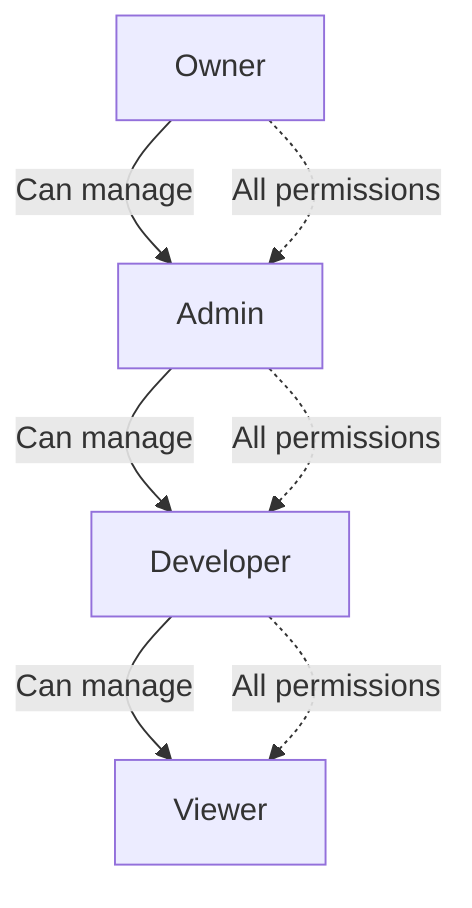

# OdooOps Sh Security Architecture

## Overview

OdooOps Sh implements defense-in-depth security with multiple layers of protection: Row Level Security (RLS) for database access control, role-based permissions (RBAC) for fine-grained authorization, `SECURITY DEFINER` functions for privilege escalation, and a comprehensive threat model to protect against common attack vectors.

**Security Principles**:
- **Least Privilege**: Users and workers have minimum necessary permissions
- **Defense in Depth**: Multiple security layers (RLS, RBAC, function security)
- **Audit Trail**: All security-relevant actions logged immutably
- **Zero Trust**: Verify every request, trust nothing by default

## User Roles and Permissions

### Role Hierarchy



### Role Definitions

**Schema** (`ops.roles`):
```sql
CREATE TABLE ops.roles (
    role_id TEXT PRIMARY KEY,
    role_name TEXT NOT NULL UNIQUE,
    description TEXT,
    permissions JSONB NOT NULL DEFAULT '[]'::jsonb,
    created_at TIMESTAMPTZ NOT NULL DEFAULT NOW()
);

-- Seed default roles
INSERT INTO ops.roles (role_id, role_name, description, permissions) VALUES
('role-owner', 'owner', 'Project owner with full control', '[
    "project:read", "project:update", "project:delete",
    "env:create", "env:update", "env:delete",
    "run:create", "run:update", "run:cancel", "run:logs",
    "backup:create", "backup:delete",
    "restore:staging", "restore:prod", "restore:approve",
    "member:add", "member:remove", "member:update",
    "agent:manage"
]'::jsonb),

('role-admin', 'admin', 'Administrator with deployment rights', '[
    "project:read", "project:update",
    "env:create", "env:update",
    "run:create", "run:update", "run:cancel", "run:logs",
    "backup:create",
    "restore:staging", "restore:prod",
    "member:add"
]'::jsonb),

('role-developer', 'developer', 'Developer with build/deploy rights', '[
    "project:read",
    "env:read",
    "run:create", "run:logs",
    "backup:create",
    "restore:staging"
]'::jsonb),

('role-viewer', 'viewer', 'Read-only access', '[
    "project:read",
    "env:read",
    "run:logs"
]'::jsonb);
```

### Permission Matrix

| Permission | Owner | Admin | Developer | Viewer |
|------------|-------|-------|-----------|--------|
| `project:read` | ✅ | ✅ | ✅ | ✅ |
| `project:update` | ✅ | ✅ | ❌ | ❌ |
| `project:delete` | ✅ | ❌ | ❌ | ❌ |
| `env:create` | ✅ | ✅ | ❌ | ❌ |
| `env:update` | ✅ | ✅ | ❌ | ❌ |
| `env:delete` | ✅ | ❌ | ❌ | ❌ |
| `run:create` | ✅ | ✅ | ✅ | ❌ |
| `run:update` | ✅ | ✅ | ❌ | ❌ |
| `run:cancel` | ✅ | ✅ | ❌ | ❌ |
| `run:logs` | ✅ | ✅ | ✅ | ✅ |
| `backup:create` | ✅ | ✅ | ✅ | ❌ |
| `backup:delete` | ✅ | ❌ | ❌ | ❌ |
| `restore:staging` | ✅ | ✅ | ✅ | ❌ |
| `restore:prod` | ✅ | ✅ | ❌ | ❌ |
| `restore:approve` | ✅ | ❌ | ❌ | ❌ |
| `member:add` | ✅ | ✅ | ❌ | ❌ |
| `member:remove` | ✅ | ❌ | ❌ | ❌ |
| `member:update` | ✅ | ❌ | ❌ | ❌ |
| `agent:manage` | ✅ | ❌ | ❌ | ❌ |

## Row Level Security (RLS) Policies

### RLS Overview

All `ops.*` tables have RLS enabled. Users can only access data for projects they're members of, filtered by their assigned role.

**Key RLS Functions**:
```sql
-- Get current user's project memberships
CREATE OR REPLACE FUNCTION ops.current_user_projects()
RETURNS SETOF TEXT AS $$
BEGIN
    RETURN QUERY
    SELECT project_id
    FROM ops.project_members
    WHERE user_id = auth.uid()::text;
END;
$$ LANGUAGE plpgsql SECURITY DEFINER;

-- Check if user is project member
CREATE OR REPLACE FUNCTION ops.is_project_member(p_project_id TEXT)
RETURNS BOOLEAN AS $$
BEGIN
    RETURN EXISTS (
        SELECT 1
        FROM ops.project_members
        WHERE project_id = p_project_id
          AND user_id = auth.uid()::text
    );
END;
$$ LANGUAGE plpgsql SECURITY DEFINER;

-- Check if user has specific permission
CREATE OR REPLACE FUNCTION ops.user_has_permission(
    p_user_id TEXT,
    p_project_id TEXT,
    p_permission TEXT
)
RETURNS BOOLEAN AS $$
DECLARE
    v_permissions JSONB;
BEGIN
    -- Get user's role for project
    SELECT r.permissions INTO v_permissions
    FROM ops.project_members pm
    JOIN ops.roles r ON pm.role_id = r.role_id
    WHERE pm.user_id = p_user_id
      AND pm.project_id = p_project_id;

    IF v_permissions IS NULL THEN
        RETURN FALSE;
    END IF;

    -- Check if permission exists in role's permissions array
    RETURN v_permissions ? p_permission;
END;
$$ LANGUAGE plpgsql SECURITY DEFINER;
```

### RLS Policies by Table

#### `ops.projects`

**SELECT Policy**: Members can view their assigned projects.
```sql
CREATE POLICY projects_select ON ops.projects
    FOR SELECT
    USING (project_id IN (SELECT ops.current_user_projects()));
```

**INSERT Policy**: Any authenticated user can create projects (becomes owner automatically).
```sql
CREATE POLICY projects_insert ON ops.projects
    FOR INSERT
    WITH CHECK (auth.uid() IS NOT NULL);

-- Trigger to auto-add creator as owner
CREATE OR REPLACE FUNCTION ops.projects_insert_trigger()
RETURNS TRIGGER AS $$
BEGIN
    INSERT INTO ops.project_members (project_id, user_id, role_id)
    VALUES (NEW.project_id, auth.uid()::text, 'role-owner');
    RETURN NEW;
END;
$$ LANGUAGE plpgsql SECURITY DEFINER;

CREATE TRIGGER projects_auto_owner
AFTER INSERT ON ops.projects
FOR EACH ROW
EXECUTE FUNCTION ops.projects_insert_trigger();
```

**UPDATE Policy**: Only users with `project:update` permission.
```sql
CREATE POLICY projects_update ON ops.projects
    FOR UPDATE
    USING (ops.user_has_permission(auth.uid()::text, project_id, 'project:update'));
```

#### `ops.runs`

**SELECT Policy**: Members can view runs for their projects.
```sql
CREATE POLICY runs_select ON ops.runs
    FOR SELECT
    USING (ops.is_project_member(project_id));
```

**INSERT Policy**: Users with `run:create` permission can queue runs.
```sql
CREATE POLICY runs_insert ON ops.runs
    FOR INSERT
    WITH CHECK (ops.user_has_permission(auth.uid()::text, project_id, 'run:create'));
```

**UPDATE Policy**: Users with `run:update` OR workers who claimed the run.
```sql
CREATE POLICY runs_update ON ops.runs
    FOR UPDATE
    USING (
        ops.user_has_permission(auth.uid()::text, project_id, 'run:update')
        OR claimed_by = auth.uid()::text
    );
```

#### `ops.run_events`

**SELECT Policy**: Members can view events for their project runs.
```sql
CREATE POLICY run_events_select ON ops.run_events
    FOR SELECT
    USING (
        EXISTS (
            SELECT 1 FROM ops.runs r
            WHERE r.run_id = ops.run_events.run_id
              AND ops.is_project_member(r.project_id)
        )
    );
```

**INSERT Policy**: Workers who claimed run OR users with `run:logs` permission.
```sql
CREATE POLICY run_events_insert ON ops.run_events
    FOR INSERT
    WITH CHECK (
        EXISTS (
            SELECT 1 FROM ops.runs r
            WHERE r.run_id = ops.run_events.run_id
              AND (
                  ops.user_has_permission(auth.uid()::text, r.project_id, 'run:logs')
                  OR r.claimed_by = auth.uid()::text
              )
        )
    );
```

#### `ops.backups`

**SELECT Policy**: Members can view backups for their projects.
```sql
CREATE POLICY backups_select ON ops.backups
    FOR SELECT
    USING (ops.is_project_member(project_id));
```

**INSERT Policy**: Users with `backup:create` permission.
```sql
CREATE POLICY backups_insert ON ops.backups
    FOR INSERT
    WITH CHECK (ops.user_has_permission(auth.uid()::text, project_id, 'backup:create'));
```

#### `ops.restores`

**SELECT Policy**: Members can view restores for their projects.
```sql
CREATE POLICY restores_select ON ops.restores
    FOR SELECT
    USING (
        EXISTS (
            SELECT 1 FROM ops.environments e
            WHERE e.env_id = ops.restores.target_env_id
              AND ops.is_project_member(e.project_id)
        )
    );
```

**INSERT Policy**: User is requester AND has permission for target environment.
```sql
CREATE POLICY restores_insert ON ops.restores
    FOR INSERT
    WITH CHECK (
        requested_by = auth.uid()::text
        AND EXISTS (
            SELECT 1 FROM ops.environments e
            WHERE e.env_id = target_env_id
              AND ops.user_has_permission(auth.uid()::text, e.project_id, 'restore:staging')
        )
    );
```

**UPDATE Policy**: Users with `restore:approve` permission (for approvals).
```sql
CREATE POLICY restores_update ON ops.restores
    FOR UPDATE
    USING (
        EXISTS (
            SELECT 1 FROM ops.environments e
            WHERE e.env_id = target_env_id
              AND ops.user_has_permission(auth.uid()::text, e.project_id, 'restore:approve')
        )
    );
```

## SECURITY DEFINER Functions

### Purpose

RPC functions use `SECURITY DEFINER` to execute with elevated privileges, bypassing RLS. This is necessary for:
- Cross-table operations (e.g., `queue_run` inserts into `runs` and `run_events`)
- Atomic transactions requiring multiple privilege checks
- System-level operations (e.g., worker claiming)

**Security Considerations**:
- ✅ Input validation to prevent SQL injection
- ✅ Permission checks within function body
- ✅ Minimal privilege escalation (only what's needed)
- ✅ Audit logging for security-relevant operations

### Secure Function Pattern

```sql
CREATE OR REPLACE FUNCTION ops.secure_operation(
    p_user_id TEXT,
    p_project_id TEXT,
    p_data JSONB
)
RETURNS TABLE (result TEXT) AS $$
BEGIN
    -- 1. Input validation
    IF p_user_id IS NULL OR p_project_id IS NULL THEN
        RAISE EXCEPTION 'user_id and project_id are required';
    END IF;

    IF NOT (p_project_id ~ '^proj-[a-z0-9-]+$') THEN
        RAISE EXCEPTION 'Invalid project_id format';
    END IF;

    -- 2. Permission check
    IF NOT ops.user_has_permission(p_user_id, p_project_id, 'required:permission') THEN
        RAISE EXCEPTION 'User % does not have required:permission for project %', p_user_id, p_project_id;
    END IF;

    -- 3. Perform operation
    -- ... (privileged operation here)

    -- 4. Audit log
    INSERT INTO ops.audit_log (action, user_id, project_id, metadata)
    VALUES ('secure_operation', p_user_id, p_project_id, p_data);

    -- 5. Return result
    RETURN QUERY SELECT 'success'::TEXT;
END;
$$ LANGUAGE plpgsql SECURITY DEFINER;

COMMENT ON FUNCTION ops.secure_operation IS 'Secure operation with permission checks and audit logging';
```

### Function Security Checklist

- [ ] Input validation (types, formats, required fields)
- [ ] SQL injection prevention (parameterized queries)
- [ ] Permission checks (before privileged operations)
- [ ] Audit logging (security-relevant actions)
- [ ] Error handling (don't leak sensitive info in error messages)
- [ ] Transaction safety (ROLLBACK on errors)

## API Authentication

### Supabase Auth Integration

**Authentication Flows**:
1. **Email/Password**: Standard username/password authentication
2. **OAuth Providers**: GitHub, Google, GitLab (for SSO)
3. **Service Role Key**: For workers and Edge Functions (bypasses RLS)

**Token Types**:
- **Anon Key**: Public API key for client-side applications (respects RLS)
- **Service Role Key**: Server-side API key with elevated privileges (bypasses RLS)

**Best Practices**:
- ✅ Use anon key for Next.js console (RLS protects data)
- ✅ Use service role key for workers (need unrestricted access)
- ✅ Store service role key in GitHub Secrets (never commit to git)
- ✅ Rotate keys quarterly

### Worker Authentication

**Pattern**: Workers authenticate using GitHub App credentials.

**Workflow**:
```yaml
# GitHub Actions workflow
jobs:
  worker:
    runs-on: ubuntu-latest
    steps:
      - name: Generate GitHub App token
        id: app_token
        uses: actions/create-github-app-token@v1
        with:
          app_id: ${{ secrets.GH_APP_ID }}
          private_key: ${{ secrets.GH_APP_PRIVATE_KEY }}

      - name: Claim run
        run: |
          # Use service role key for RPC call
          RUN_JSON=$(curl -X POST "$SUPABASE_URL/rest/v1/rpc/claim_next_run" \
            -H "apikey: ${{ secrets.SUPABASE_SERVICE_ROLE_KEY }}" \
            -H "Content-Type: application/json" \
            -d '{"p_worker_id": "gha-${{ github.run_id }}"}')
```

**Why GitHub App Instead of PAT**:
- ✅ Scoped permissions (only what's needed)
- ✅ Organization-wide installation
- ✅ Automatic token rotation
- ✅ Audit trail in GitHub

## Threat Model

### Threat 1: Unauthorized Access to Project Data

**Attack Vector**: Attacker gains access to Supabase anon key, attempts to query sensitive project data.

**Mitigation**:
- **RLS Policies**: User can only query projects they're members of
- **Permission Checks**: All operations validate `user_has_permission()`
- **Audit Logging**: All queries logged with user ID

**Residual Risk**: Low (RLS enforced at database level)

### Threat 2: Privilege Escalation

**Attack Vector**: Developer role user attempts to approve production restore.

**Mitigation**:
- **Role-Based Permissions**: `restore:approve` permission only for owner role
- **RLS UPDATE Policy**: `restores_update` checks `restore:approve` permission
- **Approval Workflow**: Production restores create approval record requiring owner action

**Residual Risk**: Very Low (multiple layers of permission checks)

### Threat 3: Worker Impersonation

**Attack Vector**: Attacker creates fake worker to claim runs and steal artifacts.

**Mitigation**:
- **Service Role Key Protection**: Key stored in GitHub Secrets, not exposed
- **Worker Registration**: Workers must be registered in `ops.agents` table
- **Agent Teams**: Workers assigned to teams, team membership verified
- **Audit Trail**: All worker claims logged to `ops.agent_events`

**Residual Risk**: Low (service role key compromise would be catastrophic, key rotation mitigates)

### Threat 4: SQL Injection in RPC Functions

**Attack Vector**: Attacker passes malicious input to RPC function, executes arbitrary SQL.

**Mitigation**:
- **Parameterized Queries**: All user input passed as function parameters (not concatenated)
- **Input Validation**: Format checks on all inputs (regex, type validation)
- **PL/pgSQL Safety**: PostgreSQL's type system prevents most injection attacks

**Example Vulnerable Function** (❌ DO NOT DO THIS):
```sql
-- VULNERABLE: Concatenating user input
CREATE OR REPLACE FUNCTION ops.bad_function(p_project_id TEXT)
RETURNS void AS $$
BEGIN
    EXECUTE 'SELECT * FROM ops.runs WHERE project_id = ' || p_project_id;  -- SQL INJECTION!
END;
$$ LANGUAGE plpgsql;
```

**Example Secure Function** (✅ CORRECT):
```sql
-- SECURE: Parameterized query
CREATE OR REPLACE FUNCTION ops.good_function(p_project_id TEXT)
RETURNS void AS $$
BEGIN
    PERFORM * FROM ops.runs WHERE project_id = p_project_id;  -- Safe (parameter binding)
END;
$$ LANGUAGE plpgsql;
```

**Residual Risk**: Very Low (PL/pgSQL's type system provides strong protection)

### Threat 5: Malicious Artifacts

**Attack Vector**: Attacker uploads malicious Docker image or SBOM as artifact.

**Mitigation**:
- **Image Scanning**: GHCR scans all images for vulnerabilities
- **SBOM Validation**: Verify SBOM format and signatures
- **Artifact Quarantine**: Suspicious artifacts flagged for manual review
- **Access Control**: Only workers who claimed run can upload artifacts

**Residual Risk**: Medium (requires ongoing vulnerability scanning and policy enforcement)

### Threat 6: Backup Theft

**Attack Vector**: Attacker gains access to S3 bucket, downloads database backups.

**Mitigation**:
- **S3 Bucket Policies**: Only authenticated AWS users can access
- **IAM Roles**: Workers use temporary credentials with least privilege
- **Encryption at Rest**: S3 server-side encryption (SSE-S3)
- **Encryption in Transit**: TLS for all S3 uploads/downloads
- **Access Logging**: CloudTrail logs all S3 access

**Residual Risk**: Low (AWS IAM and encryption provide strong protection)

## Security Best Practices

### For Developers

1. **Never Hardcode Secrets**: Use environment variables or GitHub Secrets
2. **Use Anon Key in Console**: Next.js app uses anon key, not service role key
3. **Validate All Inputs**: Check format, type, required fields before RPC calls
4. **Follow Least Privilege**: Request minimum role needed for task
5. **Review RLS Policies**: Understand what data you can access before querying

### For DevOps

1. **Rotate Service Role Key**: Quarterly rotation schedule
2. **Monitor Audit Logs**: Review `ops.audit_log` weekly for anomalies
3. **Enable MFA**: Require MFA for all owner role users
4. **Secure GitHub Secrets**: Use environment protection rules for production secrets
5. **Review IAM Policies**: Quarterly review of worker IAM roles

### For Security Team

1. **Quarterly Penetration Testing**: Test RLS policies and permission checks
2. **Vulnerability Scanning**: Continuous scanning of artifacts and dependencies
3. **Incident Response Plan**: Document procedure for service role key compromise
4. **Access Reviews**: Monthly review of project memberships and role assignments
5. **Audit Log Retention**: Retain audit logs for 1 year minimum (compliance requirement)

## Compliance Considerations

### GDPR Compliance

- **User Data**: `auth.users` table contains PII (email, name)
- **Data Retention**: Audit logs retained for 1 year, backups for 90 days
- **Right to Erasure**: Delete user from `auth.users` cascades to `ops.project_members`
- **Data Portability**: Export user's project data via PostgREST API

### SOC 2 Compliance

- **Access Control**: Role-based permissions (RBAC)
- **Audit Logging**: All security-relevant actions logged immutably
- **Encryption**: TLS in transit, SSE-S3 at rest
- **Change Management**: Approval workflows for production changes
- **Vulnerability Management**: Continuous scanning and patching

## Security Monitoring

### Key Metrics

```sql
-- Failed authentication attempts (last 24 hours)
SELECT COUNT(*) AS failed_auth_count
FROM auth.audit_log_entries
WHERE action = 'login'
  AND result = 'failed'
  AND created_at > NOW() - INTERVAL '24 hours';

-- Unauthorized access attempts (RLS policy violations)
SELECT COUNT(*) AS unauthorized_attempts
FROM ops.audit_log
WHERE action LIKE '%_denied'
  AND created_at > NOW() - INTERVAL '24 hours';

-- Privilege escalation attempts (permission check failures)
SELECT user_id, COUNT(*) AS attempt_count
FROM ops.audit_log
WHERE metadata->>'error' LIKE '%does not have%permission%'
  AND created_at > NOW() - INTERVAL '7 days'
GROUP BY user_id
ORDER BY attempt_count DESC;

-- Unusual worker activity (workers claiming many runs)
SELECT claimed_by, COUNT(*) AS runs_claimed
FROM ops.runs
WHERE claimed_by IS NOT NULL
  AND created_at > NOW() - INTERVAL '24 hours'
GROUP BY claimed_by
HAVING COUNT(*) > 50
ORDER BY runs_claimed DESC;
```

### Alerting Rules

```yaml
# Supabase Edge Function: ops-security-alerts
alerts:
  - name: High failed authentication rate
    condition: failed_auth_count > 10 in 1 hour
    action: Send Slack alert to #security-alerts

  - name: Unauthorized access spike
    condition: unauthorized_attempts > 5 in 1 hour
    action: Send PagerDuty alert to security team

  - name: Privilege escalation attempt
    condition: attempt_count > 3 for single user in 24 hours
    action: Lock user account, notify security team

  - name: Unusual worker activity
    condition: runs_claimed > 100 in 24 hours for single worker
    action: Pause worker, require manual investigation
```

## Incident Response Plan

### Service Role Key Compromise

**Symptoms**: Unauthorized runs created, data exfiltration detected

**Response**:
1. **Immediate**: Rotate service role key in Supabase dashboard
2. **Within 1 hour**: Update GitHub Secrets with new key
3. **Within 4 hours**: Review audit logs for unauthorized access
4. **Within 24 hours**: Notify affected project owners
5. **Within 1 week**: Post-incident review and remediation

### Database Breach

**Symptoms**: Unexpected queries in audit logs, data leakage reported

**Response**:
1. **Immediate**: Enable Supabase database firewall (block all IPs except known workers)
2. **Within 1 hour**: Review RLS policies for misconfigurations
3. **Within 4 hours**: Identify compromised accounts, reset passwords
4. **Within 24 hours**: Notify affected users and data protection authorities (if GDPR applies)
5. **Within 1 week**: Implement additional security controls, conduct penetration test

## References

- **RLS Migration**: `supabase/migrations/20260214_000005_ops_rls.sql`
- **RBAC Schema**: `supabase/migrations/20260214_000003_ops_schema_rbac.sql`
- **RPC Functions**: `supabase/migrations/20260214_000006_ops_rpcs.sql`
- **Supabase RLS Guide**: https://supabase.com/docs/guides/auth/row-level-security
- **PostgreSQL SECURITY DEFINER**: https://www.postgresql.org/docs/current/sql-createfunction.html#SQL-CREATEFUNCTION-SECURITY
