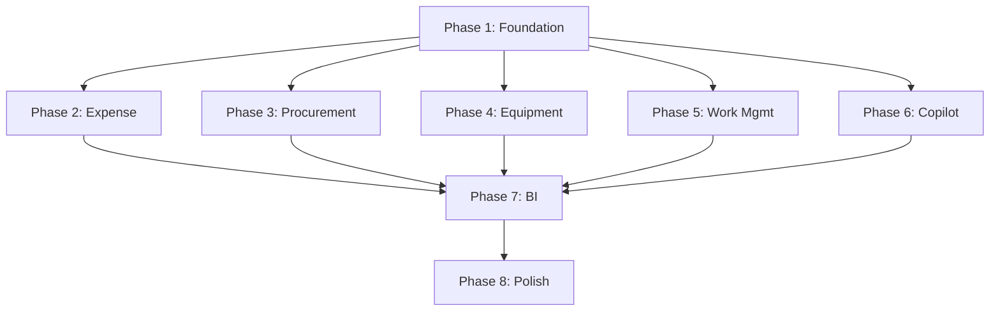

# Enterprise Parity Implementation Plan

---

## Phase Overview

| Phase | Focus | Duration | Key Deliverables |
|-------|-------|----------|------------------|
| **Phase 1** | Foundation | 2 sprints | Core modules, Supabase schema, n8n base |
| **Phase 2** | Expense & Travel | 2 sprints | Concur parity features |
| **Phase 3** | Procurement | 2 sprints | Ariba SRM parity features |
| **Phase 4** | Equipment | 1 sprint | Cheqroom parity features |
| **Phase 5** | Work Management | 1 sprint | Planner parity features |
| **Phase 6** | Copilot | 2 sprints | Joule parity features |
| **Phase 7** | BI & Analytics | 1 sprint | Superset parity features |
| **Phase 8** | Integration & Polish | 1 sprint | End-to-end testing, UX polish |

---

## Phase 1: Foundation (Sprints 1-2)

### Objectives
- Establish base infrastructure
- Configure Supabase ops schema
- Set up n8n workflows base
- Create design system tokens

### Tasks

#### Sprint 1
1. **Supabase Schema Setup**
   - Create `ops` schema
   - Create `agent_runs`, `agent_audit_log`, `tool_permissions` tables
   - Configure RLS policies
   - Set up Edge Functions for portal API

2. **n8n Infrastructure**
   - Deploy n8n instance
   - Configure Odoo credentials
   - Configure Supabase credentials
   - Create base workflow templates

3. **Design System Foundation**
   - Create `ipai_design_system` module
   - Extract Odoo theme variables
   - Create token export for portals

#### Sprint 2
4. **MCP Layer Setup**
   - Register core Odoo tools
   - Register Supabase tools
   - Implement permission checking
   - Set up audit logging

5. **CI/CD Parity Gates**
   - Create parity check scripts
   - Add to CI workflow
   - Set up test fixtures

6. **Documentation**
   - Update CLAUDE.md with parity context
   - Create developer guide
   - Document API contracts

### Exit Criteria
- [ ] Supabase schema deployed and tested
- [ ] n8n instance running with base workflows
- [ ] MCP tools registered and functional
- [ ] CI gates running

---

## Phase 2: Expense & Travel (Sprints 3-4)

### Objectives
- Implement Concur-equivalent features
- Configure policy engine
- Enable mobile capture
- BIR compliance

### Tasks

#### Sprint 3
1. **Core Expense Module**
   - Verify `hr_expense` configuration
   - Create `ipai_expense_policy` model
   - Implement policy rules engine
   - Configure approval workflow

2. **Travel Request**
   - Create `ipai_travel_request` model
   - Link to expense reports
   - Implement approval workflow

3. **OCR Integration**
   - Select OCR service provider
   - Create `ipai_expense_ocr` module
   - Build n8n `expense_ocr_ingest` workflow

#### Sprint 4
4. **Reimbursement Processing**
   - Configure `account_payment_group`
   - Create batch processing workflow
   - GL posting automation

5. **Mobile App**
   - Create PWA for expense capture
   - Implement offline storage
   - Build sync workflow

6. **BIR Compliance**
   - Configure `ipai_finance_bir_compliance`
   - Create reporting extracts
   - Validate against BIR requirements

### Exit Criteria
- [ ] Expense capture end-to-end working
- [ ] Policy enforcement active
- [ ] Approval workflow functional
- [ ] Mobile capture operational
- [ ] BIR reports generated

---

## Phase 3: Procurement (Sprints 5-6)

### Objectives
- Implement Ariba SRM-equivalent features
- Configure approval matrix
- Enable vendor portal
- 3-way match automation

### Tasks

#### Sprint 5
1. **Supplier Management**
   - Configure supplier fields
   - Implement KYC document tracking
   - Create supplier status workflow

2. **Purchase Workflow**
   - Configure `purchase_requisition`
   - Set up RFQ process
   - Implement PO approval matrix

3. **Approval Matrix**
   - Create `ipai_approval_matrix` model
   - Configure routing rules
   - Build n8n `po_approval` workflow

#### Sprint 6
4. **Receiving & Matching**
   - Configure goods receipt
   - Implement 3-way match logic
   - Build n8n `invoice_match` workflow

5. **Vendor Portal**
   - Create Next.js portal app
   - Integrate with Supabase
   - Implement PO view and invoice submission

6. **Audit Trail**
   - Configure `auditlog` module
   - Verify all state changes logged
   - Create audit reports

### Exit Criteria
- [ ] Requisition to PO workflow functional
- [ ] Approval matrix enforced
- [ ] 3-way match operational
- [ ] Vendor portal accessible
- [ ] Full audit trail

---

## Phase 4: Equipment (Sprint 7)

### Objectives
- Implement Cheqroom-equivalent features
- Enable booking calendar
- QR/barcode integration
- Maintenance tracking

### Tasks

1. **Equipment Catalog**
   - Configure equipment products
   - Set up locations
   - Create category hierarchy

2. **Booking System**
   - Create `ipai_equipment_booking` model
   - Implement calendar view
   - Conflict detection

3. **Check-out/in Flow**
   - Configure internal stock moves
   - Create condition logging
   - Build custody chain

4. **QR Integration**
   - Configure `stock_barcodes`
   - Generate equipment QR codes
   - Mobile scanning

5. **Maintenance**
   - Configure `maintenance` module
   - Link to equipment
   - Scheduled maintenance

### Exit Criteria
- [ ] Equipment catalog populated
- [ ] Booking calendar functional
- [ ] Check-out/in workflow working
- [ ] QR scanning operational
- [ ] Maintenance tracking active

---

## Phase 5: Work Management (Sprint 8)

### Objectives
- Implement Planner-equivalent features
- Plan templates
- Recurring tasks
- Workload visibility

### Tasks

1. **Project Configuration**
   - Verify Kanban stages
   - Configure `project_task_dependency`
   - Enable checklists

2. **Plan Templates**
   - Create `ipai_plan_template` model
   - Template instantiation logic
   - n8n `plan_instantiate` workflow

3. **Recurring Tasks**
   - Configure `project_task_recurrent`
   - n8n `task_generate` workflow
   - Recurrence patterns

4. **Notifications**
   - n8n `task_assign` workflow
   - n8n `due_reminder` workflow
   - Email/chat integration

### Exit Criteria
- [ ] Kanban boards functional
- [ ] Templates instantiate correctly
- [ ] Recurring tasks generate
- [ ] Notifications delivered

---

## Phase 6: Copilot (Sprints 9-10)

### Objectives
- Implement Joule-equivalent features
- RAG over Odoo data
- Action execution
- Full audit trail

### Tasks

#### Sprint 9
1. **RAG Setup**
   - Configure embedding model
   - Index Odoo data
   - Index documentation

2. **Query Interface**
   - Create chat UI component
   - Natural language processing
   - Response generation

3. **MCP Tools**
   - Complete Odoo tool set
   - Permission enforcement
   - Error handling

#### Sprint 10
4. **Action Execution**
   - Implement create/update/delete tools
   - Approval gating for sensitive actions
   - Confirmation flow

5. **Audit & Explanation**
   - Log all tool calls
   - Generate explanations
   - Audit dashboard

6. **Role-Based Access**
   - Configure tool permissions
   - Test role scenarios
   - Document capabilities

### Exit Criteria
- [ ] Natural language queries work
- [ ] Actions execute correctly
- [ ] Approval gating enforced
- [ ] Full audit trail
- [ ] Role-based access working

---

## Phase 7: BI & Analytics (Sprint 11)

### Objectives
- Implement Superset-equivalent features
- Curated analytics schema
- Pre-built dashboards
- RLS alignment

### Tasks

1. **Analytics Schema**
   - Create `analytics` schema
   - Design dimension/fact tables
   - Build ETL/CDC jobs

2. **Superset Configuration**
   - Create database connection
   - Import datasets
   - Configure RLS

3. **Dashboards**
   - Expense analytics
   - Procurement analytics
   - Equipment utilization
   - Project workload

4. **Embedding**
   - Configure guest tokens
   - Embed in Odoo
   - Test permissions

### Exit Criteria
- [ ] Analytics schema populated
- [ ] Datasets certified
- [ ] Dashboards published
- [ ] RLS enforced
- [ ] Embedding working

---

## Phase 8: Integration & Polish (Sprint 12)

### Objectives
- End-to-end testing
- Performance optimization
- UX polish
- Documentation

### Tasks

1. **Integration Testing**
   - Cross-capability flows
   - Error scenarios
   - Recovery testing

2. **Performance**
   - Load testing
   - Query optimization
   - Caching

3. **UX Polish**
   - Design system consistency
   - Mobile responsiveness
   - Accessibility

4. **Documentation**
   - User guides
   - Admin guides
   - API documentation

5. **Training**
   - Create training materials
   - Record demos
   - FAQ documentation

### Exit Criteria
- [ ] All integration tests pass
- [ ] Performance targets met
- [ ] UX consistent across surfaces
- [ ] Documentation complete
- [ ] Training materials delivered

---

## Risk Mitigation

| Risk | Mitigation |
|------|------------|
| OCA module gaps | Identify early, plan IPAI modules |
| Performance issues | Continuous monitoring, optimize iteratively |
| Integration complexity | Clear API contracts, comprehensive testing |
| Scope creep | Strict parity checklist, defer enhancements |
| Resource constraints | Parallelize independent workstreams |

---

## Dependencies

