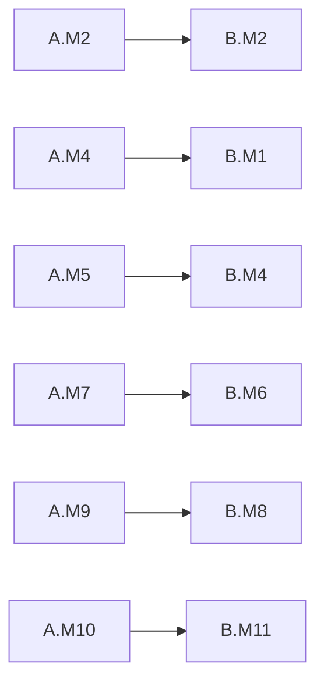

# TBWA\SMP Finance — OKR + Milestones Dashboard Spec

> **Locked:** 2026-04-15
> **Program:** [`tbwa-smp-finance-program.md`](./tbwa-smp-finance-program.md)
> **Reporting doctrine:** [`docs/ops/azure-boards-reporting.md`](../ops/azure-boards-reporting.md)
> **Boards ops:** [`docs/ops/azure-boards-operating-guide.md`](../ops/azure-boards-operating-guide.md)
> **Project:** `insightpulseai/ipai-platform`

---

## 3 dashboards, 3 audiences

| # | Dashboard | Audience | Cadence | Tier |
|---|---|---|---|---|
| 1 | **TBWA\SMP — Executive OKR** | TBWA CFO + IPAI sponsor + program owners | Monthly review | Tier 1 + Tier 2 |
| 2 | **TBWA\SMP — Milestone Timeline** | Delivery leads (IPAI + TBWA controller) | Weekly | Tier 1 |
| 3 | **TBWA\SMP — Operations Health** | Finance team + IPAI solution engineer | Daily standup | Tier 1 |

Separate concerns. No mega-board.

---

## Dashboard 1 — Executive OKR

**Audience:** TBWA\SMP CFO, IPAI sponsor (Jake).
**Answers:** *Are we hitting the OKRs? Where is the risk?*

### Layout (6 widgets, grid 3×2)

```
┌─────────────────────────────┬─────────────────────────────┬─────────────────────────────┐
│ Program progress            │ Project A — ERP KRs         │ Project B — BIR KRs         │
│ (rollup to 4 objectives)    │ (6 KRs, % complete)         │ (11 KRs, % complete)        │
├─────────────────────────────┼─────────────────────────────┼─────────────────────────────┤
│ Risk register heatmap       │ Next 3 milestones due       │ Productivity lift           │
│ (P × I, 30 risks)           │ (A.M + B.M, days + owner)   │ (KR-B.2.2 trend)            │
└─────────────────────────────┴─────────────────────────────┴─────────────────────────────┘
```

### Widget 1 — Program progress (top-left)

```yaml
Widget type:  Chart for work items (stacked bar)
Query:        "TBWA\SMP — Features by State"
WIQL:
  SELECT [System.Id], [System.State], [System.Title]
  FROM WorkItems
  WHERE [System.WorkItemType] = 'Feature'
    AND [System.Tags] CONTAINS 'customer_code:tbwa_smp'
    AND [System.State] <> 'Removed'
Group by:     State
Aggregate:    Count
Colors:       New=grey | Active=blue | Resolved=amber | Closed=green
Size:         2x2
```

### Widget 2 — Project A KR progress (top-middle)

```yaml
Widget type:  Chart for work items (pivot grid)
Query:        "TBWA\SMP — Project A KRs"
WIQL:
  SELECT [System.Id], [System.Title], [System.State],
         [Microsoft.VSTS.Common.Priority], [System.Tags]
  FROM WorkItems
  WHERE [System.Tags] CONTAINS 'kr:A.1' OR [System.Tags] CONTAINS 'kr:A.2'
    AND [System.Tags] CONTAINS 'customer_code:tbwa_smp'
Pivot rows:   Tags (KR ID)
Pivot cols:   State
Aggregate:    Count
Size:         2x2
```

### Widget 3 — Project B KR progress (top-right)

Same pattern as Widget 2 but filtered to `kr:B.1` + `kr:B.2` tags.

### Widget 4 — Risk register heatmap (bottom-left)

```yaml
Widget type:  Custom HTML/Markdown widget
Source:       Generated from docs/programs/tbwa-smp-finance-program.md §§3–6
Render:       5x6 Probability × Impact grid
Cells:        Risk IDs (A.R1–A.R10, B.R1–B.R10, P.R1–P.R10)
Color:        Severity (P × I)
Link:         Each cell → program doc anchor
Size:         2x2
Refresh:      Manual (update when risk status changes)
```

### Widget 5 — Next 3 milestones (bottom-middle)

```yaml
Widget type:  Chart for work items (list view)
Query:        "TBWA\SMP — Upcoming Milestones"
WIQL:
  SELECT [System.Id], [System.Title],
         [Microsoft.VSTS.Scheduling.TargetDate], [System.AssignedTo]
  FROM WorkItems
  WHERE [System.WorkItemType] = 'Milestone'
    AND [System.Tags] CONTAINS 'customer_code:tbwa_smp'
    AND [System.State] IN ('New','Active')
    AND [Microsoft.VSTS.Scheduling.TargetDate] >= @Today
  ORDER BY [Microsoft.VSTS.Scheduling.TargetDate] ASC
Top N:        3
Show:         Id, Title, TargetDate, AssignedTo, DaysRemaining (derived)
Size:         2x2
```

Note: ADO "Milestone" is typically modeled via tagged Feature with `milestone_id:A.M<n>`. Alternative: use the `Epic` work item type with custom field `TargetDate`.

### Widget 6 — Productivity lift trend (bottom-right)

Tier 2 only (Power BI embed). Shows:
- Baseline: finance-team hours/month pre-IPAI (from D365 timesheets, month-before cutover)
- Current: finance-team hours/month post-IPAI (from `account.analytic.line`)
- Delta %: computed against baseline
- Target line: ≥ 20% lift (KR-B.2.2)

```yaml
Widget type:  Embed (Power BI tile)
Source:       IPAI Delivery workspace → TBWA\SMP Productivity report
Visual:       Line chart with target reference line
Refresh:      Hourly (tier 2 default)
```

---

## Dashboard 2 — Milestone Timeline

**Audience:** delivery leads (IPAI solution engineer + TBWA controller).
**Answers:** *What ships when? What's slipping? What's blocking what?*

### Layout (4 widgets, grid 2×2)

```
┌─────────────────────────────────────────────┬─────────────────────────────────────┐
│ Gantt timeline                              │ Slip indicator table                │
│ 23 milestones + R2/R3/R4 bars               │ (milestones past original target)   │
├─────────────────────────────────────────────┼─────────────────────────────────────┤
│ Dependency graph                            │ This week's owner + action          │
│ 6 cross-project + 10 in-project edges       │ (Mon-Fri per milestone owner)       │
└─────────────────────────────────────────────┴─────────────────────────────────────┘
```

### Widget 1 — Gantt timeline (top-left, 4x2)

Azure Boards native Gantt is limited. Two options:

**Option A — OCA `project_timeline` module** (if PPM Features are parented to a `project.project` in Odoo, render a Gantt in Odoo). Requires TBWA\SMP users to have access. Default for operational view.

**Option B — Delivery Plan** (Azure Boards native). Filter: `customer_code:tbwa_smp`. Shows Features + Stories with iteration paths as swim lanes. Our Product Delivery Plan already covers this per [`azure-boards-delivery-plans.md`](../backlog/azure-boards-delivery-plans.md).

**Option C — Power BI custom Gantt visual** over ADO OData feed. Best for cross-team exec view.

Pick **B** for daily use, **C** for exec review.

### Widget 2 — Slip indicator (top-right, 2x2)

```yaml
Widget type:  Chart for work items (list)
Query:        "TBWA\SMP — Slipping Milestones"
WIQL:
  SELECT [System.Id], [System.Title],
         [Microsoft.VSTS.Scheduling.TargetDate],
         [System.State]
  FROM WorkItems
  WHERE [System.Tags] CONTAINS 'customer_code:tbwa_smp'
    AND [System.Tags] CONTAINS 'milestone_id'
    AND [Microsoft.VSTS.Scheduling.TargetDate] < @Today
    AND [System.State] <> 'Closed'
Highlight:    Row red if > 7 days slipped
Size:         2x2
```

### Widget 3 — Dependency graph (bottom-left, 2x2)

ADO doesn't render graphs natively. Two options:

**Option A — Markdown widget** embedding a Mermaid diagram:



Static; updated on program doc edit.

**Option B — Power BI custom visual** (dependency viz from ADO `System.LinkTypes.Dependency` edges).

Start with **A**, upgrade to **B** only if dependencies get dense.

### Widget 4 — This week's owner + action (bottom-right, 2x2)

```yaml
Widget type:  Chart for work items (list)
Query:        "TBWA\SMP — This Week's Actions"
WIQL:
  SELECT [System.Id], [System.Title], [System.AssignedTo],
         [System.State], [Microsoft.VSTS.Scheduling.TargetDate]
  FROM WorkItems
  WHERE [System.Tags] CONTAINS 'customer_code:tbwa_smp'
    AND [System.State] IN ('Active')
    AND [System.IterationPath] = @CurrentIteration
Sort by:      AssignedTo, TargetDate
Size:         2x2
```

---

## Dashboard 3 — Operations Health

**Audience:** TBWA\SMP finance team + IPAI solution engineer.
**Answers:** *What has to ship today? Where are we stuck?*

### Layout (6 widgets, grid 3×2)

```
┌─────────────────────────────┬─────────────────────────────┬─────────────────────────────┐
│ Active sprint burndown      │ Pending BIR filings         │ Month-end close status      │
│ (Story Points remaining)    │ (by filing_form, due soon)  │ (31 close issues, by state) │
├─────────────────────────────┼─────────────────────────────┼─────────────────────────────┤
│ Blocked items               │ Overdue BIR filings         │ Tax Guru usage              │
│ (tag:blocked, click-thru)   │ (red = penalty exposure)    │ (preflight calls, last 7d)  │
└─────────────────────────────┴─────────────────────────────┴─────────────────────────────┘
```

### Widget 1 — Sprint burndown (top-left)

```yaml
Widget type:  Sprint Burndown (native)
Team:         TBWA\SMP Delivery Team
Scope:        Current iteration
```

### Widget 2 — Pending BIR filings (top-middle)

```yaml
Widget type:  Chart for work items (stacked bar)
Query:        "TBWA\SMP — Pending BIR Filings"
WIQL:
  SELECT [System.Id], [System.Title], [System.Tags]
  FROM WorkItems
  WHERE [System.Tags] CONTAINS 'customer_code:tbwa_smp'
    AND [System.Tags] CONTAINS 'compliance_scope:bir-ph'
    AND [System.State] <> 'Closed'
    AND [Microsoft.VSTS.Scheduling.TargetDate] <= @Today+10
Group by:     Tags (extract filing_form:<value>)
Size:         2x2
```

### Widget 3 — Month-end close status (top-right)

```yaml
Widget type:  Chart for work items (pie)
Query:        "TBWA\SMP — Close Status Current Period"
WIQL:
  SELECT [System.Id], [System.State]
  FROM WorkItems
  WHERE [System.Tags] CONTAINS 'customer_code:tbwa_smp'
    AND [System.Tags] CONTAINS 'cadence:monthly'
    AND [System.Tags] CONTAINS 'compliance_scope:close'
    AND [System.Tags] CONTAINS 'fiscal_period:<current>'
Group by:     State
Size:         2x2
```

### Widget 4 — Blocked items (bottom-left)

```yaml
Widget type:  Query tile (count)
Query:        "TBWA\SMP — Blocked"
WIQL:
  SELECT [System.Id] FROM WorkItems
  WHERE [System.Tags] CONTAINS 'customer_code:tbwa_smp'
    AND [System.Tags] CONTAINS 'blocked'
    AND [System.State] <> 'Closed'
Click-through: opens the query
Size:         2x2
```

### Widget 5 — Overdue BIR filings (bottom-middle)

```yaml
Widget type:  Query tile (count, red threshold)
Query:        "TBWA\SMP — Overdue BIR Filings"
WIQL:
  SELECT [System.Id] FROM WorkItems
  WHERE [System.Tags] CONTAINS 'customer_code:tbwa_smp'
    AND [System.Tags] CONTAINS 'compliance_scope:bir-ph'
    AND [System.State] <> 'Closed'
    AND [Microsoft.VSTS.Scheduling.TargetDate] < @Today
Threshold:    > 0 → red; 0 → green
Click-through: opens the query
Size:         2x2
```

### Widget 6 — Tax Guru usage (bottom-right)

```yaml
Widget type:  Embed (App Insights chart)
Source:       App Insights → customEvents
Query:
  customEvents
  | where name == "tax_guru_preflight_called"
  | where customDimensions.tenant_id == "tbwa_smp"
  | summarize count_per_day = count() by bin(timestamp, 1d)
  | render timechart
Target:       90% of filing issues invoke preflight (KR-B.2.1)
Size:         2x2
```

---

## Tier 2 — Power BI report: "TBWA\SMP — Finance Productivity"

Workspace: **IPAI Delivery**
Report: **TBWA\SMP — Finance Productivity**

### Data sources (OData)

```
1. ADO Analytics OData:
   https://analytics.dev.azure.com/insightpulseai/ipai-platform/_odata/v4.0-preview/
   - WorkItems (filter: Tags contains "customer_code:tbwa_smp")
   - WorkItemSnapshot (daily states)

2. Odoo OData (OData Bridge v1 when live):
   https://erp.insightpulseai.com/odata/v1/tbwa_smp/
   - Projects, ProjectTasks, TimeEntries

3. Azure Cost Management API (daily):
   Filter: tags.customer_code = tbwa_smp

4. App Insights OData:
   customEvents filtered to tenant_id = tbwa_smp
```

### Pages (5)

| Page | Visuals |
|---|---|
| **Overview** | 4 KPI cards (objective completion %), 1 Gantt, 1 slip indicator, 1 risk heatmap |
| **Project A — ERP Displacement** | KR burndown per KR, milestones, data-migration reconciliation variance |
| **Project B — BIR Compliance** | BIR filings heatmap (form × month), Tax Guru usage, evidence pack compliance |
| **Finance Productivity** | Hours/month vs baseline, productivity lift %, target ref line |
| **Cost Allocation** | Azure spend tagged `customer_code:tbwa_smp` broken down by plane/workload |

### DAX measures (key)

```dax
-- Project A — % complete
A_KRs_Complete% =
  DIVIDE(
    CALCULATE(COUNTROWS(WorkItems), WorkItems[State] = "Closed", WorkItems[Tags] CONTAINS "kr:A."),
    CALCULATE(COUNTROWS(WorkItems), WorkItems[Tags] CONTAINS "kr:A.")
  )

-- Productivity lift %
Productivity_Lift% =
  DIVIDE(
    [Baseline_Hours_Per_Month] - [Current_Hours_Per_Month],
    [Baseline_Hours_Per_Month]
  )

-- Slip days (per milestone)
Slip_Days =
  IF(
    WorkItems[State] <> "Closed" && WorkItems[TargetDate] < TODAY(),
    DATEDIFF(WorkItems[TargetDate], TODAY(), DAY),
    0
  )

-- Evidence pack compliance % (KR-B.2.4)
Evidence_Compliance% =
  DIVIDE(
    COUNTROWS(FILTER(WorkItems, WorkItems[HasEvidenceAttachment] = TRUE() && WorkItems[State] = "Closed")),
    COUNTROWS(FILTER(WorkItems, WorkItems[ComplianceScope] = "bir-ph" && WorkItems[State] = "Closed"))
  )

-- Tax Guru usage rate (KR-B.2.1)
TaxGuru_Usage_Rate% =
  DIVIDE(
    COUNTROWS(FILTER(WorkItems, WorkItems[HasTaxGuruPreflight] = TRUE())),
    COUNTROWS(FILTER(WorkItems, WorkItems[ComplianceScope] = "bir-ph"))
  )
```

---

## Setup checklist

### Prerequisites

- [ ] TBWA\SMP Feature created under Epic 1 (Core Operations Plane)
- [ ] 2 sub-Features: "Project A — ERP Displacement" + "Project B — BIR Compliance Operations"
- [ ] All 10 + 11 KRs created as Stories under the two Features
- [ ] All 23 milestones created (tagged `milestone_id:A.M<n>` or `milestone_id:B.M<n>`)
- [ ] Tag every item with `customer_code:tbwa_smp` + `tenant_scope:single-tenant` + `billing_scope:customer`
- [ ] 10 Shared Queries saved (per widget specs above)

### Dashboard 1 — Executive OKR

- [ ] Create dashboard "TBWA\SMP — Executive OKR"
- [ ] Add 6 widgets per layout
- [ ] Pin to project home for CFO + sponsor
- [ ] Document monthly review cadence in `ssot/governance/delivery-plan-raci.yaml`

### Dashboard 2 — Milestone Timeline

- [ ] Create dashboard "TBWA\SMP — Milestone Timeline"
- [ ] Add 4 widgets
- [ ] Build/publish Mermaid dependency graph to `docs/programs/tbwa-smp-dependencies.md`

### Dashboard 3 — Operations Health

- [ ] Create dashboard "TBWA\SMP — Operations Health"
- [ ] Add 6 widgets
- [ ] Wire Tax Guru custom events in App Insights

### Power BI report

- [ ] Build report in IPAI Delivery workspace
- [ ] Connect ADO OData feed + Odoo OData (when live) + Azure Cost API + App Insights OData
- [ ] Publish + schedule hourly refresh
- [ ] Share with CFO + sponsor (read-only)

---

## Acceptance criteria (dashboard ship gates)

Before dashboard goes live:

- [ ] All queries return ≤ 5 seconds on the active sprint
- [ ] All 6 widgets in Exec OKR render without errors
- [ ] Widget 6 (Productivity lift) has baseline data loaded (requires A.M4 historical import)
- [ ] Risk heatmap reflects the 30 risks from [program doc](./tbwa-smp-finance-program.md)
- [ ] Milestone slip indicator shows 0 slips at dashboard launch
- [ ] CFO approves the exec-OKR layout on first review
- [ ] Power BI refresh runs hourly without failure for 7 consecutive days

---

## Refresh + ownership

| Dashboard | Refresh | Owner | Review cadence |
|---|---|---|---|
| Exec OKR | Real-time (widgets) + hourly (PBI tile) | Jake Tolentino | Monthly with CFO |
| Milestone Timeline | Real-time | IPAI solution engineer | Weekly with TBWA controller |
| Operations Health | Real-time | IPAI solution engineer + TBWA finance team lead | Daily standup |
| PBI Productivity | Hourly | Jake Tolentino | Monthly + on-demand |

---

## Anti-patterns

- Mixing operational + executive views in one dashboard — audiences get confused
- Widgets with > 100 items — mobile unusable
- Queries referencing `@Me` on a shared dashboard — breaks for other viewers
- "% complete" hard-coded in a markdown widget — stale within a week; use rollups
- Separate dashboard per milestone — wastes widgets; use a table with filter
- Skipping Power BI when FinOps overlay is needed — ADO widgets can't do cost overlay

---

## Milestone work-item model (how milestones live in Boards)

Since ADO Agile has no native "Milestone" type, milestones map as follows:

| Program milestone | Boards representation |
|---|---|
| `A.M1` Contract signed | Feature with tag `milestone_id:A.M1` + TargetDate |
| `A.M2` Company live | Feature |
| `A.M3` Migration plan | Feature |
| ...and so on | Feature per milestone |
| R2 ship (2026-07-14) | Feature with tag `ship_gate:R2` |
| R3 ship (2026-10-14) | Feature with tag `ship_gate:R3` |
| R4 GA (2026-12-15) | Feature with tag `ship_gate:R4` |

Each milestone Feature:
- Target Date set to the target date from the program doc
- Parent: the appropriate project Feature (A or B)
- Tag: `milestone_id:<id>` + `customer_code:tbwa_smp` + `ship_gate:<R2|R3|R4>` if applicable
- Acceptance criteria: the KRs it unblocks

---

## References

- [`docs/programs/tbwa-smp-finance-program.md`](./tbwa-smp-finance-program.md) — OKRs + milestones + risks source
- [`ssot/tenants/tbwa-smp/seed/ppm_tasks.yaml`](../../ssot/tenants/tbwa-smp/seed/ppm_tasks.yaml)
- [`ssot/tenants/tbwa-smp/seed/calendar_notifications.yaml`](../../ssot/tenants/tbwa-smp/seed/calendar_notifications.yaml)
- [`docs/ops/azure-boards-reporting.md`](../ops/azure-boards-reporting.md) — Tier 1 / Tier 2 pattern
- [`docs/backlog/azure-boards-portfolio-target-state.md`](../backlog/azure-boards-portfolio-target-state.md) — hierarchy
- [`docs/backlog/azure-boards-delivery-plans.md`](../backlog/azure-boards-delivery-plans.md) — plans

---

*Last updated: 2026-04-15*
