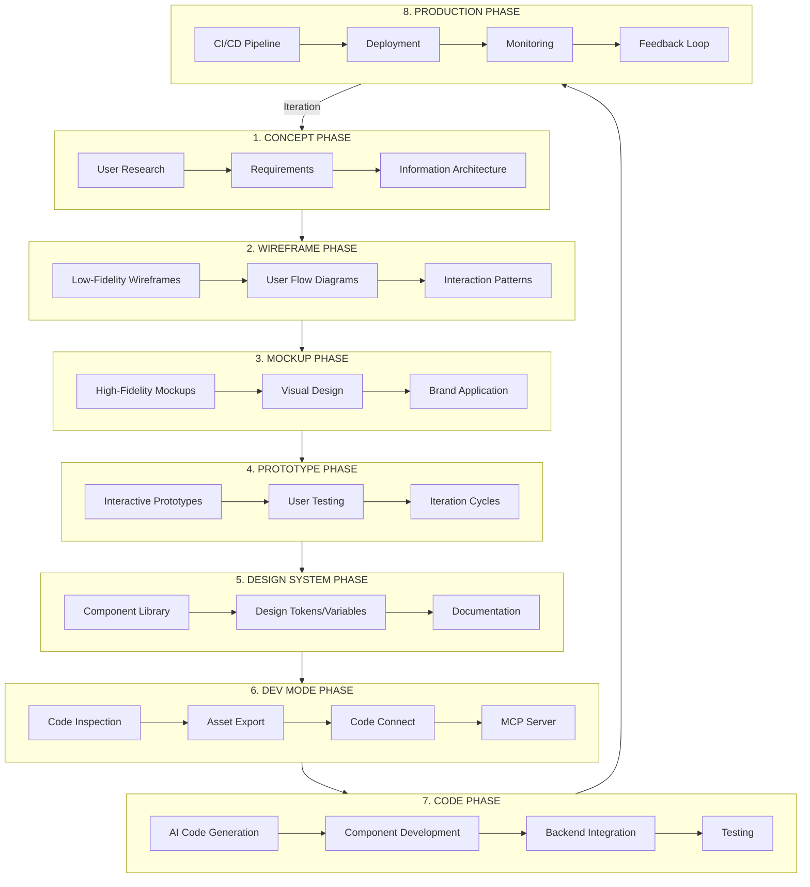
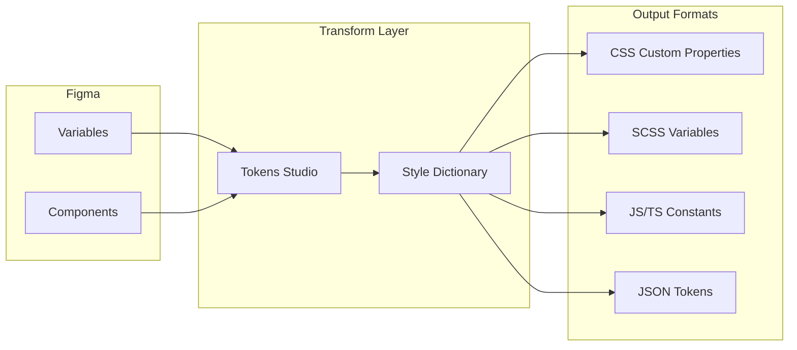
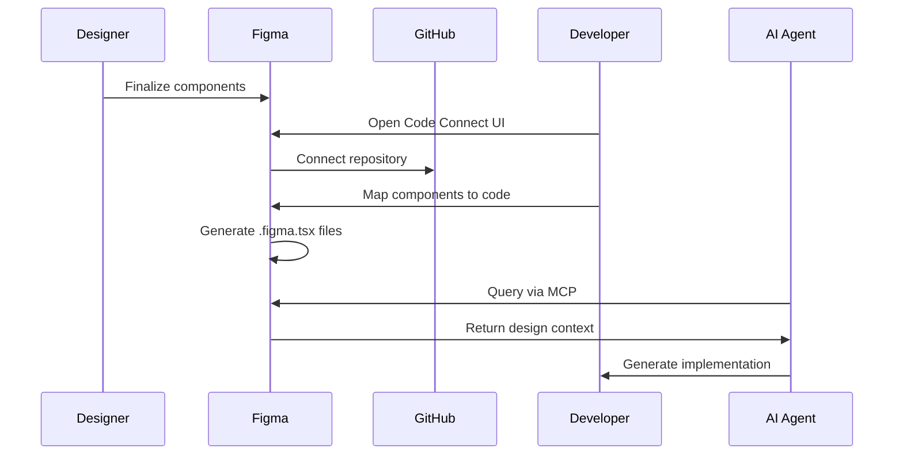
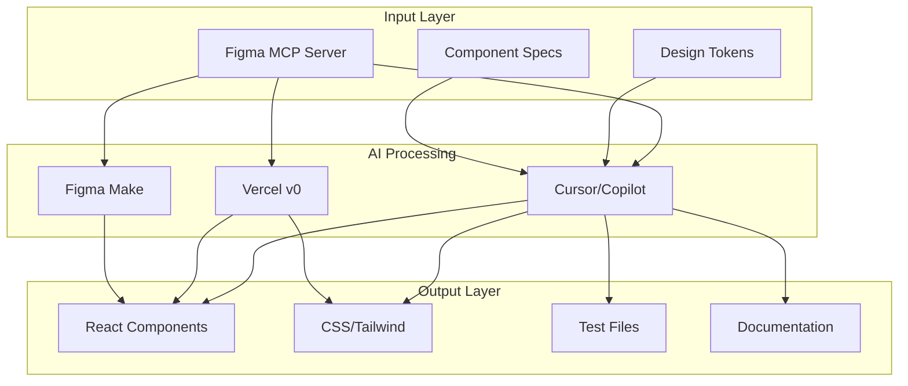
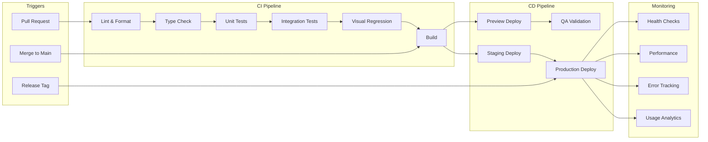
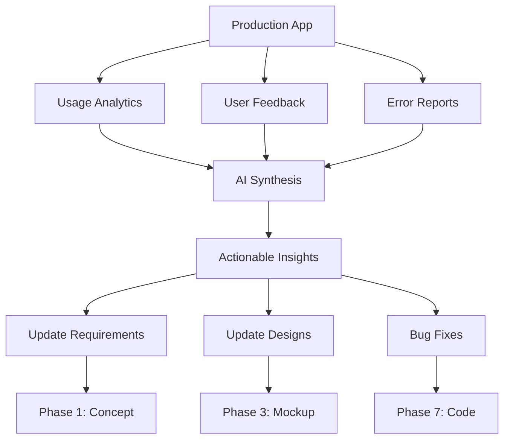

# App Design Lifecycle Map

**Document:** Figma Design Automation Research
**Date:** 2026-01-20

---

## Overview Diagram (Mermaid)



---

## Phase-by-Phase Breakdown

### Phase 1: Concept

| Attribute | Details |
|-----------|---------|
| **Duration** | 1-2 weeks |
| **Input Artifacts** | Business requirements, user research data, competitive analysis |
| **Output Artifacts** | PRD, user personas, journey maps, information architecture |
| **Tools** | FigJam, Miro, Notion, Google Docs |
| **Human Roles** | Product Manager, UX Researcher, Business Analyst |
| **AI Opportunities** | User research synthesis, competitive analysis, persona generation |
| **Version Control** | Notion/Confluence versioning |
| **CI/CD Gates** | Requirements sign-off |

```
User Research Data
       ↓
[AI: Research Synthesis]
       ↓
Personas + Journey Maps
       ↓
[Human: Strategy Validation]
       ↓
Approved PRD
```

---

### Phase 2: Wireframe

| Attribute | Details |
|-----------|---------|
| **Duration** | 1-2 weeks |
| **Input Artifacts** | PRD, information architecture, content inventory |
| **Output Artifacts** | Low-fidelity wireframes, user flows, navigation schema |
| **Tools** | Figma (wireframe mode), FigJam, Balsamiq |
| **Human Roles** | UX Designer, Information Architect |
| **AI Opportunities** | Layout suggestions, flow optimization, component recommendations |
| **Version Control** | Figma version history |
| **CI/CD Gates** | Stakeholder review, usability heuristics check |

```
PRD + IA
    ↓
[AI: Layout Generation]
    ↓
Draft Wireframes
    ↓
[Human: UX Refinement]
    ↓
[AI: Flow Validation]
    ↓
Approved Wireframes
```

---

### Phase 3: Mockup

| Attribute | Details |
|-----------|---------|
| **Duration** | 2-3 weeks |
| **Input Artifacts** | Approved wireframes, brand guidelines, content |
| **Output Artifacts** | High-fidelity mockups, visual design specs, responsive variants |
| **Tools** | Figma Design Mode, Adobe Creative Suite |
| **Human Roles** | Visual Designer, Brand Designer |
| **AI Opportunities** | Color harmony suggestions, typography pairing, responsive variants |
| **Version Control** | Figma branches, version history |
| **CI/CD Gates** | Brand compliance check, accessibility contrast check |

```
Wireframes + Brand Guide
          ↓
[Human: Visual Design]
          ↓
High-Fidelity Mockups
          ↓
[AI: Responsive Variant Generation]
          ↓
[AI: Accessibility Pre-Check]
          ↓
Approved Mockups
```

---

### Phase 4: Prototype

| Attribute | Details |
|-----------|---------|
| **Duration** | 1-2 weeks |
| **Input Artifacts** | High-fidelity mockups, interaction requirements |
| **Output Artifacts** | Interactive prototypes, user test recordings, iteration logs |
| **Tools** | Figma Prototyping, Figma Make, ProtoPie |
| **Human Roles** | Interaction Designer, UX Researcher |
| **AI Opportunities** | Interaction suggestions, user behavior prediction, test analysis |
| **Version Control** | Figma version history, prototype links |
| **CI/CD Gates** | Usability test pass rate (>80%) |

```
Mockups + Interaction Specs
           ↓
[Human: Interaction Design]
           ↓
Interactive Prototype
           ↓
[Human: User Testing]
           ↓
[AI: Test Analysis & Insights]
           ↓
Iteration Recommendations
           ↓
[Human: Refinement]
           ↓
Approved Prototype
```

---

### Phase 5: Design System

| Attribute | Details |
|-----------|---------|
| **Duration** | 2-4 weeks (initial), ongoing maintenance |
| **Input Artifacts** | Approved mockups, component audit, brand guidelines |
| **Output Artifacts** | Component library, design tokens (variables), documentation |
| **Tools** | Figma Variables, Tokens Studio, Storybook |
| **Human Roles** | Design Systems Designer, Design Ops |
| **AI Opportunities** | Token extraction, component generation, documentation |
| **Version Control** | Figma library versioning, Git (tokens) |
| **CI/CD Gates** | Token validation, component coverage metrics |

```
Approved Designs
       ↓
[AI: Pattern Recognition]
       ↓
Component Candidates
       ↓
[Human: System Architecture]
       ↓
Component Library
       ↓
[AI: Token Extraction]
       ↓
Design Tokens (Variables)
       ↓
[AI: Documentation Generation]
       ↓
Published Design System
```

**Design Token Flow (Detailed):**



---

### Phase 6: Dev Mode

| Attribute | Details |
|-----------|---------|
| **Duration** | Ongoing (part of handoff) |
| **Input Artifacts** | Design system, final mockups, prototypes |
| **Output Artifacts** | Code snippets, assets, Code Connect mappings, MCP context |
| **Tools** | Figma Dev Mode, Code Connect, Figma MCP Server |
| **Human Roles** | Developer, Design Technologist |
| **AI Opportunities** | Code generation, component mapping suggestions, asset optimization |
| **Version Control** | Git (Code Connect files), Figma versions |
| **CI/CD Gates** | Code Connect coverage, asset export validation |

```
Design System + Mockups
          ↓
[Tool: Dev Mode Inspection]
          ↓
Code Snippets + Measurements
          ↓
[Human/AI: Code Connect Setup]
          ↓
Component Mappings
          ↓
[Tool: MCP Server Activation]
          ↓
AI-Accessible Design Context
          ↓
[Tool: Asset Export]
          ↓
Optimized Assets
```

**Code Connect Setup Flow:**



---

### Phase 7: Code

| Attribute | Details |
|-----------|---------|
| **Duration** | 2-6 weeks |
| **Input Artifacts** | Code Connect mappings, design tokens, MCP context, assets |
| **Output Artifacts** | Production code, component library, backend services, tests |
| **Tools** | VS Code/Cursor, Figma MCP, Supabase, GitHub |
| **Human Roles** | Frontend Developer, Backend Developer, QA Engineer |
| **AI Opportunities** | Code generation (70-80%), test generation, backend scaffolding |
| **Version Control** | Git branches, PRs |
| **CI/CD Gates** | Lint, type check, unit tests, integration tests, visual regression |

```
MCP Context + Tokens + Assets
            ↓
[AI: Code Generation via Cursor/Copilot]
            ↓
Draft Components
            ↓
[Human: Code Review & Refinement]
            ↓
[AI: Test Generation]
            ↓
Unit + Integration Tests
            ↓
[AI: Backend Schema Generation]
            ↓
Supabase Tables + Functions
            ↓
[Human: Integration & Logic]
            ↓
Production-Ready Code
```

**AI Code Generation Flow:**



---

### Phase 8: Production

| Attribute | Details |
|-----------|---------|
| **Duration** | Ongoing |
| **Input Artifacts** | Tested code, deployment config, monitoring setup |
| **Output Artifacts** | Live application, performance metrics, user feedback |
| **Tools** | Vercel/Netlify, GitHub Actions, Supabase, DataDog/Sentry |
| **Human Roles** | DevOps Engineer, SRE, Product Manager |
| **AI Opportunities** | Deployment automation, anomaly detection, feedback synthesis |
| **Version Control** | Git tags, release branches |
| **CI/CD Gates** | E2E tests, performance benchmarks, security scans |

```
Production Code
       ↓
[CI: Lint + Type Check + Test]
       ↓
[CI: Build]
       ↓
[CI: Preview Deployment]
       ↓
[Human: QA Validation]
       ↓
[CI: Production Deployment]
       ↓
Live Application
       ↓
[Tool: Monitoring & Alerts]
       ↓
[AI: Anomaly Detection]
       ↓
[AI: Feedback Synthesis]
       ↓
Iteration Insights → Phase 1
```

**CI/CD Pipeline (Detailed):**



---

## Automation Opportunity Summary

| Phase | Current Automation | Target Automation | Gap |
|-------|-------------------|-------------------|-----|
| Concept | 20% | 50% | AI research synthesis |
| Wireframe | 30% | 60% | AI layout generation |
| Mockup | 40% | 70% | AI variant generation |
| Prototype | 50% | 80% | Figma Make integration |
| Design System | 60% | 85% | Token pipelines |
| Dev Mode | 70% | 90% | Code Connect + MCP |
| Code | 50% | 80% | AI code generation |
| Production | 80% | 95% | Existing CI/CD maturity |

---

## Version Control Points

```
┌──────────────────────────────────────────────────────────────────┐
│                    VERSION CONTROL CHECKPOINTS                   │
├──────────────────────────────────────────────────────────────────┤
│                                                                   │
│  [Concept]           PRD v1.0                                    │
│      ↓                                                           │
│  [Wireframe]         Figma Branch: wireframes/v1                 │
│      ↓                                                           │
│  [Mockup]            Figma Branch: visual/v1                     │
│      ↓                                                           │
│  [Prototype]         Figma: Prototype Link v1                    │
│      ↓                                                           │
│  [Design System]     Figma Library v1.0.0                        │
│      ↓               Git: tokens/v1.0.0                          │
│  [Dev Mode]          Git: code-connect/v1.0.0                    │
│      ↓                                                           │
│  [Code]              Git: feature/component-library              │
│      ↓               Git: PR #123                                │
│  [Production]        Git: release/v1.0.0                         │
│                      Git Tag: v1.0.0                             │
│                                                                   │
└──────────────────────────────────────────────────────────────────┘
```

---

## Feedback Loop Integration



---

*Document generated: 2026-01-20*
*Part of: Figma Design Automation Research*
