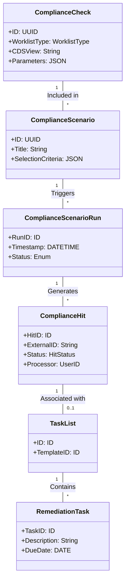

# SAP Tax Compliance — Object Model

Core entities and their relationships within SAP Tax Compliance.

## Entity Definitions

### 1. Compliance Check (F2338)
The fundamental unit of detection logic. It references a **Worklist Type** (defining the data source) and a **Check View** (the logic).

### 2. Compliance Scenario (F2339)
A grouping of Checks that are run together for a specific business purpose (e.g., "VAT Quarterly Close").

### 3. Compliance Hit (F2344)
The output of a Scenario Run. Represents a potential violation found in the source data.
- **States:** Created, Assigned, Under Investigation, Completed (Confirmed/Not a Hit).

### 4. Task List & Remediation Task
The workflow objects for resolving a Hit. A Hit can trigger a Task List based on its conclusion.

### 5. Worklist Type
A conceptual wrapper around a CDS entity that ensures the Compliance Check has the necessary dimensions (e.g., Company Code, Fiscal Year, Document Number) to support investigation and navigation.
