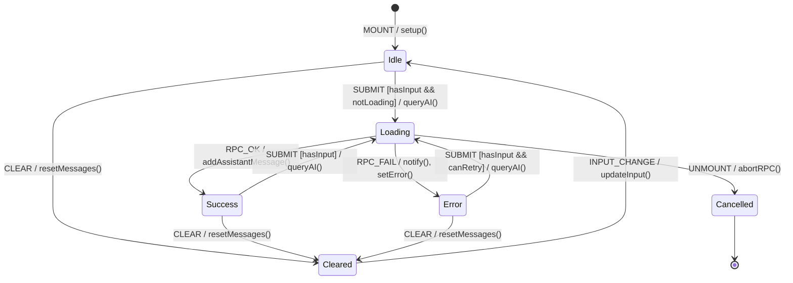

# Ask AI Chat FSM

**Source**: `addons/ipai/ipai_ask_ai/static/src/js/ask_ai_chat.js`

## Overview

OWL component implementing conversational AI interface with RPC backend calls.

## States

| State | Description |
|-------|-------------|
| `Idle` | Initial state, input ready |
| `Loading` | RPC call in progress |
| `Success` | Response received |
| `Error` | API error or network failure |
| `Cleared` | Conversation reset |

## Events

| Event | Source | Description |
|-------|--------|-------------|
| `SUBMIT` | User | Enter key or send button |
| `INPUT_CHANGE` | User | Typing in input field |
| `CLEAR` | User | Clear conversation button |
| `RPC_OK` | System | Successful API response |
| `RPC_FAIL` | System | API error or network timeout |
| `UNMOUNT` | System | Component destroyed |

## Guards

| Guard | Condition |
|-------|-----------|
| `hasInput` | `currentInput.trim().length > 0` |
| `notLoading` | `!state.loading` |
| `canRetry` | Error is recoverable (not 403/401) |

## Side Effects

| Action | Endpoint | Description |
|--------|----------|-------------|
| `queryAI` | `POST /ipai/ask_ai/query` | Send prompt to AI backend |
| `notify` | N/A | Display error notification |
| `scrollBottom` | N/A | Scroll messages container |

## Transition Table

| From | Event | Guard | To | Action |
|------|-------|-------|----|--------|
| Idle | SUBMIT | hasInput, notLoading | Loading | queryAI, addUserMessage |
| Idle | INPUT_CHANGE | - | Idle | updateInput |
| Idle | CLEAR | - | Cleared | resetMessages |
| Loading | RPC_OK | - | Success | addAssistantMessage |
| Loading | RPC_FAIL | - | Error | notify, setError |
| Loading | UNMOUNT | - | Cancelled | abortRPC |
| Success | SUBMIT | hasInput | Loading | queryAI, addUserMessage |
| Success | CLEAR | - | Cleared | resetMessages |
| Error | SUBMIT | hasInput, canRetry | Loading | queryAI, clearError |
| Error | CLEAR | - | Cleared | resetMessages |
| Cleared | INPUT_CHANGE | - | Idle | updateInput |

## Mermaid Diagram

## Identified Gaps

1. **Missing abort on unmount**: No AbortController to cancel pending RPC when component unmounts - can cause "set state on unmounted component" warning
2. **No retry logic**: Failed requests require manual resubmit, no automatic retry with backoff
3. **No debounce on rapid submit**: Multiple rapid Enter presses could queue multiple requests
4. **Missing optimistic UI**: User message not marked as "pending" during loading
5. **No conversation persistence**: Conversation lost on page refresh
6. **No session expiry handling**: 401 errors not triggering re-auth flow
7. **Missing rate limiting**: No client-side throttle for spam protection
