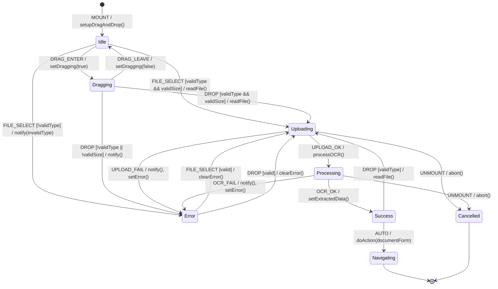

# Document Upload/OCR FSM

**Source**: `addons/ipai/ipai_document_ai/static/src/js/document_upload.js`

## Overview

OWL component for drag-and-drop document upload with two-phase processing: upload to ir.attachment, then OCR extraction.

## States

| State | Description |
|-------|-------------|
| `Idle` | Waiting for file selection |
| `Dragging` | File being dragged over drop zone |
| `Uploading` | File being uploaded to ir.attachment |
| `Processing` | OCR extraction in progress |
| `Success` | Document processed, extracted data available |
| `Error` | Upload or processing failed |
| `Navigating` | Redirecting to document form view |

## Events

| Event | Source | Description |
|-------|--------|-------------|
| `DRAG_ENTER` | User | File dragged over zone |
| `DRAG_LEAVE` | User | File dragged away |
| `DROP` | User | File dropped |
| `CLICK` | User | Upload button clicked |
| `FILE_SELECT` | User | File chosen via dialog |
| `UPLOAD_OK` | System | Attachment created |
| `UPLOAD_FAIL` | System | Upload error |
| `OCR_OK` | System | Extraction complete |
| `OCR_FAIL` | System | Extraction error |
| `UNMOUNT` | System | Component destroyed |

## Guards

| Guard | Condition |
|-------|-----------|
| `validType` | File type in [pdf, jpeg, png, tiff] |
| `validSize` | File size <= 25MB |
| `hasFile` | File object exists |
| `notBusy` | !isUploading && !isProcessing |

## Side Effects

| Action | Endpoint | Description |
|--------|----------|-------------|
| `readFile` | N/A | FileReader.readAsDataURL |
| `createAttachment` | `POST /web/dataset/call_kw` | Create ir.attachment record |
| `processOCR` | `POST /ipai/document_ai/upload` | Trigger OCR extraction |
| `navigate` | N/A | doAction to document form |
| `notify` | N/A | Display notification |

## Transition Table

| From | Event | Guard | To | Action |
|------|-------|-------|----|--------|
| Idle | DRAG_ENTER | - | Dragging | setDragging(true) |
| Idle | CLICK | - | Idle | openFileDialog |
| Idle | FILE_SELECT | validType, validSize | Uploading | readFile, createAttachment |
| Idle | FILE_SELECT | !validType | Error | notify(invalidType) |
| Idle | FILE_SELECT | !validSize | Error | notify(tooLarge) |
| Dragging | DRAG_LEAVE | - | Idle | setDragging(false) |
| Dragging | DROP | validType, validSize | Uploading | readFile, createAttachment |
| Dragging | DROP | !validType | Error | notify(invalidType) |
| Uploading | UPLOAD_OK | - | Processing | processOCR |
| Uploading | UPLOAD_FAIL | - | Error | notify, setError |
| Uploading | UNMOUNT | - | Cancelled | (abort) |
| Processing | OCR_OK | - | Success | setExtractedData, navigate |
| Processing | OCR_FAIL | - | Error | notify, setError |
| Processing | UNMOUNT | - | Cancelled | (abort) |
| Success | DROP | validType | Uploading | readFile, createAttachment |
| Error | DROP | validType, validSize | Uploading | clearError, readFile |
| Error | FILE_SELECT | validType, validSize | Uploading | clearError, readFile |

## Mermaid Diagram

## Identified Gaps

1. **No upload progress**: `uploadProgress` state exists but never updated during upload
2. **No chunked upload**: Large files could timeout; no resumable upload support
3. **Missing abort on unmount**: FileReader and RPC calls not cancelled on component destroy
4. **No duplicate detection**: Same file can be uploaded repeatedly without warning
5. **AccessError not handled**: 403 response not distinguished from other errors
6. **No retry for transient failures**: Network errors require full re-upload
7. **Missing CSRF protection**: Upload endpoint should validate CSRF token
8. **Race condition**: Rapid file drops could interleave upload sequences
9. **OCR timeout**: No handling for long-running OCR jobs (should poll for status)
