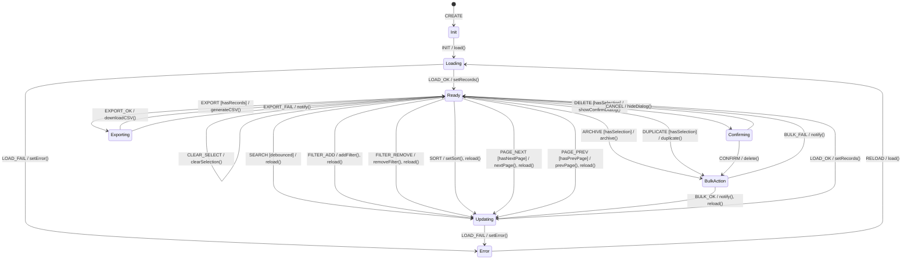

# Grid View Controller FSM

**Source**: `addons/ipai_grid_view/static/src/js/grid_controller.js`

## Overview

Complex OWL controller implementing list view with pagination, sorting, filtering, selection, and bulk actions.

## States

| State | Description |
|-------|-------------|
| `Init` | Component mounting |
| `Loading` | Data being fetched |
| `Ready` | Data loaded, interactive |
| `Updating` | Applying filter/sort/pagination |
| `Selecting` | Selection in progress |
| `BulkAction` | Bulk operation executing |
| `Exporting` | CSV export generating |
| `Error` | Load or action failed |
| `Confirming` | Confirmation dialog open |

## Events

| Event | Source | Description |
|-------|--------|-------------|
| `INIT` | System | Component mounted |
| `LOAD_OK` | System | Data fetched successfully |
| `LOAD_FAIL` | System | Data fetch error |
| `SEARCH` | User | Search input (debounced) |
| `FILTER_ADD` | User | Filter applied |
| `FILTER_REMOVE` | User | Filter removed |
| `SORT` | User | Column header clicked |
| `PAGE_NEXT` | User | Next page |
| `PAGE_PREV` | User | Previous page |
| `PAGE_SIZE` | User | Page size changed |
| `SELECT_ONE` | User | Row checkbox toggled |
| `SELECT_ALL` | User | Header checkbox or Ctrl+A |
| `CLEAR_SELECT` | User | Escape key or clear button |
| `DELETE` | User | Delete selected |
| `ARCHIVE` | User | Archive selected |
| `DUPLICATE` | User | Duplicate selected |
| `EXPORT` | User | Export button |
| `OPEN_RECORD` | User | Row clicked |
| `CREATE` | User | Create button |
| `CONFIRM` | User | Dialog confirmed |
| `CANCEL` | User | Dialog cancelled |
| `RELOAD` | System | Refresh triggered |

## Guards

| Guard | Condition |
|-------|-----------|
| `hasRecords` | `records.length > 0` |
| `hasSelection` | `selectedIds.size > 0` |
| `hasNextPage` | `offset + limit < total` |
| `hasPrevPage` | `offset > 0` |
| `notLoading` | `!state.loading` |
| `isSearchValid` | Debounce timer elapsed |
| `canDelete` | User has unlink permission |
| `canArchive` | User has write permission |

## Side Effects

| Action | Endpoint | Description |
|--------|----------|-------------|
| `load` | `orm.searchRead()` | Fetch records |
| `delete` | `model.executeBulkAction(ids, 'delete')` | Delete records |
| `archive` | `model.executeBulkAction(ids, 'archive')` | Archive records |
| `duplicate` | `model.executeBulkAction(ids, 'duplicate')` | Duplicate records |
| `export` | N/A | Generate and download CSV |
| `navigate` | `action.doAction()` | Open form view |
| `notify` | N/A | Display notification |

## Transition Table

| From | Event | Guard | To | Action |
|------|-------|-------|----|--------|
| Init | INIT | - | Loading | load() |
| Loading | LOAD_OK | - | Ready | setRecords() |
| Loading | LOAD_FAIL | - | Error | setError() |
| Ready | SEARCH | isSearchValid | Updating | setSearchTerm, reload() |
| Ready | FILTER_ADD | - | Updating | addFilter, reload() |
| Ready | FILTER_REMOVE | - | Updating | removeFilter, reload() |
| Ready | SORT | - | Updating | setSort, reload() |
| Ready | PAGE_NEXT | hasNextPage | Updating | nextPage, reload() |
| Ready | PAGE_PREV | hasPrevPage | Updating | prevPage, reload() |
| Ready | SELECT_ONE | - | Ready | toggleSelection() |
| Ready | SELECT_ALL | hasRecords | Ready | selectAll() |
| Ready | CLEAR_SELECT | hasSelection | Ready | clearSelection() |
| Ready | DELETE | hasSelection | Confirming | showConfirmDialog() |
| Ready | ARCHIVE | hasSelection | BulkAction | archive() |
| Ready | DUPLICATE | hasSelection | BulkAction | duplicate() |
| Ready | EXPORT | hasRecords | Exporting | generateCSV() |
| Ready | OPEN_RECORD | - | (external) | navigate() |
| Ready | CREATE | - | (external) | navigate() |
| Updating | LOAD_OK | - | Ready | setRecords() |
| Updating | LOAD_FAIL | - | Error | setError, notify() |
| BulkAction | BULK_OK | - | Updating | notify(success), reload() |
| BulkAction | BULK_FAIL | - | Ready | notify(error) |
| Exporting | EXPORT_OK | - | Ready | downloadCSV() |
| Exporting | EXPORT_FAIL | - | Ready | notify(error) |
| Confirming | CONFIRM | canDelete | BulkAction | delete() |
| Confirming | CANCEL | - | Ready | hideDialog() |
| Error | RELOAD | - | Loading | load() |

## Mermaid Diagram

## Identified Gaps

1. **Stale filter race**: Rapid filter changes can return out-of-order; no request cancellation
2. **No optimistic selection**: Selection cleared on reload even if same records returned
3. **Missing bulk action rollback**: No undo for accidental delete/archive
4. **Debounce timer leak**: `_searchTimer` not cleared on unmount
5. **AccessError not handled**: Bulk delete with no permission shows generic error
6. **No pagination bounds check**: Going to page beyond total could break
7. **Export memory**: Large datasets built entirely in memory; should stream
8. **Concurrent bulk actions**: Multiple bulk buttons clickable while action in progress
9. **Keyboard shortcut conflicts**: Ctrl+A inside input field triggers select all
10. **No loading indicator per-row**: Bulk actions show global loading, not per-row
