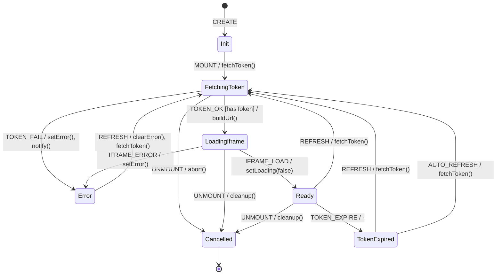

# Superset Dashboard Embed FSM (Odoo Side)

**Source**: `addons/ipai/ipai_superset_connector/static/src/js/superset_embed.js`

## Overview

OWL component that fetches guest tokens from Odoo backend and renders Superset dashboards in an iframe.

## States

| State | Description |
|-------|-------------|
| `Init` | Component mounting |
| `FetchingToken` | Getting guest token from Odoo |
| `LoadingIframe` | Iframe loading dashboard |
| `Ready` | Dashboard visible and interactive |
| `TokenExpired` | Guest token expired mid-session |
| `Error` | Token fetch or iframe load failed |

## Events

| Event | Source | Description |
|-------|--------|-------------|
| `MOUNT` | System | Component mounted |
| `TOKEN_OK` | System | Guest token received |
| `TOKEN_FAIL` | System | Token fetch failed |
| `IFRAME_LOAD` | System | Iframe onload fired |
| `IFRAME_ERROR` | System | Iframe onerror fired |
| `REFRESH` | User | Manual refresh button |
| `UNMOUNT` | System | Component destroyed |
| `TOKEN_EXPIRE` | System | Token TTL exceeded |

## Guards

| Guard | Condition |
|-------|-----------|
| `hasToken` | `result.token !== null` |
| `hasUrl` | `result.superset_url !== null` |
| `notExpired` | Token not past expiry |
| `iframeLoaded` | Iframe contentWindow accessible |

## Side Effects

| Action | Endpoint | Description |
|--------|----------|-------------|
| `fetchToken` | `GET /ipai/superset/guest_token/{id}` | Get guest token |
| `buildUrl` | N/A | Construct iframe src with params |
| `notify` | N/A | Display error notification |

## Transition Table

| From | Event | Guard | To | Action |
|------|-------|-------|----|--------|
| Init | MOUNT | - | FetchingToken | fetchToken() |
| FetchingToken | TOKEN_OK | hasToken, hasUrl | LoadingIframe | buildUrl() |
| FetchingToken | TOKEN_FAIL | - | Error | setError, notify() |
| FetchingToken | UNMOUNT | - | Cancelled | abort() |
| LoadingIframe | IFRAME_LOAD | - | Ready | setLoading(false) |
| LoadingIframe | IFRAME_ERROR | - | Error | setError() |
| LoadingIframe | UNMOUNT | - | Cancelled | cleanup() |
| Ready | REFRESH | - | FetchingToken | fetchToken() |
| Ready | TOKEN_EXPIRE | - | TokenExpired | - |
| Ready | UNMOUNT | - | Cancelled | cleanup() |
| TokenExpired | REFRESH | - | FetchingToken | fetchToken() |
| Error | REFRESH | - | FetchingToken | clearError, fetchToken() |

## Mermaid Diagram

## Identified Gaps

1. **No token expiry monitoring**: Token TTL not tracked; no auto-refresh before expiry
2. **Missing iframe postMessage**: No communication channel with embedded Superset
3. **No loading timeout**: Slow Superset loads show spinner indefinitely
4. **CORS errors silent**: Iframe cross-origin errors not catchable via onerror
5. **CSP violation handling**: frame-ancestors mismatch not detected client-side
6. **No filter sync**: Native filters in embedding context not synced to iframe
7. **Missing health check**: No way to detect if embedded dashboard is still responsive
8. **Session coupling**: Odoo session expiry doesn't invalidate cached Superset token
9. **No retry for token fetch**: Network failure requires manual refresh
10. **Iframe sandbox missing**: Should use sandbox attribute for security
