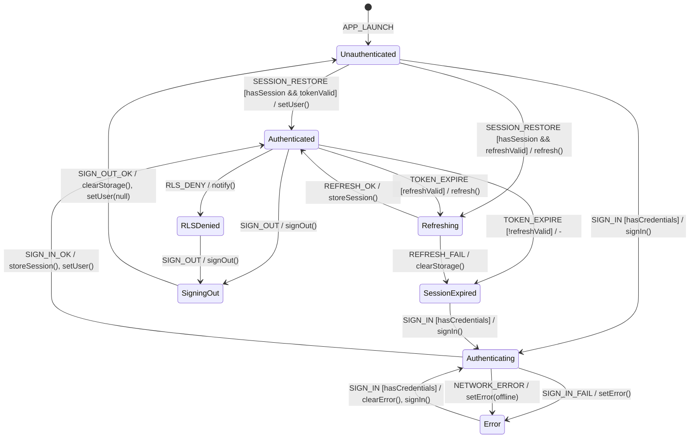

# Auth Session FSM

**Source**: `apps/mobile/src/lib/supabase.ts`, `apps/mobile/src/store/app.ts`, `apps/control-room/src/app/api/mobile/auth/login/route.ts`

## Overview

Authentication flow using Supabase Auth with token refresh, secure storage, and session persistence.

## States

| State | Description |
|-------|-------------|
| `Unauthenticated` | No valid session |
| `Authenticating` | Sign-in request in progress |
| `Authenticated` | Valid session, user logged in |
| `Refreshing` | Token refresh in progress |
| `SessionExpired` | Token expired, needs refresh |
| `SigningOut` | Logout in progress |
| `Error` | Auth error (invalid credentials, network) |
| `RLSDenied` | Valid token but RLS policy blocked |

## Events

| Event | Source | Description |
|-------|--------|-------------|
| `SIGN_IN` | User | Email/password submitted |
| `SIGN_IN_OK` | System | Auth successful, token received |
| `SIGN_IN_FAIL` | System | Invalid credentials or error |
| `SIGN_OUT` | User | Logout initiated |
| `SIGN_OUT_OK` | System | Logout complete |
| `TOKEN_EXPIRE` | System | Access token TTL exceeded |
| `REFRESH_OK` | System | Token refresh successful |
| `REFRESH_FAIL` | System | Refresh token invalid/expired |
| `SESSION_RESTORE` | System | App launch, restore from storage |
| `RLS_DENY` | System | 403 from Supabase query |
| `NETWORK_ERROR` | System | Connection failure |

## Guards

| Guard | Condition |
|-------|-----------|
| `hasCredentials` | Email and password provided |
| `hasSession` | Session object in SecureStore |
| `tokenValid` | Access token not expired |
| `refreshValid` | Refresh token not expired |
| `isOnline` | Network connection available |

## Side Effects

| Action | Endpoint/Method | Description |
|--------|-----------------|-------------|
| `signIn` | `supabase.auth.signInWithPassword()` | Authenticate |
| `signOut` | `supabase.auth.signOut()` | Clear session |
| `getSession` | `supabase.auth.getSession()` | Read current session |
| `getUser` | `supabase.auth.getUser()` | Get user profile |
| `storeSession` | `SecureStore.setItemAsync()` | Persist to storage |
| `clearStorage` | `SecureStore.deleteItemAsync()` | Remove session |
| `setUser` | Zustand | Update global user state |

## Transition Table

| From | Event | Guard | To | Action |
|------|-------|-------|----|--------|
| Unauthenticated | SESSION_RESTORE | hasSession, tokenValid | Authenticated | setUser() |
| Unauthenticated | SESSION_RESTORE | hasSession, !tokenValid, refreshValid | Refreshing | refresh() |
| Unauthenticated | SESSION_RESTORE | !hasSession | Unauthenticated | - |
| Unauthenticated | SIGN_IN | hasCredentials | Authenticating | signIn() |
| Authenticating | SIGN_IN_OK | - | Authenticated | storeSession, setUser() |
| Authenticating | SIGN_IN_FAIL | - | Error | setError() |
| Authenticating | NETWORK_ERROR | - | Error | setError(offline) |
| Authenticated | TOKEN_EXPIRE | refreshValid | Refreshing | refresh() |
| Authenticated | TOKEN_EXPIRE | !refreshValid | SessionExpired | - |
| Authenticated | RLS_DENY | - | RLSDenied | notify() |
| Authenticated | SIGN_OUT | - | SigningOut | signOut() |
| Refreshing | REFRESH_OK | - | Authenticated | storeSession() |
| Refreshing | REFRESH_FAIL | - | SessionExpired | clearStorage() |
| SessionExpired | SIGN_IN | hasCredentials | Authenticating | signIn() |
| RLSDenied | SIGN_OUT | - | SigningOut | signOut() |
| SigningOut | SIGN_OUT_OK | - | Unauthenticated | clearStorage, setUser(null) |
| Error | SIGN_IN | hasCredentials | Authenticating | clearError, signIn() |

## Mermaid Diagram

## Identified Gaps

1. **No proactive token refresh**: `autoRefreshToken: true` set but no monitoring of expiry time
2. **Race in SESSION_RESTORE**: Multiple rapid app opens could interleave session checks
3. **RLS error not distinguished**: 403 from RLS vs 403 from auth not differentiated
4. **No offline queue for auth**: Sign-in attempts while offline not queued
5. **Missing retry with backoff**: Network errors fail immediately, no retry
6. **SecureStore failures ignored**: Storage write errors not handled
7. **No biometric unlock**: No Face ID/Touch ID integration for session restore
8. **Device registration incomplete**: Push notification device registration commented out
9. **Mock JWT in production**: `generateMockJWT()` in login route - security risk
10. **No MFA flow**: Two-factor authentication not implemented
