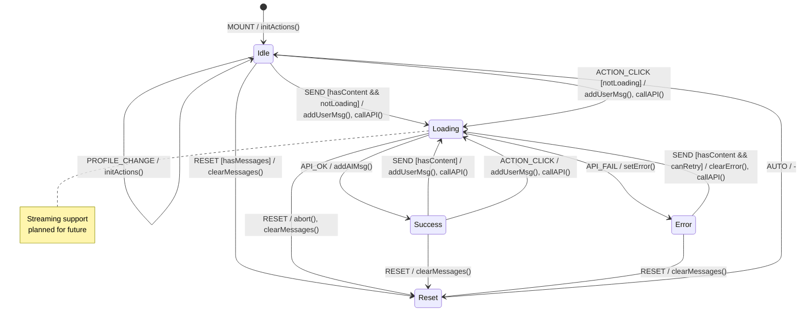

# Copilot Session FSM

**Source**: `apps/control-room/src/components/copilot/hooks/useCopilotSession.ts`

## Overview

Conversational AI session management with message history, action templates, and API integration.

## States

| State | Description |
|-------|-------------|
| `Idle` | Ready for input, no pending request |
| `Loading` | API request in progress |
| `Streaming` | (Future) Streaming response |
| `Success` | Response received |
| `Error` | API error occurred |
| `Reset` | Conversation cleared |

## Events

| Event | Source | Description |
|-------|--------|-------------|
| `SEND` | User | Message submitted |
| `ACTION_CLICK` | User | Quick action clicked |
| `API_OK` | System | Response received |
| `API_FAIL` | System | API error |
| `RESET` | User | Clear conversation |
| `PROFILE_CHANGE` | System | Profile slug changed |

## Guards

| Guard | Condition |
|-------|-----------|
| `hasContent` | `content.trim().length > 0` |
| `notLoading` | `!state.isLoading` |
| `hasMessages` | `messages.length > 0` |
| `canRetry` | Error is recoverable |

## Side Effects

| Action | Endpoint | Description |
|--------|----------|-------------|
| `callAPI` | `POST /api/copilot/chat` | Send message to Copilot API |
| `addUserMsg` | N/A | Append user message to state |
| `addAIMsg` | N/A | Append assistant message to state |
| `setError` | N/A | Update error state |
| `initActions` | N/A | Seed action templates on profile change |

## Transition Table

| From | Event | Guard | To | Action |
|------|-------|-------|----|--------|
| Idle | SEND | hasContent, notLoading | Loading | addUserMsg, callAPI() |
| Idle | ACTION_CLICK | notLoading | Loading | addUserMsg(action.prompt), callAPI() |
| Idle | RESET | hasMessages | Reset | clearMessages() |
| Idle | PROFILE_CHANGE | - | Idle | initActions() |
| Loading | API_OK | - | Success | addAIMsg() |
| Loading | API_FAIL | - | Error | setError() |
| Loading | RESET | - | Reset | abort(), clearMessages() |
| Success | SEND | hasContent | Loading | addUserMsg, callAPI() |
| Success | ACTION_CLICK | - | Loading | addUserMsg, callAPI() |
| Success | RESET | - | Reset | clearMessages() |
| Error | SEND | hasContent, canRetry | Loading | clearError, addUserMsg, callAPI() |
| Error | RESET | - | Reset | clearMessages(), clearError() |
| Reset | SEND | hasContent | Loading | addUserMsg, callAPI() |
| Reset | (auto) | - | Idle | - |

## Mermaid Diagram

## Identified Gaps

1. **No abort on unmount**: Pending API call continues after component unmount
2. **Stale closure in sendMessage**: `state.messages` captured at callback creation time
3. **No streaming support**: Full response wait, no incremental rendering
4. **Missing retry logic**: API errors require manual resend
5. **No request deduplication**: Rapid clicks could send duplicate messages
6. **Context not persisted**: Conversation lost on page refresh
7. **No rate limiting**: No client-side throttle for API calls
8. **Missing loading indicator per-message**: Global isLoading, not per-message pending state
9. **No timeout handling**: Long-running API calls hang indefinitely
10. **Action templates not customizable**: Hardcoded actions, no per-profile customization
11. **Profile change race**: Changing profile during loading could mix contexts
