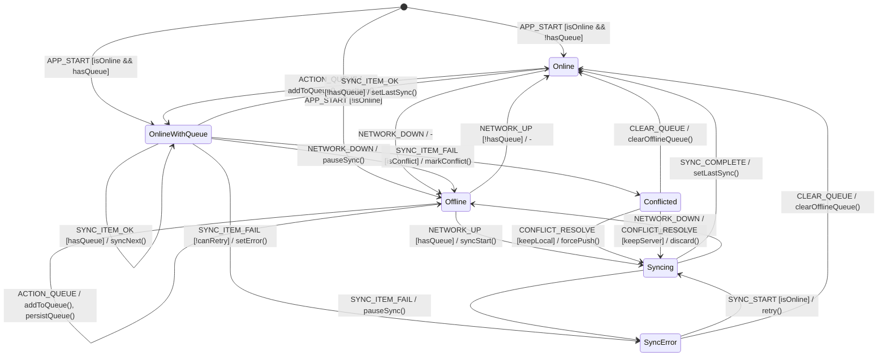

# Offline Queue FSM

**Source**: `apps/mobile/src/store/app.ts`

## Overview

Zustand-based offline action queue with persistence for handling approvals and mutations when disconnected.

## States

| State | Description |
|-------|-------------|
| `Online` | Network available, queue empty |
| `OnlineWithQueue` | Network available, pending items to sync |
| `Syncing` | Processing queued actions |
| `Offline` | No network, queueing actions |
| `SyncError` | Sync failed for one or more items |
| `Conflicted` | Server version differs from queued action |

## Events

| Event | Source | Description |
|-------|--------|-------------|
| `NETWORK_UP` | System | Connection restored |
| `NETWORK_DOWN` | System | Connection lost |
| `ACTION_QUEUE` | User | Add action to offline queue |
| `SYNC_START` | System | Begin processing queue |
| `SYNC_ITEM_OK` | System | Single item synced |
| `SYNC_ITEM_FAIL` | System | Single item failed |
| `SYNC_COMPLETE` | System | All items processed |
| `CONFLICT_RESOLVE` | User | Conflict resolution chosen |
| `CLEAR_QUEUE` | User | Discard all pending |

## Guards

| Guard | Condition |
|-------|-----------|
| `hasQueue` | `offlineQueue.length > 0` |
| `isOnline` | `navigator.onLine` or `NetInfo.isConnected` |
| `canRetry` | Item retry count < max |
| `isConflict` | Server version > queued version |

## Side Effects

| Action | Method | Description |
|--------|--------|-------------|
| `addToQueue` | Zustand | Persist action to queue |
| `removeFromQueue` | Zustand | Remove processed item |
| `syncItem` | Supabase | Execute queued mutation |
| `persistQueue` | AsyncStorage | Save queue to disk |
| `checkConflict` | Supabase | Compare server version |
| `setLastSync` | Zustand | Update sync timestamp |

## Transition Table

| From | Event | Guard | To | Action |
|------|-------|-------|----|--------|
| Online | NETWORK_DOWN | - | Offline | - |
| Online | ACTION_QUEUE | - | OnlineWithQueue | addToQueue, syncItem() |
| OnlineWithQueue | SYNC_ITEM_OK | !hasQueue | Online | removeFromQueue, setLastSync() |
| OnlineWithQueue | SYNC_ITEM_OK | hasQueue | OnlineWithQueue | removeFromQueue, syncNext() |
| OnlineWithQueue | SYNC_ITEM_FAIL | isConflict | Conflicted | markConflict() |
| OnlineWithQueue | SYNC_ITEM_FAIL | canRetry | OnlineWithQueue | incrementRetry, retry() |
| OnlineWithQueue | SYNC_ITEM_FAIL | !canRetry | SyncError | setError() |
| OnlineWithQueue | NETWORK_DOWN | - | Offline | pauseSync() |
| Offline | ACTION_QUEUE | - | Offline | addToQueue, persistQueue() |
| Offline | NETWORK_UP | !hasQueue | Online | - |
| Offline | NETWORK_UP | hasQueue | Syncing | syncStart() |
| Syncing | SYNC_COMPLETE | - | Online | setLastSync() |
| Syncing | SYNC_ITEM_FAIL | - | SyncError | pauseSync() |
| Syncing | NETWORK_DOWN | - | Offline | pauseSync() |
| SyncError | SYNC_START | isOnline | Syncing | clearError, retry() |
| SyncError | CLEAR_QUEUE | - | Online | clearOfflineQueue() |
| Conflicted | CONFLICT_RESOLVE | keepLocal | Syncing | forcePush() |
| Conflicted | CONFLICT_RESOLVE | keepServer | Syncing | discard(), syncNext() |
| Conflicted | CLEAR_QUEUE | - | Online | clearOfflineQueue() |

## Mermaid Diagram

## Identified Gaps

1. **No conflict detection implemented**: `isConflict` guard referenced but not implemented
2. **Missing version tracking**: Queued actions don't store entity version for conflict detection
3. **No sync order guarantee**: Queue processed in insertion order, not dependency order
4. **Partial sync state lost**: App crash during sync could leave queue inconsistent
5. **No exponential backoff**: Fixed retry delay, should increase on repeated failures
6. **Missing sync progress UI**: User can't see which item is syncing
7. **No selective retry**: All-or-nothing sync, can't skip problematic items
8. **AsyncStorage size limit**: Large queues could exceed storage quota
9. **No TTL on queued items**: Old actions could be executed days later
10. **Optimistic UI not reverted**: Failed sync doesn't undo local state changes
11. **Network detection unreliable**: `navigator.onLine` can give false positives
