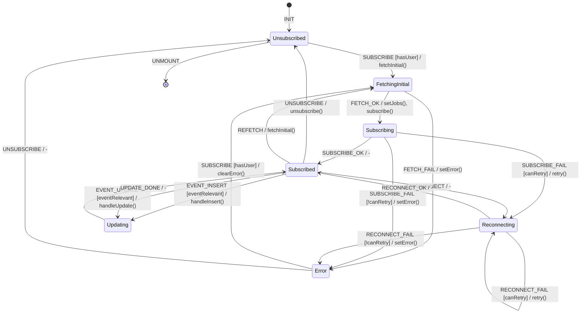

# Realtime Subscription FSM

**Source**: `apps/mobile/src/hooks/useRealtime.ts`, `apps/mobile/src/lib/supabase.ts`

## Overview

Supabase Realtime channel subscriptions for jobs and approvals with automatic reconnection.

## States

| State | Description |
|-------|-------------|
| `Unsubscribed` | No active subscription |
| `Subscribing` | Channel subscription in progress |
| `Subscribed` | Active subscription receiving events |
| `Reconnecting` | Connection lost, attempting reconnect |
| `Error` | Subscription failed |
| `FetchingInitial` | Loading initial data before subscribe |
| `Updating` | Processing incoming event |

## Events

| Event | Source | Description |
|-------|--------|-------------|
| `SUBSCRIBE` | System | Hook mounted |
| `SUBSCRIBE_OK` | System | Channel subscribed |
| `SUBSCRIBE_FAIL` | System | Subscription error |
| `UNSUBSCRIBE` | System | Hook unmounted |
| `EVENT_INSERT` | System | New record event |
| `EVENT_UPDATE` | System | Record updated event |
| `EVENT_DELETE` | System | Record deleted event |
| `DISCONNECT` | System | Connection lost |
| `RECONNECT_OK` | System | Reconnection successful |
| `RECONNECT_FAIL` | System | Reconnection failed |
| `FETCH_OK` | System | Initial data loaded |
| `FETCH_FAIL` | System | Initial fetch failed |
| `REFETCH` | User | Manual refresh |

## Guards

| Guard | Condition |
|-------|-----------|
| `hasUser` | User is authenticated |
| `isOnline` | Network available |
| `canRetry` | Retry count < max |
| `eventRelevant` | Event matches user filter |

## Side Effects

| Action | Method | Description |
|--------|--------|-------------|
| `subscribe` | `supabase.channel().subscribe()` | Start subscription |
| `unsubscribe` | `subscription.unsubscribe()` | Stop subscription |
| `fetchInitial` | `supabase.from().select()` | Load initial data |
| `updateStore` | `setJobs()` / `updateJob()` | Update Zustand state |
| `handleEvent` | N/A | Process postgres_changes event |

## Transition Table

| From | Event | Guard | To | Action |
|------|-------|-------|----|--------|
| Unsubscribed | SUBSCRIBE | hasUser | FetchingInitial | fetchInitial() |
| Unsubscribed | SUBSCRIBE | !hasUser | Unsubscribed | - |
| FetchingInitial | FETCH_OK | - | Subscribing | setJobs(), subscribe() |
| FetchingInitial | FETCH_FAIL | - | Error | setError() |
| Subscribing | SUBSCRIBE_OK | - | Subscribed | - |
| Subscribing | SUBSCRIBE_FAIL | canRetry | Reconnecting | retry() |
| Subscribing | SUBSCRIBE_FAIL | !canRetry | Error | setError() |
| Subscribed | EVENT_INSERT | eventRelevant | Updating | handleInsert() |
| Subscribed | EVENT_UPDATE | eventRelevant | Updating | handleUpdate() |
| Subscribed | EVENT_DELETE | eventRelevant | Updating | handleDelete() |
| Subscribed | DISCONNECT | - | Reconnecting | - |
| Subscribed | UNSUBSCRIBE | - | Unsubscribed | unsubscribe() |
| Subscribed | REFETCH | - | FetchingInitial | fetchInitial() |
| Updating | UPDATE_DONE | - | Subscribed | - |
| Reconnecting | RECONNECT_OK | - | Subscribed | - |
| Reconnecting | RECONNECT_FAIL | canRetry | Reconnecting | retry() |
| Reconnecting | RECONNECT_FAIL | !canRetry | Error | setError() |
| Error | SUBSCRIBE | hasUser | FetchingInitial | clearError, fetchInitial() |
| Error | UNSUBSCRIBE | - | Unsubscribed | - |

## Mermaid Diagram

## Identified Gaps

1. **No event ordering**: Out-of-order events could overwrite newer data with older
2. **Missing event deduplication**: Same event received multiple times during reconnect
3. **Optimistic update race**: Local state update before server confirmation could conflict
4. **Memory leak on unmount**: Subscription cleanup in useEffect return may not fire reliably
5. **No backoff on reconnect**: Fixed retry interval, should use exponential backoff
6. **RLS filter not applied**: `filter` in subscription uses string interpolation - SQL injection risk
7. **No stale event detection**: Events from before subscription start not distinguished
8. **Fetch-subscribe race**: Events between fetch and subscribe could be lost
9. **No connection state UI**: User not informed when in Reconnecting state
10. **Dependency array issue**: `[user?.id]` in useEffect could cause over-subscription on user change
