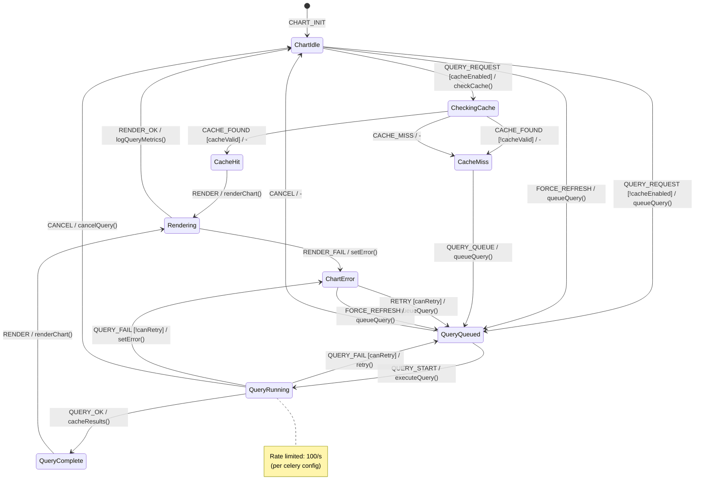

# Chart Query Lifecycle FSM

**Source**: `infra/superset/superset_config.py`, Superset Chart Query Engine

## Overview

State machine for individual chart query execution within a dashboard, including cache behavior, query execution, and error handling.

## States

| State | Description |
|-------|-------------|
| `ChartIdle` | Chart rendered, no pending query |
| `CheckingCache` | Checking if cached result exists |
| `CacheHit` | Valid cache found |
| `CacheMiss` | No cache, need fresh query |
| `QueryQueued` | Query waiting for execution slot |
| `QueryRunning` | Query executing in SQL Lab |
| `QueryComplete` | Query finished, results available |
| `Rendering` | Chart rendering with data |
| `ChartError` | Query or render failed |
| `CacheWarming` | Pre-fetching results for cache |

## Events

| Event | Source | Description |
|-------|--------|-------------|
| `QUERY_REQUEST` | System | Chart needs data |
| `CACHE_CHECK_OK` | System | Cache lookup complete |
| `CACHE_FOUND` | System | Valid cache entry exists |
| `CACHE_EXPIRED` | System | Cache entry stale |
| `CACHE_MISS` | System | No cache entry |
| `QUERY_START` | System | Query execution started |
| `QUERY_OK` | System | Query returned results |
| `QUERY_FAIL` | System | Query error (timeout, SQL error) |
| `RENDER_OK` | System | Chart rendered |
| `RENDER_FAIL` | System | Render error |
| `FORCE_REFRESH` | User | Bypass cache |
| `CANCEL` | User | Cancel pending query |

## Guards

| Guard | Condition |
|-------|-----------|
| `cacheEnabled` | Chart has caching enabled |
| `cacheValid` | Cache entry not expired |
| `querySlotAvailable` | Under concurrent query limit |
| `underTimeout` | Query time < configured limit |
| `hasResults` | Query returned non-empty results |
| `canRetry` | Retry count < max |

## Side Effects

| Action | Method | Description |
|--------|--------|-------------|
| `checkCache` | Redis lookup | Check for cached results |
| `executeQuery` | SQL Lab | Run query against database |
| `cacheResults` | Redis set | Store results in cache |
| `renderChart` | Chart library | Render visualization |
| `cancelQuery` | SQL Lab | Cancel running query |
| `logQueryMetrics` | Celery | Record query performance |

## Transition Table

| From | Event | Guard | To | Action |
|------|-------|-------|----|--------|
| ChartIdle | QUERY_REQUEST | cacheEnabled | CheckingCache | checkCache() |
| ChartIdle | QUERY_REQUEST | !cacheEnabled | QueryQueued | queueQuery() |
| ChartIdle | FORCE_REFRESH | - | QueryQueued | queueQuery() |
| CheckingCache | CACHE_FOUND | cacheValid | CacheHit | - |
| CheckingCache | CACHE_FOUND | !cacheValid | CacheMiss | - |
| CheckingCache | CACHE_MISS | - | CacheMiss | - |
| CacheHit | RENDER | - | Rendering | renderChart() |
| CacheMiss | QUERY_QUEUE | querySlotAvailable | QueryQueued | queueQuery() |
| CacheMiss | QUERY_QUEUE | !querySlotAvailable | QueryQueued | wait() |
| QueryQueued | QUERY_START | - | QueryRunning | executeQuery() |
| QueryQueued | CANCEL | - | ChartIdle | - |
| QueryRunning | QUERY_OK | hasResults | QueryComplete | cacheResults() |
| QueryRunning | QUERY_OK | !hasResults | QueryComplete | - |
| QueryRunning | QUERY_FAIL | canRetry | QueryQueued | retry() |
| QueryRunning | QUERY_FAIL | !canRetry | ChartError | setError() |
| QueryRunning | CANCEL | - | ChartIdle | cancelQuery() |
| QueryComplete | RENDER | - | Rendering | renderChart() |
| Rendering | RENDER_OK | - | ChartIdle | logQueryMetrics() |
| Rendering | RENDER_FAIL | - | ChartError | setError() |
| ChartError | RETRY | canRetry | QueryQueued | clearError, queueQuery() |
| ChartError | FORCE_REFRESH | - | QueryQueued | clearError, queueQuery() |

## Mermaid Diagram



## Cache Configuration

```python
# From superset_config.py
CACHE_CONFIG = {
    "CACHE_TYPE": "RedisCache",
    "CACHE_DEFAULT_TIMEOUT": 300,  # 5 minutes
    "CACHE_KEY_PREFIX": "superset_",
    "CACHE_REDIS_HOST": REDIS_HOST,
    "CACHE_REDIS_PORT": int(REDIS_PORT),
}
```

## Identified Gaps

1. **No per-chart timeout**: All charts use same timeout, long queries block others
2. **Cache stampede**: Multiple requests for expired cache all hit database
3. **No query cancellation propagation**: UI cancel doesn't kill database query
4. **Missing partial results**: Query timeout returns nothing, not partial data
5. **Cache key collision**: Different users with same query share cache (RLS bypass risk)
6. **No background refresh**: Cache only refreshes on request, not proactively
7. **Query queue starvation**: Slow queries can block fast queries
8. **No result streaming**: Large results loaded entirely before render
9. **Error details lost**: Database errors sanitized, hard to debug
10. **No circuit breaker**: Failing queries keep retrying, no backoff
11. **Dashboard query coordination**: Charts query independently, no batching
